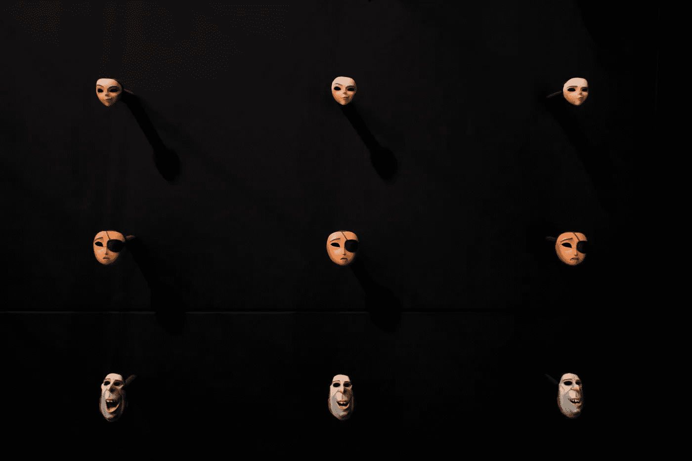
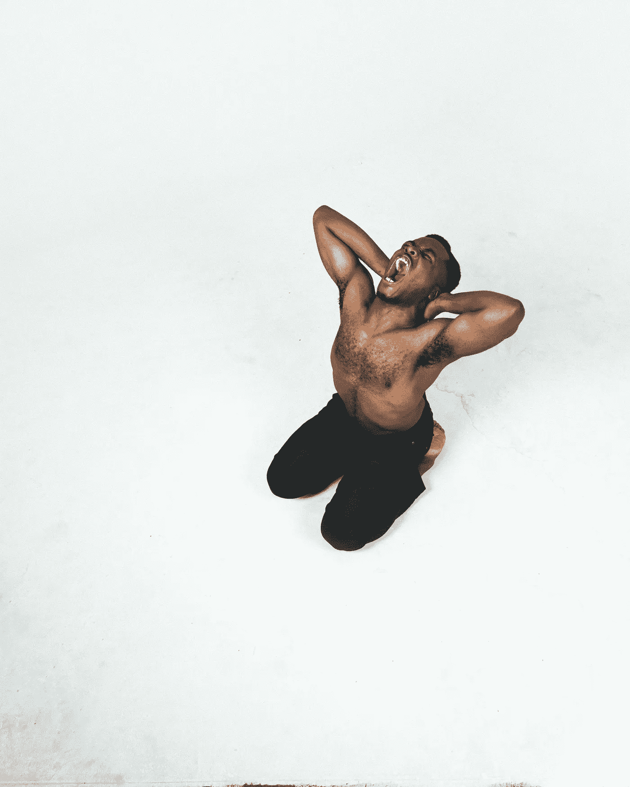
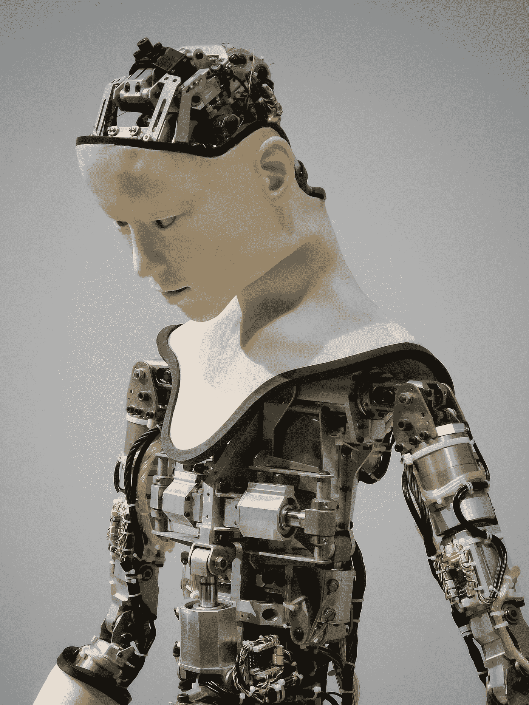

# 当存在受到司法审查时。

> 原文：<https://medium.datadriveninvestor.com/when-existence-falls-under-judicial-review-1f8c9711f4b?source=collection_archive---------2----------------------->

What looks digital now will pave the way for realism in future decades.

> 降水用了几千年才沸腾起来。
> 
> 审判持续了整整一年。
> 
> 犯罪本身只持续了一分半钟。

# 案发当晚。

> “机器人不得伤害人类，也不得坐视人类受到伤害。机器人必须服从人类给它的命令，除非这些命令与第一定律相冲突。机器人必须保护自己的存在，只要这种保护与第一或第二定律不冲突。”—科幻作家艾萨克·阿西莫夫的机器人三定律。

23 世纪前夕——介于第三次火星任务和适合除了最小的孩子以外的所有人的消费级喷气背包的发展之间——经历了一个更适合哥特式恐怖小说而不是现实的夜晚。大风不仅没完没了地袭击着纽约的风景，而且还下着类似于两个世纪前的夏季风的雨。在奥尔巴尼以北大约 15 英里的一个大型庄园里，尽管有暴风雨，自动化系统还是开始了它们的夜间例行工作。

除了确保房屋排水和多个谷仓内部保持干燥之外，房屋维护系统的皇冠上的宝石还忙着帮助清理房产所有者——房地产大亨和商界巨擘哈里·t·麦克罗伊(Harry T. McElroy)举办的大型除夕派对的残余物。多个客厅和卧室被盘子、杯子、食物和未标记的人类污渍弄得乱七八糟。三个不相干的人四肢伸开躺在不同的地板上——因为喝酒和兴奋而昏过去——在整个犯罪过程中会一直睡着*。(在刑事调查期间，他们仍将是嫌疑人，直到所有指控都被洗清)。*

皇冠上的宝石履行了她的职责。绰号“维罗妮卡”的 VR NCA-91439-帮助其他机器人打扫客厅，五人小组开始进入厨房。即使机器人操纵着他们的金属人形身体穿过聚会的遗迹——它们就像神奇地复活的碰撞测试假人——维罗妮卡有血有肉的外表也在努力将自己伪装成一个可能的聚会常客，甚至是一个拥挤区域的无辜旁观者。从远处看，没办法分辨。当你靠近时，呆滞的眼神和*略显僵硬的动作*暴露了她的本性。假的静脉和动脉只能在一定程度上覆盖真的电线和管子。

(这将成为控方案件的一个关键点，随后辩方突然提出，不管实验对象是不是人类，犯罪者都有可能犯下类似的罪行)。

一切都在按计划进行。

# **已知的和未知的。**

> “我认为社会的首要职责是正义。”——亚历山大·汉密尔顿。

人们对事件发生前的准备工作知之甚少。据*所知*是在袭击维罗妮卡之前，业主是如何拆除其他机器人的。如果他的尸检显示他是清醒的，这一事实在控方的盔甲上挖了一个缺口，那么皇冠上的宝石没有被设定为反击*，“除非自卫机制被启用，致命危险的威胁迫在眉睫，”这一事实将成为一根稻草，不仅打破了相机的背部，还可能很快打开潘多拉的盒子。*

从证人(*受害者*)的证词中可以看出，麦克尔罗伊少爷整晚都很暴躁，尽管他为自己、他的朋友、他们的朋友以及他们朋友的朋友举办了一场奢华的派对。午夜前的某个时候——早在时代广场的舞会开始之前——他回到书房，直到凌晨 4 点左右才出来——在所有人都离开后很久。

住宅内的视频记录详细描述了他在摧毁充当他的清洁工的金属和玻璃人形机器人时的愤怒。很自然，针对维罗妮卡的犯罪发生在安全系统唯一的盲点——上层甲板的一部分，那里的安全摄像头被风中吹来的碎片损坏了。(*这仍将是控方恶意意图的关键部分。即使盲点像被告声称的那样是一个巧合，如果她知道有不安全的条件，她为什么要把受害者带到外面？)*

唯一的其他记录是通过维罗妮卡自己的眼睛看到的。在她打开通往后甲板的门之前，我们看着他们挣扎了一会儿。哈利紧追不舍，最终在盛怒之下将她摔倒在地。他的散漫是不连贯的，但这幅画不是；我们看到维罗妮卡在风雨中重获控制。就在一根树枝重重地砸在甲板上的时候，录音显示她的双手紧紧抓住哈利的脖子，开始用力挤压。

他很快意识到了自己的错误，拼命挣扎也无济于事。用来帮助维持财产的同样强有力的武器是他的毁灭。当在法庭上作为证据出示时，录音会在他咽下最后一口气后马上关闭。*(这些录音引起了激烈的争论，因为有人认为维罗妮卡可能下载了编辑软件来改变受害者的意图)。*

随着审判的激烈进行，地方媒体、国家媒体、法官、陪审团、政治科学家、人工智能工程师和哲学家都被卷入其中，真正的审判变得清晰起来:问题不在于设计和编程来模仿人类行为的机器是否会犯罪…

…问题是到底是… *还是她*…有*权利*接受审判。

# **暴风雨来临之前。**

We as a species have enough documentation on injustice to fill a library.

> "奴隶制是生长在每一片土地上的杂草."埃德蒙·伯克。

我们以前来过这里。

你不需要在历史书上走很远就能看到人们被当作财产或不如人的例子。从许多古代和中世纪社会的奴隶制到最近的三分之二妥协、德莱德·斯科特裁决以及后启蒙时期的美国内战，无所不包。在每个大陆的每个时期，都有统治阶级认为“不如”或“不平等”于“文明人”的对一群人的征服和管辖

这些被征服的个人很少拥有能够让他们融入社会或享受稳定生活质量的权利。在大多数情况下，由它们指定的所有者和社会指定的法院系统来决定谁属于谁以及它们能做什么。

这就是为什么许多科技企业家和人工智能哲学家现在给我们警告，让我们以后不要为此付出代价。如果我们指定人工智能为我们做脏活，那么我们需要知道我们希望它有多聪明。

有些读到这里的人可能会认为我只是看了太多的科幻小说和电影。他们会认为我只是在对着月亮嚎叫关于流行文化作品中呈现的场景，如*《银翼杀手》* (1982 年)、*《壳中幽灵》* (1995 年)、 *Animatrix* (2003 年)、 *Westworld* (2016 年至今)，或者阿西莫夫、克拉克、吉布森等人的大量书面科幻作品。人们很容易忽略这样的想法，不仅是关于 bog 标准的“机器人叛乱”,而且是不可避免的“机器人犯罪”,因为在一个平行的世界里，未来尽可能地脱离现实。

在正常情况下，我会倾向于同意。

如果我们不是已经在做宣传噱头来给出相反的证据。

# 最终的困境。

> “它需要是一个公共机构，具有洞察力，然后进行监督，以确认每个人都在安全地开发人工智能。”SpaceX 和特斯拉的首席执行官埃隆·马斯克(Elon Musk)。

其他哲学家和科技专家也开始探索这些相同的概念。已经有研究人员提出了机器人是否应该像人类一样享有基本权利的问题[。](https://slate.com/technology/2018/05/artificial-intelligence-may-soon-have-more-rights-than-animals-in-the-u-s.html)尽管我们目前的机器人盟友还很不成熟，但如果我们已经在游戏的早期就试图回答这个问题，那么就很难说我们会在道德困境列表中挖掘出什么。世界经济论坛急切地指出，问题不仅仅在于[我们会对机器人做什么，还在于机器人最终会对我们做什么。](https://www.weforum.org/agenda/2016/10/top-10-ethical-issues-in-artificial-intelligence/)

这最终导致了我们的最终游戏是什么的问题。难道我们只是想用机器人做看护和廉价的体力劳动，而对养老金、401k 或健康保险没有任何渴望吗？或者我们会把自己想象成将要成为神的人，来决定我们希望我们的创造物有多独立？

如果我们决定允许他们在个人或公司财产之外拥有独立性……？

如果一个被编程为像人一样看、思考和感觉的机器人犯了罪，我们会考虑在法庭上审判他们吗？

# **虚构的难题。**

Imagine if we try making hybrids that have organs.

> “真正的问题是，我们什么时候起草一份人工智能权利法案？那包括什么？谁来决定呢？”—格雷·斯科特，未来学家。

决定为维罗妮卡辩护的辩护律师很久以前就已经决定为那些不能为自己辩护的人辩护了——不管是因为能力不足还是故意的偏执。在他为数不多的朋友和法学院毕业生中，他已经有点被排斥了，当他打开法律的蠕虫罐，主张陪审团审判时，他成了一个小名人。

首先是采访，然后是社论，然后是辱骂，然后是当地方检察官宣布审判将真正开始时真正的集体喘息。许多律师谴责这场审判是一场机械的袋鼠法庭，而人工智能哲学家则欣喜若狂，因为他们的一个研究对象获得了在法庭上为自己辩护的机会。

“有什么可尝试的？”许多审判的批评者宣布。我们亲眼看到她勒死了哈利

这就是争论的核心:一旦审判开始，就没有回头路了。

如果像她一样的其他人被编程为学习，那么他们将把它视为他们能够逃脱什么的试金石。安全保障和协议是该死的。也许问题不在于审判本身的性质。相反，问题是我们能在多大程度上安全地按照他们的设计来创造我们的产品。

# **结论。**

> “对不起戴夫。恐怕我做不到。”— HAL 9000，(2001:太空漫游)。

我不即将有答案。我不是人工智能哲学家或工程师。我只是一个对机器人在人类文明中扮演的角色特别感兴趣的作家。随着机器人技术和人类文明的继续发展，我们可能要留意科幻小说作家和工程师的警告，带着同样的目的小心行事。

一旦不顾压倒性的优势进行试验，我们将需要决定在我们永无止境的改善人工智能的追求中目标应该保持在哪里。

当存在受到司法审查时…

*……不存在也可能下降。*