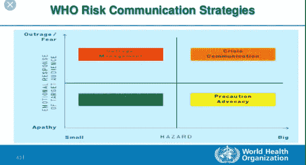
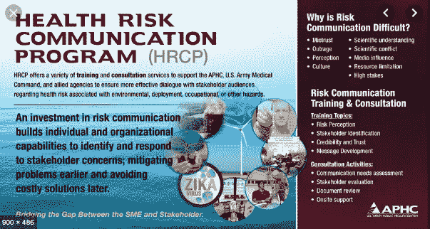

# 恐惧会给你带来最好的药

> 原文：<https://medium.datadriveninvestor.com/when-fear-is-the-best-medicine-59dd1c5265cb?source=collection_archive---------7----------------------->

## 非常规策略引起顽固患者的注意

当可怕的信息被封锁时，下一步该如何注入紧迫感？恐惧呢？

很多时候，医生发现绝望的时候需要绝望的措施——或者基于恐惧的药物。这不是标准的商业惯例，但它能迅速消除误会。

一种常见的恐惧策略是反吸烟广告。这些广告现在经常出现，但是最著名的公益广告之一出现在 1985 年。[在他死于肺癌](https://www.youtube.com/watch?v=JNjunlWUJJI)后播出，演员[尤尔·伯连纳](https://en.m.wikipedia.org/wiki/Yul_Brynner)看着镜头说:“现在我走了，我告诉你:不要抽烟，无论你做什么，就是不要抽烟。”

从短期来看，基于恐惧的医学让人们认识到犹豫不听从医生建议的病人会发生什么。

【Iris Thiele Isip Tan 博士研究了挑战的长期和短期策略。内分泌学家是菲律宾大学医学院的教授。一个普通的博主，谈论恐惧和医学已经不是什么新鲜事了。

“几年前，我写过关于使用恐吓战术和糖尿病并发症的文章，”她说。“我从事临床实践近 20 年，知道恐吓战术不起作用。

 [## 在创业之旅中，拥抱学习|数据驱动的投资者

### 好像建立一个数百万美元的公司还不够困难，企业家必须额外照顾他们的…

www.datadriveninvestor.com](https://www.datadriveninvestor.com/2018/10/16/on-the-entrepreneurial-trek-embrace-the-learning/) 

“然而，我承认我需要赶上我有时使用的语言，”谭说。“我不得不忘掉单词，寻找新的方式来说出需要说的话，而不带有威胁性。”

她希望保持自己职业生涯早期的乐观态度:

“我在 Twitter 上遇到了许多患有糖尿病的了不起的人，”年轻的谭写道。“通过他们，我能够更好地理解患者的观点，这与我的观点截然不同。”

这些观点受到了耐心的不情愿或固执的考验。基于恐惧的医学在什么程度上是最好的课程？

“确定这个阈值可能会有问题，”谭说。“是否应该在单个患者的层面上采用这种方法？也许是为了公共卫生信息？

她说:“我们已经听了太多次‘吸烟致命’了，它已经不起作用了。”"在医学院，一位年长的医生告诉我，永远不要夺走病人的希望."

# **多重后果**

使用恐惧战术的风险可能是身体上的，也可能是精神上的。

“在我作为医学院学生的精神病学轮转中，我看到了对抗技术的示范，”谭说。“我非常害怕病人——或者医生——会受伤。

“煽动恐惧也被伪科学所利用，”她说。“害怕糖尿病足感染？这里有一个镁足浴。”

加热是一个程度的问题。

“谨慎使用，”谭说。“在我的诊所里，我尽量不吓到病人，但换一种更严肃的语气会有所帮助。”

 [## 利用恐惧获得力量

### 尊重并理解如何疏导普遍的恐惧

medium.datadriveninvestor.com](/tap-into-fear-for-strength-bbf54673b632) 

精神病学家斯蒂芬妮·米亚科医生对利用恐惧的潜力有第一手的了解。她在菲律宾杜马盖地市开业，倡导精神健康以及如何改善所有人的精神健康服务。她也是西里曼大学医学院的一名教员。

“我发现在我的实践中很难使用恐吓战术，”Miaco 说。“在我的工作中，这不是‘治疗性的’。一些来找我的人需要以他们能够理解和思考的方式“包装”的信息。

“我担心会有什么后果，”她说。“急诊室和门诊设置可能会有所不同。此外，现实测试也有问题，比如幻觉和妄想。”

[杰罗姆·克莱奥法斯](https://twitter.com/SocioJCleofasRN)博士也持谨慎态度。他是菲律宾的研究员、教育家、健康社会学家和护士。

“当患者或社区对一个问题表现出漠不关心时——尽管持续教育——也许可以尝试诉诸恐惧，”他说。

“在健康传播中有一门学科，关于如何有效地使用积极和消极的框架信息进行信息、教育和交流，”克莱奥法斯说。

正如菲律宾大学常务副校长[泰迪·赫布萨](https://twitter.com/Teddybird)博士所说，图形图像也能说明问题。他有创伤外科和急救医学的经验。

“你也可以用科学来煽动恐惧，”他说。“我在伤害预防讲座中展示颌面部伤害，提醒人们三点式安全带如何预防这种伤害。

赫布萨说:“我有一些病人，他们来自其他医生，这些医生吓唬他们，让他们同意接受选择性手术。”"我们需要用科学来说明事实和风险。"

# **达到极限**

职业健康专家[Gia Sison 博士](https://twitter.com/giasison)知道她的职业断裂点。

世界卫生组织西太平洋地区和菲律宾马卡蒂医疗中心的顾问说:“那时我已经用尽了所有的手段和选择，否则病人的健康将受到极大的破坏。”

恐吓战术虽然诱人，但可能适得其反。

“我过去在谈论艾滋病毒和艾滋病时经常使用它们，”克莱奥法斯说。“然而，我了解到这样做会加剧对性少数群体的歧视。现在我使用更多的性积极信息。

他说:“在信息传递的一致性的配合下，负面框架信息真的可以改变和维持行为。”

 [## 社会是艾滋病患者最大的敌人

### 那些受影响的人被污名化、歧视和边缘化

medium.datadriveninvestor.com](/society-poses-as-hiv-sufferers-greatest-foe-942a3c9f6a9) 

事实上，最微妙的信息可能是最有效的，这是谭在讨论病人肾功能受损时发现的。

“当我说她的肌酸酐上升时，我的语气很忧郁，”谭说。“她肯定注意到了我举止的变化，并说她肯定会安排一个肾病医生的预约。几个月来，我一直试图推荐她。”

作为一名乳腺癌幸存者，Sison 受益于接受基于恐惧的医学。

“六年前，我想在第三个化疗周期后退出，但我的肿瘤医生——也是我的朋友——向我展示了风险，尽管我知道这些风险，”她说。“我选择完成它的治疗。”

引发恐惧的经典时机是在分秒必争的紧急情况下。

“我在灾难医学教学中使用过它，”Herbosa 说。“我问，如果呢？卫生系统将如何运作？我喜欢问其他专业的问题。如果手术室里现在着火了怎么办？”

他回忆说，当菲律宾登革热的五年死亡率仅为 0.39%时，医疗和政府机构是如何使用恐吓策略来推动登瓦夏的。Herbosa 采用基于恐惧的医学的学术方法，引用定义:

*“风险沟通是指专家和面临健康、经济或社会福祉威胁的人之间交流实时信息、建议和意见。风险沟通的最终目的是使处于风险中的人能够做出明智的决定来保护自己和他们所爱的人。”*

# **心跳停止的反应**

赫布萨说:“经济风险也必须非常明确和清楚。”“恐吓战术也会产生意想不到的副作用。它们包括抑郁、绝望、免疫反应降低——可能是急性心肌梗死。”

他补充说，风险沟通不同于危机沟通，危机沟通“指的是处理个人和组织声誉的特殊部门。”

 [## 从某种意义上说，医生拯救生命

### 把最好的光放在选择上，促使病人做出决定

medium.datadriveninvestor.com](/in-a-manner-of-speaking-doctors-save-lives-11a8cf155394) 

医疗服务提供者没有使用恐吓战术，而是使用其他策略来解释风险或与患者谈论并发症。例如，Sison 喜欢激励性的交流，对病人坦诚相待，非常有耐心，同时让家人参与到病人护理中来。

“最好的方法是关注积极的健康行为能够带来的回报，”克莱奥法斯说。“为不断增加的成就提供持续但真实的正面强化，而不是关注不合规的不良后果。

“反复使用恐吓战术的危险在于，客户可能最终对感知到的危险变得麻木，尤其是那些持宿命论态度的患者，”他说。

谭赞成在宣布坏消息之前先测量一下房间的温度。

“实话实说——实事求是，不加修饰或渲染——可能会提供一个可以冷静做出决定的环境，”她说。“我有一个病人说停下来，我能离开房间吗，你能向我女儿解释一下吗？她还没准备好。”

**关于作者**

吉姆·卡扎曼是[拉戈金融服务公司](http://largofinancialservices.com/)的经理，曾在空军和联邦政府的公共事务部门工作。你可以在[推特](https://twitter.com/JKatzaman)、[脸书](https://www.facebook.com/jim.katzaman)和 [LinkedIn](https://www.linkedin.com/in/jim-katzaman-33641b21/) 上和他联系。