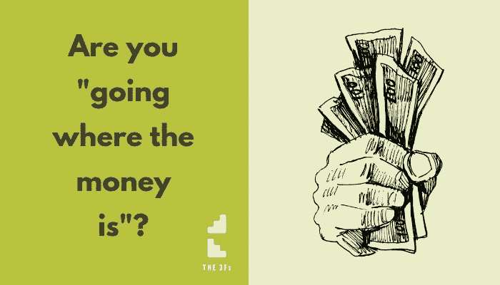

# 当“追随金钱”让你陷入困境时

> 原文：<https://medium.datadriveninvestor.com/when-following-the-money-leaves-you-high-and-dry-892ef07df542?source=collection_archive---------26----------------------->

鲍勃曾经热爱他的工作。不再是了。

起初，他热衷于学习——毕竟，“我不知道”不会让你在职业阶梯上走得更远。

原来他有这项工作的天赋。公司喜欢他所做的。

促销经常发生。他一级一级往上爬。

鲍勃感到“成功”。他有自己的标志……一份令他自豪的薪水，一辆如果是他支付的话他永远也不会选择的车，还有支付抵押贷款的能力。

在某个时候(他说不清*到底是什么时候*)鲍勃开始对……*感到厌烦*。

这份工作不再给他带来几年前令他兴奋的挑战。只是“老样子老样子”。鲍勃生活在土拨鼠时代。

然而他很舒服。没必要捣乱。事情并没有那么糟糕。

然后船撞上了冰山。

似乎出乎意料的是，鲍勃被“解雇”了。他们称之为“合理调整”。

“轴系”是鲍勃的看法。

仅仅在一周前，鲍勃的世界还看上去如此舒适、稳定、安全，但现在却陷入了混乱。

他试图把这当成一个“机会”，去“积极地思考”，但事实是，鲍勃吓坏了。他睡不着。他很恐慌，觉得自己必须投入下一份工作。

只是…事情并没有像那样发展。

鲍勃申请了几份工作。事实上，他的心不在这里。尽管如此，他还是敷衍了事。

他有 100%的失败率。

所以他做了任何有自尊有经验的专业人士都会做的事情:他以自由职业者的身份提供他的技能、经验和知识。

 [## 为你的职业生涯提供机器人保护——数据驱动型投资者

### 随着生产率的提高和巨大的利润，企业转向自动化来简化他们的…

www.datadriveninvestor.com](https://www.datadriveninvestor.com/2018/11/20/robot-proofing-your-career/) 

鲍勃成为了一名顾问。

好消息是，他发现赢得项目比找到一份固定工作更容易。

在六个月的时间里，通过利用他的关系网并发布消息，他成功地建立了“投资组合”收入。

他一个月在一家公司工作几天，一个月在另一家公司工作四天，一对夫妇每个季度需要他工作八天……所以他从不同的来源积累收入。

是的，他花了一段时间。

是的，他需要重建自信。

但是最终……鲍勃到达了一个他感到舒适的阶段。

然后，看似突如其来的，他的一个客户遇到了一些麻烦，需要削减成本。失去鲍勃的服务是一个容易的决定。

然后，就像是经过协调的一记重拳，另一个客户失去了一份合同，不再需要 Bob 的服务。

**砰，又一个客户倒下了。**

为了证明“坏事传千里”这一法则，鲍勃又失去了一个客户，原因他自己也不清楚。如果鲍勃更加愤世嫉俗，他会怀疑这是一个阴谋。

然而，他又一次从舒适变得暴露、脆弱和担心未来。

也许鲍勃的情况听起来和你自己的情况很相似？

他的经历*是不可避免的*还是生活就是如此？

毕竟，当鲍勃成为一名顾问时，他*真正想要的是“不把所有鸡蛋放在一个篮子里”的安全感。*

他认为他已经从被雇佣中吸取了教训。看似安全的事情，结果却是除了 T11 之外的事情。

当然，从各种各样的客户那里获得收入会创造出他想要的安全感？

结果鲍勃没有。

原因如下:

作为一名自由职业者，鲍勃喜欢去赚钱的地方。

听起来是个合理的方法，不是吗？他肯定不会去没有钱的地方吧？！

没错。然而，“去有钱的地方”是鲍勃最近面临的挑战。

那还有什么选择呢？

**拿钱来找你。**

鲍勃去拿钱。

差别很大。

而跟着钱走的*后果*就是鲍勃又(*！)*作为员工工作*。*

只是这一次，员工没有假期工资，病假工资或任何其他权利。

当然，鲍勃并不称自己为雇员——他是一名顾问！

然而，虽然他的客户付钱给他的原因是因为他的知识、技能和经验，但是他们如何付钱给他只取决于他的“出现”。

他对客户唯命是从。

对鲍勃来说，还有一个更大的问题——一个让他非常沮丧的问题:

当他忙于和客户打交道时，他没有时间去寻找新客户。

即使他*已经*做了一些营销，他也不可能把他们安排进去！所以似乎没必要这么麻烦。

毕竟，一切看起来都很舒适。

鲍勃有更好的选择吗？

事实上，他做到了…但是有两个原因他没有遵循:

第一个原因:他只能把*当成员工*，所以错过了更好的选择。

其次，他*将*“舒适的投资组合”误认为“财务安全”。

自由职业者是一种不同类型的“雇员”。

然而它仍然是一名雇员。

很明显，成为一名雇员并没有给鲍勃带来经济保障。

揭露真相需要一个痛苦的事件。

在这种情况下， ***他怎么可能“让钱来找他”？***

以一种令人惊讶的简单方式…他只需要看到它，然后学习它，然后应用它。

我在另一篇文章中解释了这个方法。

现在，亲爱的读者，你的问题是，你是“去有钱的地方”还是…为了财务安全…“让钱来找你”？

你是自由职业者吗？

你是“去有钱的地方”吗？

感觉*舒服吗*？