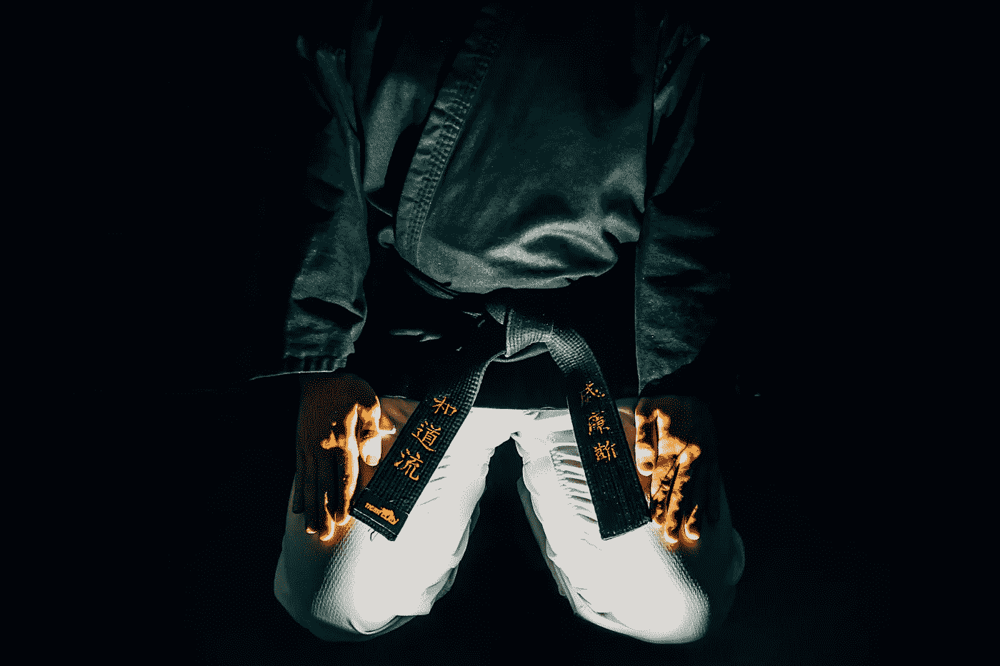

# 当自由成为一种限制。

> 原文：<https://medium.datadriveninvestor.com/when-freedom-becomes-a-limitation-461eda2fd?source=collection_archive---------32----------------------->

我可以被认为是一个自由迷，我知道更多。我们都有一些其他的共同点，在某些时候，我们对自由的渴望找到了一个舒适的区域，在那里我们避免困难:承诺，结构，纪律，不适。

当我们开始走出那个阶段，我们可以很容易地看到，当我们决定挑战自己的舒适区时，自由就来了。纪律可以成为自由的源泉！

Photo by Leslie Jones

> “不要期望每天都有动力走出去，让事情发生。你不会的。不要指望动力。指望纪律。”― **乔科·威尔林克**

请随意[联系我](http://linkd.in/N32LZH)，添加您的问题或评论，开始一场充满敬意和启发性的对话。感谢阅读！