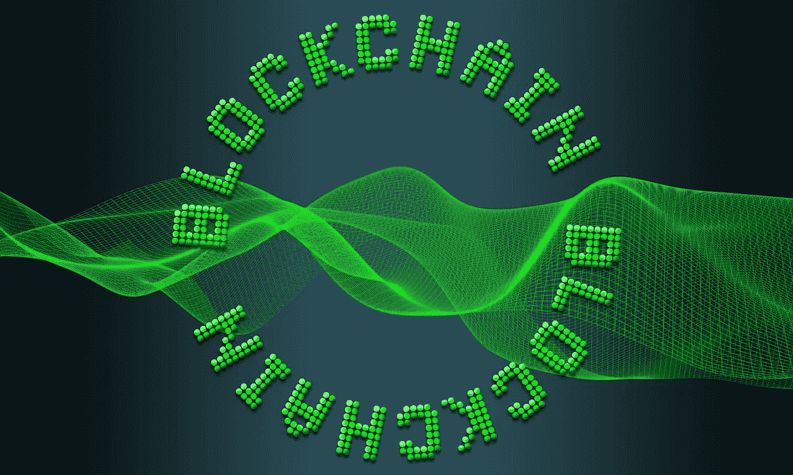
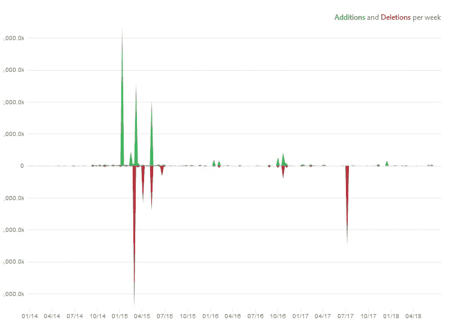
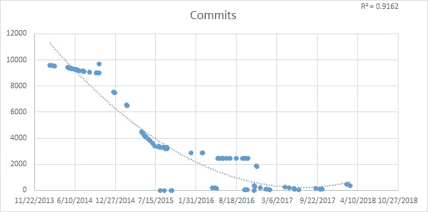
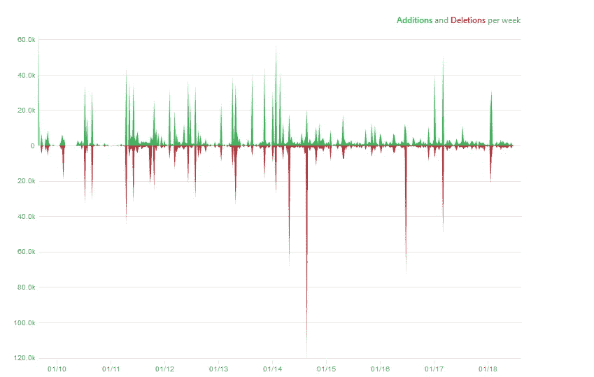
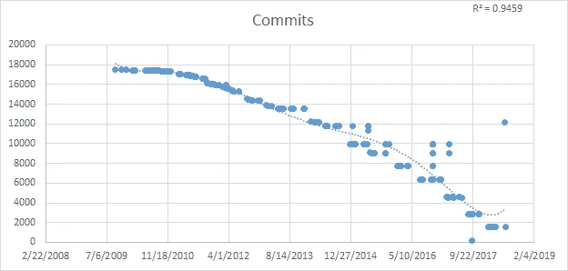
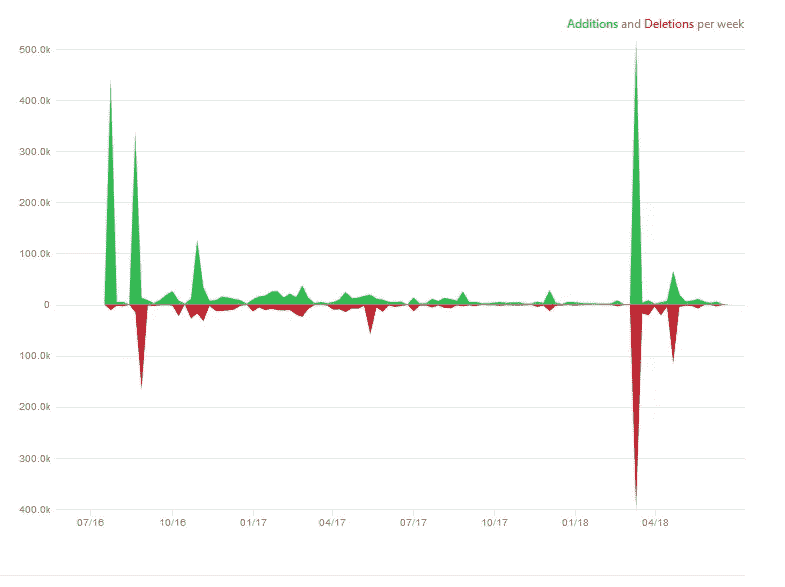
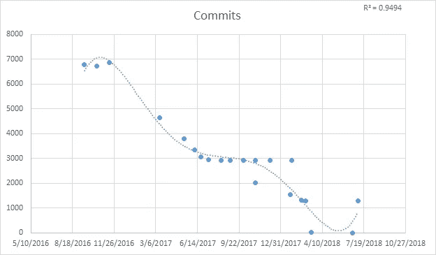

# 投资区块链时，要谨慎

> 原文：<https://medium.datadriveninvestor.com/when-investing-in-blockchain-use-caution-65f4e829ecb6?source=collection_archive---------9----------------------->

区块链受到了相当大的炒作。这项技术受到了《卫报》的称赞，该报将区块链描述为“我们这个时代最大的 IT 发明之一”其他的赞美包括对未来技术革命的宣告。CNet 表示，“通过智能合同，区块链可以帮助自动化许多计算操作，”这是自动化形式的一种反叛。[【2】](#_ftn2)这一妙招无疑吸引了投资。然而，一些转变未能实现。一个正在发展的叛乱是区块链。这项技术的赞誉吸引了投资者将资金投向与区块链相关的项目。这些努力是否会带来任何有影响力的好处还不清楚。缺乏清晰、有效的应用程序引发了关于投资的明智方法的问题。对区块链投资的明智策略是谨慎，因为该技术在业务关键领域中没有已证明的用例，其实现才刚刚开始稳定，并且缺乏一致认可的定义。

[【1】](#_ftnref1)阅读整篇文章，请前往:[https://www . the guardian . com/commentis free/2016/Jan/24/区块链-比特币-技术-最重要-技术-我们时代的发明-sir-mark-walport](https://www.theguardian.com/commentisfree/2016/jan/24/blockchain-bitcoin-technology-most-important-tech-invention-of-our-age-sir-mark-walport)

[【2】](#_ftnref2)要阅读整篇文章，请前往:[https://www . CNET . com/news/区块链-explained-builds-trust-when-you-need-it-most/](https://www.cnet.com/news/blockchain-explained-builds-trust-when-you-need-it-most/)

在区块链的投资应该谨慎进行，因为该技术在关键业务领域还没有经过验证的使用案例。当一项技术在一个关键领域得到应用时，这项技术就成为了构建其他功能的基础。这些功能扩展了核心业务功能，扩展了企业的工具箱。这个工具包只能根据基础技术进行扩展，而区块链不是。区块链尚未证明其在商业关键领域的应用。

这项技术的一些关键应用已经被放弃。一种尝试性的用法是信用互换，这是一个资产价值 11 万亿美元的市场(Nordrum，2017)。将区块链应用于这种价值的资源正是业务关键领域的定义。如果区块链可以在管理 11 万亿美元资产的领域取得成功，那么这项技术将在商业关键领域展示一个用例。为了应对这一关键市场，IBM 和存管信托结算公司(DTCC)开发了一个基于区块链的解决方案(Nordrum，2017)。那个产品被废弃了。DTCC 取消了该项目(伊雷拉和麦克兰克，2018 年)。

其他努力没有被放弃，但也没有取得成果。IBM 努力的收获并没有被放弃，但它也没有带来意外之财。IBM 正试图将区块链的好处带到世界食品供应链中(IBM 宣布与 Dole、Driscoll's、金州食品、Kroger、McCormick and Company、McLane Company、雀巢、泰森食品、联合利华和沃尔玛进行重大区块链合作，以解决全球食品安全问题，2017 年)。食品及其供应链是一个关键领域的缩影。世界粮食供应的短缺确实会导致死亡和疾病。缓解这些问题对人类来说将是一笔巨大的横财。希望带来这些有益成果的是 IBM。该公司开发了一个名为 Food Trust 的平台，旨在将问责制和可见性引入食品供应链(欢迎来到 IBM Food Trust，n.d .)。为了帮助提供问责制和可见性，一些大公司已经签约使用 IBM 的食品信托。该平台的参与者包括十家全球最大的公司(Nash，2018)。在这些大型组织的帮助下，IBM 的食品信托正在向前发展。然而，该产品仍在开发中(Nash，2018)。食品信托没有被放弃，但也没有取得任何成果。

区块链项目似乎不太可能在不久的将来带来一场革命。一些努力被放弃了。其他努力仍在开发中。在不久的将来，新的事业不太可能进展顺利。区块链的技术核心还在发展。构建基于区块链的产品的解决方案仍不成熟(Bennett，2017)。交付这些产品的项目不太可能带来革命，因为区块链的技术核心还处于萌芽状态。

这项技术的解决方案还不成熟，它们才刚刚开始稳定下来。即使应用得当，稳定解决方案也会导致大量的时间和金钱支出。一个稳定的实现有时会出现一些问题或缺点，组织只能通过花费大量的时间和金钱来克服。在利用解决方案寻找立足点之前，这种支出的可能性要求谨慎。区块链技术就是这种解决方案。它的实现仍然是稳定的。

以太坊的 Go 客户端稳定的时间最长，从 2016 年底到 2017 年初才开始稳定下来。根据图 1，以太坊在 2015 年第一季度后经历了内容增加和内容删除的大幅下降。大峰值的减少表明项目的结构趋于稳定。稳定的项目结构是项目本身稳定的可靠标志。以太坊的 Go 客户端在 2015 年的前三分之一之后正在走向结构稳定。然而，其每次发布的提交量还没有开始稳定下来。由于 2015 年签入的数量仍然在下降，每个发布的工作量还没有稳定下来，尽管项目的结构已经稳定下来。从 2016 年底到 2017 年初，以太坊的工作经历了稳定，根据图 2，当时以太坊的 Go 客户端经历了每次发布的提交数量的稳定。随着每个版本中稳定的签入以及更少的大型添加和删除高峰，以太坊从 2016 年底到 2017 年初开始稳定，比其他区块链解决方案更早。

图 1:以太坊的 GO 客户端增删[**【1】**](#_ftn1)

图 2:以太坊的 Go 客户端提交每个版本[**【2】**](#_ftn2)

另一个区块链实现，比特币核心，从 2017 年底到 2018 年初才开始稳定。根据图 3，比特币核心在 2017 年经历了内容添加和删除的大峰值频率的快速下降，仅在 2018 年初发生了一次大峰值。大峰值的减少表明项目的结构趋于稳定。一个稳定的项目结构是项目本身稳定的可靠标志。比特币核心在 2017 年走向结构稳定。然而，其每次发布的提交量还没有开始稳定下来。2017 年，每次发布的签到次数仍在下降。根据图 4，从 2017 年底到 2018 年初，每个比特币核心发布的提交数量保持稳定。截至 2018 年初，比特币核心既有稳定的检入，也有不太频繁的大规模内容添加或删除，因此它在那时开始稳定，这一时间早于其他常见的区块链解决方案。

图 3:比特币核心的内容增删[**【3】**](#_ftn3)

图 4:比特币核心每次发布的提交数[**【4】**](#_ftn4)

另一个常见的区块链实现 Hyperledger Fabric 在 2018 年上半年开始稳定。根据图 5，在 2018 年的前三分之一，Hyperledger Fabric 经历了内容添加和删除峰值的稳定。上一次大峰值发生在 2018 年的前三分之一，上一次大峰值发生在一年半之前。在 2018 年的大尖峰之后，尖峰的大小大大减小。2018 年，Hyperledger Fabric 的项目结构趋于稳定。一个稳定的项目是一个有充分理由怀疑项目本身是稳定的。Hyperledger Fabric 在 2018 年第一季度趋于稳定，但其每次发布的提交量尚未稳定。根据图 6，到 2018 年上半年结束时，每次发布的签入数量稳定下来。到 2018 年年中，Hyperledger Fabric 稳定下来，大型添加和删除峰值减少，每次发布的提交数量稳定。2018 年，区块链最常见的实施稳定下来。

图 5: Hyperledger Fabric 的内容添加和删除[**【5】**](#_ftn5)

图 6:每次提交的释放[**【6】**](#_ftn6)

比特币核心(Bitcoin Core)等区块链解决方案最明显地与加密货币联系在一起，这种看法混淆了该术语的定义。比特币是一种运行在比特币核心上的加密货币。[【7】](#_ftn7)该技术实现了在比特币网络(比特币核心，n.d .)上运行的客户端。这个网络是一个节点的集合，这些节点通过一个名为区块链(Bitcoin network，n.d .)的复制分布式账本在点对点的基础上运行。据 CNet 的 Steven Shankland 称，“区块链最广为人知的是加密货币比特币背后的技术”，因此它与加密货币，特别是比特币混为一谈是很容易理解的。事实上，区块链和比特币如此频繁地被混为一谈，以至于彭博的蒂姆·卡尔平觉得有必要区分这两个术语。[【8】](#_ftn8)区块链这个术语没有明确的定义。

要获得此图的最新版本，请访问:[https://github.com/ethereum](https://github.com/ethereum)

[【2】](#_ftnref2)此图的原始数据来自于列出的提交，每个发布都列在:[https://github.com/ethereum](https://github.com/ethereum)

[【3】](#_ftnref3)要获得此图表的最新版本，请访问:[https://github.com/bitcoin/bitcoin](https://github.com/bitcoin/bitcoin)

[【4】](#_ftnref4)此图的原始数据来自于每个发布所列出的提交:[https://github.com/bitcoin/bitcoin](https://github.com/bitcoin/bitcoin)

要获得此图的最新版本，请访问:[https://github.com/hyperledger/fabric](https://github.com/hyperledger/fabric)

[【6】](#_ftnref6)此图的原始数据来自于列出的提交，每个发布都列在:[https://github.com/hyperledger/fabric](https://github.com/hyperledger/fabric)

[【7】](#_ftnref7)关于比特币更全面的描述，请访问:[https://en.wikipedia.org/wiki/Bitcoin](https://en.wikipedia.org/wiki/Bitcoin)

[【8】](#_ftnref8)欲阅读库尔平全歧，请前往:[https://www . Bloomberg . com/牛虻/articles/2017-11-08/区块链-比特币](https://www.bloomberg.com/gadfly/articles/2017-11-08/blockchain-bitcoin)

这一术语缺乏公认的定义。如果没有一致同意的定义，组织将很难理解区块链的任何用例，以及如何使用区块链的任何实现，即使每个用例都定义良好，每个实现都很成熟。如果一个人对某个事物没有一个清晰的定义，那么这个事物的用例就无法被理解。如果没有对正在实现的东西的定义，就无法理解那个东西的实现。清晰的定义对于理解一项技术至关重要。区块链技术有一个模糊的定义。

在许多地方，区块链被定义为一种分布式账本或分布式账本背后的技术。区块链是分布式分类帐的一种特殊形式。这种技术被描述为一种分布式分类帐。[【1】](#_ftn1)然而，并不是所有的分布式总账都是“传统的”区块链。拥有分段、许可数据的账本不被视为比特币区块链模型中的区块链(Platt，2017)。分布式账本可能是比特币式的区块链，也可能不是。事实上，区块链可能根本不是分布式分类账，而是分布式分类账背后的技术。分布式总账由区块链技术提供支持(麦克沃特，2016)。无论如何，区块链和分布式分类帐是关联的。不定义分布式账本这个术语，就无法定义区块链。

术语“分布式分类帐”被定义为一个不同于分布式数据库的概念，或者是分布式数据库的一个专门化。分布式分类帐定义其信任边界的方式不同于分布式数据库。在分布式分类帐中，信任边界存在于每个节点周围，而分布式数据库将其信任边界定义为存在于其节点集合周围(在分布式数据库和分布式分类帐上，n.d .)。由于对信任边界的不同理解，分布式分类帐和分布式数据库似乎是不同的概念。然而，分布式总账也被定义为分布式数据库概念的专门化(Meunier，2016)。分布式分类帐和分布式数据库在某些来源中被定义为不同的概念，而在其他来源中被定义为相互关联的概念。

由于区块链的基本概念“分布式账本”没有明确的定义，区块链的定义显然也是不明确的，因此在投资这项技术之前需要谨慎。区块链缺乏明确的定义，给追求它的组织带来了风险。一个机构不可能对一项它没有定义的技术做出合理的投资决策。因此，像区块链这样的技术会招致不明智的决策。为了对区块链做出更好的选择，一个组织必须等待一个更清晰的定义出现。只有时间会给区块链一个不那么模糊的定义。

[【1】](#_ftnref1)要阅读更完整的描述，请前往:[https://bitsonblocks . net/2017/02/20/whats-the-difference-a-distributed-ledger-and-a-区块链/](https://bitsonblocks.net/2017/02/20/whats-the-difference-between-a-distributed-ledger-and-a-blockchain/)

区块链不会在不久的将来带来技术上的突破。这种剧变被仍处于起步阶段的废弃项目和努力所延缓。这些努力目前正经历快速增长。区块链项目不成熟，背后的技术也不成熟。区块链实施才刚刚开始稳定。事实上，区块链的定义仍然是稳定的。没有一个稳定的定义和实施，没有在业务关键领域的全面努力，对区块链来说唯一明智的投资策略是谨慎。一种由 care 定义的方法似乎打破了区块链狂热者的幻想。非理性的希望因谨慎而破灭。然而，谨慎的策略并不排除在区块链投资。这项技术并没有被证明是不可行的，这使得 R & D(研发)成为资金的目标。如果项目进行了适当的风险缓解，投资甚至可以合理地导向业务关键工作，使区块链成为长期、实际项目的合理选择。革命没有迫在眉睫，但也没有死亡。

# 引用的作品

m . Bennett(2017 年 11 月 9 日)。【2018 预测:区块链革命还要再等一会儿。从 Forrester 检索:[https://go . Forrester . com/blogs/predictions-2018-区块链革命-将不得不再等一会儿/](https://go.forrester.com/blogs/predictions-2018-the-blockchain-revolution-will-have-to-wait-a-little-longer/)

*比特币核心*。(未注明)。从维基百科检索:[https://en.wikipedia.org/wiki/Bitcoin_Core](https://en.wikipedia.org/wiki/Bitcoin_Core)

*比特币网络*。(未注明)。从维基百科检索到:【https://en.wikipedia.org/wiki/Bitcoin_network 

*IBM 宣布与 Dole、Driscoll、金州食品、Kroger、McCormick and Company、McLane Company、雀巢、泰森食品、联合利华和沃尔玛进行重大区块链合作，以解决全球食品安全问题*。(2017 年 8 月 22 日)。从 IBM 检索到:[https://www-03.ibm.com/press/us/en/pressrelease/53013.wss](https://www-03.ibm.com/press/us/en/pressrelease/53013.wss)

Irrera，a .，& McCrank，J. (2018 年 3 月 27 日)。当兴奋与现实相遇时，华尔街重新思考区块链项目。检索自路透社:[https://www . Reuters . com/article/us-banks-fin tech-区块链/wall-street-rethinks-区块链-projects-as-euphoria-meets-reality-iduskbn 1h 32 go](https://www.reuters.com/article/us-banks-fintech-blockchain/wall-street-rethinks-blockchain-projects-as-euphoria-meets-reality-idUSKBN1H32GO)

麦克沃特斯，J. R. (2016)。*金融基础设施的未来。*德勤。

默尼耶，S. (2016 年 12 月 12 日)。*区块链技术——一种非常特殊的分布式数据库*。检索自 LinkedIn:[https://www . LinkedIn . com/pulse/区块链-technology-very-special-kind-distributed-meunier/？trk=mp 读卡器卡](https://www.linkedin.com/pulse/blockchain-technology-very-special-kind-distributed-meunier/?trk=mp-reader-card)

纳什，K. S. (2018 年 6 月 25 日)。*沃尔玛领导的区块链项目寻求从农场到杂货店的食品供应链视角*。从华尔街日报检索:[https://blogs . wsj . com/CIO/2018/06/25/Walmart-led-区块链-努力-寻求-农场-杂货店-过道-食品-供应链视图/](https://blogs.wsj.com/cio/2018/06/25/walmart-led-blockchain-effort-seeks-farm-to-grocery-aisle-view-of-food-supply-chain/)

诺德勒姆，A. (2017 年 9 月 29 日)。华尔街公司将在 2018 年将数万亿美元转移到区块链。检索自 IEEE Spectrum:[https://Spectrum . IEEE . org/telecom/internet/wall-street-firms-to-move-万亿-to-2018-区块链](https://spectrum.ieee.org/telecom/internet/wall-street-firms-to-move-trillions-to-blockchains-in-2018)

*关于分布式数据库和分布式总账*。(未注明)。检索自 Richard Gendal Brown:[https://Gendal . me/2016/11/08/on-distributed-databases-and-distributed-ledgers/](https://gendal.me/2016/11/08/on-distributed-databases-and-distributed-ledgers/)

c .普拉特(2017 年 2 月 27 日)。*关于区块链分类的思考&分布式账本技术*。检索自 LinkedIn:[https://www . LinkedIn . com/pulse/thoughts-taxonomy-区块链-分布式-分类帐-科林-普拉特/](https://www.linkedin.com/pulse/thoughts-taxonomy-blockchains-distributed-ledger-colin-platt/)

*欢迎来到 IBM 食品信托*。(未注明)。从 IBM 检索到:[https://www.ibm.com/blockchain/solutions/food-trust](https://www.ibm.com/blockchain/solutions/food-trust)