# 谈到财务数据，云的力量可以帮助你透过树木看到森林

> 原文：<https://medium.datadriveninvestor.com/when-it-comes-to-financial-data-the-power-of-cloud-can-help-you-see-the-forest-through-the-trees-9b30e5f313f8?source=collection_archive---------10----------------------->

**2018 年 5 月 25 日**

投资组合构建的核心是多样性，多样性的核心是相关性。一个简单的咒语统治了金融多年:投资一堆不相关的资产，你的投资组合将会波动性更小。考虑一个股票投资组合:发现公司之间以及股票价格之间的直接或间接关系有多容易？如果两只股票的价格在过去相关，这种相关性会持续到未来吗？我想探索这个问题，但要做到这一点，我需要一公吨的数据和一些工具来帮助我筛选垃圾，找到宝石。

因此，在这个过程中，我将探索几个不同的问题，比如——为什么在云中运行比被踢中膝盖更痛苦？我如何简化复杂的数据接收过程，以便不同的人可以轻松地获取和运行我创建的大型数据集？请耐心听我说一会儿，吞下几颗我要喂你的蔬菜，我保证它们会让你变得足够强壮，足以应对宇宙中那些深奥有趣的问题。这是我打算带你去的地方:

*   向您展示一种轻松的方式来获取大量杂乱的数据集，以回答手头的问题
*   向您展示如何获得足够的计算能力来优化处理这样的数据集
*   解释股票价格的相关性，并检查随着时间的推移，相关性有多稳定
*   从相关性的角度分析整个市场
*   给你看一部甜蜜的电影，展示了过去 30 年来市场关系的演变

**得到那份甜蜜的数据**

这个项目中让我生气的一件事是，我碰巧有一个数据集，我出于另一个目的收集了这个数据集。只有几个 GB，而且是生活在亚马逊 s3 的云上，只是格式有点乱。它被分成大约 6000 份文件，每家公司一份。此外，我不记得确切的文件夹结构，我真的不喜欢在弄清楚我想如何啜饮它之前在我的桶里戳来戳去。我希望它能够从 s3 下载所有内容，并将其绑定到一个漂亮的数据帧中。幸运的是，B23 使用了一个名为“Lastmile”的数据集导入框架，通过 python 中的一个魔法行命令，整个数据集就为我加载了。

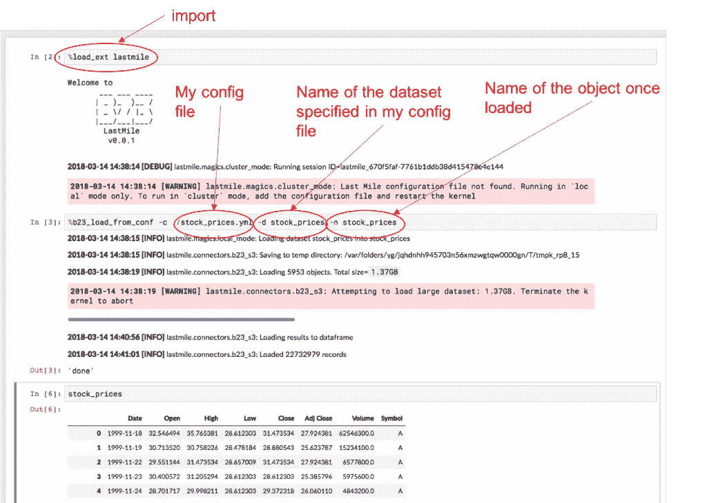

我所要做的就是指定下面的配置文件，Lastmile 将自动循环通过您的 s3 存储桶，下载到本地的临时文件，将每个文件加载到内存中，然后将所有内容连接到一个大熊猫数据帧中——哇，这真是轻而易举！

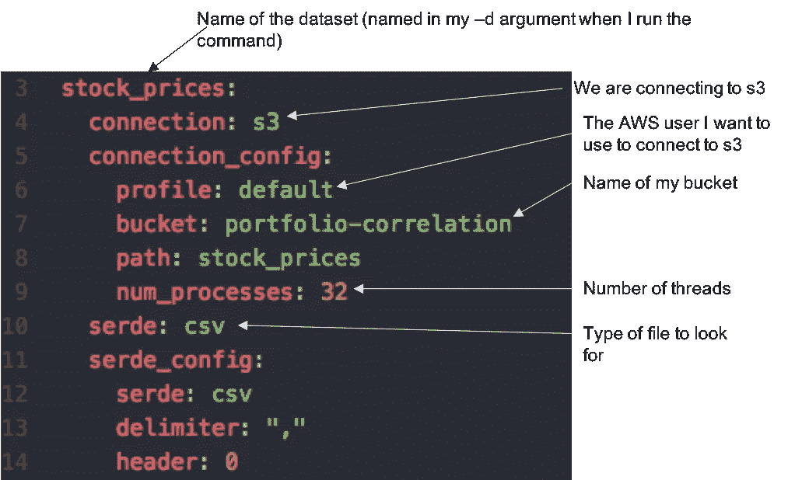

**获得必要的云资源**

现在我有了一个运行在内存中的几 GB 的数据集。我也许可以在我的本地机器上安装这个，但是这会让我的生活变得困难，尤其是当我正在使用我的计算机的一些内存来观看第一轮疯狂三月的时候！因此，我将在 [B23 数据平台](https://platform.b23.io/)或 BDP 上构建一个 [R 堆栈](http://www.b23.ai/experimenting-with-chromebook-data-science-in-the-cloud/)。这给了我一个 16 核和 64GB 内存的 m4.4XL。基本上，一台更大、更坏的机器，有足够的内存来存储我的数据的多个副本，有足够的计算能力来并行运行大型作业，价格为 0.80 美元/小时。通常设置这个的过程是相当烦人的——我已经跟随了几个长教程，比如[这个](https://www.datacamp.com/community/tutorials/aws-ec2-beginner-tutorial),并且花了很多时间试图弄清楚额外步骤的细节，比如连接到我的 s3 桶。对于 BDP，我有大约[一页的指令](https://b23-llc-stackspace-user-documentation.readthedocs-hosted.com/en/latest/index.html)。本质上，我只需选择要运行的堆栈，选择我想要的机器大小，就可以开始处理一些数据了！

**回到数据集**

除了价格数据，我还创建了一个数据集，包含目前在美国证券交易所、纽约证券交易所或纳斯达克上市的每家公司的公司摘要信息——总共约 6000 家公司，下面是动态数据集的截图。

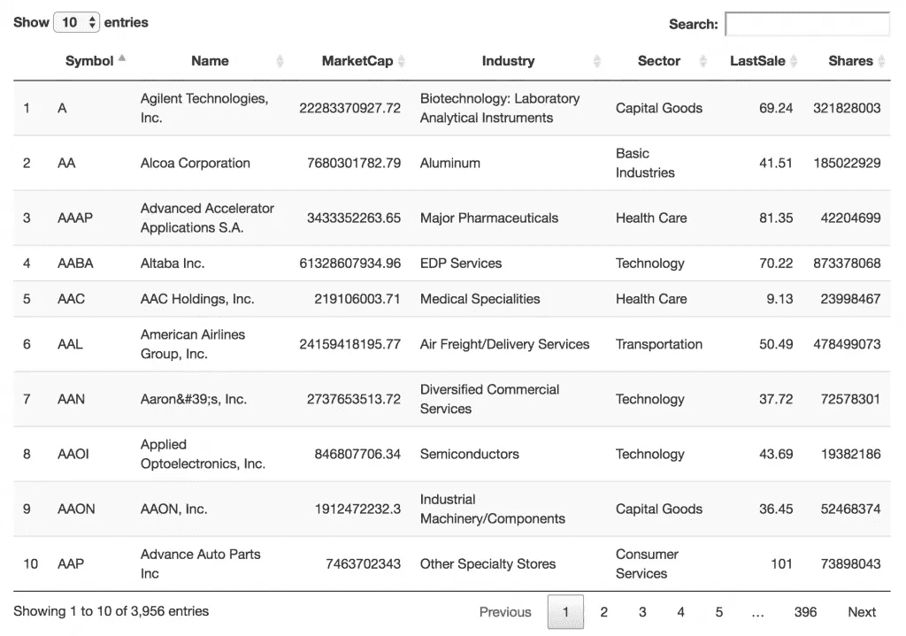

然后我开始清理数据:

*   消除数据集中不到一年的重复和库存
*   有限的每日价格调整收盘，因为这占股息
*   只保留了我的列表中不属于金融行业且没有空白行业的公司的价格数据。这样，总共只剩下不到 4，000 只股票:

现在我们有了一个非常好的、干净的数据集来处理。然而，仍然有几个问题需要解决。

**1。我们不能直接比较价格，因为它们不是固定的。**在两个非平稳时间序列之间运行相关性不是一个好主意。如果这两个序列只是朝着同一个方向运动，它们的相关性就会被极大地夸大。正如在，汤姆·布拉迪会拒绝与他们玩膨胀。关键问题是，单只股票的价格取决于其历史，在分析其与另一只股票价格的关系之前，必须消除这种依赖性。一个简单的方法是求第一个差。在这种情况下，股价差异在很大程度上也取决于股票的价格，因此更好的衡量标准是*对数差异*。让我们定义一天 *i* 的日志日收益:log(price I)-log(price I-1)。

现在我们有了一个固定的测量，但它是在一个非常短的时间尺度上。一般来说，在构建投资组合时，我们不会在意每日相关性，因为我们着眼于更长时间的回报。因此，我们将使用双周收益日志，定义为第 *i* 天:log(price I)log(price I 14)。这相当于连续两周的每日日志回报总和。为了保持平稳性，我们还需要确保每两周采集一次非重叠样本。

事实证明，这些日志日收益率比原始股票价格更好玩，离群值少得多，且呈相对正态分布:

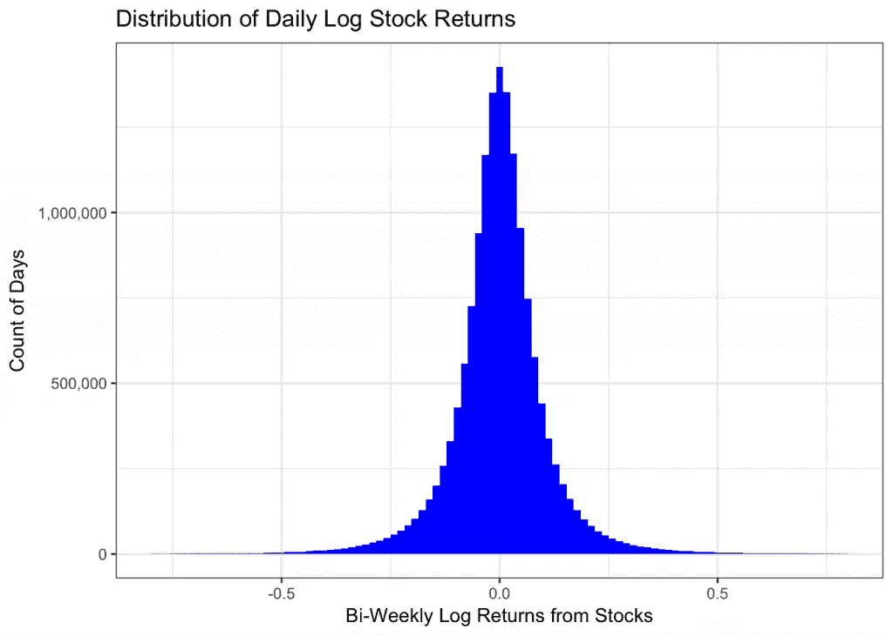

**2。所有股票都倾向于跟踪市场指数。这将导致股票看起来比实际更相关。为了清楚地看到这一点，请查看一组股票随时间变化的曲线图。**

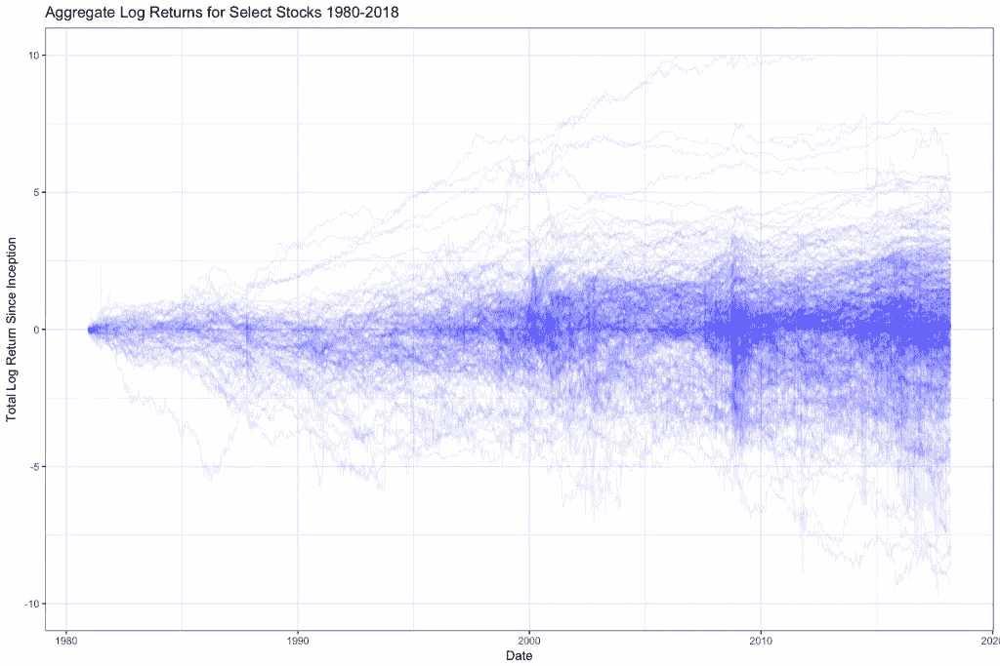

请注意，大型市场事件尤其普遍，比如 2008 年的崩盘。为了解决这个问题，我们将创建一个加权的市场指数，它是所有股票按其发行在外的股票数量加权后的综合价格。现在我们可以简单地减去对数市场回报周期。我们称之为两周一次的超额回报——这是高于市场周期的回报。

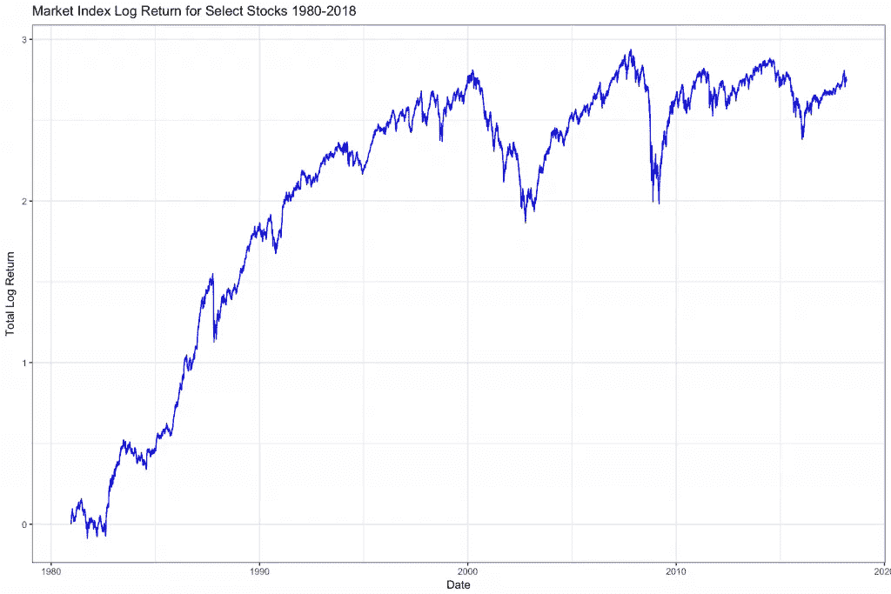

**现在我们来看看相关性**

为了衡量相关性，我们将使用一段时间内两只股票双周超额收益的对数之间的皮尔逊相关系数，或ρ。特别是，我对相关性随时间的一致性感兴趣。假设我观察了 1995 年至 2005 年间的可口可乐(Coca-Cola ),我想知道哪些股票与之相关。会有几家公司看起来有关联；其中包括爱迪生联合公司(Edison)和纽维尔品牌公司(Newell Brands)。ED 是一家主要在纽约地区运营的电力公司。NWL 是一家消费品营销商，我们可能会认为它与可口可乐更有关联。在此期间，两者都与可口可乐有很高的相关性(*p*10–6)。所以让我们看看他们 2005 年及以后的总体超额收益:

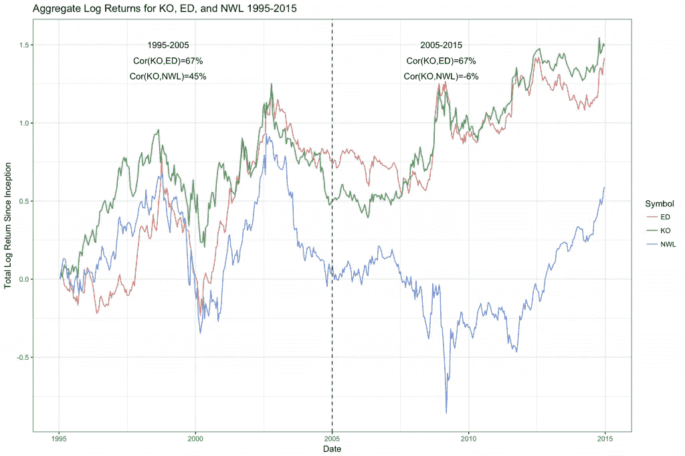

有趣的是，虽然 ED 的相关性仍然和以前一样强，但 NWL 却迅速偏离。事实上，在 2005 年至 2015 年期间，NWL 与可口可乐没有任何关联。看看两家公司每期双周收益的对比。这里，每个点是一周，我们可以看到两家公司的相对表现。

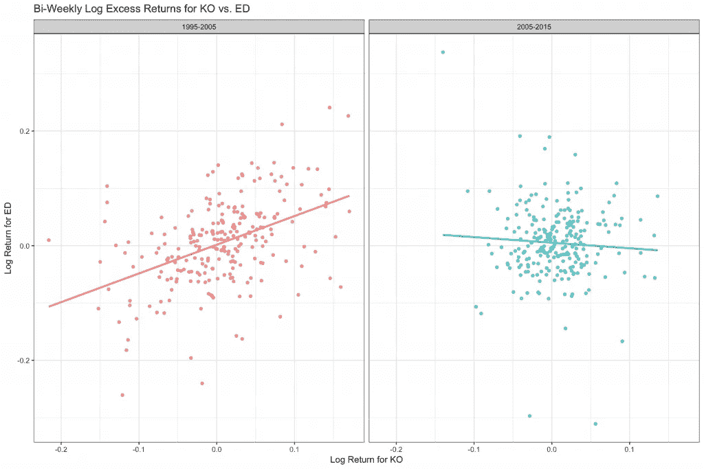

从 1995 年至 2005 年，可口可乐表现良好的时期似乎与 NWL 表现良好的时期一致，反之亦然，因此出现了向上的斜线。2005–2015 年，线是平的，所以没有任何关系。所以，很明显，我们有两种状态:一种有相关性，一种没有相关性。我们是如何在他们两人之间进化的？让我们来看一下 1995 年至 2015 年整个时间段内连续两年的相关系数(ρ):

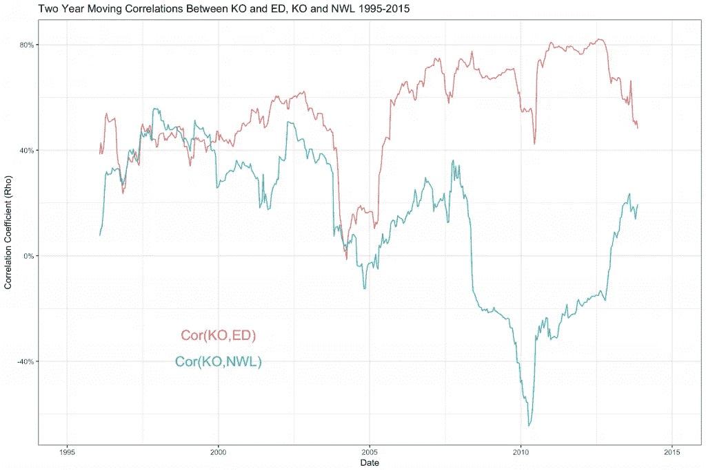

我们可以看到，仅仅是由于统计上的波动，这些相关性就会出现相当大的波动。但是，在 2007 年前后有一个非常陡峭的变化。一种理论是，有许多因素对股票价格的上涨和下跌施加压力，有一种力量压倒了 NWL，使其大幅下跌，淹没了与可口可乐的关系。另一个原因是，公司之间的潜在关系消失了。也许 Newel brands 曾经销售某些可乐产品，但他们在 2007 年停止了这样做。

无论解释是什么，我都有兴趣看看在更广的范围内相关性有多稳定。一般来说，历史相关性*的预测性如何？也就是说，如果我观察 1995 年到 2005 年间任何两家公司之间的相关性。这些公司在 2005 年至 2015 年间继续保持相关性的可能性有多大？为此，我需要对数百万对公司的两个时间段进行相关性分析。感谢科学，我正在云中运行它！*

**相关性的相关性**

好了，现在我要请你戴上莱昂纳多·迪卡普里奥的帽子，和我一起再深入兔子洞一层。因为现在我们要看相关性的相关性。换句话说，如果我从 1995 年至 2005 年(称之为训练期)取两对股票之间的相关系数，我可以预期从 2005 年至 2015 年(称之为测试期)重复多少结果；两个周期之间的相关系数有多相关。答案是 26%左右——不是没有，但也不是很好。考虑到大多数投资组合优化方法以某种方式假设恒定相关性(大多数使用*条件*相关性，以及许多员工技术，如多指数或收缩来改善估计)，我们会期望更高程度的一致性。

对于大量完全不相关的公司对来说，这一衡量标准可能会因 0 左右的大幅波动而变得模糊不清，所以让我们问一个稍微实际一点的问题:如果我确定了一个超高的相关性，即我认为存在一种真实的关系，那么这种相关性多久重复一次？在训练集中具有ρ>.5 的公司对内的相关性的相关性跳到大约 40%。如果一家公司在培训中有ρ>.5 相关性，那么他们在测试中有大约 50%的机会再次有ρ>.5 相关性。更详细地说，我根据训练相关性将训练和测试相关性的分布分成几个桶…

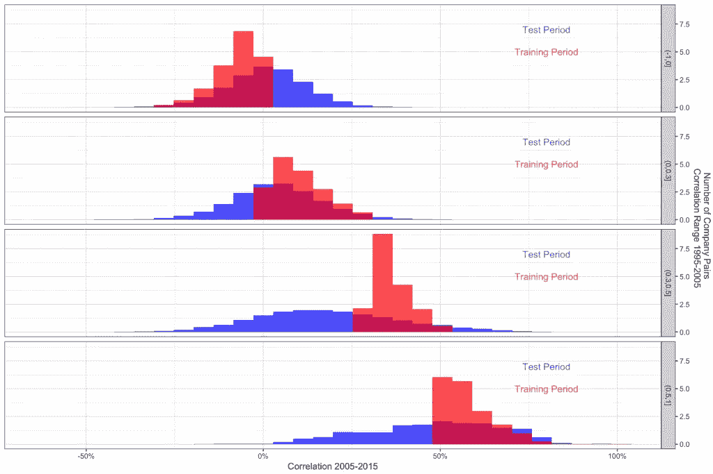

在 1995 年至 2005 年间，我们已经确定具有高度相关性的底层人群中，持续相关性的比率比普通人群中的比率高得多。此外，相关性低于 0.5 的“未命中”仍然倾向于高于平均值。这是一些稍微好一点的消息。

**看见森林**

所以大致有一半的相关性在不同的时间段是稳定的。这对整个市场前景意味着什么？这个简单的统计数据无法让我们看到整个市场格局是如何变化的。首先，股票来来去去。另一方面，我们看不到哪些关系持续稳定了很长一段时间，而哪些关系转瞬即逝。市场内连通性的本质有任何可预测性吗？这是一个最好通过视觉探索的问题，至少第一遍是这样的。首先，让我们看看在这两个时间段内，整个相关性的*网络*是什么样子的。为了做到这一点，我绘制了一个网络图——它连接了每一对相关度超过 50%的公司。我根据公司的部门给节点涂上颜色，并根据市值来确定它们的大小。

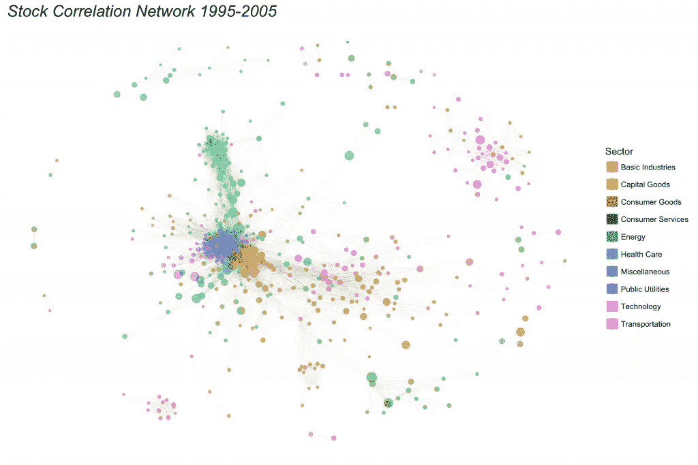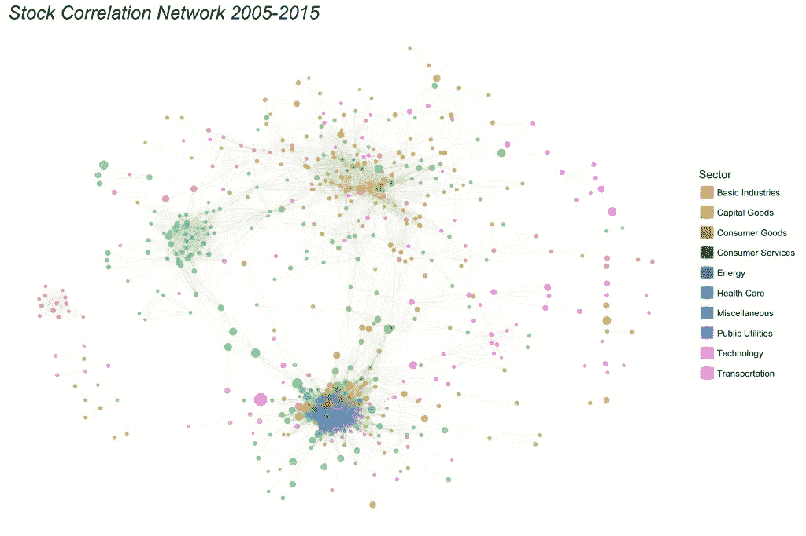

**万物的进化**

从表面上看，这似乎是两种截然不同的制度。然而，要意识到有很多相似之处:在公共事业和基础工业部门有密集的相关股票核心，这种情况似乎持续存在。为了考察我们是如何在这两种制度之间转换的，我将试图描绘一幅市场随着时间推移的完整演变图。为了做到这一点，我将使用类似的策略，但对于优势，我将使用股票对之间的两年运行相关性，并且我将在 2002 年至 2012 年之间的每个星期都这样做(仅供参考，我计划重新运行这个以更好地匹配上面使用的时间段)。

我再怎么强调在云上运行这部分分析的重要性也不为过。我现在每周都在做几百万次的比较。在我的桌面上，这项工作需要几个小时甚至几天，而且很难并行化，因为我的机器没有足够的内存在每个内核上保存大型数据集的副本。但是在我为此而改进的 m4 上，整个工作只需要几分钟。似乎相关性还不够计算，创建图表也有很多困难。为了创建一个视觉上简单的布局——这些图使用了一种叫做 Fruchterman Reingold 的算法。该过程本质上运行物理模拟，其中节点相互排斥，但连接的节点根据其连接的权重被吸引。我正在以一种方式创建动态布局，允许节点在不同时间段之间缓慢移动，最大限度地减少总移动量，但也试图根据 Fruchterman Reingold 算法最大限度地简化。这些模拟需要大量的计算能力。

事不宜迟，请欣赏这部电影:

嗯，它可能不会进入圣丹斯电影节，但我们可以从这部小电影中学到很多东西。有趣的是，高度集中的技术部门在 2004 年前后似乎已经解体。大约在同一时间，另一大群消费品和服务出现了。除了特定部门集群的涨落之外，部门之间的关系也是波动的。在 2011 年前后的一段短暂时间里，我们的主要公共事业集群转向消费服务。从这种探索中我们可以得出许多假设。也许作为更大集群的一部分的公司关系比仅仅两个公司之间的关系更加一致。也许一个部门内的关系比跨部门的关系更加一致。

*原载于*[*www . b23 . io*](https://www.b23.io/when-it-comes-to-financial-data-the-power-of-cloud-can-help-you-see-the-forest-through-the-trees-part-1/)*。*