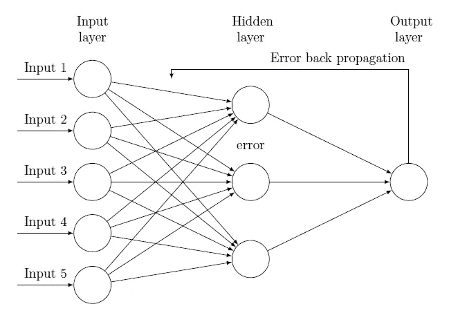
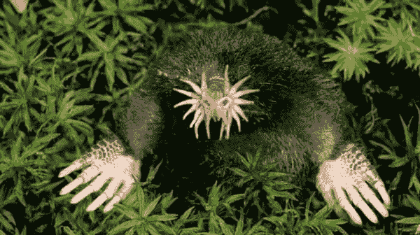
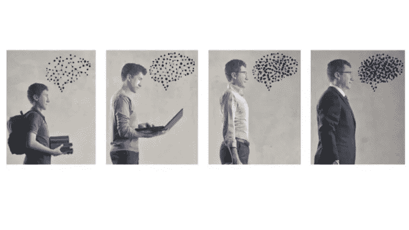
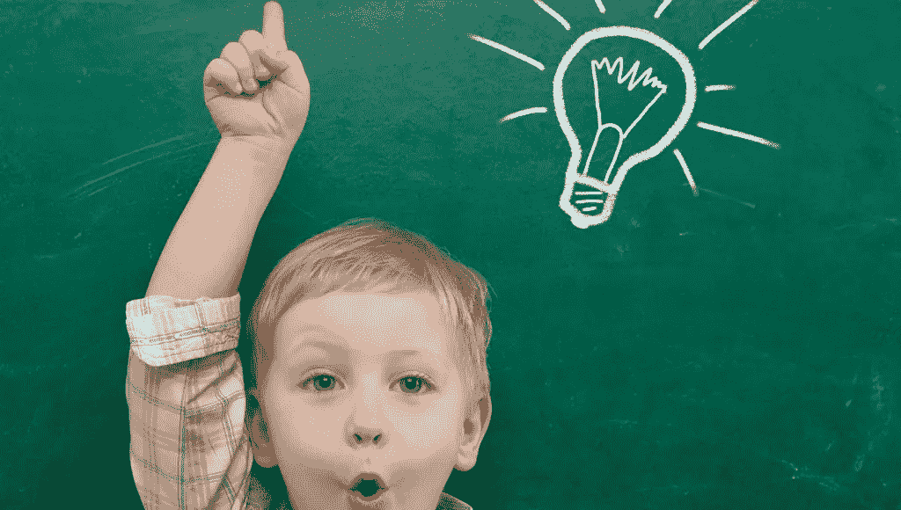

# 当网络永不停止学习:持续学习 vs. DNN 学习 vs .迁移学习

> 原文：<https://medium.datadriveninvestor.com/when-networks-never-stop-learning-continual-learning-vs-dnn-learning-vs-transfer-learning-3fbe47048467?source=collection_archive---------0----------------------->

Continual learning does… what it says: keeps learning. Not true for DNN and its cousin, Transfer Learning.

我在与人工智能合作时经常遇到的一个问题是:

> “酷…我看到这个人工智能从未停止学习。但这就像迁移学习，对吗？…"

尽管人们在说深度学习、神经网络、转移学习等词时，就像在星巴克点拿铁咖啡一样容易，但我不太相信他们真的理解这些算法中微妙但关键的差异。牛顿物理学和相对论物理学之间的区别如此重要，要证明这一点，必须首先通过日蚀和水星轨道的细微衍射进行测试，但它们的根本区别和分歧是巨大的。

持续学习和传统的 DNN 学习之间的鸿沟同样巨大。

 [## 2019 年深度学习的终极学习路径及更多...-数据驱动型投资者

### Faisal 在加拿大工作，拥有金融/经济和计算机方面的背景。他一直积极从事外汇交易…

www.datadriveninvestor.com](https://www.datadriveninvestor.com/2019/01/07/the-ultimate-learning-path-for-deep-learning-in-2019-more/) 

我和我的同事花了数年时间研究和实现终身 DNN(L-DNN)，今天，这是一个发展完善、部署到位的网络家族，属于“持续学习”算法的新兴类别。它们与传统的“AI”(更好的，DNN…或深度神经网络)算法有什么不同？

首先，让我们提醒大家今天的深度神经网络是如何工作的。然后，我会一劳永逸地清理你的头脑。等不及了！…

# 今天的 DNN 是如何运作的

基于 20 世纪 60 年代的理论工作，今天的深度学习和神经网络算法的力量来自于从数据中学习的能力(而不是被预编程来执行功能)。

他们还大量使用 20 世纪 80 年代形成的学习形式:反向传播。该算法通过迭代调整每个神经元的权重来优化网络输出，完成对该数据(例如，图像)的学习过程。这使得基于反向传播的人工智能系统能够在越来越多的任务中匹配甚至超越人类水平的表现，从下棋到在安全摄像头中检测入侵者。

然而，这种超级性能是以沉重的代价为代价的:反向传播网络对新信息非常敏感，容易受到灾难性的干扰。当学习到新的东西时，它会抹去旧的信息。为了缓解这个问题，研究人员采取了两个步骤:

1.让学习*变得更慢，只需少量改变突触，并在多次迭代中重复这个过程，通常是几十万或几百万次，其中每次输入重复出现，其错误不断减少，每次一点点。*

*2.在达到目标性能后，简单地 ***冻结学习*** ，以避免在添加新信息时损害旧的学习信息。*

*所以，今天的 DNN 是 ***慢于训练*** 和训练后的 ***静*** (因为更新它们慢如冰川)。震惊？等我给你讲迁移学习。*

# *迁移学习怎么样？*

*那么，什么是迁移学习(TL)呢？它和迁移学习有什么不同呢？*

*TL 现在是一种非常流行的方法，以前开发的 DNN 被“回收”作为 DNN 学习第二个任务的起点。*

*揭开这意味着什么:它使用一些预先训练的权重来初始化一个新的 DNN，这有一点帮助…*

> **基本上，传统的 DNN 方法没有什么真正的改变，除了你可以用更少的数据进行训练…**

**

*例如，如果你有一个在流行的 Imagenet 上训练的模型，它可以识别 1000 个对象类别(汽车、狗、猫等)，并说你想训练一个新的模型来区分尤卡坦/西伯利亚犰狳和新的塔斯马尼亚翼龙(我希望这些是稀有动物……)你奶奶在她的院子里，TL 会尝试通过初始化一个新的网络来学习这两种动物，该网络的权重来自更大的 1000 个类别的网络，该网络已经知道一些动物的样子。*

*虽然 TL 可能有助于使新网络的训练更快和更可靠，但有一个问题是，新网络现在只能识别尤卡坦半岛/西伯利亚犰狳和塔斯马尼亚翼龙。*

*两件事。不是 1002！*

> **让我重申一下:新网络对你之前学习的 1000 个对象一无所知，它只能识别 2 个新对象。**

*因此，尽管这种训练比从头开始的训练快，但它仍然可能需要几个小时到几天的时间，这取决于数据集的大小。请记住，上述所有类似 DNN 的问题都适用。*

> **迁移学习并不是深度学习的新方法。你只需使用循环网络进行少量训练。**

*虽然回收对环境有益，但对人工智能来说并不是革命性的。*

# *那么，DNN 怎么样？*

*终身-DNN (L-DNN)的灵感来自大脑神经生理学，并在软件中模仿皮层和皮层下电路“串联”工作的能力，以在飞行中添加新信息。如上所述，DNN 在大型数据集上以迭代的方式进行训练，原因如下所述，而 L-DNN 在学习中使用了完全不同的方法，其中迭代过程在数学上由瞬时过程近似，在架构中引入了与传统 DNNs 相关的新过程、层和动态。*

**

*Continual learning is the learning methodology employed by biological systems: they never turn it off!*

*至关重要的是，在 L-DNN，你在训练中付出的代价是不变的:也就是说，对于你遇到的每一项数据，你只需要训练一次。这转化为训练速度的巨大提高，在相同的硬件上，L-DNN 在 10K 之间的训练速度比传统的 DNN 快 50 公里。*

**

*那么，尤卡坦半岛/西伯利亚犰狳和它的塔斯马尼亚翼龙朋友怎么样？*

*L-DNN 将允许训练动物种类(比如说，10 种)，然后让你只需几毫秒的训练就可以将两个新的动物种类添加到现有的类网络中，所以现在你的奶奶有了一个网络来区分她的异国动物。*

*如果你尝试用 TL 来这样做，即使在用旧的 10 级模型的权重初始化新的 12 级模型之后，你仍然需要训练它几天，并且需要比 L-DNN 更多的数据。*

*更糟糕的是:由于 TL 完全类似于 DNN 训练，您将需要保存所有的训练数据，因为 DNN 训练迭代所有的数据点。有了 L-DNN，你可以在旧的东西上不断添加新的东西，只需要新的数据，你不再需要你之前拥有的那 10 种动物的图像了。*

> *那是巨大的…也就是说，在 L-DNN，你可以扔掉学习数据，而在 DNN，你需要保留它。想象一下隐私方面的含义吧！*

*(想了解更多关于终身学习的知识？[看到这里](https://medium.com/datadriveninvestor/when-natural-intelligence-blows-artificial-intelligence-out-of-the-water-3c2c9fc159ee)*

# *总结:迁移学习与 DNN*

**

*虽然可以得到比传统 DNN 更快的训练，但训练仍然是缓慢的、非瞬时的、非增量的；*

*您需要向已经知道 1，000 条数据的网络中添加 1 条新数据？迁移学习除了在 1001 个数据点上训练之外，没有其他答案。使用 L-DNN，你只需支付一个不变的、可以忽略不计的价格，而且你只需要用一条数据进行训练。*

*有了 L-DNN，你不需要保存所有的训练数据。对于 DNN，如果你不这样做，你就完了。*

*所以，永远不要把新的 L-DNN 学习范式和传统的 DNN 训练混淆，无论是它的原始形式还是它的新化身 TL。一样的东西。*