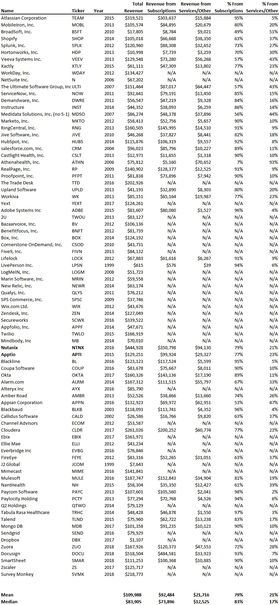

# 当非经常性收入有价值时

> 原文：<https://medium.datadriveninvestor.com/when-non-recurring-revenue-is-valuable-82101b99bad5?source=collection_archive---------8----------------------->

风投喜欢有经常性收入的业务，许多风投不会把任何价值归于非经常性收入流。也就是说，不要犯放弃非经常性收入流的错误。如果你这样做，你就忽略了一个巨大的免费融资来源以及其他好处。入职费和安装费等非经常性收入流是一个极好的现金来源，这意味着你不必筹集那么多钱来实现你的目标。其他非经常性收入来源，如持续服务或支持，有助于保持与客户的联系，从而防止客户流失并发掘追加销售机会。

在我们监测的 82 家 SaaS 上市公司中，有 49 家将 SaaS 的经常性收入从其他收入来源中分离出来。我们在下面列出了一些最大的 SaaS 成功案例，它们从非订阅来源获得了可观的收入。请注意，N/A 表示收入没有细分。

在这 49 家公司中，平均而言，83%和 79%的收入来自订阅，剩下的一小部分收入来自非经常性收入(17%和 21%)。其他收入来源各不相同:Atlassian 和 Splunk 从维护中获得了很大一部分收入，MobileIron 从永久许可证和支持中获得了相当一部分收入，而 Shopify 从商户处理费中获得了大量收入。

如果你只从订阅中获得收入，你会留下一些收入，这些收入可以作为免费的现金融资，让你的产品对客户更有吸引力。虽然风险投资可能不喜欢非经常性收入，但它会帮助你建立一个类似于所示上市公司的真正企业。

*在 blossomstreetventures.com 拜访我们*