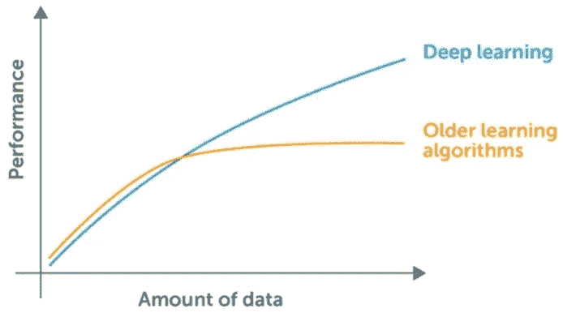
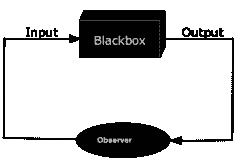
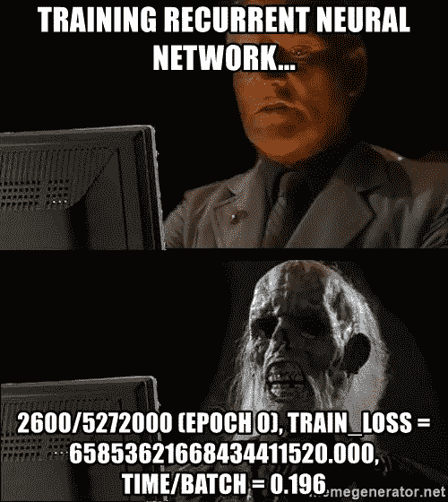

# 何时不使用神经网络

> 原文：<https://medium.datadriveninvestor.com/when-not-to-use-neural-networks-89fb50622429?source=collection_archive---------0----------------------->

好了，伙计们，我们都知道神经网络很棒，它们真的很酷，在过去几年中，在许多任务中表现出了最先进的性能，并且在深度学习的许多任务中非常有前途，是深度学习背后的主要驱动力。

但是你有没有想过为什么它们在大多数时候都工作得很好，什么时候你应该避免使用它们？作为一名优秀的数据科学家/机器学习工程师，你应该非常清楚自己拥有的武器库，以及何时应该使用哪种武器来确保最大的结果。

因此，最近对神经网络大肆宣传的背后有 3 个主要原因——**数据、算法(多亏了辛顿的反向传播，几乎每个神经网络都使用)**和**计算能力。**

你给神经网络输入的数据越多，它的表现就越好。

计算能力每两年翻一倍，随着许多公司生产更强大的硬件，处理过去几年收集的大量数据变得简单多了。英伟达在 GPU 方面是市场领导者，现在谷歌也进入了这一领域，最近发布了 TPU(专门用于深度学习的[ASIC](https://en.wikipedia.org/wiki/Application-specific_integrated_circuit)),使训练深度神经网络变得更容易，这需要如此强大的计算能力。

此外，谈到算法，[反向传播](https://en.wikipedia.org/wiki/Backpropagation)一直是这些神经网络带给我们的神奇背后的主要驱动力，它不是一个新东西，已经存在很长时间了，只是最近因为如此多的数据和计算能力而闻名。

神经网络的主要优势在于它们能够超越几乎所有传统的机器学习算法，但就像其他任何东西一样，它们也有自己的缺点。

当你拥有如此多的数据(当然还有计算能力)时，你很可能会使用神经网络，而**准确性对你来说是最重要的**。例如，**癌症检测**。如果你想在实际的医疗应用中使用它，你不能在精确度上浪费时间。

所以，让我开始逐一讨论神经网络的缺点:

# 1.大多数时候很难理解

大多数情况下，如果你将神经网络用于正确的问题，它会给你带来好的结果，但如果它表现不好，你会很难找到为什么它没有像预期的那样发展，特别是深度神经网络(大多数情况下都是这样)。例如，如果你试图预测癌症的类型，并且你预期输出是**恶性、**，但是你得到的是**良性、**，这将很难弄清楚为什么神经网络给出这样的输入，而传统的 ML 算法，如**决策树**，将更容易解释。

例证:银行通常不会使用神经网络来预测一个人是否有信用，因为它们需要向客户解释拒绝贷款的原因。

长话短说，当你需要对某事发生的原因做出解释时，神经网络可能不是你的最佳选择。你不能仅仅因为我们的计算机这么说就做出决定。

# 2.他们需要太多的数据

I bet you saw this coming,didn’t you :P

当然，你预见到了！神经网络需要比传统机器学习算法多得多的数据才能很好地完成工作。大多数情况下，如果数据太少或者数据不多，你会发现自己在与神经网络作斗争，有时你不会有太多数据。例如，当数据较少时，**朴素贝叶斯**会处理得很好。

# 3.它们需要时间来发展

我知道交易伙计们，你们中的一些人可能会想我在说什么。我知道使用诸如 **Keras、**之类的高级 API 在几分钟内构建一个神经网络模型是非常容易的，但情况并非总是如此(事实上，在大型项目中从来都不是这样)。Keras 非常适合快速原型制作，但也有自己的缺点。当你需要大量定制时，你不会发现它是一个好的竞争者，这就是 **Tensorflow** 来拯救你的地方，为你提供更好的选项来根据你的需要定制东西，所以你真的要再次考虑建立一个定制的神经网络模型(以很好地适应问题)是否值得努力，或者你可以使用传统的 ML 算法。

# 4.他们在训练阶段花了很多时间

I bet you have seen such memes xD

我们都知道，神经网络比传统的 ML 算法需要更长的时间来训练，我们并不总是有计算能力，即使我们有，有时，我们也没有时间等待这么久，并决定最终结果是否值得等待。虽然这真的取决于你的神经网络的架构(通常有多深)和你的数据的大小，但在大多数情况下，它仍然需要一些时间来训练它。

总而言之，你知道神经网络可以超越几乎所有传统的最大似然算法，但是的，它们也有自己的缺点，所以下次你需要解决最大似然问题时，明智地选择你的算法，并带着“你知道你在做什么”的感觉。希望这篇文章能帮助你，增加你现有的 ML 知识。如果是这样的话，如果你能尽可能多的鼓掌，我会很感激，你可以在 [Medium](https://medium.com/@rbhatia46) 和 [Twitter](https://twitter.com/rbhatia46) 上关注我，了解我写的所有关于机器学习和网络开发的最新消息。感谢你的阅读，祝你圣诞快乐，新年快乐！