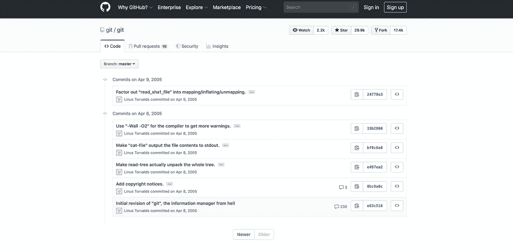
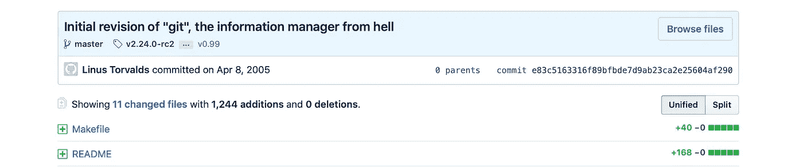
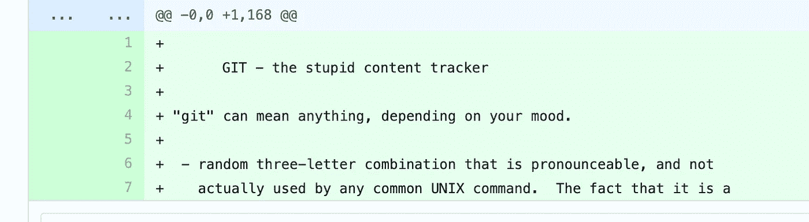
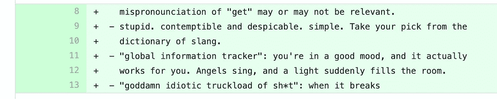
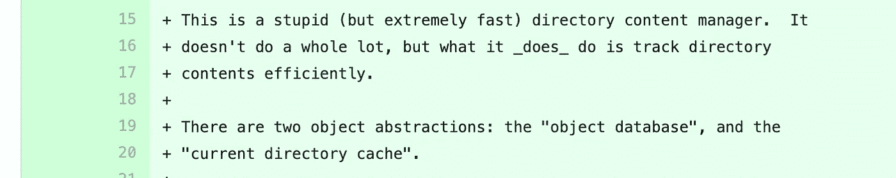
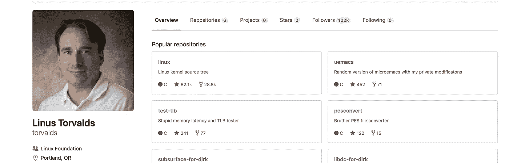

# 当成功者自我怀疑时 Git 的诞生

> 原文：<https://medium.datadriveninvestor.com/when-overachievers-self-doubt-the-birth-of-git-780503960577?source=collection_archive---------3----------------------->

## Linux 创造者 Linus Torvalds 创建 Git 是为了向自己证明他不仅仅是一个“昙花一现的奇迹”

在欧洲开源峰会的一次炉边谈话中，Torvalds 回顾了他创建最广泛使用的版本控制系统——Git 的动机。尽管他创造了 Linux，并在全世界超过 2500 万台设备上使用，但他也不能幸免于冒名顶替综合症。

[Ted](https://www.youtube.com/watch?v=o8NPllzkFhE)

在 2019 年 10 月 28 日在法国里昂花旗会议中心举行的峰会上，他说:“我们都有自我怀疑。Linux 只是 Unix 的重新实现。Git 证明了我不仅仅是昙花一现。”

Linus Torvalds (l) and Dirk Hohndel (r) at the Open Source Summit Europe — Image: [Matt Asay](/"I maintained Git for six months, no more," he acknowledged this week at Open Source Summit Europe. "The real credit goes to others. I'll take credit for the design.")

他的自我怀疑加上对现有 SCMs(源代码控制管理)的不满，导致他在一个周末把自己关在一个房间里，并创建了现在众所周知的 git。

> “工作显然大部分是在白天进行的，但也有一些是在午夜和凌晨 2 点进行的。”—托瓦尔兹

 [## 在创业之旅中，拥抱学习|数据驱动的投资者

### 好像建立一个数百万美元的公司还不够困难，企业家必须额外照顾他们的…

www.datadriveninvestor.com](https://www.datadriveninvestor.com/2018/10/16/on-the-entrepreneurial-trek-embrace-the-learning/) 

它是一个在软件开发过程中跟踪源代码变化的工具。**它是为协调程序员之间的工作而设计的**，但是它也可以用来跟踪任何一组文件中的变化。这意味着您对代码所做的任何更改都是可见的，并且带有发生这种更改的时间戳。

How collaboration happens over git — [Noble Desktop](https://www.nobledesktop.com/blog/what-is-git-and-why-should-you-use-it)

观察 git 的诞生是很有趣的，因为这一切都发生在周末，时间戳可以证明这一点。当被问及此事时，[莱纳斯是这样回答的](https://www.linuxfoundation.org/blog/2015/04/10-years-of-git-an-interview-with-git-creator-linus-torvalds/)

> 你整个周末都在熬夜写它，还是只是在正常时间写？
> 
> 托瓦尔兹:呵。除了第一天左右，你实际上可以看到它是如何在 git 源代码库中成形的。用了大约一天的时间…开始使用 git 本身向 git 提交东西，所以第一天左右是隐藏的，但是其他的都在那里。这项工作显然大部分是在白天进行的，但也有一些是在午夜和凌晨 2 点进行的。

Git 已经提交了超过 57K 个变更，有 1300 个贡献者，现在它非常受欢迎，到处都在使用。我实际上进入了存储库去挖掘关于最早提交的信息。提交是已经达到一个里程碑且足够稳定以至于可以保存在代码库中的代码版本。下面是最初几次提交的情况

Notice the year of this commit

The Information Manager from Hell — Linus Torvalds

《第一次犯罪》的标题表明了特洛沃兹的幽默感。自述文件的内容同样令人捧腹。

Trovalds 被认为创造了 Linux 和 Git，但现在他说他不再是程序员了。如今，他不再写代码，而是阅读解释 Linux 内核修改建议的电子邮件和入站提交消息。

> “提交消息对我来说几乎和代码本身一样重要”——托沃兹

[Torvalds’ github page](https://github.com/torvalds)

尽管疯狂的编码导致了 git 的诞生，但早期编写的实际代码只占整个项目的一小部分。Linus 最初的爆发更多的是激发想法，而不是创造成品。

他在采访中提到——“我想强调的是，虽然它确实是在大约**十天**左右(那时我使用 git 完成了我的第一个*内核*提交)，但这并不像是某种疯狂的编码。早期代码实际数量相当少。”

这位创意天才也很谦虚，认为这个项目是他的团队的功劳。“我维护了 Git 六个月，没有更多的时间，”他在欧洲开源峰会上承认。“真正的荣誉属于别人。我会把设计归功于我。”

> "有时代码的变化如此明显，以至于不需要解释，但这种情况很少见."—托瓦尔兹