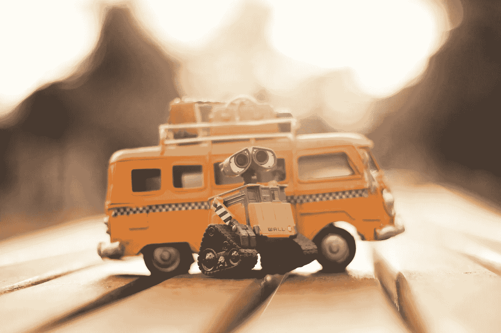

# AI 会成为人类继续存在的法官和陪审团吗？

> 原文：<https://medium.datadriveninvestor.com/when-robots-kill-afe9e19acf80?source=collection_archive---------8----------------------->

## AI 会带我们去哪里？

Photo by Renato Danyi from Pexels

***人工智能***

我们在电影《终结者》中看到了科幻版的人工智能，天网是一个人工智能驱动的计算机系统，它接管了世界，并试图消灭人类。此外，还有那些电影，其中有一个可爱的机器人，具有像人类一样的感情，就像瓦力。在现实中，现在在我们的家里，我们有人工智能驱动的个人助理，如 Siri 或 Alexa，它们被认为对复杂任务的能力水平较低，但这将会改变——它们将迅速改善。想象有一天，一个可爱的机器人，像瓦力，不仅是你的私人家庭助理，而且出于安全目的被武器化。

(人工智能)正在迅速发展——从谷歌的搜索算法到中国人工智能机器人“小 I”，它最近通过了医疗许可考试，成为第一个这样做的机器人，一直到自主武器，这是一种可以根据编程的限制和方向独立搜索和攻击目标的军用机器人。数据科学家、机器人和 IT 专家正在使用人工智能来帮助内部物流系统自主学习和进化，以优化履行中心、仓库或配送中心内的物资物流。人工智能统治地位的竞赛开始了。

***自主杀人武器***

根据维基百科[致命自主武器](https://en.wikipedia.org/wiki/Lethal_autonomous_weapon)是一种自主军事机器人，可以根据编程的约束和描述独立搜索和攻击目标。[1]LAWS 也被称为致命自主武器系统(LAWS)、致命自主机器人(LAR)、机器人武器或杀手机器人。法律可以在空中、陆地、水上、水下或太空发挥作用。截至 2018 年，当前系统的自主性受到限制，因为人类给出了攻击的最终命令——尽管某些“防御性”系统也有例外。

> 人工智能可以提供“不可估量的利益和风险”，例如“技术超越金融市场，超越人类研究人员，超越人类领导人，以及开发我们甚至无法理解的武器”。"
> 
> [人名]斯蒂芬·霍金 (理论物理学家、宇宙学家及作家)

超级智能计算机系统会像人类一样被贪婪和对权力的渴望所驱动吗？不太可能——人工智能不需要像人类一样思考来决定挑选人类。人工智能只需要有一个目标，比如为地球上的所有物种创造一个平衡或减少温室气体排放，并决定人类以目前的人口数量存在无助于实现目标。

有没有想过人类会对自己的创造物进行一次耶稣降临式的清算？当然，自然母亲已经尽了她的职责，在历史的进程中控制着我们…黑死病和其他疾病一起浮现在脑海中…但是，由于我们自己的创造而导致的淘汰呢？

***扑杀***

扑杀是有意识地决定从某个动物种群中移除或杀死多余的动物。这可能是因为这种动物是一种入侵物种，它威胁到了本土栖息地，也可能是因为人口增长失控，甚至可能是因为这种动物对我们的生活方式构成了威胁。一些人认为宰杀有时是必要的，而一些支持者认为没有必要，人类可能是地球生态系统的最大威胁。

然而，现在世界人口已经超过 73 亿。根据联合国的预测，到 2050 年将达到 97 亿人，到 2100 年将超过 110 亿人。只有这么多的空间，我们似乎做了很大的工作，为我们的 5 间卧室，两个车库，1 英亩的财产需求和我们的消费需求推平它。

就人类而言，地球能承受多少是没有先例的。这个星球能容纳 110 亿人吗？我们不知道。但证据似乎表明它不能。

关于什么可能阻碍我们统治地球以及什么可能导致人口调整的场景比比皆是——国家之间的一场大规模战争，一场大规模的自然灾害，一颗小行星撞上一个人口稠密的地区，等等，但一个可爱的小武器化的瓦力？这不会是因为一个开关改变了瓦力的善意和乐于助人的本性，从帮助你选择去哪家披萨店或让你知道会下雨，到突然变成一个拿着枪准备从地球上消灭你的心理机器人。这仅仅是由于一个算法，一个数学方程。

这不是针对个人的——只是做做算术。

Photo by Nubia Navarro (nubikini) from Pexels

[奥黛丽·奈斯比特在 Linkedin 上](https://www.linkedin.com/in/audrey-nesbitt-0388a52a/)

[@ audreynesbit 11 在推特上](https://twitter.com/AudreyNesbitt11)