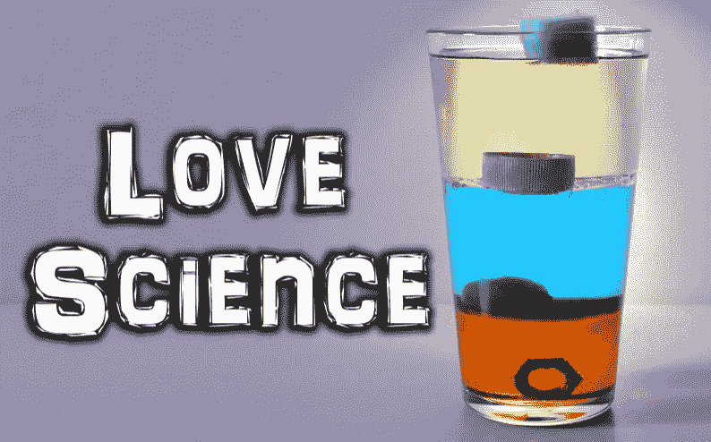

# 当科学被金钱颠覆时

> 原文：<https://medium.datadriveninvestor.com/when-science-is-turned-on-its-head-for-money-44f661dde6c2?source=collection_archive---------14----------------------->

你把质疑另一个理论的阴谋论叫做什么？如果他们要求实验证据，那就叫科学。任何不能通过实验的理论都是错误的。这是所有科学的基础。

医生告诉美国人烟草是健康的。那些质疑这种智慧的人被指责为阴谋狂人。当然，隐藏的实验后来证明人们的怀疑是正确的。

那些嘲笑任何要求对理论进行实验测试的人，通常都有不测试该理论的动机。

在被医生、政治家和专家告知儿童疫苗和自闭症之间没有(绝对没有)联系多年后，聪明人开始做真正的实验。

疾控中心首席专家证人齐默尔曼博士现在表示，疫苗和自闭症之间存在联系。他签了一份书面证词。疾病控制中心在几天内解雇了齐默曼。齐默尔曼在成为叛徒之前，是数千起自闭症诉讼的主要证人。

前疾病预防控制中心高级科学家比尔·汤普森博士说，他现在看到患有自闭症的孩子时感到非常羞愧，并表示疾病预防控制中心避免实验研究，因为害怕会发现其中的联系。这已经发生在他们的硫柳汞和 04 MMR 研究中(据 Thompson 称)。

疫苗是一个了不起的发现，但在科学上，我们总是不得不做真正的实验，不管我们可能会发现什么。实验是科学方法的基础。实验是我们进步的方式。如果政府命令你开始吸烟，你可能会质疑他们的动机，并为他们吸烟有益健康的理论寻求实验证据。

儿童期接种疫苗会导致自闭症吗？现在最好的答案是我们需要更多的实验。

> **你的理论有多美不重要，你有多聪明也不重要。如果与实验不符，那就是错的。理查德·p·费曼**

 [## 一位支持疫苗的医生如何重新开始关于与自闭症联系的辩论

### 一位世界知名的支持疫苗的医学专家是最新的声音，加入了表明疫苗…

thehill.com](https://thehill.com/opinion/healthcare/425061-how-a-pro-vaccine-doctor-reopened-debate-about-link-to-autism)