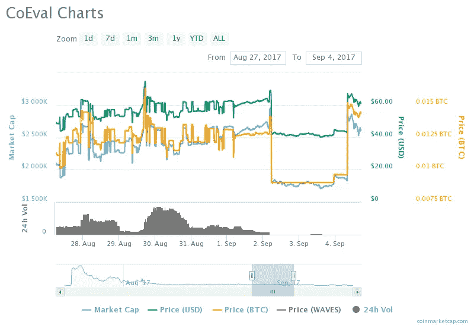

# 当有人想要你死的时候

> 原文：<https://medium.datadriveninvestor.com/when-someone-wants-you-dead-d9c88ac872bc?source=collection_archive---------3----------------------->

## 实际上，法律上，可能还有身体上的。

Silver Miller’s Expensive PR Campaign

2017 年 8 月 31 日，银米勒法[开店](https://www.prnewswire.com/news-releases/silver-miller----a-new-kind-of-law-firm-home-of-the-no-recovery-means-you-dont-pay-our-attorneys-fees-guarantee-300512442.html):

> 全国知名律师大卫·c·西尔弗和杰森·s·米勒今天自豪地宣布西尔弗·米勒(【www.SilverMillerLaw.com】)的成立，这是一家专注于商业诉讼和代表金融欺诈受害者的律师事务所——所有这些都是基于应急费用。事务所认为，如果它不能为客户挽回任何经济损失，客户就不应该为事务所的服务支付任何费用。“我们的客户已经遭受了财务损失；我们的工作是帮助他们尽可能多地弥补损失，而不是给他们增加额外的经济负担。

启动一家应急费用律师事务所并不便宜。首先，你必须支付诉讼费用，然后承担诉讼可能根本无法支付的风险。它本质上是一种佣金，只在很长一段时间内有效。

两位律师起诉的第一个案子是[猴子资本……哦，还有丹尼尔·哈里森](https://www.prnewswire.com/news-releases/silver-miller-files-class-action-lawsuit-against-monkey-capital-and-its-principal-daniel-harrison-for-alleged-fraudulently-promoted-and-aborted-initial-coin-offering-300574019.html)。这是一个奇怪的案例，原因有很多:

1.  与 Bitconnect、比特币基地、Nano Ledger、Gigawatt 和他们吹嘘的所有其他案例相比，这似乎微不足道，但它的媒体关注度是他们其他案例的 3 倍
2.  该案件在每个标题中都提到了我个人的名字(见[此处](https://www.prnewswire.com/news-releases/silver-miller-files-class-action-lawsuit-against-monkey-capital-and-its-principal-daniel-harrison-for-alleged-fraudulently-promoted-and-aborted-initial-coin-offering-300574019.html)，此处[此处](https://www.prnewswire.com/news-releases/notice-of-securities-class-action-lawsuit-against-monkey-capital-ico-and-daniel-harrison-300580291.html)，此处[此处](https://www.prnewswire.com/news-releases/notice-of-securities-class-action-lawsuit-against-monkey-capital-ico-and-daniel-harrison-300580291.html))。他们付钱给一名记者，让他在《泰晤士报》上写一篇关于我的文章也做了同样的事情。如果我是汤姆·克鲁斯，这一点都不奇怪。但是我没有那么出名——远没有那么出名。为什么“丹尼尔·哈里森”是一个引人注目的标题？这就好像有人试图让我进入搜索引擎。
3.  考虑到媒体的报道，CoinDesk 发表了一篇文章，声称我在 7 月份就已经被法官拒绝了。我向他指出了这一点，他回答说:“对不起，那是我们搞砸了。”我问他能否把我的评论放在西尔弗·米勒的《104 个词》旁边，但他没有回应。换句话说，这是昂贵的公关。他们实际上已经买下了出版社、CoinMarketCap 和其他任何公司。
4.  尽管以这种方式追捕我肯定会付出巨大的代价，更不用说这样做所花费的时间和精力，但实际上并不确定会有任何回报。即使西尔弗和米勒先生赢了官司，我也不得不宣布破产。这意味着没有支出。为什么一开始会有两个应急费用律师接手这个案子？它代表着可怕的风险。
5.  这个案件中陈述的事实大体上是完全错误的。他们是彼得·斯皮纳的[垃圾文章](https://steemit.com/cryptocurrency/@goldseek/beware-of-monkey-capital-and-its-monkey-daniel-harrison)的类似版本，他们制作并记录了一段视频，指控各种各样做错的事情，而事实并非如此。同样，把我的名字放在汽车前灯里的愿望再次与那些彼得·斯皮纳的信件产生了共鸣。
6.  其中一名原告试图获得 30 个比特币，他声称自己是通过玩 Coeval 失去的，这是我发行的一种象征，后来价格下跌，当我向他询问初步信息以确定损失时，他告诉我“去你的”。另一个原告已经事先审核了我所有的钱包地址。还有其他我从来没听说过的。
7.  尽管进行了公关，但监管机构对这件事一点也不感兴趣，因为当你看到一份警告不要使用 ICO 的监管公告时，我做了你应该做的事情:我取消了 ICO。

总的来说，这个案件有一些独特之处——这些随机的 ICO 玩家的攻击具有强烈的个人性质，我以前从未见过他们，甚至在竞选期间也没有在一对一的基础上交谈过。它被你曾经在我们社区的聊天室和 Twitter 上发现的那种强烈的个人仇恨所煽动。

这些人甚至不认识我，而且几乎所有人都在金钱方面领先。如果他们不这样做，他们只是失去了他们最初在同期收益中获得的一切(不是全部，而是大部分)。不管怎样，这个案件带有某种个人报复的味道，其设计一点也不像普通的民事诉讼，而是本质上近乎犯罪的东西。

例如，Silver Miller 在我们的相互通信中公开和推定地向法官表示，他们将尝试在法庭外解决诉讼，但预期的审判几乎肯定是必要的。为什么？他们从未联系过我，问我是否愿意与他们和解。在这种类型的诉讼中，在寻求某种形式的早期仲裁之前花费大量金钱在昂贵的公关项目上是不正常的。此外，诉讼出现在许多律师的网页上(搜索一下)。换句话说，这不是小预算的东西。资助他们律师事务所的人想要我和我的资产死。

所以，2017 年 8 月 31 日，他们正是这么做的。仅仅一周之后，Waves DEX 下调了我创建的表现最佳的资产 Coeval 的价格:

当时我问 CoinMarketCap 为什么他们不能更正价格数据，他们回答说，一旦资产以替代形式出现，他们就会重新列出。当我第二次问他们时，他们再次拒绝了，并拒绝了我从那以后放出的所有资产。

我将保持简单:从上述事实中只能得出一个结论。有人给了西尔弗·米勒一大笔钱让他开自己的律师事务所来起诉我。他们给出了非常明确的指示，从各种意义上说，我是绝对要被消灭的；羞辱，毁灭，无论什么，很明显，因为所有这些政党都需要巨大的回扣来鼓励，他们也不在乎代价是什么。

这会是谁呢？这将是这个迷人故事的后续主题。不过，这和加密货币没有任何关系。敬请关注。

**2018 年 12 月 27 日更新:**这篇文章发表后的几天，Silver Miller 就他们的最新案例 [Silver Miller 对 Jeremy Spence 提起诉讼，指控他进行 Coin Signals 加密货币基金欺诈](https://www.prnewswire.com/news-releases/silver-miller-files-lawsuit-against-jeremy-spence-for-coin-signals-cryptocurrency-fund-fraud-300770884.html)。值得注意的是，这是该律所 18 个月来第一次在其一项诉讼的标题中提到被告的名字，而这是在这篇文章引用的批评之后直接发生的。这远没有证明 Silver Miller 经常在诉讼中突出被告的名字，而是引出了这个可疑的二人组是如何认真对待这篇文章中提出的批评。因此，问题是，为什么？人们只能从西尔弗·米勒的精神分裂症行为中得出逻辑结论，这种对个人的引用，显然是在恐慌中做出的，意味着这里包含的是非常接近真相的版本。