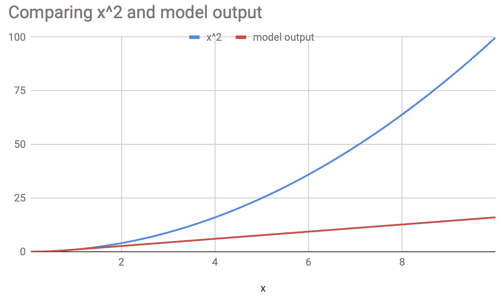

# 什么时候在你的神经网络中繁殖？

> 原文：<https://medium.datadriveninvestor.com/when-to-multiply-inside-your-neural-network-ee39863da446?source=collection_archive---------0----------------------->

典型的神经网络由输入特征和建立在其上的 Relu 单元的线性组合组成，仅此而已。那么，有必要在输入端或网络内部引入显式乘法吗？

但是首先，让我们考虑为什么你不应该在你的神经网络内部繁殖。假设你有一堆特征，想构造任意的乘法项。最直接的方法是在应用 *log()* 之后将它们输入网络。乘法变成加法，任务完成！由于其他原因，这也是有用的。当您将一组数字相乘时，乘积通常会有一个很大的方差，其值在该范围内或大或小。如果您处理原始值，那么您感兴趣的大部分区域可能会被挤压。将要素映射到日志空间可以防止此类灾难，因此在将乘数注入网络之前，这肯定是首先要考虑的问题。

其次，神经网络可以逼近任意函数。当然，它也可以近似为乘数。为了看到这一点，我们训练一个单隐层神经网络来学习乘法。如果您安装了 Tensorflow，您可以复制粘贴下面的代码并运行它。

```
''' Plot the root mean squared error of a single
hidden layer neural network while modeling x^2.
'''
import tensorflow as tf
import numpy as npNUM_TRAIN_SAMPLES = 1000000
NUM_TEST_SAMPLES = 100000feature_columns = [
  tf.feature_column.numeric_column(key='a'),
  tf.feature_column.numeric_column(key='b')]a_train = np.random.rand(NUM_TRAIN_SAMPLES)
b_train = np.random.rand(NUM_TRAIN_SAMPLES)
train = tf.estimator.inputs.numpy_input_fn(
  x={'a': a_train, 'b': b_train},
  y=a_train * b_train, # model a * b
  batch_size=128,
  shuffle=True)a_test = np.random.rand(NUM_TRAIN_SAMPLES)
b_test = np.random.rand(NUM_TRAIN_SAMPLES)
test = tf.estimator.inputs.numpy_input_fn(
  x={'a': a_test, 'b': b_test},
  y=a_test * b_test,
  shuffle=False)range_test = np.arange(0.00, 10.0, 0.01)
ranget = tf.estimator.inputs.numpy_input_fn(
  x={'a': range_test, 'b': range_test},
  y=range_test * range_test,
  shuffle=False)def estimate_error(num_hidden_units):
  model = tf.estimator.DNNRegressor(
      hidden_units=[num_hidden_units],
      feature_columns=feature_columns)
  model.train(input_fn=train, steps=100000)
  eval_result = model.evaluate(input_fn=test)
  mse = eval_result["average_loss"]**0.5
  print('rmse=%f'%mse)
  predictions = list(model.predict(input_fn=ranget))
  for ip, p in zip(range_test, predictions):
    v  = p["predictions"][0]
    print('x=%f, x^2=%f, model=%f'%(ip, ip*ip, v))if __name__ == "__main__":
  estimate_error(80)
```

80 Relus 时，均方根误差接近 0.003，这似乎是乘数的合理近似值。上面的代码还将(0，1)范围内的数字输入到乘法器的两个输入端，本质上是计算 x，然后将其与 x 的实际值进行比较。下图显示了比较结果。不出所料，这个模型似乎很擅长模拟乘法。


所以网络内部的乘法似乎已经过时了？不完全是。请注意，该模型刚刚学会近似训练数据中示例的输出，它对乘法一无所知。换句话说，*模型所学的并不能推广到真正的乘法*。为了理解这一点的重要性，我们将上面的图扩展到训练数据受限的(0，1)范围之外的值。现在情节看起来像:



神经网络可以伪装成一个乘数，但当你超过训练期间看到的值时，它就会戏剧性地崩溃。如果您的训练数据不能代表模型运行的整个世界，这可能很重要。例如，如果您的模型用于搜索排名，您的训练数据可能仅限于第一页的结果，而实际上，该模型用于对 100 倍大小的文档进行评分，超出了记录为训练数据的内容。

因此，如果你有一种强烈的直觉，认为乘法是对某些关系建模的正确方法，那么在网络中明确地实施这种方法可能会更好。它的影响可能不会立即从被划分为训练和测试的记录数据中显现出来。在线测试可能是证实你直觉的最佳方式。祝你好运！

*参见:*

[神经网络是如何工作的？](https://medium.com/machine-intelligence-report/how-do-neural-networks-work-57d1ab5337ce)

[你需要多少训练数据？](https://medium.com/@malay.haldar/how-much-training-data-do-you-need-da8ec091e956)