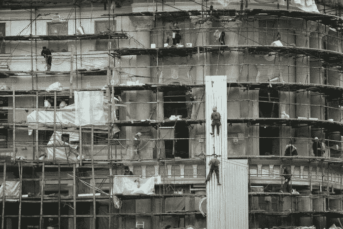
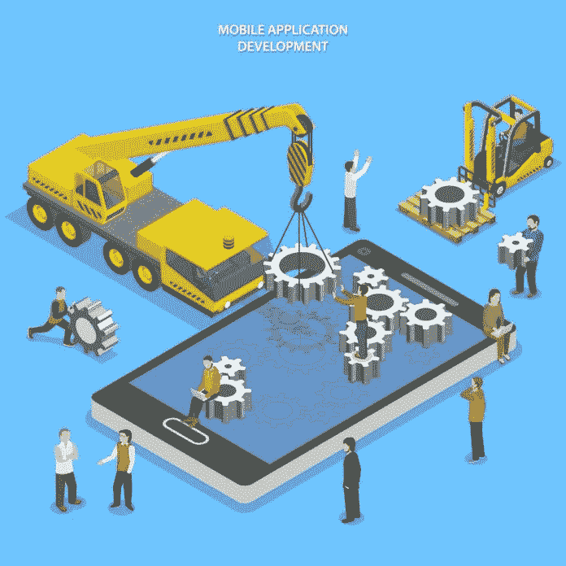

# 什么时候从头开始重建软件？

> 原文：<https://medium.datadriveninvestor.com/when-to-rebuild-software-from-scratch-data-driven-investor-420a0fe70226?source=collection_archive---------9----------------------->

软件开发影响者[乔尔·斯波尔斯基](https://en.wikipedia.org/wiki/Joel_Spolsky)明确禁止[从头开始重建软件](https://www.joelonsoftware.com/2000/04/06/things-you-should-never-do-part-i/)。他称这样做是“任何软件公司都会犯的最严重的战略错误。”几个[的历史例子](https://www.joelonsoftware.com/2000/04/06/things-you-should-never-do-part-i/)证明了这个错误的灾难性。这些案例被各种各样的印象所强化。这些认知导致开发人员得出结论，他必须从头开始重新构建一个程序。然而，工程师很少会推倒一个应用程序，用新伪造的软件取而代之。一个程序员应该只考虑完全重建一个产品，如果他能够检查出下面描述的框。

从头开始重新创建应用程序的一个要求是对软件有深入、详细的了解。一个程序以各种 bug 修复的形式获得毛发(其中一些又丑又脏)。那些没有刮掉的修正代表了积累的知识。当从零开始重写代码库时，这种专业知识就被抛弃了。[1]推倒一种产品来制造一种全新的产品，就像是拆掉切斯特顿的篱笆。这个障碍代表了一种改革者(或开发者)知之甚少的事态。

 [## 数据科学和软件工程哪个更有前途？-数据驱动型投资者

### 大约一个月前，当我坐在咖啡馆里为一个客户开发网站时，我发现了这个女人…

www.datadriveninvestor.com](https://www.datadriveninvestor.com/2019/01/23/which-is-more-promising-data-science-or-software-engineering/) 

革命者拆除了街垒，认为它毫无用处。然而，切斯特顿寓言中的栅栏是有目的的，起义者只有在拆掉围墙后才意识到这一点。诗人故事的边界是不为人知的软件。改革者是想从头开始重新构建一个程序的程序员，而不是先深入理解它。改革家和开发商都会遇到麻烦，但他们都不知道自己想要推什么。

一个开发人员决定，在处理一个特别难看的遗留应用程序时，他想从头开始重新制作它，但是他没能产生一个比旧程序更好看的程序。新建的软件取得了进展。随着它的前进，它开始长出各种疣、丑陋的毛发和皱纹。新的代码库至少和旧的一样没有吸引力。前一版本中可怕的特性是程序员认为仅仅是瑕疵的错误修复。开发者犯了一个[类别错误](https://en.wikipedia.org/wiki/Category_mistake)。他懒得去理解他正在重新构建的应用程序。他重建的程序充其量也不比其畸形的前身好看。

令人愉快地重建代码库不仅需要深入理解现有的应用程序，还需要从该产品中吸取经验教训。洞察力导致知识的增长。智慧的扩展是获得更好结果的先决条件。需要额外的专业知识来避免导致现有代码库缺陷的错误。那些缺陷，或者不同的缺陷，将被构建到重构的商品中。程序是由开发人员构建的，他们的知识最多相当于构建原始代码库的工程师。新程序会在重建的应用程序中犯相同或不同的错误，就像老开发人员在现有程序中犯的错误一样。如果开发人员没有从现有的产品中吸取任何教训，那么重新构建的产品将会是一个丑陋的旧产品。

一个工程师团队重新构建了该应用程序，但它未能创建一个比其前身更美观的商品，这让该团队感到困惑。开发人员了解该产品，所以他们想知道，“他们的单位是如何努力生产一个更有吸引力的继任者的？”有人可能会回答，“程序员们从这些专业知识中学到了什么吗？他们能清楚地表达出来吗？”团队可以回答。“是的。”它的对话者会这样回答:“工程师们获得了什么样的洞察力？”该单元可能会发呆，表明其开发商没有深入思考这个问题。这个团体已经获得了智慧，但却无法表达出来。任何学到的教训都有可能不被应用，因为程序员没有足够的意识去实践它。由于许多进步没有得到利用，重新构建的应用程序最终会像以前的应用程序一样难看。

为了从头开始重新构建一个应用程序，并使重新构建的版本比它的前身更有吸引力，一个工程师团队必须识别经验教训的应用程序，而不仅仅是发现那些见解。教训不一定会带来进步。开发人员必须有意识地发现进步，以构建更具吸引力的代码库。改进的程序源于对洞察力的利用，而不是课程本身。智慧仅仅是改进的先决条件，它会导致一个不那么难看的产品。

当前的产品可以有突破，这是由一个开发团队从应用到它的见解中挑选出来的，就像一个重构的代码库一样。程序员并非天生就被禁止利用其获得的知识来将进步应用到现有的应用程序中。理论上，一个单元可以清理一个商品现有的[架构](https://en.wikipedia.org/wiki/Software_architecture)或者重构它的代码，就像团队可以构建一个干净的架构和编写干净的代码一样容易。通过整合[类层次](https://en.wikipedia.org/wiki/Class_hierarchy)和清理组件[接口](https://en.wikipedia.org/wiki/Interface_(computing))，现有的设计可以被擦洗干净。一个新的蓝图可以通过整齐的分组或者松散耦合的组件来消毒。如果忽略开发人员应用这些改进的环境，从经验中获得的改进可以应用于从头构建的应用程序或当前的应用程序。

在某些情况下，一个程序员团队只能将某些见解应用于现有的产品或重构的软件，而在其他环境下，其他经验可以应用于两者。例如，一个应用程序的架构可能是如此的[紧密耦合](https://en.wikipedia.org/wiki/Coupling_(computer_programming)),以至于在不破坏代码库的情况下，它不可能被清理。那个程序的设计只能在完全的重建中被净化。另一种商品的蓝图可能是混乱和浪费的，但不会以令人震惊的方式与[紧密结合。这种布局通常可以通过与应用程序大小相称的努力进行整合和清理，因此完全重新构建应用程序是不可取的。其他程序存在于两个极端之间，要求一个单元权衡修复当前应用程序或从头重新构建它的成本和收益。改进特定产品的环境是独特的。并不是每一个观点都可以在每一种情况下适用于现有的商品和从零开始构建的商品，这需要团队独立地评估每一种情况。](https://en.wikipedia.org/wiki/Coupling_(computer_programming))

一个程序员小组经常想要破坏并重建一个程序，这种本能通常是错误的。只有当团队真正理解了想要重建的代码库时，才应该遵循这样的直觉。此外，任何开发商，更不用说集体单位，在继续拆除之前，必须能够清楚地表达至少一个从他的经验中收集的见解。这种智慧至少会导致一种应用。应该权衡当前产品和重建产品的每种方法的成本和收益。如果收益和支出指向产品的拆除和重建，那么团队应该继续进行，否则另一条改进的道路是更明智的。一般来说，除了完全拆除和重建之外的方法是更谨慎的，正如[乔尔·斯波尔斯基](https://en.wikipedia.org/wiki/Joel_Spolsky)十多年前所说。

自 2000 年代中期以来，科林·鲁斯克参与了各种项目，利用他在软件工程方面的兴趣和专业知识来开发和/或构建企业系统。商业产品面临独特的挑战。企业系统通常很复杂，通常至少需要十年的支持。长时间的支持和复杂性使得软件工程中的不足尤其有害。这些缺陷会让组织损失数百卡车的现金。多种产品的不足使得这些数量累积到破坏性的水平，科林已经多次目睹了这一事件。那些事件和他自己的错误激发了他对软件工程(一个与编程截然不同的概念)的兴趣。Collin 利用这种兴趣以及从中获得的知识，将他构建的企业系统朝着破坏性较小的方向推进。Collin 从 2010 年开始设计企业软件。他拥有 Le Moyne 学院的管理信息系统学士学位和劳伦斯理工大学的计算机科学硕士学位。科林对各种各样的科目都感兴趣。利用这些领域，他试图增加他的软件工程知识。

[Aapo Haapanen](https://www.flickr.com/people/decade_null/) 的[《改造](https://www.flickr.com/photos/decade_null/2906944323/)》由[CC 2.0](https://creativecommons.org/licenses/by/2.0/)授权

*原载于 2019 年 5 月 17 日*[*https://www.datadriveninvestor.com*](https://www.datadriveninvestor.com/2019/05/17/when-to-rebuild-software-from-scratch/)*。*