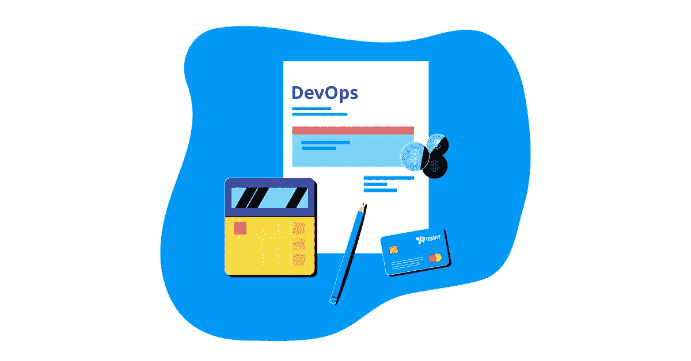

# 何时依赖 DevOps 服务

> 原文：<https://medium.datadriveninvestor.com/when-to-rely-on-devops-services-c08b022f35a2?source=collection_archive---------7----------------------->

一个普遍的误解是，DevOps 工作流的中心是自动化云基础架构的日常操作。恰恰相反， [DevOps 服务](https://itsvit.com/our-services/devops-service-provider/)可以做得更多…

从一开始就订购 DevOps 即服务的主要原因是显而易见的——节省软件开发过程中涉及的云计算资源的时间和成本。这给了 DevOps 团队更多的时间来设计和实现所需的基础设施，并在软件交付的所有阶段使用它。更重要的是，它允许经验丰富的 DevOps 工程师预测未来的系统瓶颈，并设计云基础架构来避免它们。

下面是软件开发生命周期的一个简化方案。

1.  想法打磨和规范创建
2.  网站/应用模型创建和功能反馈收集
3.  [sprint 和代码测试中的最小可行产品](https://itsvit.com/blog/mvp-not-enough-product-must-awesome/)开发
4.  发布前的 Beta 测试
5.  发布到生产并创建 CI/CD 管道，用于维护和进一步更新
6.  生产、基础设施优化中的持续应用监控、记录和更新

虽然最常见的方法是尽可能少地在开发运维上花钱(也就是说，订购开发运维服务只是为了将应用投入生产并在那里提供支持)，但从一开始就使用[开发运维工具](https://itsvit.com/blog/must-have-devops-tools-make-things-right-get-go/)和功能是非常有益的。让我们仔细看看这些阶段。

# DevOps 实践如何从项目一开始就提供帮助？

当客户想到他们未来的产品或服务时，他们可以(通常)清楚地想象它的功能和设计特点。然而，根据我们的经验，初创公司通常不太熟悉在生产中运行他们的应用程序的细节和相应的问题。准确地说，初创公司通常无法定义他们的应用/网站/服务在繁重的工作负载下应该如何表现。

最常见的回答是“尺度！”但是缩放的确切模式不是那么明显。它应该是垂直的(通过向应用程序的单个实例添加更多云计算资源)还是水平的(通过启动应用程序的多个实例)？如果我们选择后一种变体，应该如何在这些实例之间平衡负载？它们应该如何同步、备份和恢复、更新等？

这些问题的答案极大地影响了应用程序的结构和它将使用的基础设施，所以这些细节应该在创建规范的第一阶段就知道。坦率地说，许多初创公司对他们的工作产品没有清晰的愿景，并把这个问题的解决方案留到预发布阶段。这通常会导致不正确的应用程序结构，无法很好地扩展，必须大量重写，或者需要更多的计算资源才能平稳运行。从我们的经验来看，我们已经看到一些项目**由于 app 结构规划的错误，花费了将近 200%** 的预估预算。

因此， **DevOps 工程师可以运用他们的经验来预测应用在生产中可能面临的瓶颈，并相应地规划基础设施**。这些信息对于创建一个有弹性的、可扩展的应用来说是无价的。

# 使用 DevOps 收集功能反馈

软件交付生命周期的下一阶段主要涉及设计测试。如果您希望看到使用 Bootstrap 等工具创建的网站页面原型，您将需要为它部署至少一个开发环境。知道应用程序在生产中应该如何工作意味着知道某些功能何时不能正常工作。

这又会导致重新启动开发环境来进行更改和调整功能。这一次只需要很少的时间，但由于这种重启必须发生多次，因此时间投资变得至关重要，并且客户必须为花费的工作时间和计算资源付费。

当使用 Docker 容器和 CI/CD DevOps 工具部署这样的环境时，构建它们只需要几秒钟和一个命令，而如果原型制作是以传统方式完成的，则需要几分钟和一个手动操作清单。这对客户来说意味着什么？**与其听到原型将在 3 天内准备好，你还不如听到所有的反馈将在 5 个小时内被应用——事实就是如此。**

# DevOps 工作流如何帮助代码创建？

实际上，这是 DevOps 服务应用最广泛的领域之一，因为大量 DevOps 任务旨在创建 CI/CD 管道。

CI 代表**持续集成**，这意味着所有的新代码都被提交到一个中央 git 存储库中，并根据自动化单元测试代码库进行持续测试。每个提交的小代码都会自动成为一个新的子构建，并被测试以确保它运行良好。这有助于**将修复 bug 的时间减少近 56%** ，并将所有安全性和合规性测试自动转移到左边。

CD 代表**连续交付**，这意味着每一个新的应用版本都通过 Kubernetes 滚动更新、重启时的应用内更新和其他种类的无缝更新推向生产，从而确保不间断的最终用户体验和产品可用性。集中开发你的应用程序，定期更新，没有停机时间——这对你来说值多少钱？这种方法帮助**将代码开发时间缩短了近 40%** ，而不影响其质量。

# 关于订购 DevOps 服务的最佳时间的最终想法

如您所见，我们甚至还没有进入发布阶段，提前订购 DevOps 的好处已经很明显了。为进一步的应用程序更新启用 CI/CD 管道，以及执行云监控、日志记录和数据分析是许多客户定期订购的常规 DevOps 任务。然而，[在软件开发过程的最开始](https://itsvit.com/our-services/devops-service-provider/)使用 DevOps-as-a-Service 可以产生更大的商业利益。

如果你喜欢这篇文章，请点击拍手按钮！你也可以看看我以前的故事:

 [## 数字化转型的三大支柱:云、开发运维、大数据

### 数字化转型是一个整合最新技术的过程，以确保最大的效率和…

medium.com](https://medium.com/datadriveninvestor/3-pillars-of-digital-transformation-cloud-devops-big-data-856e47391524)  [## 银行业的大数据分析

### 大数据分析可以成为银行业创新的主要驱动力，而且它实际上正在成为……

medium.com](https://medium.com/datadriveninvestor/big-data-analytics-in-the-banking-sector-b7cb98d27ed2)