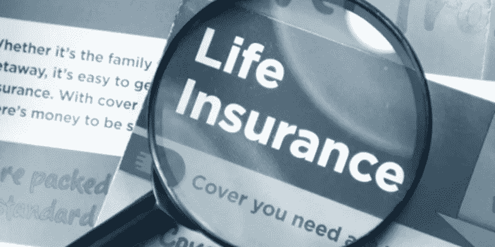
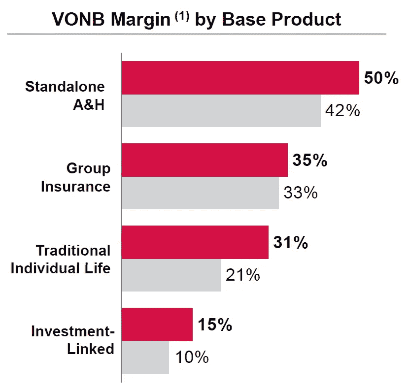

# 买寿险，寿险公司是怎么赚钱的？

> 原文：<https://medium.datadriveninvestor.com/when-you-buy-life-insurance-how-does-the-life-insurer-make-money-c022148cf527?source=collection_archive---------26----------------------->

我在大学的专业是精算(我仍然记得我学到的最重要的两件事是在 50/50 概率的情况下，拥有更多资本的一方获胜，他们过去常常扣除多项选择的分数，以鼓励承担已知的风险)，我花了几年时间作为人寿保险公司的精算分析师和股票分析师。

即便如此，我不得不承认我对保险了解甚少。首先，有如此多的专业，人寿保险，非人寿保险，再保险，养老金，投资。这些人寿保险产品除了在细节上看起来一样，这些细节都是印刷精美的。

事实上，我确实在我的一份人寿保险单上赔了钱，因为我得到的退保价值超过了如果我让这些费用继续侵蚀我的资本所能得到的。

在这篇文章中，我仍将尽可能用外行人的方式解释我所理解的，希望能帮助人们在购买人寿保险时做出更好的决定。

**人寿保险的利润基本上分为三类，即死亡率/发病率、费用和投资。**

现在，记住在人寿保险中，一切都是在实际和预期中进行的。

死亡率实际上是指你实际死亡的时间与精算师根据他们的生命表和对你的习惯的某些知识(如你是否吸烟、饮酒、进行高风险活动、是否有某些健康状况(通过身体检查得知))预计你死亡的时间相比。**它实际上是在赌你的生命，保险公司比你更了解你，因为他们有一个数据库，知道像你这样的人的历史趋势**。

费用基本上是做生意的成本和收购成本。投资是指客户向人寿保险公司支付保费的投资回报。

下面是一家人寿保险公司展示的图表。

> ***可以看出，独立 A & H(意外与健康)的裕度最高。这是因为它通常是相对较小的金额，所以人们不太关注定价，相对于人们发生事故和健康问题的实际比率，定价是昂贵的。就我个人而言，我认为这是一种现象，因为人们一直在阅读关于事故和健康问题的新闻，并且有一种感觉，即这些事情比实际发生的更频繁。***

最低的是投资挂钩型，类似于共同基金，但寿险公司仍能从实际平台费用中赚取 15%的利润，即不包括基金管理费。

传统个人寿险的利润率约为 30%，记住这只是保险公司的利润，不包括支付给销售保单的代理人的佣金，佣金通常为首年保费的 30-40%左右。

代理人是从询问死亡是否不可避免开始的人。然后说，对于一个银行账户中有 100 万美元的老年人，他可以用这 100 万美元中的 10%购买人寿保险，在他去世时支付 100 万美元，并在他的一生中使用剩下的 90%。他死后，他的孩子仍然可以继承那 100 万英镑。更妙的是，如果他用 20%买人寿保险，他的孩子反而会得到 200 万。哪个头脑正常的人不想要这笔交易？

**免责声明:本文并非投资建议。**