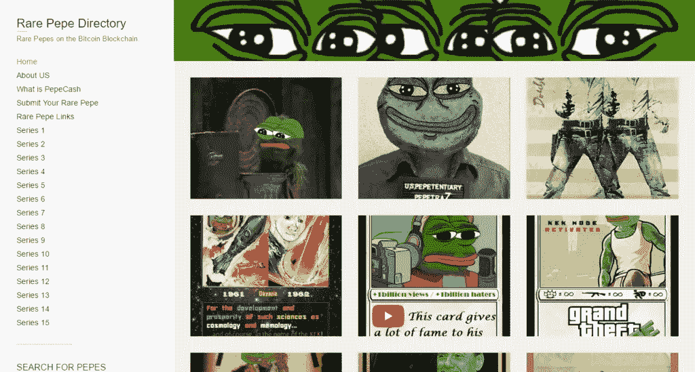
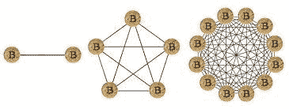

# 黑仔的爸爸们都在哪里？

> 原文：<https://medium.datadriveninvestor.com/where-are-all-of-the-killer-dapps-8c4171bdbb28?source=collection_archive---------13----------------------->

I’m not going to lie, RarePepe was the first dapp I used.

我花了整整一周时间思考为什么区块链上没有杀手级应用。现在，我们有一大堆蒸汽器皿和数不清的狗屎硬币。几乎所有这些硬币/代币都是为了利用加密货币的宣传而建造的，仅此而已。我们确实拥有的少数 dapp——去中心化的应用——比如 Cryptokitties、稀有 Pepes，以及一些“体面” [**【区块链】**](https://breakermag.com/we-played-5-blockchain-games-theyre-no-fortnite-but-theyre-pretty-good/) 的游戏，并没有太多的表现。他们有一个不错的用户群，但游戏很笨重，对密码圈以外的人没有太多吸引力。对于这些应用程序来说，没有什么值得转换到区块链的。

 [## dApps 能恢复我们的信仰吗？-数据驱动型投资者

### 又一周过去了，脸书又一次数据崩溃。这一次，是关于它分享用户的隐私…

www.datadriveninvestor.com](https://www.datadriveninvestor.com/2018/12/20/can-dapps-restore-our-faith/) 

# 是什么阻碍了我们前进？

当我第一次听说在以太坊区块链、ERC20 代币和 dapps 的基础上建造的能力时，我充满了兴奋。像你们许多人一样，我能感觉到“革命”的来临。然而，在实践中，Cryptokitties——一种交易纸牌游戏——单枪匹马地充斥了以太坊区块链，并使天然气价格飙升。当一个愚蠢的交易纸牌游戏可以让普通消费者无法使用区块链时，我们怎么能期望看到下一波拥有数十亿用户的去中心化应用呢？想象一下像社交网络这样的东西；以太坊早就被砌砖了。

这不是孤立的。有趣的是，在那段时间里，我支付了相当于 35 美元的费用将我的 ETH 从一个交易所转移到另一个交易所。后来，我知道了在任何转移之前先转换为莱特币的好处，但这一点仍然有效。

从根本上来说，如果**一个**愚蠢的纸牌游戏能让以太坊区块链拥挤不堪，那么我们的日子就不好过了。现在，我知道在以太坊已经有了大规模的开发工作。我不经常关注他们的更新，所以如果你特别知道他们是如何选择解决这个问题的，那么请留下评论，照亮我的无知。

除了纸牌游戏，我们一无所有。我们最接近有竞争力的区块链应用的是[**Steemit**](https://steemit.com/)——一个类似于 Medium 的分散式博客平台，但你对网络的贡献是有报酬的。我喜欢 Steemit，但它并没有像我预期的那样迅速发展。我与作家和普通人交谈过，他们都知道这一点，尽管他们喜欢通过写作获得报酬的想法，但他们似乎对此并不兴奋。我认为 Steemit 的福也是祸，在于其令牌的直接货币化。如果你的硬币由于密码市场的波动而崩溃，那么很难维持网络激励。如果你去 Steemit 看看，那些多产的作者似乎还在赚钱，但远不如一两年前，其他人都已经撤离了。

**就是这样！**

所有勉强合格的区块链民主党人的详尽名单。

考虑到所有的兴奋，这是相当缺乏。Vers，那么 dex 呢？是的，那些不会成为一件事。抱歉。我会确保在以后的帖子中写下原因。

我们该怎么办？为什么所有这些公司都没有兑现他们的承诺？一方面，我已经在我的上一篇文章 [**中报道了他们未能理解加密的本质。然而，事情远不止如此。对吗？**](https://tasheme.com/bitcoin-is-not-the-internet-of-money/)

所有这些项目都试图利用网络效应的力量。简而言之，这意味着更多用户的加入会给网络带来更多的价值。这被编入梅特卡夫定律。

太好了，这应该很容易，因为这是一个在分散网络中设计的产品，所以理想情况下，它只需要 ***工作*** 就能获得回报。对于许多这样的项目来说，这本身就是一个问题。它们不起作用；它们是蒸汽器皿。忽略这些无用的东西，其余的项目似乎失败了，因为它们缺少一个基本的质量，那就是 ***效用*** 。更具体地说，在 Metcalfe 指出的创造价值非线性增长的用户临界点之前，它们没有用。

> ***梅特卡夫定律指出，一个*** [***电信网络***](http://en.wikipedia.org/wiki/Telecommunications_network) ***的值与*******系统的连接用户数的平方成正比(n2)。****

**

*我最近读了一篇由尤金·卫写的文章，虽然篇幅很长，但它触及了一个精彩的点。需要有一个 ***单人*** 使用到你的网络，才有一个 ***多人*** 使用。电子游戏就是最好的例子。在易于在线访问之前，缺乏单人模式的游戏失败了。*光环 2* 可能是最早在网上大受欢迎的主机游戏之一，其单人模式令人惊叹。尽管如此，15 年后的今天，我仍然会在第一场比赛和第二场比赛中谈论洪水，或者我妈妈那天让我翘课，因为这样我就可以在午夜发布时拿到游戏并玩一整天(我从来不想翘课，所以我猜他们认为这没什么)。这一切都是在 我有 Xbox Live 之前的 ***。这些是关于单人模式有多吸引人的对话。更别说一个 [**跑了 9 年就遇到眼泪的线上模式了。**](https://www.digitaltrends.com/gaming/halo-2-goes-offline-in-february-starting-a-quiet-year-before-the-inevitable-anniversary-edition/) 《光环 2》的寿命超过了它的主机和后续主机 Xbox 360。微软不得不停止在线运行，以便为当年晚些时候发布的 Xbox One 游戏机让路。****

*连硬件都有单人钩子。录像机最初的用途是当人们不得不错过原来播放的节目时，用它把节目录制到空白磁带上。直到有足够多的人使用录像机，电影制片厂才开始把他们的电影全部放到录像机上。*

# *区块链 dapps 在设计时需要考虑单人对多人模式。*

*95%或更多的区块链 dapps 只是代币。它们要么是 ICO 令牌，要么是一些实用令牌，或者其他什么。4.99%都是缺少那种单人效用，然后还有 [**【假人】**](https://golem.network/) 这样的项目。**像假人**。首先创建一个实用程序。假人走出去，得到了商业伙伴，并有了一个基本的网络第一，每增加一台计算机增加非线性改善分散的超级计算机，从用户 0。这是你需要思考的方式。你知道那句谚语吗，放眼全球，立足本地？没有什么地方比区块链社区更需要这些了。*