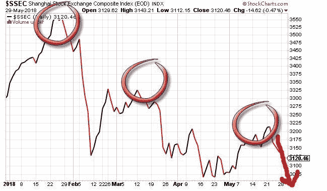
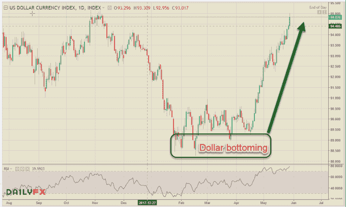
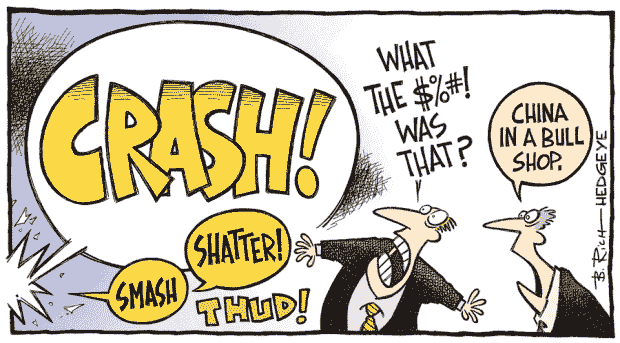

# 金融市场将走向何方？

> 原文：<https://medium.datadriveninvestor.com/where-are-the-financial-markets-headed-d160fa83eea0?source=collection_archive---------8----------------------->

通常我会在周末对金融市场做一个总结，但是我不得不在周中写一些东西，因为美国股票在过去几天里经历了过山车。我不是那些宣扬 2018 年市场大规模崩盘的末日阴谋论者之一，但这里感觉有些不对劲。假期缩短的一周开始时，有消息称，由未来的意大利政府提名的财政部长被意大利总统拒绝，因为他反对欧元，增加了举行选举的机会，这可能成为对欧盟的一种公投。这使得意大利和德国 10 年期债券达到 4 个级别中的最高水平，给该地区的银行带来了巨大的压力。当美国股市开始交易时，恐惧已经笼罩了全球市场&它也蔓延到了美国指数。银行和金融板块暴跌，普遍下跌，标准普尔 500 两周的盘整打破了支撑。

Credit: @**KeithMcCullough**

就在美国市场似乎已经见顶，并最终开始下一轮下跌时，我们今天(星期三)又遇到了一个惊喜。BTFD 发生的事情已经成为交易员的同义词&一天前损失 400 点，收盘时上涨 300 多点。金融股和小盘股一起反弹。现在我知道公牛会说“我们告诉过你！”但这并不像看起来那么简单。问题是欧洲正在应对增长放缓，英国退出欧盟和意大利的政治动荡，西班牙和希腊的救助情况可能会随时出现，这不仅对欧洲集团来说是灾难性的，而且恐慌可能会蔓延到全球，就像我们在 2009 年的上次金融危机中看到的那样。然而，这次我们有了一个额外的复杂性——中国也在放缓。第二大经济体因伪造经济数据而臭名昭著，但看看上海证券交易所综合指数(见上图)，情况并不乐观。

尽管如此，问题还没有结束。最近，美元一直在以近乎垂直的走势上升，这不仅给主要对手带来了压力，而且新兴市场货币也在过去一个月的趋势下崩溃。土耳其里拉、巴西雷亚尔和阿根廷比索对美元的汇率都大幅下跌。这让他们不得不应对不断膨胀的进口账单、飙升的通胀和购买力下降，这些都对他们的增长前景产生了不利影响。随着风险厌恶情绪在股市中的蔓延，美元的强势得到了进一步的推动。看看美元指数，你就能判断出问题的严重性。

世界经济现在面临着多重问题，欧盟的政治和经济风险，中国经济放缓，加上与美国的贸易紧张局势，新兴经济体的货币问题&更糟糕的是，美国股市仍接近历史高点，经济衰退的风险是真实的，可能即将到来。从目前的情况来看，这可能迟早会发生。为了不被贴上悲观主义者的标签，我会以轻松的语气结束这篇漫画。

对加密货币、金融科技行业、突破性技术感兴趣，或者正在寻找加密货币、外汇或股票交易想法的人——关注我的[Twitter](https://twitter.com/trade_nut)&[StockTwits](https://stocktwits.com/trade_nut)。关于外汇&股票的实时信号，请在[trade alike](http://www.tradealike.com)App(**@ Fakd**)上关注我

*原载于 2018 年 5 月 30 日*[*www.datadriveninvestor.com*](http://www.datadriveninvestor.com/2018/05/30/where-are-the-financial-markets-headed/)*。*

