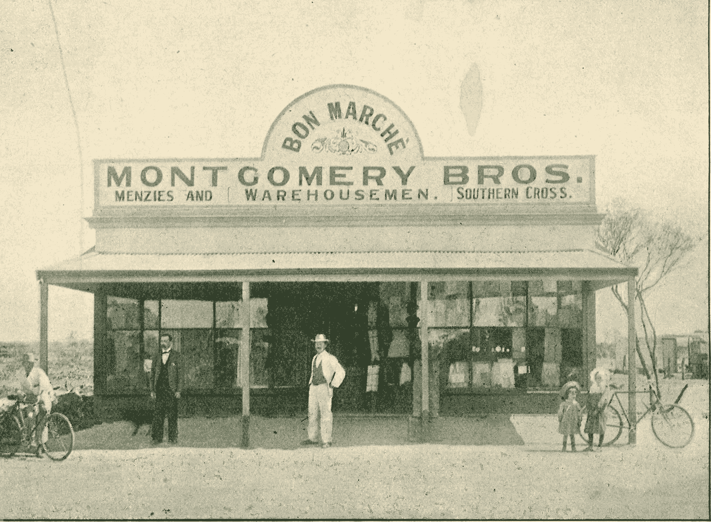

# 铲子、帐篷和牛仔裤在哪里？

> 原文：<https://medium.datadriveninvestor.com/where-are-the-shovels-tents-and-jeans-69c7409dee?source=collection_archive---------7----------------------->

[https://www.outbackfamilyhistoryblog.com/2016/12/28/merchants-v-miners-theres-gold-rush-sell-shovels/](https://www.outbackfamilyhistoryblog.com/2016/12/28/merchants-v-miners-theres-gold-rush-sell-shovels/)

如果你在过去的一年里一直在阅读我的文章，你会明白我试图给出一个我们当前生活的世界的愿景，并描述我们的未来。

我们浏览了[两极分化的世界](https://medium.com/@arnaudsingapore/a-polarized-world-7a27386d3d1e)，对[信任](https://medium.com/@arnaudsingapore/collaboration-hope-trust-part-1-4a399b189075?source=---------7------------------)和[协作](https://medium.com/@arnaudsingapore/trust-and-hope-part-2-90e94ec54aa5?source=---------6------------------)的需求，我们分析了 AI 提供的新能力(这里[这里](https://medium.com/datadriveninvestor/glimpsing-into-the-future-artificial-intelligence-444b1ef79e07?source=---------5------------------)和[这里](https://medium.com/datadriveninvestor/from-ai-to-ia-powering-intelligent-assistants-5d4d95d8d3c3?source=---------4------------------))并思考了未来技术平台的[基础](https://medium.com/@arnaudsingapore/what-foundations-will-technology-be-built-on-over-the-next-decade-547e7c0329ce?source=---------2------------------)。现在让我们来看看我们还没有涉及的两个技术趋势。当我们审视美国面临的挑战时，这两项技术将变得极其重要。

 [## 在创业之旅中，拥抱学习数据驱动的投资者

### 好像建立一个数百万美元的公司还不够困难，企业家必须额外照顾他们的…

www.datadriveninvestor.com](https://www.datadriveninvestor.com/2018/10/16/on-the-entrepreneurial-trek-embrace-the-learning/) 

# 活力

目标很明确:让我们让能源变得清洁、廉价和可靠。这对战胜贫困和气候变化至关重要。你可以期待对清洁技术的大量兴趣和投资。

可再生能源和存储将会增长。新的元素和新的来源将会被发现，如[钍](https://www.ted.com/talks/kirk_sorensen_thorium_an_alternative_nuclear_fuel, https://www.economist.com/news/science-and-technology/21600656-thorium-element-named-after-norse-god-thunder-may-soon-contribute)迫使继续推进

生产能源以应对自然资源和人口增长的限制将是重要的，因为从中长期来看，这可能是冲突的根源。例如，参见开发海上原子能发电站的例子。

# 生物科学

有大量的机会可以帮助人们活得更长、更健康。值得关注的两个主要领域是基因组学和先进材料。

基因编辑方面的进步——如今很难避免 [CRISPR](https://en.wikipedia.org/wiki/CRISPR) 上的新闻和文章，这只是一个开始——可能会通过消除疾病(疟疾)或治愈遗传或自身免疫疾病(囊性纤维化、糖尿病、类风湿性关节炎、肌肉萎缩症、多发性硬化症、纤维肌痛，或许还有一些癌症)而导致人类健康的突破。一些微生物还可以补充抑郁症、双相情感障碍和其他与压力有关的精神障碍的治疗。它还将对减少发展中国家的粮食不安全和改善人民健康产生影响。

神经元的光学监测和神经活动的光遗传调制有望帮助神经科学家观察大脑的活动，以预防或治疗痴呆症、帕金森症和精神分裂症等疾病。这些程序还可以为人工智能的类脑系统的构建提供见解。

纳米材料越来越多地用于医疗设备涂层、诊断造影剂、纳米诊断中的传感元件和高级药物输送。数字医学和其他新的医疗程序可能有助于改善全球健康。在纳米尺度上表征、控制和操纵生命物质的结构和功能的改进工具可以激发其他技术发展和新制造技术的基于生物学的方法。

# 不要寻找黄金

面对我们面前的所有变化，寻找黄金或者寻找[铲子、帐篷和牛仔裤](https://www.flexport.com/blog/trade-merchants-rich-california-gold-rush/)是很有诱惑力的。

鉴于我在以前的文章中描述的全球趋势，我们可以建立什么样的盈利企业来解决我们共同面临的问题？

我们在西方世界和世界其他地方之间左右为难，西方世界仍然掌握着绝大部分财富，增长缓慢，正在老龄化，而世界其他地方则年轻，在大城市快速增长，梦想着更好的生活。几个全球性问题威胁着每个人:气候变化、人口流动、健康、安全。人类正面临着新的问题，比以往任何时候都更加全球化和强大，而传统的社会组织方式正面临着极限(教育、政治制度……)。新技术为人们解决这些问题提供了新的平台。目前还不清楚解决方案将从何而来。很明显，我们需要利用新平台来释放我们最大的潜力。

# 如何对技术产生影响？

寻找铲子、帐篷和牛仔裤实际上并不是看待影响力的正确方式，因为我们只是将传统思维应用于新问题。

我们需要**新的**解决方案，我们需要由我们**信任的**和分享共同人文价值观的人来引导。让我们不要评判人们试图解决的问题，而是随波逐流去发现我们不曾考虑过的新想法。让我们相信自己的直觉，避免从事我们不喜欢的项目。让我们不要把事情过分复杂化和分析，让我们准备好相信我们的直觉。让我们把艺术带入科学。我们需要接受挑战，直面观点，而不是最终带着相同的愿景。

就像@ericstromberg 的 [B2C](https://docs.google.com/spreadsheets/d/1k5sTdMpWKvPIqUi1UNIKQ8xBpw5DEyRfwnAQxZoHmDw) 和 [B2B](https://docs.google.com/spreadsheets/u/1/d/1xafwdQyWczCwPDGsGoiCSe8SdlbgN-QHjktLemqRo7s/edit) 的启动矩阵一样，让我们开始构建一个新的矩阵:一个轴将列出正在解决的问题(可能会根据[可持续发展目标](https://www.un.org/sustainabledevelopment/sustainable-development-goals/)调整这些问题)，而第二个轴将对如何解决这些问题进行分类。

让我们保持乐观，相信进步。

“真理可以在哲学家的心中找到，但很少在统计学家的数字中找到；这是一件非常微妙的事情，不能用划线纸上的一列数字来固定。路易斯·布罗姆菲尔德

你同意我的观点吗？你考虑过应用技术来解决现实世界的问题吗？