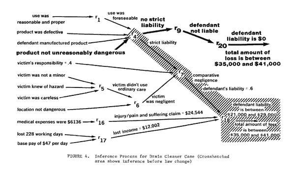

# 人工智能在法律文本处理中的地位如何？

> 原文：<https://medium.datadriveninvestor.com/where-are-we-in-legal-text-processing-with-artificial-intelligence-e84ee2eac562?source=collection_archive---------4----------------------->

By [rawpixel](https://unsplash.com/@rawpixel?utm_source=medium&utm_medium=referral) on [Unsplash](https://unsplash.com?utm_source=medium&utm_medium=referral)

我多年来一直致力于人工智能在法律中的应用，许多律师都提出了以下问题:“我们有一天会被人工智能取代吗？”我回答说:“嗯，无论如何都不会很快。”然后，我补充道，“定制服务，比如谈判宣传，永远不会自动化，因为它需要类似的思维。”然而，这个帖子没有讨论它是否可以自动化，但它是解释我们迄今为止的技术进步的一个触发器。

自然语言理解是处理机器阅读理解的[人工智能](https://en.wikipedia.org/wiki/Artificial_intelligence)中[自然语言处理](https://en.wikipedia.org/wiki/Natural_language_processing)的子课题。一些自然语言理解程序，如沃森或我们的初创公司[www.turklex.com](http://www.turklex.com)，通过执行语义分析来解决问题或查询，该分析搜索大型文本集合，并找到精确回答问题的一个句子或一组句子。

**我们成功的地方:语义分析**

语义分析器提取结构信息。在法律文本中，这可能包括:

-引用的案例

-法律主题

-法律角色、当事人、律师

-法律原因

-案件的性质

-决定

一些高级系统能够相对于上述标签来标记文本。

此外，语义分析器使用单词的含义，即在上下文中对一组单词的解释。例如，查询单词“法律”也应该返回与“立法”、“指令”和“宪法”相关的命中结果，并且系统应该自动考虑这些单词。除了同义词，该系统还考虑了许多其他类型的联想，如反义词、下义词等。通过使用人工智能，有可能建立一个巨大的矩阵来描述单词之间的关系。

到目前为止，这项技术在实现语义分析器方面取得了巨大的成功。

这些高级系统在法律论证的意义上执行分析而没有更深入的理解，但是它们执行问题和最佳可能答案之间的语义匹配。

**需要进一步改进的地方:法律论证**

律师用论据为他们的案件辩护；法官用论据支持判决；一个立法者用论据支持他的提议；一个法学家用论据证明他的观点；但是什么是论点呢？

这是一个著名的逻辑演绎的例子，我们很多人在《逻辑学导论》中都见过:

苏格拉底是个人。(前提 1)

所有的人都会死。(前提 2)

= >所以，苏格拉底是凡人。(结论)

一个前提是一个陈述，一个论点声称将导致或证明一个结论。论点是支持其结论的一组前提。

现在，在法律辩论中，事情要复杂一些:

(RULE-BASED MODELS OF LEGAL EXPERTISE, Waterman, Peterson, 1980)

在上图中，我们可以看到一系列试图得出共同结论的争论。

如果我们想要一台机器来模拟法学家的论证方案，自动化这项任务的第一个挑战是自动收集论证。换句话说，系统必须像律师一样一个接一个地提取所有的论点。

第二个挑战是法律规则系统或规范的建模，建模风格类似于上图。法律规则有时有不明确的概念，逻辑推理不容易建模。贯穿这些法律规则的推论是不清楚的。这是人脑仍然胜过机器或人工智能的地方。

**结论**

今天，研究人员已经到了可以自动收集论证的地步。这非常有用，尤其是在比较两个法庭案例时。另一方面，为了使法律推理完全自动化，仍然需要取得重大进展。

即使我们到了法律论证成为一个完全解决的问题的时候，仍然需要律师。有些领域需要模糊逻辑，而人类在这方面很擅长。如今，许多律师都在订阅在线法律研究软件，随着时间的推移，这些服务将会越来越好。然而，这些服务不是直接面向客户的服务。