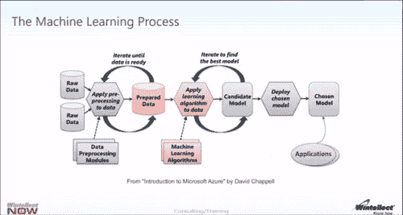

# 你的数据在哪里，兄弟？数字经济的自然资源及其对人工智能创业公司产品策略的影响

> 原文：<https://medium.datadriveninvestor.com/where-art-thy-data-brother-4c51c637e4ed?source=collection_archive---------21----------------------->

如今，企业正在被三种不可阻挡的趋势所改变。首先，企业正在从令人眼花缭乱的大量来源中产生大量数据。因此，这些数据必须进行大规模管理。其次,“云”无疑是最高效、可扩展的平台，可以提供快速、可靠、经济可行的数据存储和分析。这部分是由于一些最大的云供应商购买大量服务器的资本支出所带来的规模经济。事实上，在过去需要花费数百万美元才能获得的计算能力，用一张信用卡只需几分钟就能完成。第三，企业现在应该根据从边缘来源(即设备、移动应用、传感器)捕获的数据来预测行为和趋势；由于云计算带来的规模经济，他们现在可以做到这一点。展望未来，企业应该能够实时查看数据，而不是回顾历史趋势，从而对企业的未来做出最明智的决策。打个比方，就像我们从硬件堆栈转到软件堆栈(购买服务器到购买由这些服务器支持的软件服务)一样，公司正在从询问有关其业务的问题:“发生了什么？”到“我们现在该怎么办？”

人工智能是“云”和“数据”联姻的浪子，它可以帮助企业回答最后一个问题。虽然我在微软当员工的时候可能喝过微软的清凉饮料，但我仍然发现这家总部位于雷德蒙德的巨头对人工智能含义的世界观被该领域的其他人普遍接受。正如微软人工智能数据营销团队所建议的那样，我们已经从描述性分析(“发生了什么？”)，到诊断(“为什么会这样？”)，现在来预测(“会发生什么？”).下一个前沿是人工智能的承诺:制定规范的能力(“我们如何才能让它发生？”)[【1】](http://monsieurpopp.tumblr.com/#_ftn1)。如今，企业可以将之前用于资本 IT 支出的资金重新分配给面向核心业务创新的研发投资。以一家向企业客户销售硬件设备的公司的设备监控为例，这是一个典型的物联网用例。销售该硬件可以在产品中融合一批基于云的服务(即数据仓库、数据分析、机器学习)，通过将固件连接到云来监控设备。企业可以利用云供应商的能力，而不必构建基础设施来运行这些云服务以实现有效的设备监控和维护；从运行这些密集型计算工作负载中收集的分析最终可以提高效率。例如，部件可以在损坏之前更换，因为嵌入其中的软件可以预测硬件业务的最终客户所消耗的产品的磨损或“边缘”。这对企业的底线有积极的影响。接下来，该公司可以通过分析设备组件过早损坏的模式，制造更高质量、更少损坏的设备。这将提高生产和维护效率，这都要归功于基于云的机器学习服务，该服务可以预测设备磨损的模式。

在提供这种基于云的服务的供应商空间的概述中，我们看到了人工智能丰富的软件解决方案集中在少数几家跨国公开交易的技术公司手中。乍一看，为最终用户创建最完整的数字档案的公司似乎也能够为这些最终用户提供最引人注目和最相关的体验。这种类型的关系，反过来，创造了几乎不可逾越的进入壁垒。例如，谷歌对搜索的垄断几乎不可能被打破，因为它已经收集了数十亿字节的用户搜索查询和偏好数据，他们继续将这些数据输入到他们的算法中，使他们的结果更加相关。相比之下，DuckDuckGo 无法与之竞争，即使他们标榜自己的差异化是一个避免收集用户数据的搜索引擎。有人可能会说，更多的人更喜欢使用 Google that DuckDuckGo，因为他们的搜索结果更好(完全理解，这仍然是一个有待讨论的问题！[【2】](http://monsieurpopp.tumblr.com/#_ftn2))。

提供这种推荐的能力——这是谷歌、亚马逊、微软市场力量的核心——直接来自数据*。这种观点并不独特。在 2017 年 5 月 6 日的版本中，*经济学家*认为数据是现代数字经济中最新的自然资源。[【3】](http://monsieurpopp.tumblr.com/#_ftn3)消费者已经表明，他们愿意牺牲一些隐私来获得更具情境性的数字体验，这是由他们自己过去的行为、偏好和行动(实际上是他们的“数据”)驱动的。例如，像脸书和腾讯这样的公司收集了大量关于用户行为和偏好的数据；机器学习等人工智能技术能够根据用户数字生活的模式，智能地预测和推荐用户更倾向于购买的产品、服务和商品，从而从这些数据中提取更多价值。甚至非传统软件供应商也在利用他们收集的数据在他们的市场上竞争。电动汽车制造商特斯拉(Tesla)使用其最新模型从客户那里收集数据，这使他们能够优化其自动驾驶算法，他们希望有一天能在所有汽车中嵌入该算法。谈论与通用汽车&福特竞争对手不同的产品！后两者还分别收购了 Cruise Automation，并与 Argo AI 合作，以对抗特斯拉、优步和 Waymo 在自动驾驶领域的势头。事实上，他们最终希望创造新的商业模式，刺激利润率较低的汽车业务增长。这些例子让我们相信，谁拥有最多的数据，谁就最有可能在其核心业务周围建立最深的护城河。*

但这对试图向最终用户提供人工智能应用的初创公司来说意味着什么？如果数据主宰一切，他们如何与这些巨头竞争？乍一看，似乎不是这样。这些公司正在制造并向市场推出 piegon-hole 初创公司的现成人工智能产品。事实上，Azure 有一套认知服务，可以嵌入或扩展到应用程序中来验证用户。谷歌有 TensorFlow。Amazon 开始提供外部可用的 ML 算法集。这些组织还不断使用他们的大量资源来召集大型团队，甚至更大的资源来改进这些产品。仅微软一家每年就在人工智能进步上花费 120 亿美元，并雇佣了 5000 名技术人员专门致力于该技术的进步。谷歌大脑团队是一个独立的团队，可以利用谷歌庞大的资源来寻求引入人工智能。如果有机产品开发不成功，这些公司将进入他们的深口袋，挖掘任何与他们自己的产品互补或相抵触的创业公司。众所周知，脸书以 220 亿美元收购了 WhatsApp 微软，LinkedIn 262 亿美元；气象公司 IBM 以 20 亿美元购买了沃森服务。因此，即使一家初创公司达到临界规模，它们也更有可能被一家保持独立、应对这种地位带来的挑战的大公司收购。乍一看，认知服务、机器学习和人工智能领域的许多进展都是在这些大公司中取得的；没有多少寻求人工智能圣杯的创业公司拥有资源或跑道来达到自我可持续发展的地步。[【4】](http://monsieurpopp.tumblr.com/#_ftn4)

与这些立场相反，我将挑战这样一种信念，即大型根深蒂固的供应商是垄断性的，并且已经建立了这样的护城河，以至于初创公司几乎不可能创造出有意义和差异化的基于人工智能的消费者和企业产品。创业公司仍然可以主导不断增长的利基市场和用例，因为世界上的谷歌和微软不可能一下子无处不在。这篇文章试图回答的问题是，这些初创公司应该如何思考他们产品的演变，以促进业务增长和可持续性。考虑到这一点，我将重点关注初创公司应该如何根据最好的人工智能业务必须依赖数据这一事实来构建他们的产品战略。因此，我认为初创公司创造人工智能丰富的软件产品的能力源于他们数据的价值，这可能来自两个来源之一:要么来自他们服务的客户(他们愿意分享数据)，要么来自公共领域(即用户或愿意分发数据的软件合作伙伴)。

**数据是公开的，但您的访问权限可能并不总是**

人工智能，即机器像人一样行动的能力，在过去的六十年里，经常被研究人员分为两类。正如安德森·霍洛维茨在他们的《人工智能简介[【5】](http://monsieurpopp.tumblr.com/#_ftn5)中所阐明的，第一类，被称为“古典”，起源于 1956 年人工智能研究项目之后的大约 60 年。在这段时间内，科学家们试图用逻辑规则来模仿智能。例如，他们会用数据结构表示世界，并应用逻辑规则从数据集中推断出一些东西。这个框架通常被称为“符号人工智能”，因为机器人本质上被赋予了规则的符号表示，以便它们推断出正确的行动路线。符号系统的一个例子是“如果/那么”语句。

相比之下，人工智能的“现代”定义认为，一旦一个数据集被编排，一套机器学习技术就可以应用于该数据，以解决不同类别的问题。接下来的想法是“使用一套技术，如逻辑回归、决策树、高斯朴素贝叶斯、随机森林、k-最近邻、深度学习”，以便最终训练一个程序，在新的传入数据集输入引擎时预测它们的行为。[【6】](http://monsieurpopp.tumblr.com/#_ftn6)一些人认为人工智能和机器学习是不同的:机器学习使程序能够*预测*未来，而人工智能给机器编程以*做出*决定。[【7】](http://monsieurpopp.tumblr.com/#_ftn7)话虽如此，许多人工智能技术都源于机器学习，因此这两者仍然交织在一起。例如，神经网络的概念——一个人工智能概念，其中一组相互连接的计算机程序充当“节点”，就像你的神经元在你的大脑中相互连接和分层一样——是基于机器学习的基础。由于 ML 基于训练模型，神经网络由一组特定计算机节点路径的置换触发器和连接训练并建立在其上(就像你的大脑有数万亿个连接，甚至更多的触发序列组合)。通俗地说，ML 源于将数据点输入到一个黑盒中，让黑盒中的程序识别模式和唯一标识符，并从那里得出决策。[【8】](http://monsieurpopp.tumblr.com/#_ftn8)

在“经典”和“现代”定义中，数据是算法的根源，而算法是人工智能的根源。如下图 1 所示，机器学习的价值源于应用于原始数据的算法。2017 年，34 家初创公司被收购[【9】](http://monsieurpopp.tumblr.com/#_ftn9)，因为这些灵活的公司创造了独特的方法来处理数据，并应用机器学习技术来创造新的数字产品。微软、谷歌和 AWS 可能会提供一些 ML APIs，但这些初创公司有特定的用例，这些大型供应商没有足够的广度一次性解决所有问题。因此，假设他们将垄断人工智能领域并不能公平对待初创公司可以解决的用例及垂直领域。

也就是说，如果在 2017 年，拥有最佳算法的初创公司能够智胜竞争对手，这意味着在某个时候，算法层面将会出现平等，数据将成为最大的差异和最终软件最强大的素材。例如，今天在食品配送领域，一家初创公司可能比另一家更好——door dash vs Uber eats vs post mastes——因为人们可以根据他们的算法定制推荐。在某种程度上，建立这些模型的公司之间应该是平等的。算法将会商品化。最终，算法只有在拥有更多数据的基础上才能变得更加智能。以无人机分析为服务用例。如今，硬件和捕获成像流程正成为一个竞争更加激烈的领域，因为这里没有太多的区分标准。为了与众不同，下一代无人机分析不仅仅是捕捉建筑物的缺陷以触发保险支付(这是计算机视觉 API 的应用，这是一项即将商品化的服务)。相反，他们必须应用人工智能从*多个*而不是*单一*数据源中收集见解。无人机将能够识别损坏模式和迹象，自动识别保险索赔是否可行的过程，然后从其他数据源(天气模式、自购买以来房屋折旧的历史趋势等)进行预测，而不是简单地拍摄屋顶照片。今天，拥有最佳算法的无人机初创公司将赢得客户，因为他们可以自动化并加速即时、实时的洞察收集和共享；三年后，当这种算法商品化时(它可以建立在作为平台出售的 ML 模型之上，如 Google TensorFlow 或 Azure ML)，谁能够基于最丰富的数据集以最高的准确度和信心识别对象和模式，预测*将会发生什么*最终将提供更丰富的服务。这只有在他们能够比竞争对手更大规模、更快地收集更多数据的情况下才会发生。因此，如果数据是最终的差异，那么公司必须确保他们的数据管道不会被切断；换句话说，如果软件有更少的数据来支持机器学习，它的价值就会降低。

Figure 1: Algorithms will provide the first level of differentiation, but ultimately, as those gets commoditized, the depth and breadth of data will provide the ultimate competitive barrier to entry. Source: Wintellect’s Guide to Azure Machine Learning

如果我们看看一些更成功的创业公司，人们会注意到，为他们的人工智能产品提供动力的数据大多是从公共领域收集的。在这种场景下，初创公司销售多租户人工智能驱动的软件作为服务，其价值由外部公共数据和网络效应驱动；越多的数据和越多的用户使用他们的软件，为供应商提供更多的模式和数据点，他们的人工智能软件就变得越强大，越有价值，越有特色。例如，按需送货初创公司 DoorDash 成功地使用了人工智能，他们看到机器学习的食品推荐给最终用户的销售额增加了 25%。[【10】](http://monsieurpopp.tumblr.com/#_ftn10)这些推荐是根据这些用户认为 DoorDash 可以用来改进推荐和整体终端用户体验的大量数据量身定制的。[【11】](http://monsieurpopp.tumblr.com/#_ftn11)建立非常具体的用例的垂直型初创公司——用于交付跟踪(Samsara)的物联网、日志分析(Loom Systems)——现在是 2019 年的中心。与 DoorDash 类似，他们从用户那里收集数据，并将其输入到机器学习模型中，以根据个人最终用户和客户的背景和独特需求定制解决方案。或者，公司可以从第三方来源获取数据，这被认为是公共的，因为它可以被现成的第三方 API 使用。以智能 CRM 软件 affinity.co 为例，它是一种关系/LinkedIn 的混合体。该软件可以预测哪些关系将在潜在客户中产生最热烈的关系。他们的应用程序可以根据从外部来源(LinkedIn、社交媒体、你的通讯录等)收集的数据预测信息，然后输入到算法中。在这两种用例中——数据由公共或第三方供应商提供——初创公司从最终用户那里收集的数据越多，他们的人工智能就越强大(因为它有更多的数据可以学习)。换句话说，训练模型的数据量与最终产品的“粘性”之间存在直接关联。

在这种情况下，这些创业公司不一定能够建立保护他们收集的数据的护城河，因为这些数据要么可供每个人使用，要么可以被嫉妒的第三方供应商囤积。没有什么可以阻止竞争对手复制 DoorDash 的模式，重新创造他们自己的体验——比如 UberEats 或 Postmates。Affinity 示例表明，有时数据是从第三方供应商管理的封闭花园中收集的。有些是开放的(想想 Twitter 和他们的开发者 API)，但是总有数据软管突然关闭的危险(说到 [Twitter](https://t.umblr.com/redirect?z=https%3A%2F%2Fthestack.com%2Fcloud%2F2015%2F10%2F05%2Ftwitters-withdrawal-of-reliable-share-count-api-is-a-bold-monetising-move%2F&t=YjM2MTczMmE3YzIwMjg0OGFkYTUxMjlkOTkzMGE2NTVlOGU3MGM2NCxINkVmNDdvcg%3D%3D&b=t%3A2PUxn0A6RupHpj5is97rWA&p=http%3A%2F%2Fmonsieurpopp.tumblr.com%2Fpost%2F161567081269%2Fwhere-art-thy-data-brother-the-digital&m=1) …)。这与我们看到的开发人员和 ISV 在似乎对他们开放的平台上构建的问题是一样的，一旦那些竞争对手对底层平台变得太危险，所有这些都将被关闭。

因此，创业公司必须在竞争对手之前考虑两种数据摄取策略。首先，他们必须得到客户的同意，才能聚集他们的数据，以便他们可以将这些数据输入到他们的算法中，用于训练目的。这是我们在 DoorDash 的服务条款中看到的。优步也是这样做的——他们可以根据交通数据和路线模式，根据路径和需求激增来调整价格。他们的条款和条件规定，用户的数据确实是匿名和聚合的——所以健全的法律条款和条件在这里就足够了。但是第二，如果数据不能被用户使用，它应该被一个数据合作伙伴的网络接收。在这种情况下，直接的许可交易或产品合作是可行之路，因为它确保数据管道不会被切断；这是有商业协议支持的。此外，在协议中，初创公司可以在预先确定的时间框架内谈判排他性，阻止任何竞争对手达成相同的协议。即使在协议结束时，如果竞争对手复制相同的联盟，第一批创业公司将拥有先发优势——他们将在更长时间内拥有更多数据来训练他们的模型。这也是假设供应商在第二年没有增加产品合作伙伴关系的更新。“合作伙伴”是一个关键的动议，以确保管道保持开放，同时暂时关闭其竞争对手。

**看门人是你的朋友**

如果人工智能解决方案作为一个平台销售，而不仅仅是作为一个预建的软件，会发生什么？我们先来定义平台。平台意味着它可以支持插件和扩展——它有一个核心功能，但不同的客户可以在它的基础上构建。在“软件即服务”交付模型中，客户下载一个软件，该软件培养的用户体验不会因客户而异；重要的是你如何使用它。在平台交付模式中，客户建立在他们为访问付费的一组核心功能之上；在客户与客户之间，界面可能是相同的，但是为服务提供动力的数据对于每个用户是不同的。在人工智能世界中，交付模式通常反映了 SaaS 的模式——也就是说，客户与应用程序进行交互。这最终取决于数据来自哪里——来自我们之前看到的公众，还是来自客户，我们很快就会看到。人工智能软件由客户对客户的数据驱动，而不是来自支持每个人都可以使用的产品的多个来源。区别是细微的，但数据交付和接收模型没有区别。

举几个例子来说明这种区别。以 Infer 为例，早在 2014 年，他们就构建了一个预测分析和人工智能应用程序，使他们的企业客户更容易对他们的线索进行排名和评分，从而优化销售团队对更有可能达成交易的潜在客户的关注。虽然他们已经通过用样本数据训练他们的模型建立了他们的人工智能堆栈，但对客户来说，真正的价值——ROI——是当它应用于他们自己的数据时。Infer 曾经参与竞争，因为他们有最好的算法；但是它需要更多来自企业客户的数据，以便 1)向这些客户展示价值，2)随着时间的推移改进他们的模型。如果你还记得 Wintellect 的机器学习，Infer 已经建立了 ML 算法，但数据原始数据来自他们的客户而不是公众。他们软件的价值是基于客户提供给他们学习的数据；客户插入他们的数据，最终获得投资回报，这要归功于 Infer 分析此类数据的专有流程。另一个例子是:Cylance 利用人工智能方法来帮助他们的企业客户预测和阻止可能发生在他们网络中的网络攻击。当然，他们出售的应用程序是通过移动和网络应用交付的，管理员可以监控，但软件必须部署在客户的网络中。每个客户都必须部署 Cylance 的软件，并且该过程因客户而异，因为没有相同的基础架构。Cylance 带来的价值是其算法的新颖性，已经有了识别恶意行为的基本信号；随着时间的推移，他们将从客户那里学习，提高算法抵御网络攻击的能力。他们了解得越多，也就是收集的数据越多，他们的服务就会比竞争对手更复杂，因为竞争对手没有足够的时间来吸收这么多数据来改善自己的服务。

正如我们在人工智能软件作为平台交付的案例中看到的那样，销售服务的初创公司可以将他们的算法应用于客户对客户基础上的专有数据。客户提供他们的网络，他们的基础设施，他们的数据，创业公司的人工智能产品生活在那个环境中。数据被封闭在他们所服务的客户的围墙内，这比 SaaS 模型更有优势，因为产品可以在这些围墙内安全地应用。事实上，产品贬值的风险更小，因为数据来自客户而不是公共领域。没有随时可能被切断的公共数据软管；客户通过与他们的供应商签署商业协议来规定。此外，这家初创公司的产品非常“黏”从基础设施中剥离人工智能驱动的产品是及时和昂贵的；竞争对手将不得不建立一个投资回报模型，该模型考虑了推出现有服务所需的时间*和*由于必须等待竞争产品的价值实现而造成的业务影响损失。

接下来的挑战是扩大业务规模；提供人工智能驱动平台的初创公司需要在客户对客户的基础上进行大量的前期开发(想想专业服务)，并持续改进有商业化风险的算法。在客户的网络中部署软件服务，而不是简单地将其作为软件即服务来交付，是非常耗时的。在 SaaS，你可以通过手机或网络应用访问该软件——入职流程非常简单。部署网络中交付的人工智能解决方案需要时间和资源(想想售前工程师和顾问)。此外，交付的解决方案在 2017 年可能会有所不同，因为没有其他人开发出类似的算法，但这种情况可能不会持续太久。以人工智能驱动的网络安全为例。有几家软件公司——Invincia、Harvest.ai、Niara、Darktrace、Deep Instinct，仅举几个例子[【12】](http://monsieurpopp.tumblr.com/#_ftn12)——声称它们解决的用例与 Cylance 解决的用例相同或相似。说得难听点，安全已经是一个竞争激烈的领域，很难有差异化。但是，如果这些公司必须根据其算法带来的价值来区分自己，他们该如何做呢？正如我们所见，对那些拥有最多数据和最好算法的人来说。数据是他们最终必须竞争的地方。

因此，将人工智能软件作为平台销售的初创公司必须在两个方面积极主动地进入市场和获取数据。首先，为了扩大软件的部署，初创公司应该投资与专业服务公司合作。提供服务是一项低利润的业务——如果你从事销售人工智能产品的业务，最大限度地降低专业服务带来的收入流的百分比对于该业务的长期盈利非常重要。与专门从事这一领域的公司合作——从数字代理到全球系统集成商——意味着当你赢得一个客户时，你可以利用你的合作伙伴训练有素的顾问来为你做繁重的工作。此外，如果创业公司不断为合作伙伴带来业务，那么合作伙伴也会主动向他们的客户推销你的解决方案(以及他们的专业服务)。这家初创公司加倍保护了他们自己的市场，并开辟了一条新的路线来赢得他们没有时间或带宽去追求的客户。第二，初创公司应该从从他们的个人客户那里收集的数据中学习尽可能多的东西，并从那里改进他们的算法。如果一个供应商首先进入市场，并且他们在几年内的生存取决于他们的技术优势，那么一切都源于数据。

**寡头竞争？**

在之前讨论的用例中，我们认为数据是算法的基础。如果算法要商品化，为什么创业公司要继续专注于开发自己的算法？它们不会被这些大型供应商已经在构建的产品所取代吗？亚马逊、谷歌和微软已经在构建自己的人工智能服务，并作为 RESTful APIs 出售。这些供应商正在收集万亿字节的数据，以提供给这些服务——使产品更加智能，更加足智多谋，并最终成为开发人员嵌入他们自己的应用程序的标签。如果他们已经有了这样的领先优势，为什么还要和这些庞然大物竞争呢？

答案可能根植于历史。Salesforce 销售基于云计算基础设施的 CRM 产品，它通过互联网提供服务。亚马逊为这种类型的服务提供基础设施——网络、数据存储和处理、虚拟机。这两家巨头宣布了最近的合作伙伴关系，亚马逊将为 Salesforce 的产品提供支持。为什么这与我们的讨论相关？这两家公司提供不同的服务，但基于相同的原则——云计算。谷歌和微软为人工智能提供了基础，但创业公司实际上可以在他们已经做的基础上建立。正如 Salesforce 在云计算的基础上销售特定的应用程序(CRM)，创业公司实际上可以在机器学习算法的基础上构建垂直专注的应用程序(微软、谷歌和亚马逊现在正在构建)。还记得 Kespry、无人机和作为服务初创公司的分析吗？他们在 Google TensorFlow 的基础上建立了冰雹检测算法的对象识别。此外，谷歌和微软不可能同时出现在所有地方——大公司不可能同时出现在所有地方的标准论点再次占据上风。以名为 ScaleAPI 的初创公司为例，他们正在构建一套促进“人类智能”的认知服务 API 更具体地说，他们提供了四种不同的人工智能产品(作为 API 交付):图像注释、音频转录、分类、比较、数据收集。这些都是微软和谷歌可以解决的用例，但他们选择了暂时不解决。也许有一天他们会复制 ScaleAPI，但这一行动只会支持这一论点的论点:ScaleAPI 可能会在这一点上领先于他们，因为到那一点为止收集的数据的广度和深度都被输入到他们的 ML 算法中。

最终归结到数据上。它是数字世界的最新货币，相当于 1848 年时代的黄金。历史表明，最先找到黄金(数据)的人赢得了最多的财富(客户和收入流)。

*最初发布于 2017 年 6 月 7 日；2019 年 1 月更新。*

— –

[【1】](http://monsieurpopp.tumblr.com/#_ftnref1)如需全面了解人工智能数据营销在人工智能即服务领域的应用，请访问:【https://channel9.msdn.com/Events/UKDX/Introducing-AI】

我得出这个结论是基于这样一个事实:谷歌每月有 35 亿次搜索，而 DuckDuckGo 平均只有 1500 万次(来源:【http://duckduckgo.com/traffic.html】[)。也许这是一个营销问题，阻止了 DuckDuckGo 看到更高的量，但出于本文的目的，我假设这是因为用户已经开发了肌肉记忆来使用谷歌，因为搜索引擎已经多次证明他们的结果是最准确的(得益于他们多年的 ML 训练)和可靠的交付(得益于他们挥霍的全球分布式服务器基础设施)。](https://t.umblr.com/redirect?z=http%3A%2F%2Fduckduckgo.com%2Ftraffic.html&t=Yzg4ZTAzY2UxMjY5ZjcyMGYzZTk4NjkzZjY2OTcyMDhmOGU5ZTNiNSxINkVmNDdvcg%3D%3D&b=t%3A2PUxn0A6RupHpj5is97rWA&p=http%3A%2F%2Fmonsieurpopp.tumblr.com%2Fpost%2F161567081269%2Fwhere-art-thy-data-brother-the-digital&m=1)

[【3】](http://monsieurpopp.tumblr.com/#_ftnref3)《经济学人》，2017 年 5 月 6 日。两篇文章提供了这篇文章的来源:“世界上最有价值的资源”，第 9 页；和“未来的燃料”，第。19–22.

尽管专家们会说他们的退出也不坏，考虑到我们可能正处于 AI 的夸大其词的承诺中。只有时间能证明一切。

[http://aiplaybook.a16z.com/docs/guides/ai](https://t.umblr.com/redirect?z=http%3A%2F%2Faiplaybook.a16z.com%2Fdocs%2Fguides%2Fai&t=ODM5MzYzMTVhYmZjNTY2ZTJlMDQ0MWZkOTYyMTU4ZTVjYmRmY2Y3ZixINkVmNDdvcg%3D%3D&b=t%3A2PUxn0A6RupHpj5is97rWA&p=http%3A%2F%2Fmonsieurpopp.tumblr.com%2Fpost%2F161567081269%2Fwhere-art-thy-data-brother-the-digital&m=1)

*同上*

[【7】](http://monsieurpopp.tumblr.com/#_ftnref7)[https://medium . com/safe graph/a-non-technical-introduction-to-machine-learning-b 49 FCE 202 AE 8](https://t.umblr.com/redirect?z=https%3A%2F%2Fmedium.com%2Fsafegraph%2Fa-non-technical-introduction-to-machine-learning-b49fce202ae8&t=NDRmYzBhZDVkMjE3YzY5OTUzYmYzMTQ1YzhmZGEzMTk1N2UyNDk1NyxINkVmNDdvcg%3D%3D&b=t%3A2PUxn0A6RupHpj5is97rWA&p=http%3A%2F%2Fmonsieurpopp.tumblr.com%2Fpost%2F161567081269%2Fwhere-art-thy-data-brother-the-digital&m=1)

为了简单起见，我们不深入讨论监督学习和非监督学习，但是对于这个主题的更多内容，前面提到的脚注提供了对这个主题的可靠介绍。杰里·卡普兰的《人工智能:每个人都需要知道的事情》一书也提供了人工智能的基本概述。

[【9】](http://monsieurpopp.tumblr.com/#_ftnref9)[https://venturebeat . com/2017/05/28/tech-giants-acquired-34-ai-startups-in-Q1-2017/](https://t.umblr.com/redirect?z=https%3A%2F%2Fventurebeat.com%2F2017%2F05%2F28%2Ftech-giants-acquired-34-ai-startups-in-q1-2017%2F&t=N2FkYzg3YjdlYzgwMmMzNjlhNWVmYWFlOTNiYmFlZDhiYmU1YTI5NixINkVmNDdvcg%3D%3D&b=t%3A2PUxn0A6RupHpj5is97rWA&p=http%3A%2F%2Fmonsieurpopp.tumblr.com%2Fpost%2F161567081269%2Fwhere-art-thy-data-brother-the-digital&m=1)

[【10】](http://monsieurpopp.tumblr.com/#_ftnref10)[https://venturebeat . com/2017/05/17/door dash-sees-25-lift-from-ai-recommendations/](https://t.umblr.com/redirect?z=https%3A%2F%2Fventurebeat.com%2F2017%2F05%2F17%2Fdoordash-sees-25-lift-from-ai-recommendations%2F&t=OTRiNTM0MTgxZWY2NzkzNTgzMmIxOTJmYmU0NzVjNTVjNjA2NDYwMyxINkVmNDdvcg%3D%3D&b=t%3A2PUxn0A6RupHpj5is97rWA&p=http%3A%2F%2Fmonsieurpopp.tumblr.com%2Fpost%2F161567081269%2Fwhere-art-thy-data-brother-the-digital&m=1)

[【11】](http://monsieurpopp.tumblr.com/#_ftnref11)根据 DoorDash 条款和条件，“您特此授予公司永久的、不可撤销的、可转让的、全额支付的、免版税的、非排他性的、全球范围的、完全可再许可的权利和许可，以使用、复制、展示、发布、修改、删除、公开执行、翻译、创建衍生作品、分发和/或以其他方式使用与公司业务相关的用户内容，以及以所有现在已知或以后发明的形式(“使用”)，而无需通知您和/或获得您的批准。”资料来源:https://www.doordash.com/terms/

[【12】](http://monsieurpopp.tumblr.com/#_ftnref12)[http://www . nanalyze . com/2017/04/6-ai-网络安全-创业公司/](https://t.umblr.com/redirect?z=http%3A%2F%2Fwww.nanalyze.com%2F2017%2F04%2F6-ai-cybersecurity-startups%2F&t=YmU3ZWQxY2NkMjI3MDI1MzAyMDBkYjE4M2FjMjk3MzQxM2MwNWE4ZixINkVmNDdvcg%3D%3D&b=t%3A2PUxn0A6RupHpj5is97rWA&p=http%3A%2F%2Fmonsieurpopp.tumblr.com%2Fpost%2F161567081269%2Fwhere-art-thy-data-brother-the-digital&m=1)