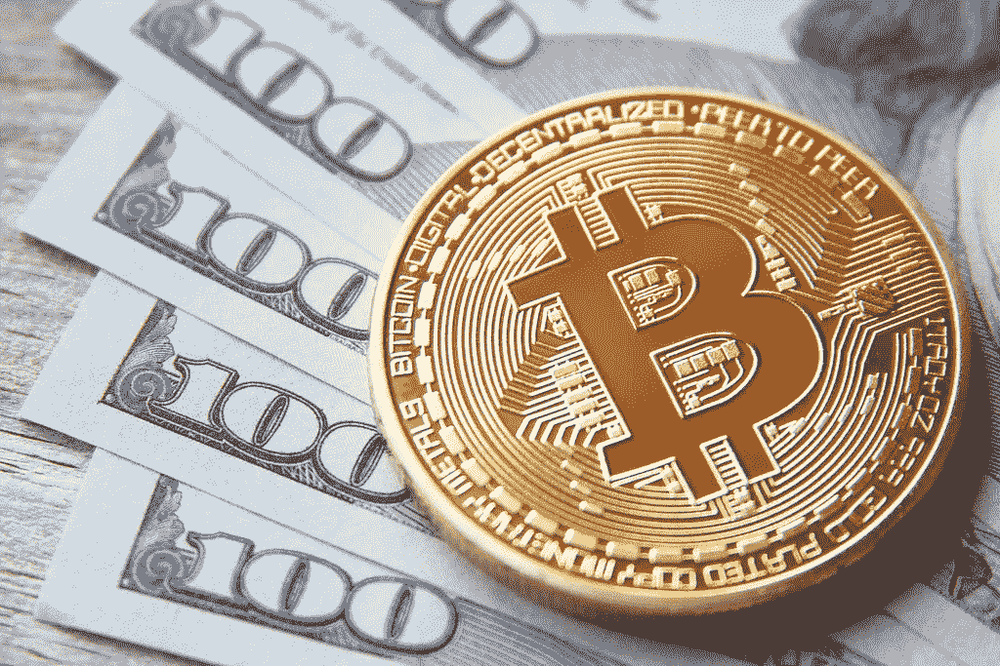
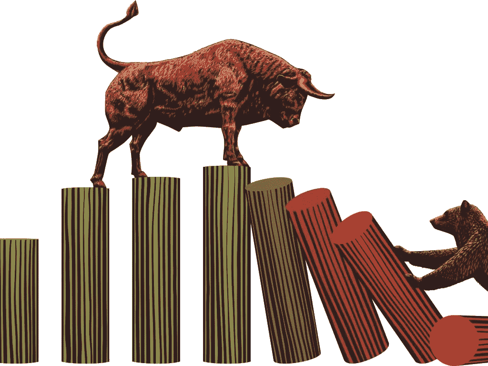
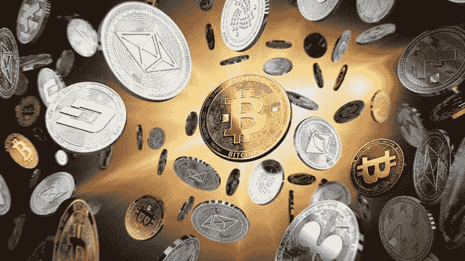

# 比特币去哪里，整个市场就去哪里

> 原文：<https://medium.datadriveninvestor.com/where-bitcoin-goes-the-whole-market-goes-7ba4898bb109?source=collection_archive---------1----------------------->

## 2019 年 6-7 月加密货币市场分析

关于比特币，有一件事我一直收到不停的提问。

但如果你一直在关注我，你就不会对它在过去一周的飙升感到惊讶。

 [## 总部设在瑞士的 ETP 进入加密交易市场-数据驱动的投资者

### 虽然金融市场几乎没有沉闷的时刻，特别是在引入…

www.datadriveninvestor.com](https://www.datadriveninvestor.com/2019/03/10/swiss-based-etp-enters-the-crypto-trading-market/) 

在这篇文章中，我将告诉你它的发展方向以及对整个市场的意义。

# 比特币价格行动

我今天真正想谈论的是比特币的现状……我们几乎达到了 13，000 美元，我看到它在小幅回调后走向 15，000 美元(在 9，500 美元处有强大阻力)。我已经收到了很多人的来信，他们想知道，“它什么时候会撤回(一个主要的)？”或者“什么时候会崩溃？”

从 4 月份开始我就一直在说熊市结束了。机构正在进入比特币。对比特币的需求正在飙升，并将继续飙升。

所以我没有看到比特币翻来覆去，分崩离析。事实上，我看到它越来越强大。请记住:我们有庞大的机构投资者正准备进入这个市场，并向机构资金开放这个市场。

我们在比特币上看到的这种变化不应该是一个惊喜。我们谈过的所有事情都开始变得有条不紊了。很快，今年就会有经纪公司允许人们点击鼠标就能购买比特币。

我们所看到的只是开始。如果你看看图表，看看比特币是如何爆发的，这表明比特币将大幅走高。

# 预测下一次回调

现在，我告诉你，显然比特币不是直线上升的。它总是不稳定的。但我认为，试图预测 18 个月熊市之后的下一次回调是一场危险的游戏。很多想卖掉比特币的人已经卖掉了他们的比特币。

也许会有一些人坚持在 19-20k 美元左右，人们会说，“嗯，我在 19k 美元买了一些，在 20k 美元买了一些，我会等到它到达那里时再卖。”我可以看到比特币在那里停顿了一下。但是一旦它清理了那个区域，就没有头顶阻力了。你知道比特币的走势。一旦它决定跑，它就跑。所以我会说，如果你分配不足，根据你自己的个人分配规则，你需要适当地分配。

# 替代硬币会赶上来的

同样，我们的观点是，你希望拥有一个广泛的硬币投资组合，你希望拥有合理的头寸规模，因为当比特币下跌时，整个市场都会下跌。

通常情况下，会有六个月的时滞，这是我几个月前解决的问题。比特币永远是先动的，而且永远比市场上的其他货币动得快。我们回头看了所有的动作。一般来说，在比特币打破其下降趋势线的六个月内，你会看到 altcoin 市场的其余部分开始赶上，然后最终跑赢大盘。

所以这个机会仍然存在。如果投资组合中有你还不拥有的替代币，并且它符合你的风险参数，那么利用这个机会，因为我们刚刚开始看到这种生活回到市场。

此外，在长达 18 个月的熊市之后，你不会在牛市开始时调整投资组合。这根本说不通。你要做的是等待市场继续发展。

我想再次向你们强调，这仍然是非常非常早期的阶段。比特币 4 月份刚破跌势线，我们 7 月初刚到，所以才两个月。

所以，HODL 紧张而愉快的交易！

感谢阅读！请随意查看我下面的一些类似的加密货币相关帖子。

*   [如何从科莫多(KMD)获得加密收入](https://medium.com/@rastogimanu461/how-to-earn-crypto-income-from-komodo-kmd-5217fd8bc129)
*   [“锁定”您的 BIX 代币，继续获得您的 BIX 奖励](https://medium.com/@rastogimanu461/lock-your-bix-tokens-today-to-continue-receiving-your-bix-incentive-reward-8ee80f4589ba)
*   [如何从本体中获得 ONG(ONT)](https://medium.com/@rastogimanu461/how-to-earn-ong-from-ontology-ont-acd92ffdd318)
*   [Zilliqa:进展和更新，2019 年 6 月](https://medium.com/@rastogimanu461/zilliqa-progress-and-update-june-2019-ec09b0c3cc71)

你可以在 [Medium](https://medium.com/@rastogimanu461) 上关注我更多这样的帖子。