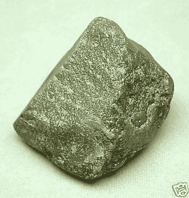

# 一家没有收入可展示的全新创业公司，你能从哪里找到资金？

> 原文：<https://medium.datadriveninvestor.com/where-can-you-find-funding-for-a-brand-new-start-up-company-without-revenue-to-show-95434989d1f6?source=collection_archive---------10----------------------->

我已经为新的创业公司筹集了一些资金。大多数情况下，创业者会需要做一些和我类似的事情。从天使或风投那里融资简直是白日做梦。

**为什么创业者筹不到钱**

为什么我认为这是一个白日梦？我为几个组织做指导。我为 500 家初创公司提供指导，帮助他们的投资组合公司找到商业模式。我也为马来西亚全球创新和创造力中心做同样的事情，这些年来我看到的是:

*   大多数单干的企业家并不真正可信。他们的球场甲板是二流的，想法很差，有很多模糊的想法和天真的乐观主义帮助他们蹒跚前行。有很多例外，但是每一个例外都有 10 个以上的例外。
*   我通过 Magic 看到的企业家通常都上过一门或多门创业课程。他们可能经历了一个训练营，或者一个投球周末。因此，他们有更好的牌，他们更清晰、更自信，与他们的会议更多的是指导而不是教练。
*   最后，当我与由 500 家初创公司资助的初创公司合作时(他们只获得 5 万美元)，我看到企业家们更加专注。球场甲板被打磨，他们的执行能力向前迈进了一大步。他们完成任务。电话与其说是一次指导经历，不如说是一次指导经历。

这些年来，我合作过的近 1000 家创业公司可能都是这三个群体的。

> [DDI 编辑推荐——如何在没有风险投资的情况下为你的初创公司融资和发展](http://go.datadriveninvestor.com/fundstartup2/matf)

[保罗·奥布莱恩](https://www.quora.com/profile/Paul-OBrien-1)提出了一些关于营销的重要观点。我会走不同的方向。清晰的思想和想法是获得资金的最关键的方面之一。

你清楚了吗？

我给你一个快速的挑战。用不到 3 句 30 秒的时间写下评论

> *“你的企业将如何改变世界？”*

我主持过一些推销会议，我想

> *“除了与虚拟现实有关的东西之外，我对他们正在做的东西一无所知，我如何以好的东西开始呢？*

这是一场灾难，这表明他们也许有一个很好的想法，但他们没有花时间或精力去弄清楚如何实现它。

你会买这块石头吗？这是什么？

这是一颗 731 克拉的钻石，直接来自矿山。它没有经过切割和打磨，看起来几乎和其他石头一样。

除非你把你的想法说得清清楚楚(一语双关),否则很难让人信服。

你真的了解你的业务吗？

我要为 Y 做 X，从 Z 中赚钱

这是经典的音调措辞。用一句话，你就概括了你业务的核心。

我们往下挖。

继续问

*   我该怎么做？
*   他们为什么会这么想/这么做？

你能用清晰简洁的有证据支持的句子来回答吗？

你是否清楚地了解你的业务是什么，以及它将成为什么？

> *任何人都可以看到一个漂亮的女孩，看到一个漂亮的女孩。一个艺术家可以看着一个漂亮的女孩，看到她将成为一个老妇人。一个更好的艺术家可以看着一个老妇人，看到她曾经的美丽。*
> 
> *但是一个伟大的艺术家——一个大师——奥古斯特·罗丹就是这样——可以看着一个老妇人，描绘出她真实的样子……并迫使观众看到她过去的样子……而且更重要的是，他可以让任何一个有着犰狳般敏感的人，甚至是你，看到这个可爱的年轻女孩还活着，一点也不老也不丑，只是被囚禁在她被毁坏的身体里*

(罗伯特·海因莱茵)

就像上面的原石一样，这句话让你思考在你的业务表面下到底发生了什么。你的公司几年后会是什么样子？

**制定出前进道路的愿景**

忘掉销售废话或用户数量…说说办公室会是什么样子？谈论在那里工作的人。描述企业文化，以及企业在接下来的一年左右的时间里发生了怎样的变化。和我谈谈三年后的市场情况？

这不可能吗？不。但是非常非常难。

你需要花很多时间来理解你的想法，并慢慢将其从你对它的乐观和草率的想法中解放出来。这是一个决定你的生意是什么，不是什么的研磨(另一个双关语)过程，切割和打磨它，使它变得可投资。

所以回到保罗·奥布莱恩的观点。

投资人给你钱，是因为你擅长营销，还是因为你擅长创新。你可以改变人们，也可以改变世界

明白自己在做什么，能够把这个超级解释清楚，就是这个的前兆。

我曾经用这个短语筹集过资金。我用了不到一周的时间就筹集到了我需要的资金。

> “我们向制造石油钻塔的人出售厚钢板。油价在上涨，而世界上只有 6 家公司能生产出合适质量的钢板。他们都不在东南亚”。

我可以就那里的每一点谈上几个小时。我读过几十篇论文和研究报告。我写了几十万字。我与数百名客户谈论过他们的业务和客户的需求。对于每一个可能的问题，我都能给出一个完美的答案。

所以回到这个问题:**如果一个全新的创业公司没有收入可言，你能从哪里找到资金呢？**

如果你既不清楚也不了解你想要建立的企业，你就不能。

编辑:清晰而优美=深刻的理解，而不是华而不实的幻灯片演示。最重要的是传递实质而不是形式。与其他企业家相比，当你与投资者交谈时，你怎么能大幅度超额交付呢？

— — — — — — — — — — — — — — — — — — — — — — — — — — — — — — — — — — — — —

如果你有清晰的思路，那么你几乎可以从任何地方筹集资金。

请关注 [Wannapreneur](https://www.quora.com/q/yandmsnohdjsgiaj) ，获取更多关于开始创业之旅的精彩答案

如果你正在考虑创业，或者刚刚开始创业，你可能会喜欢我的[创业准备报告](https://goo.gl/forms/i0KIVsmWyeV57nsl1)，这是一份基于你的经历的 30 页定制报告。它将帮助你避免早期创业的许多陷阱，并更快取得成功。