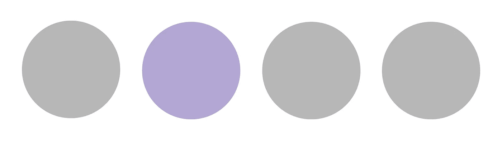
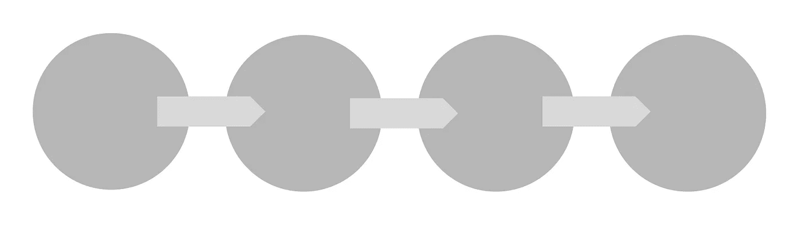
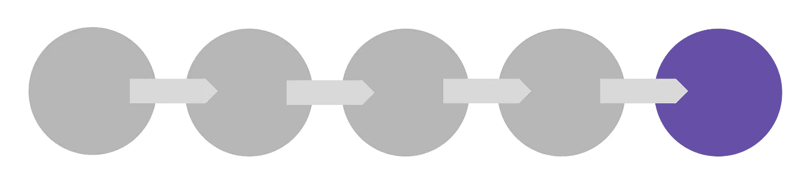
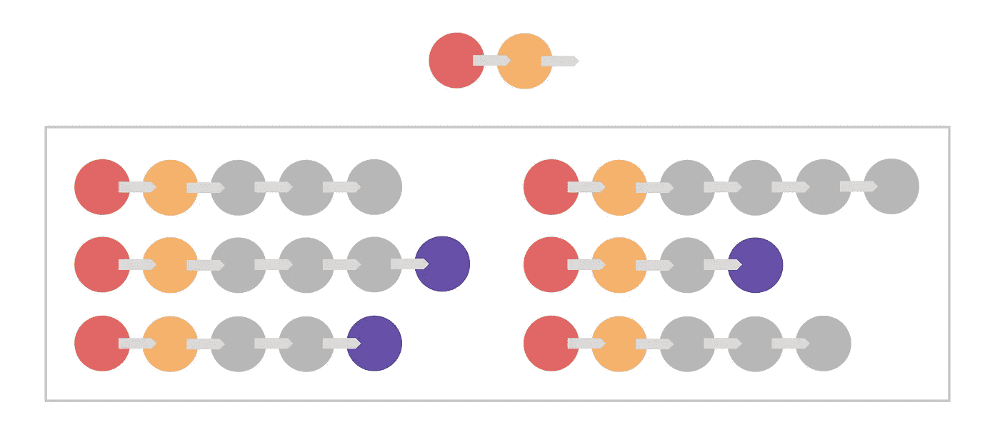
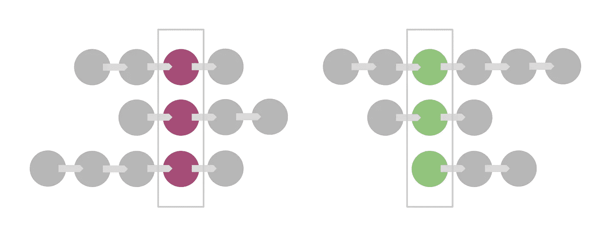
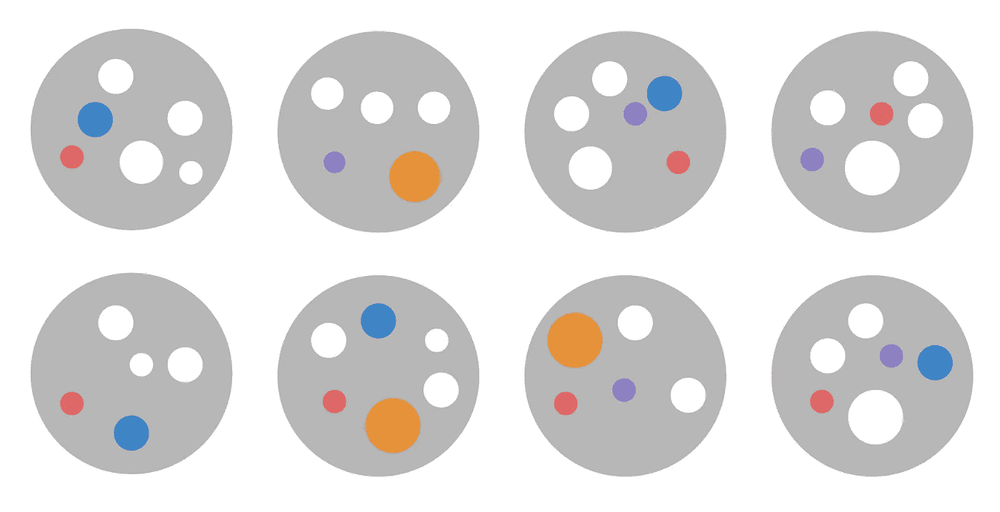

# 顺序行为的预测建模:一种新的理论算法

> 原文：<https://medium.datadriveninvestor.com/where-did-you-come-from-where-did-you-go-where-are-you-headed-ai-will-know-9d623d1cf52f?source=collection_archive---------1----------------------->

*在写完* [*我的上一篇关于搜索、配对和属性群组*](https://medium.com/datadriveninvestor/thoughts-on-building-relational-data-sets-the-reverse-collector-appraiser-algorithm-5b3121ff390e) *的文章后，我受到启发，将其中的一个概念(基于日期之间的关系构建“树”的嵌套值群组)扩展到我最近一直在思考的另一个相关主题:* ***预测行为建模。***

*[*我写的最后两篇文章*](https://medium.com/datadriveninvestor/matters-of-taste-teaching-ai-to-be-the-ultimate-foodie-aeb0081e47ad) *对我来说，在业余时间拼凑起来是冗长且相当费力的——所以我打算暂时保留这篇高水平的文章。稍后，如果时间允许，我将回到这个主题，探索一些扩展的应用程序，并深入研究理论数据模型。**

*不管怎样，让我们来看看好东西:*

*我们经常尝试用机器学习做的事情之一是**根据之前记录和分析的数据，预测序列中“接下来”会发生什么**。“下一个”可能是一个动作(点击一个链接，购买一件产品)，一个条件(有资格享受优惠，交通堵塞)，或者一个值(图像中的一串像素，消息中的一个词)。**我们使用的算法**通常是多用途的，并且在某种程度上是数据不可知的——它们**不必“关心”预测的人类背景是什么**，只要它们被馈送、作用和输出的数据反映了人类的考虑。这是让机器变得“智能”的部分原因(至少从我们的角度来看)。*

*然而，我发现，正如我写的前两篇关于机器学习的文章一样，维持这样一个开放的场景很难讲清楚；一切都变得模糊抽象。*

*因此，为了这次探索的目的，我将具体地:**让我们来谈谈在线购物环境中的预测行为建模。(但是当你阅读的时候，请记住，这个模型可以被塑造成几乎任何背景，只要有一点点创意；当我打字的时候，我会尽量不让手指向任何方向移动。不过，不能保证。)***

*考虑用户在电子商务网站上的主要行为:加载页面、点击另一个页面、将产品添加到购物车、填写表格、输入支付细节、完成购买等。作为业务用户，这些是您认为重要的操作。**让我们称这些行为为“节点”***

**

***A Node** represents a distinct action that a user takes during a visit.*

***现在，考虑所有次要的交互**和事件，它们累积成主要的动作:滚动页面，暂停阅读，离开浏览器标签/窗口的焦点，展开信息面板，浏览图像转盘，等等。这些是在用户进入一个节点和离开该节点进入下一个节点之间发生的事件。或者，换句话说，它们是用户在节点内*所做的事情。让我们称这些行为为“点子”**

**

***A Pip** represents a minor action that occurs within a Node. Nodes contain many Pips.*

***现在，考虑用户在网站上的旅程**:从主页经过，点击登录他们的帐户，导航到产品类别，点击产品详情页面，将产品添加到他们的购物车，等等。旅途中的每一步都代表一个节点。当您按顺序记录用户经过的节点时，该顺序就成为他们访问网站的记录。**让我们称这个序列为“链”***

**

***A Chain** represents the sequence of Nodes that a user has passed through.*

*通常我们希望用户执行的**特定操作:注册电子邮件程序、完成购买、创建帐户等。像其他动作一样，这些可以被认为是节点；但是它们通常代表一段旅程的结束(或者至少是这段旅程中明确定义的*部分的结束)。**让我们称这种特殊类型的节点为“端点”******

**

***An Endpoint** is a Node that represents a desired outcome.*

*既然我们已经勾勒出了描述用户体验的基本模型*(同样，我们是在网站访问的背景下讨论这个问题，但体验可以是任何东西——就此而言，用户也可以是)*，**让我们考虑如何建立一个包含许多用户访问网站的数据集**。*

*首先，**我们要定义机器的主要动作**(节点)。(*最终，我们可能会决定让算法足够智能，通过发现和分析足够大的数据集来自行推断这一点——但现在，让我们假设我们正在教它自己)。*既然这样，**我们也来定义一下端点**。这些可能是我们特定场景或环境所特有的。*

***当用户访问网站时，我们将记录他们的所有行为:**从点到节点，节点到链，最后到(或不到)一个端点。我们将为每个访问网站的用户做这件事，捕捉他们从行动到行动再到结果的路径。当我们有足够的数据达到统计意义时，我们可以开始分析我们捕捉到的东西。*

*几乎可以肯定的是，不同的用户在他们不同的旅程中，会经过相似(或相同)的节点序列。这意味着它们的链将有一定数量的共同“链接”。因为这些链代表相似的路径，所以我们以某种方式对它们进行分组是有意义的。**让我们称一组链条为“链条队列”***

**

***A Chain Cohort** is a collection of Chains that begin with the same Node or series of Nodes.*

*当一个链群只共享一个起始节点(例如，登陆主页)时，其中的链没有那么多共同点——很难预测用户下一步会做什么。链群组共享的节点越多，用户选择的路径就越具体。*

*为了说明这一点，**我们可以在其他链群组**内对链群组进行分组，根据它们的特殊性和它们共有的领导节点的数量来“嵌套”这些群组。例如，考虑以下情况:*

***以主页访问节点开始的链:***

*   *主页访问节点，然后登录屏幕节点*
*   *主页访问节点，然后是购物车节点*
*   *主页访问节点，然后是产品类别节点*

*每次我们“向下一级”，我们会遇到更多的链群，而每个链群包含的单个链更少(即，随着我们继续细分，分组变得更小)。每个链中的节点序列对用户来说变得更加具体和独特，我们捕捉的信息的有用性也增加了。*

***因为我们已经定义了我们的终点，**我们知道每个捕获的链是否产生了期望的结果。为了让这些知识对我们有用，**我们可以为终点附加一个“权重”:**一个表示我们对特定结果的重视程度的值(例如，结账购物可能比注册电子邮件程序的权重更大)。链中出现加权端点表示链是“成功的”没有加权端点表明它不是。*

**

***The Endpoints** present on chains contribute a Success Weighting that rolls up to the Chain Cohort, then to its cohort, and so on.*

*然后，我们可以**平均链群组**中所有链的权重，以确定群组的总体成功程度。向上移动一级，我们可以进一步平均属于更一般群组的链群组的值，以确定*其*总成功，等等。*

*我们得到的**越接近**具有特定端点的单链，其权重被考虑的**越强**。反之，**离我们得到的特定链和端点**越远，**对其权重的考虑就越弱**。这反映了当前处于其旅程的特定位置的用户到达终点的可能性，假定他们“接近”终点。**因此，我们可以说，转移到其链，然后转移到其链的群组的端点的权重，反映了用户在给定其当前轨迹的情况下将体验到成功结果的可能性**。*

***更好地表示节点**之间的关系(它们按顺序出现的位置，它们的变化，等等)。)，在我们记录每个用户的旅程时，捕捉更多关于他们的信息将会很有价值。我们可以**将相似的节点分组到节点群**中，以允许我们回过头来更好地理解每个节点的行为中固有的多样性，节点在链中可以占据的不同位置，以及它们在产生成功结果中的相对参与。*

**

***Node Cohorts** allow us to analyze the role that various nodes grouped based on their primary action play in leading the user to an Endpoint.*

*一旦我们**记录了足够数量的用户交互**，我们就可以开始基于我们刚刚建立的模型评估新的交互，并且**试图影响新用户**朝着我们喜欢的结果前进。*

***让我们快速看看这是如何实现的:***

*   *当用户第一次访问一个网站时，他们到达一个初始节点。这开始了他们的链条。*
*   *基于该起始节点，**我们可以识别用户的旅程可能采用的所有可能路线**。这些是我们正在构建的链条所属的群组。*
*   *随着用户通过更多的节点，**他们的链增长。每次我们向链中添加一个节点，用户就“下降”到越来越具体的链队列中。***
*   *用户链越长，用户就越接近理论终点。这意味着我们开始检测我们希望用户所属的链群(以及我们希望他们经过的节点)。*
*   *然后，我们可以开始**采取措施来塑造用户体验**,将他们引向最有可能通向成功终点的节点。*

*最后一点包含了许多复杂的行为——在这篇介绍性的文章中无法一一介绍。然而，我们*可以*在这里讨论的一件事是**pip 在促进结果方面可以发挥的作用。***

***pip 代表节点**的“味道”——区别于其他类似节点的独特特征(例如，一个普通的“添加到购物车”节点可能包括 pip，它携带添加了哪些产品、数量、用户在页面上做了什么等细节。).*

*当用户处于其旅程中的特定节点时，我们可以回过头来检查其父节点群组揭示的趋势:*

***群组**中的哪些节点最终通向终点？(即，属于具有高成功加权的网/网群组的节点)*

*   *这些帮助我们选择用户“应该”点击的下一个(些)节点，如果他们想继续成功的话。*

***在导致具有最高成功加权的链的节点中，**哪些点出现得最频繁？*

*   *这些代表了最常伴随着向终点或成功结果的移动的微操作和其他交互细节。*

**

***The Pips** present in Nodes that lead to Endpoints can be analyzed to identify common interactions that may have previously contributed to success.*

*然后，我们可以根据我们的目标采取行动来影响用户行为:*

***我们需要使用什么“杠杆”**来影响用户的行为，使其符合这些 pip——提高用户在旅程中前进到首选下一个节点的可能性？*

***“杠杆”取决于 Pip 的性质** —例如，考虑以下潜在的 Pip 和我们为鼓励互动可能采取的行为:*

*   *购买一件以上的产品>预先填充数量框，或者以某种方式突出显示增量按钮*
*   *向下滚动页面>开始轻微的“意外”滚动，以显示较低的内容，或者以某种方式突出向下的箭头元素*
*   *单击图像放大>突出显示 UI 元素*
*   *选择特定的搜索结果>提升 SERP 上的项目，用特殊处理突出显示它*
*   *参与现场聊天>自动弹出聊天框*

***奖励:**如果我们检测到某些点很少或从不出现在成功的节点中，我们可以采取措施在页面上抑制或最小化它们——有效地将用户的焦点缩小到统计上最有可能产生成功结果的参与选项。*

*由于权重是基于各种节点、链和群组的，因此在给定时间可能会有多个 Pip 争夺用户的注意力。**这意味着每个元素的重要性(或“鼓励”)将由其相对权重决定。***

*因为链的结果是根据终点的存在与否自动捕获的，所以我们在调整每个群组的权重时，会不断刷新推荐点数的选择。*

***我觉得这是这个作品的一个很好的收官点，**暂时。但是首先，让我们概括一下我们已经讨论过的所有内容(简洁不是我的强项，所以这给了我一个浓缩的机会):*

1.  ***节点是用户采取的动作**。*
2.  ***点子是那些描述独特“味道”的动作中的细节**。在一群节点中，点数是它们之间的区别。*
3.  ***链是节点的序列**。*
4.  ***终点是代表积极结果的节点**。*
5.  ***从头部开始，根据链共享的节点数量，链被分组为群组**。这些是嵌套的。该结构是一棵树。*
6.  ***节点被分别分组到群组**中，以便与对等节点进行比较。*
7.  ***端点携带“重量”**。这个重量被共享给链，然后是群组，等等。*
8.  ***权重描述成功的可能性。**它随着远离终点的每一步而减少。*
9.  *以上所有内容的结合让我们能够识别出**用户何时接近可能的结果**，并开始将他们“拉”向结果——结果越接近，拉力越大。*
10.  *整个系统通过将过去的成功和失败输入到数据模型中来“教育”自己，根据表现改变链条和团队的权重。*

*给定这种类型的预测模型，我们可以模拟什么样的行为？当我认真思考时，尽管电子商务离我家特别近，但老实说，它是最没意思的场景之一。*

***想象一下，将链/节点模型应用于发动机性能、**运动和燃料效率数据，这些数据在车辆行驶于各种环境时流过车辆。汽车开得有多快？油门开多大？制动器启动了吗？有打滑吗？我们预期会有更高速度的需求吗？我们转弯了吗？驾驶员指挥车辆的流畅程度如何？他们在示意轮到他们了吗？有麻烦吗？有没有需要解决的挑战——需要权衡、平衡和调整的难题？*

*我们如何利用这种模式让事情变得更好？*

**…甚至不要让我开始子链队列和节点跳跃的想法。让我们把那个留到下一天。**