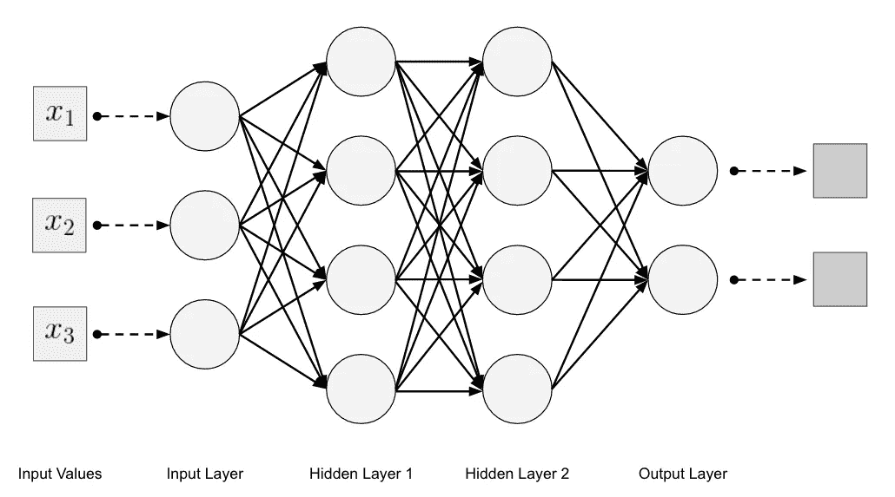

# 我从哪里开始？

> 原文：<https://medium.datadriveninvestor.com/where-do-i-start-from-f9e40ca81958?source=collection_archive---------12----------------------->

数据科学实际上已经引起了轰动，许多人都想加入这一行列。然而，正如深度学习 Keras library 的创始人 Francis Chollet 正确指出的那样，你不应该相信短期炒作，而是应该相信数据科学的长期效果。由于短期的嗡嗡声，网上有过多的资源，许多人显然不知道从哪里开始。你要看[2019 年学数据科学是什么感觉](https://towardsdatascience.com/how-it-feels-to-learn-data-science-in-2019-6ee688498029)。这是一件漂亮的作品。我不会试图给你一个 2019 年学习数据科学的路线图(你可以查看 Analytica Vidhya 的美丽的[指南](https://www.analyticsvidhya.com/blog/2019/01/learning-path-data-scientist-machine-learning-2019/))。我也不会试图定义数据科学的范围。相反，我将为你如何尝试学习数据科学提供实用指南。

**先做第一件事**

Excel, Always Excel!

如果你以前没有数据分析的经验，你应该从 Microsoft Excel 开始。开始的课程是[在 EdX](https://www.edx.org/course/introduction-to-data-analysis-using-excel-0) 上使用 Excel 进行数据分析的介绍。然后，您可以转到[使用 Microsoft Excel](https://www.edx.org/course/analyzing-and-visualizing-data-with-excel-0) 分析和可视化数据。这两门课程都是微软提供的，如果你预算紧张，可以免费旁听。老师和实验室都很棒，对我来说这是一次很棒的学习经历。我推荐这些课程，因为它们可以帮助你在前进的过程中做出关键的决定:我是满足于做一名传统的数据分析师，还是真的想成为一名数据科学家。剧透警告:用搜索引擎来找出不同之处可能会让你更加困惑。

Data science is a science.

好吧，我想我得做一些定义。在我遇到的所有数据科学学习平台(EdX、Coursera、DataCamp、Udemy、Udacity、AnalyticsVidya 等)中，所有数据科学专业/课程的共同点是，你需要一点数学(线性代数和基本微积分)、统计学(基本描述和推理统计)、编程(Python、R 和 SQL)、研究和业务/领域知识。关键是数据科学不仅仅是这些技能中的一种或多种，它将所有这些技能与通信和其他“人类”技能融合在一起。虽然这些课程中的许多课程在所需技能的深度上有所不同，但它们大多都同意，要成为数据科学家，需要这些技能的基本组合。

**早期数据科学步骤**

That’s one small step for a man, one giant leap for mankind — Neil Armstrong

如果你确定你想成为一名数据科学家(坚持做纯数据分析师，甚至提前成为一名机器学习工程师，绝对没有错)，你的下一步应该是花时间学习数学、统计学和编程。Udacity 贝塔斯曼数据科学挑战课程向我提供了这一点。您将学习数据科学所需的统计学、Python 编程和 SQL 的基础知识。趁着前阵子挑战课程结束，可以利用这些资源:D [*描述性统计*](https://www.udacity.com/course/intro-to-descriptive-statistics--ud827)*[*推断性统计*](https://www.udacity.com/course/intro-to-inferential-statistics--ud201)*[*编程使用 Python*](https://www.edx.org/course/introduction-to-computer-science-and-programming-using-python-0) *(注意本课程非常面向计算机科学)*。数学方面的知识，可以在 Udemy、YouTube 或者可汗学院上温习一下矩阵、向量、微分学的知识。那里有很好的资源，任何人都可以。虽然我真的很喜欢吴恩达在 Coursera 上提供的机器学习入门课程，但我不建议参加，因为它非常密集，作业是在 Matlab/ Octave 中完成的，许多人不再使用这些语言来研究数据科学。要获得更多关于 SQL、R 或 Python 的数据科学实践，DataCamp 是必去之地。如果 Python 是你的首选语言(这应该是真的)，那么加州大学圣地亚哥分校的用于数据分析的 Python(T21)是你应该利用的一个很好的资源。最后，你应该使用微软在 EdX 上提供的 Python 、[数据科学研究方法](https://www.edx.org/course/data-science-research-methods-python-edition)来尝试机器学习的[原理，让你感受一下机器学习和研究世界。请注意，虽然这些是我根据自己的学习经验提出的建议，但您也可以随时查看其他优秀的资源。我不能说出我在这里使用或接触到的所有资源，我只是分享那些与我产生巨大共鸣的资源。](https://www.edx.org/course/python-principles-machine-learning-3)**

****深度学习预习与实践****

****

**One more step**

**在吸收了这些学习资源之后，你应该稍微转向深度学习。虽然从我与数据科学资源的互动来看，深度学习不是数据科学的重要组成部分，但我觉得作为一名数据科学家，它是对你工具箱的宝贵补充。你的深度学习学习应该包括卷积神经网络、递归神经网络和推荐系统。无论是在转向深度学习之前还是之后，你都应该选择项目/现实生活中的数据集来工作。还可以加入现场比赛。Kaggle 是一个很好的起点。然而，如果你不知道你到底在找什么，Kaggle 很容易让人迷惑。如果您想测试您的数据清理技能，并感受一下可能是最具挑战性的结构化数据类型，我推荐使用[Zindi Africa](https://medium.com/u/d0e2a6b729ff?source=post_page-----f9e40ca81958--------------------------------)Loan Prediction 和 Busara Health datasets 不平衡的班级。你也可以看看 AnalyticsVidhya 的学习挑战。虽然在这些挑战、项目和/或比赛中取得非常好的成绩很重要，但请记住，作为一名数据科学家，您希望尽可能多地学习并应用您迄今为止所学的一切。在这一点上，你应该看到栈溢出或谷歌一般会是你最好的朋友。此外，我建议你应该尝试选择一个现实生活中的项目来工作。作为我最后一年项目的一部分，我应用数据科学工作流来解决一个工程问题(如果你还不知道，我是一名工程学生)。这赋予了我已经提到的数据科学家应该具备的全部技能。这是巨大的挑战，但一路上都很有趣。最后，开一个 GitHub 账户，在那里你可以随时上传你参与过的项目，并开始关注一些数据科学博客。**

**遗言。**

****

**Clear easy path, right?**

**我知道这是一篇很长的文章，但是我希望我已经回答了“我从哪里开始”这个问题。如果你还没有注意到，我是一个非常偏向于视听的学习者，但我也遇到并使用了一些优秀的书籍。如果你更倾向于从书本中学习，你可以看看它们(它们都是为 Python 用户编写的)。然而，无论你倾向于书籍还是视频，我都建议你使用它们来帮助你的学习曲线。**

**Muller A.C .和 Guido S .用 Python 介绍机器学习**

**-统计学。《从数据中学习的艺术和科学》，作者 Agresh Franklin**

**-通过 Scikit-Learn 和 TensorFlow 进行机器实践学习**

**-用 Python 自动化枯燥的东西**

**-用 Python 进行深度学习，作者 Francis Chollet**

**-预测分析，预测谁会点击、购买、撒谎或死亡的力量，作者艾瑞克·希格尔**

**Field Cady 的《数据科学手册》**

**-杰克·范德普拉斯的《Python 数据科学手册》**

**-大数据，一场将改变我们生活、工作和思维方式的革命，作者维克多·迈尔-绍恩贝格**

**页（page 的缩写）s:尝试尽早加入数据科学社区。参加聚会和新兵训练营。如果你身边有一个这样的平台，AISaturdays 就是一个很好的平台。对于生活在尼日利亚的人来说，[尼日利亚](https://www.datasciencenigeria.org/)数据科学也许是最好的平台，在这里你可以见到那些不仅在你学习时鼓励你，而且挑战你变得更好的人。你还可以找到一群数据科学爱好者，他们是你的支持者。是的，我们称自己为朝圣者。最后，无论你有多专注，学习数据科学都需要一些时间。尽可能地鞭策自己，但不要对自己太苛刻。**

**再见。**

## **来自 DDI 的相关故事:**

** [## 用 7 个步骤解释深度学习——数据驱动的投资者

### 自动驾驶汽车、Alexa、医学成像——在深度学习的帮助下，我们周围的小工具变得超级智能…

www.datadriveninvestor.com](https://www.datadriveninvestor.com/2019/01/23/deep-learning-explained-in-7-steps/)  [## 成为数据科学家所需的 8 项技能——数据驱动型投资者

### 数字吓不倒你？没有什么比一张漂亮的 excel 表更令人满意的了？你会说几种语言…

www.datadriveninvestor.com](https://www.datadriveninvestor.com/2019/02/07/8-skills-you-need-to-become-a-data-scientist/)**