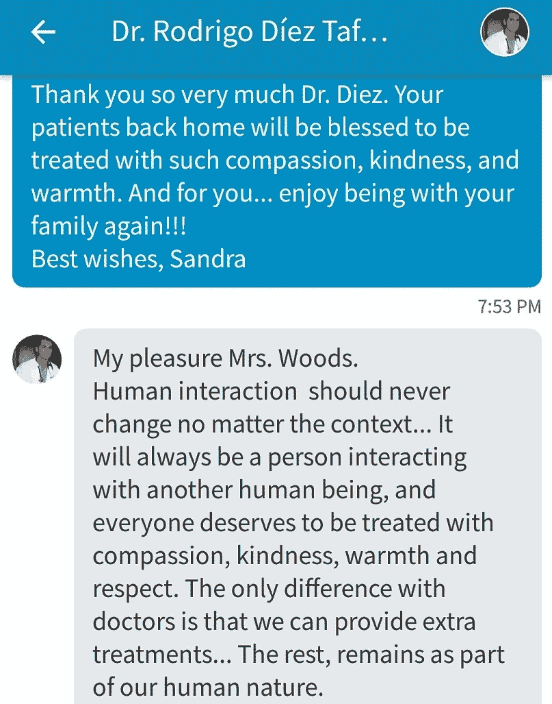
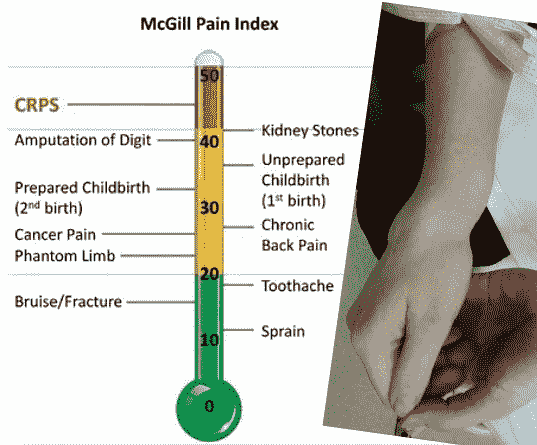

# 你在哪里透明地划清界限？

> 原文：<https://medium.datadriveninvestor.com/where-do-you-transparently-draw-the-line-3945faa07141?source=collection_archive---------0----------------------->

## 社交媒体使医生和病人之间的隐私变得复杂

Source: The Beckman Collaborative

透明给医疗保健提供者带来了挑战。展现人性一面的冲动与医患隐私相冲突。然后加入社交媒体。医生的底线在哪里？

“医生-患者-医疗服务提供者和客户或患者之间是一种动态关系，”[Stephanie mia co](https://twitter.com/StephMiaco)医生说。“这是基于这样一个前提，即对于医生来说，诚实和负责是双向的，而对于患者来说，信任和脆弱是双向的。”

米亚科是来自菲律宾杜马盖地市的精神病学家。她倡导精神健康，并谈到了完全透明及其对医患关系的影响。

“在当今社交媒体密集的医疗保健领域，人们可以随时获取任何医生的多年可检索上传信息，”她说。

“想要更多地了解某人以获得安全感是人的本性，尤其是在他们的健康问题上，”Miaco 说。“当它涉及到更多的个人问题时，它可能会对关系产生积极或消极的影响。”

# 记录访问

不完全是社交媒体——但与透明度有关——许多医生现在让病人在线访问他们的记录。这包括预约，测试结果和其他需要通过简单的登录和查找。

“我一直保持我的推特账户是专业的，我的脸书账户是私人的，”T4 的 Iris Thiele Isip Tan 博士说。“推特上没有家人或食物的照片，因为有些东西我只需要朋友和家人看到。”

谭，内科内分泌学家，菲律宾大学医学院临床副教授，菲律宾大学医学院医学信息中心主任。

jai Fred Christian“Jim”Lopez 医生说[“在健康领域，你被定型为一个提供建议的人。他从事卫生政策和管理方面的研究，并在马尼拉的圣贝达学院教授社区医学和研究方法。](https://twitter.com/jaifredlopez)

“医疗服务提供者应该对此保持敏感，”他说。"他们可能需要建立网页，专门提供建议和参考当地的从业者."

Miaco 试图在社交媒体上坚持令人愉快的项目。

“尽可能地，我只想发布积极的东西，”她说。“有一些有趣的东西展示了我的家乡或我的旅行，供公众消费。

“不过，我有一个家庭相册账户，”Miaco 说。“有时我觉得在社交媒体上发布这些很容易受到伤害。”

# 好奇的头脑

她对那些想知道太多的人保持警惕。

“人们倾向于对他们的医疗服务提供者感到好奇，而不是他们的工作，”Miaco 说。“这就是为什么我们在网上和社交媒体上寻找人们。我想每个人都会这样。”

当好奇成为一种文化规范时，它尤其是一个问题。

“有时在诊所里，病人会问我，你有几个孩子？男孩还是女孩？他们多大了？”谭说。“菲律宾文化的一部分——如果在社交媒体上就不同了。”

Remo-tito Aguilar 博士说隐私应该是个人的选择。作为一名整形外科医生，他是桑托斯将军医疗中心的诊所主任，也是达沃市南菲律宾医疗中心整形外科的医疗专家。

“我的目标不是总是把个人生活和工作混为一谈，”他说。“到目前为止，这对我很有效。”

[桑德拉·伍兹](https://twitter.com/SandraWoodsMtl)在加拿大专门研究生物医学伦理、病人隐私、研究伦理和退伍军人健康。她有明确的社交媒体规则。

“永远不要发布任何你不想让父母、孩子或未来雇主看到的东西——或者病人和咨询，”她说。

# 对黑客开放

你想在社交媒体上社交，但又想保持距离。你透露的越多，就有越多的黑客需要合作。他们已经有很多你的信息了。您不必帮助他们，也不必在此过程中制造自己的数据漏洞。

“在我的脸书主页上，没有人问我的私生活，”谭说。“也许这是因为我不发布任何个人信息，只发布关于内分泌学的信息。

“我不回脸书的短信，”她说。“他们向我的脸书个人账户发送消息，因为我的专业页面关闭了消息服务。”

这有助于避开刺探的问题——但并不总是如此。

“下一件事是，‘我儿子未婚。你想见见他吗？”谭说那是一个同事的真实经历。"

伍兹知道类似的社交媒体遭遇。

“我有医疗专业的朋友遇到过这种情况，”她说。“他们说，‘你的眼睛真好看。“我们能不能出去喝杯咖啡，聊聊天，”

“请记住，你发布的任何内容都是公开的，或者可能是公开的，”伍兹说。"即使您在受限网络中共享，其他人也可以在该组之外共享您的帖子."

她加入了一个 Twitter 交流，她经常在博客上发布，并获得了分享的全面许可。

“大多数人不会问，”伍兹说。“当任何人在 Twitter 上问这些问题时，我都会检查个人资料和过去的推文。他们经常是机器人，所以我屏蔽了他们。

“如果这个简介看起来合法，我会用幽默和一张*的旧照片来回复，”她说。“我说，‘你可能登录了错误的平台；这是推特，不是约会应用！"*

当在社交媒体的透明度和隐私需求之间取得平衡时，请记住 mind 对很多信息。

想想当别人告诉你太多的时候你是如何畏缩的。现在让他们成为你。几年后，幸福可能会让你说:“为什么我认为这是个好主意？”就像 Miaco 说的，不能删旧图。

“我认为在诊所里友好是好事，但我们必须坦率地告诉他们，最好不要在社交媒体上添加他们，”她说。“通常，我们将不得不解释‘界限’对我们所有人来说是多么客观。

“我在考虑发表专业文章，然后也发表一些与工作无关的活动，不过是用笔名，”Miaco 说。“这样一来，患者可以从你发布的内容中受益，但你仍然可以进行艺术表达。”

# 逃跑

谭权衡何时彻底脱离社交媒体。

“当我去度假时，我想为我的脸书主页拍摄一些视频——为糖尿病患者在外面吃饭，”她说。“我决定不去，因为这也是我和家人在一起的私人时间。

“作为一名内分泌学家，我在社交媒体上与个人生活保持距离，”谭说。"我可以在不泄露个人细节的情况下建立融洽的关系."

这样做，她并没有受到反对。

“我发现，当我拒绝他们在脸书上的好友请求时，我说这是我对所有患者的政策，而不是针对个人的，患者会理解的，”谭说。

医疗保健提供者必须做出自己的决定。

“制定你自己的社交媒体政策，”阿吉拉尔说。“那些也关心自己隐私的人或病人真的理解。”

# 私人原因

伍兹有时会出于职业目的发布更多个人信息。

“作为一名生物伦理学专家，我尽量不发布太多私人信息——除了锻炼和活动照片，”她说。“这个想法是，这些可以激励其他人进行更多的锻炼和献血。

“作为一名新的罕见病患者，这个帖子对我来说很难，”伍兹说。“我的生物伦理和隐私背景说不要分享。但我觉得有必要与其他患者交流，提高对疾病的认识。花了几个月的时间，但我终于发布了我的复杂的区域性疼痛综合征信息。”

专栏作家兼前家庭医生利亚姆·法雷尔(Liam Farrell)在[上加了一条他写的关于医疗透明的文章](https://www.gponline.com/liam-farrell-id-love-friend-bma-says-no/article/1086995)。

“谨慎小心并不妨碍你建立人际关系，”他说。“没有陌生人，只有我们还没见过面的朋友。”

在社交媒体上保持透明度的最好规则是在点击发送或发布前三思。如果非要想太多，那就不要做。

“健康的界限需要建立起来，这样我们才能更好地发挥医生的作用，”Miaco 说。“我们可能需要限制我们分享的内容——无论是面对面还是在社交媒体上。远见很重要。”

**关于作者**

吉姆·卡扎曼是[拉戈金融服务公司](http://largofinancialservices.com)的经理，曾在空军和联邦政府的公共事务部门工作。你可以在[推特](https://twitter.com/JKatzaman)、[脸书](https://www.facebook.com/jim.katzaman)和 [LinkedIn](https://www.linkedin.com/in/jim-katzaman-33641b21/) 上和他联系。