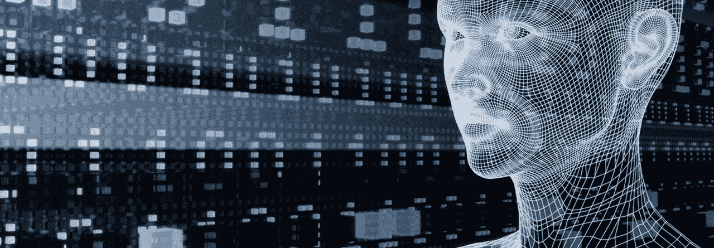
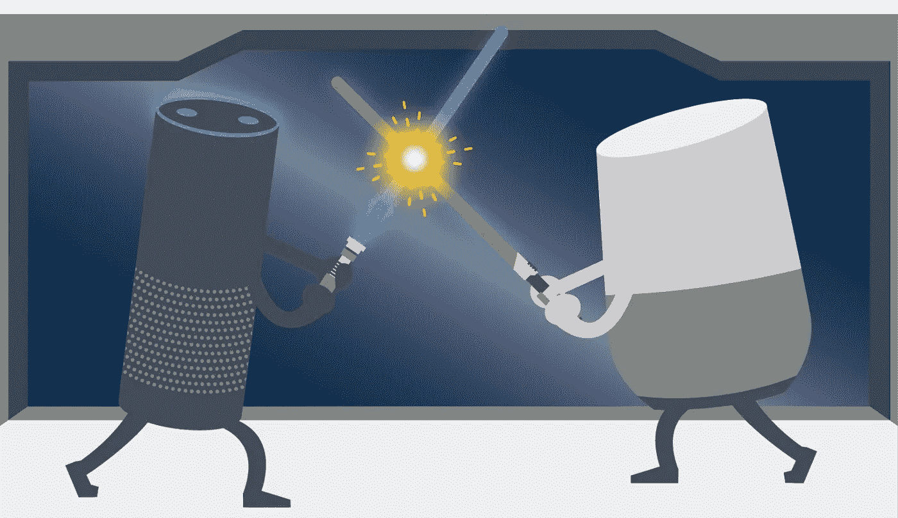

# 人工智能在今天处于什么地位？

> 原文：<https://medium.datadriveninvestor.com/where-does-ai-stand-today-a55805327eab?source=collection_archive---------19----------------------->

**“总有一天，计算机会给出错误的答案，以免伤害他人的感情，人类将发明人工智能”**

**——罗伯特·布劳特。**

上面的引述预测了人类发明人工智能的时间，这确实是当他能够让机器有意识，能够思考，推理，反应，最重要的是有情感的时候。虽然自人工智能这个术语出现以来，人类已经走过了漫长的道路，但仍然有很长的路要走。根据专家在最近一次人工智能会议上的调查，2050 年被认为是人工智能能够做人类在历史上做过的任何智力工作或基本上能够像人类一样思考的一年。

虽然看起来很遥远但是 AI 的现状还是比较令人满意的。科技界出现了一股人工智能热潮。像谷歌、微软、IBM、亚马逊和脸书这样的科技巨头是开发和研究该领域各个学科的主要利益相关者。他们开发了技术和工具来帮助人类理解复杂的问题，支持决策并发展人工智能的场景。在过去的 5 年里，人工智能领域有了巨大的发展。已经进行了许多新的发明和实验，使计算机能够解决一些以前不能解决的最复杂的问题。

其中一个例子是一个古老的中国棋盘游戏围棋，它非常复杂，每一步都有几乎无限种可能的走法。在 2017 年早些时候的未来围棋峰会上，当谷歌 DeepMind 的人工智能程序 AlphaGo 连续 3 场击败排名第一的围棋选手柯洁时，所有人都惊呆了。考虑到早期无法破解的游戏的复杂性，这场历史性的胜利被认为是人工智能领域的一个里程碑，特别是对于被称为深度强化学习的技术。AlphaGo 在最后一场比赛后退役，而 DeepMind 则继续研究现代领域中需要机器学习的其他挑战。

**AlphaGo Competing With LEE SEDOL**

同样，IBM 的 Watson 自上次在 Jeopardy 上获胜以来，每天都在给我们带来惊喜。今天，沃森可以理解所有形式的数据，与人自然互动，并进行大规模学习和推理。它正被用于利用机器学习的力量来发展商业智能、天气预报、教育、政府部门以及医疗保健领域的主题专业知识，在这些领域中，它能够诊断几种类型的癌症疾病，并且它还帮助专家创造有效的药物。

另一方面，人工智能的应用日益增加和完善，虚拟助手如苹果的 Siri、亚马逊的 Alexa 和谷歌助手等在日常生活中帮助我们，同时学习和增长他们的知识库。同样，自然语言生成和语音识别比以往任何时候都更好，现代人工智能工具和程序可以识别许多语言，说它们，并比人类专业人员更好地转录语音。他们可以通过情感分析准确识别语音中的情感。

**Amazon Alexa Vs Google Assistant**

此外，机器和深度学习平台结合云正在推动当前的场景，并在广泛的企业和其他应用中使用，主要涉及预测或分类。现在，很容易在庞大的数据集中找到模式，并使用它们来学习，然后将知识融入每个领域，无论是商业、教育、安全、金融、农业、博彩业、科学、医学，甚至是创作音乐、写书或诗歌。

最后，因为凡事都有利弊。尽管人工智能有所有积极的方面，但仍然有人担心它会接管人类或将其自身用于人类无法控制的破坏性目的，考虑到这种可怕的可能结果，OpenAI 等组织正在致力于开发一种友好的人工智能，并旨在发现和制定安全的人工智能之路，以便它对整个人类有益。

**结论:**

如果我们把现在的状态称为 AI 的黄金时代，也不会错。这是人工智能领域研究、实验、创新、进步、成就和突破的时代。有了这些显著的成功，我们离创造完美的人工智能还很远，但未来的道路正在被铺就，预计到 2025 年左右，人工智能将在很大程度上影响我们的日常生活。