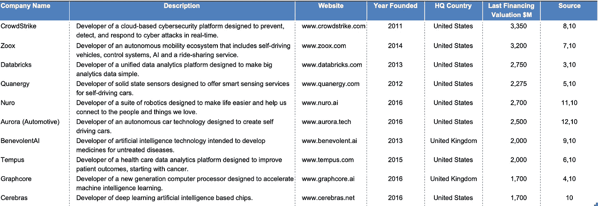
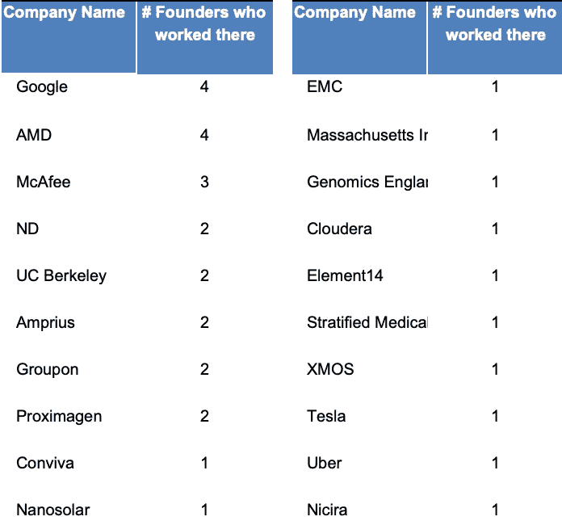
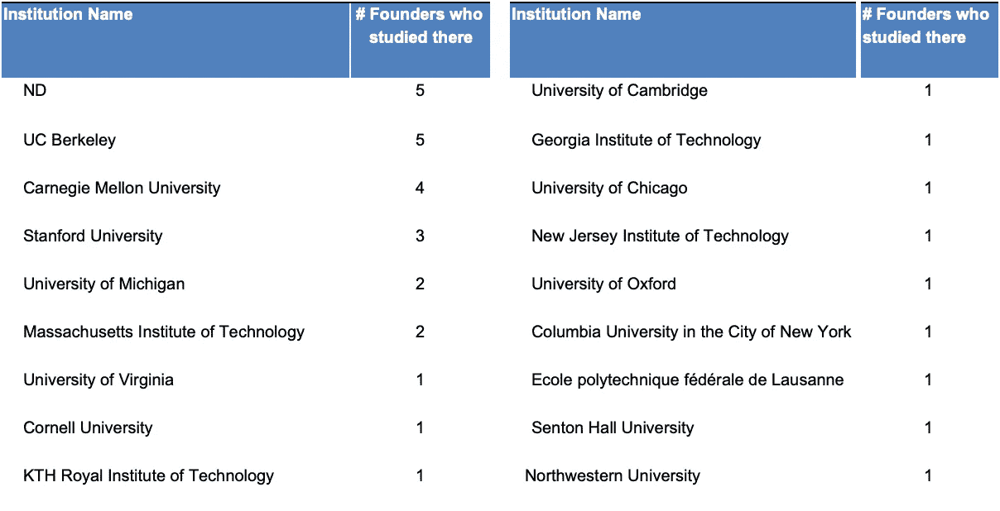

# 卓越的人工智能初创公司的想法和创始人来自哪里

> 原文：<https://medium.datadriveninvestor.com/where-ideas-and-founders-of-exceptional-ai-startups-come-from-2cbe35d38ecf?source=collection_archive---------12----------------------->

## 回顾 10 家创业公司及其创始人

> 聪明是一件美妙的事情，你永远不应该有其他想法，也永远不应该停止这种想法。但是，随着年龄的增长，你会发现，世界上还有几十亿人同时在努力变得聪明，你一生中所做的一切肯定会付诸东流——淹没在海洋中——除非你和志同道合的人一起努力，他们会记住你的贡献并发扬光大。
> 
> 尼尔·斯蒂芬森的《钻石时代》。

***

在想要成为企业家的人面临的各种挑战中，找到联合创始人和找到创意本身可能是最痛苦的挑战；即使这些问题被[投资者](https://firstround.com/review/Looking-for-Love-in-All-The-Wrong-Places-How-to-Find-a-Co-Founder/)和[更广泛的](https://www.quora.com/What-are-some-good-ways-of-finding-a-cofounder) [社区](https://news.ycombinator.com/item?id=653655)多次提出，我觉得提供一个额外的分析视角可能是有益的。

***在这篇文章中，我分享了对十家最昂贵的人工智能(AI)初创公司*** (图 1)创始团队背后传记的探索。具体来说，我关注的是这些团队是如何走到一起的，以及他们是如何做到他们正在做的事情的。

我希望这篇文章能帮助数据科学家、研究人员和其他技术人员找到更好地了解自己和找到志同道合的人的方法。

***Chart 1\. AI companies with the highest valuation. Europe, US, Israel, privately held companies founded since 2010*.***

研究 33 位个体创始人的传记让我得出了以下理解——***尽管大肆宣传，一家人工智能初创公司并不是一夜成功，而是在追随激情的漫长道路上的一个关键点*** 。几个轶事证据可以支持这一点:

*   ***33 位创始人中有 30 位已经在与他们之前工作相似或相近的领域创办了一家初创公司*** 。例如， [Aurora](https://aurora.tech) 的三位联合创始人参与了谷歌、优步和特斯拉的自动驾驶项目。脑波强化器的四名创始成员在芯片制造商 AMD 工作。在创办自己的网络安全公司之前， [CrowdStrike](https://www.crowdstrike.com) 的联合创始人在 McAfee 工作多年；
*   在 22 名联合创始人[1]， ***中，有 20 人从获得学士学位到创办最后一家创业公司*** 花费了超过 5 年的时间。

从外部角度来看，选定的人工智能初创公司的创始团队似乎不是随机的个人群体，而是这些 ***团队是一群自然相遇的人*** 。在 3 家创业公司的情况下，至少有两名联合创始人在同一所机构学习，在 8 家创业公司的情况下，至少有两名联合创始人在创办公司前在同一家公司工作。例如， [Quanergy](https://quanergy.com) 的联合创始人在 Amprius 工作， [Nuro](https://nuro.ai) 的联合创始人在谷歌工作，而 [Databricks](https://databricks.com) 的联合创始人在加州大学伯克利分校学习(图表 2、3)。

**Chart 2\. Company where an AI startup founder worked or co-founded before launching a startup.**

*团队在业务/商业专业知识方面似乎很均衡，通常包括 2-3 人。10 家创业公司中，只有 4 家没有商业联合创始人[2]。即使是这四个人，也大多是通过以前担任管理技术职务的人来弥补纯商业联合创始人的缺失，例如，首席技术官或副总裁。*

**

***Chart 3\. Institution where a founder obtained the most advanced degree.***

*根据我在风投基金工作期间和准备这项研究期间所见所闻， ***我可以概括出几件事*** :*

1.  *如果你找不到创业的想法， ***探索你长期的激情，一些你在工作/研究/教育期间一直喜欢做的事情*** 。 ***或者，你也可以看看改变人生的事件*** 。例如，Tempus 的联合创始人受到了[的激励](https://en.wikipedia.org/wiki/Tempus_(business))根据所爱的人接受癌症治疗的经历开展业务；*
2.  ****找联合创始人，要通过和你有过共同经历的人*** ，比如，你们在同一家公司工作过，研究过同样的主题，在同一家机构学习/工作过。或者，利用你的人际网络，寻求推荐人。以[为例](https://www.bloomberg.com/news/features/2018-07-17/robot-taxi-startup-zoox-has-800-million-and-a-wild-pitch)，Zoox 的联合创始人是在其中一人通过相互联系被另一人引用后相遇的；*
3.  *不要低估商业/商务专业知识 ，即使是最杰出的工程师/研究人员似乎也会与同样才华横溢的商务人士合作，或者至少他们自己会获得管理经验。*

**在我的研究中，我重点分析了来自欧洲、美国和以色列的人工智能公司，这些公司仍然是私有的，成立于 2010 年。因此，我想出了这个名单，它不同于 CB Insight 的[名单](https://www.cbinsights.com/research/artificial-intelligence-top-startups/)。这 10 家公司是由 33 个人创立的，我研究了他们的公开简历。*

*不包括其他地区公司的原因纯粹是缺乏数据。为了帮助想成为创始人的人，我也只关注最近成立的公司，它们都是在或多或少相似的社会经济背景下成立的。我选择 2010 年作为截止日期，因为退出一家初创公司大约需要 5-8 年，我想涵盖那些正在退出的初创公司。见统计:[https://venturebeat . com/2017/05/19/VC-investing-still-strong-even-as-median-time-to-exit-reaches-8-2-years/](https://venturebeat.com/2017/05/19/vc-investing-still-strong-even-as-median-time-to-exit-reaches-8-2-years/)*

*[1]33 人中有 22 人有毕业年份的数据。*

*[2]曾担任商业/企业职位的人。*

*[3][https://www . crunchbase . com/funding _ round/databricks-series-e-037705 FB # section-overview](https://www.crunchbase.com/funding_round/databricks-series-e--037705fb#section-overview)*

*[4][https://www.crunchbase.com/funding_round/graphcore-series-d-b 2884 BC 3 #剖面图-概述](https://www.crunchbase.com/funding_round/graphcore-series-d--b2884bc3#section-overview)*

*[5][https://www.crunchbase.com/funding_round/quanergy-series-c-9f 910 a 75](https://www.crunchbase.com/funding_round/quanergy-series-c--9f910a75)*

*[6][https://www.crunchbase.com/funding_round/tempus-3-series-e-f 65601 b 6 #剖面-锁定-图表](https://www.crunchbase.com/funding_round/tempus-3-series-e--f65601b6#section-locked-charts)*

*[7][https://www.crunchbase.com/funding_round/zoox-series-b-351 bc54f #剖面锁定图](https://www.crunchbase.com/funding_round/zoox-series-b--351bc54f#section-locked-charts)*

*[8][https://www . crunchbase . com/funding _ round/crowd strike-series-e-649 D5 ed 0 # section-overview](https://www.crunchbase.com/funding_round/crowdstrike-series-e--649d5ed0#section-overview)*

*[9][https://www . crunchbase . com/funding _ round/benevolent-ai-disclosed-07 acad 77 # section-overview](https://www.crunchbase.com/funding_round/benevolent-ai-undisclosed--07acad77#section-overview)*

*[10]宣传手册*

*[11]【https://www.crunchbase.com/funding_round/nuro-2-series-b f7ca 85 b 0 #剖面图-概述*

*[12][https://www . crunchbase . com/funding _ round/aurora-6292-series-b-0a 02d 840 # section-overview](https://www.crunchbase.com/funding_round/aurora-6292-series-b--0a02d840#section-overview)*