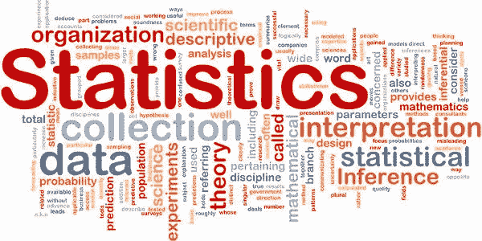

# 数据科学中统计学用在哪里？

> 原文：<https://medium.datadriveninvestor.com/where-is-statistics-used-in-data-science-adff66141808?source=collection_archive---------16----------------------->

如果你是一个数据科学的新手，第一次学习编程，当你知道你的第 12 个标准和学士学位中的数学再次被用于数据科学时，你会觉得很奇怪！！！(对我来说就是这样的感觉)。我对数据科学有一个模糊的概述。我过去常常想我应该在哪里使用数学，我不知道确切的数字。如果你也觉得这篇文章适合你。

今天我将写统计在数据科学工作流程中的确切位置。在我看来，统计占了 30-35%甚至更多。因为在数据科学或分析中，理解问题是最重要的。如果你想建立一个 DS 模型，你需要我正在做的数学的基础知识，或者数学的哪一部分，如果你在任何两个概念之间建立联系，相关性(统计)是有用的，或者当评估客户是否点击广告时，我们使用概率等。

所以 DS 模型在工作流程的每一步都需要数学。

我将讨论在 DS 问题中使用统计的情况。

**情况 1** :

广告 1 的点击率比广告 2 高(比如当两者都在做类似的广告时)。

可以使用统计数据来确定点击率的差异是否影响访问网站的 AD 2 对 AD 1 客户、流量、未来方面等。

由于实验结果引起的问题，例如当使用不同的度量标准时，辛普森悖论问题的出现等，可以通过使用统计学来避免。

在上述问题中，我们使用实验测试、假设检验、置信区间。

**情景二:**

当公司上一年和本年度的收入减少时。

统计告诉你低收入背后的原因是什么。它帮助你了解销售行为、趋势和预测未来结果，试图增加收入。

在上面的例子中，数据应该足够可观，足以做出洞见(越大越好)。

这里我们使用回归、分类等方法。

**情景三:**

把原始的海量数据变成熟而简单的数据。

假设一家公司有 100 万客户，购买不同类型的产品(比如 10 万种)，可以使用统计数据来确定或标记每个人的口味，对他们进行分组，采取可能的步骤让客户购买该产品，并推荐产品。我们还会关注顾客的情绪，并提出好的建议。

这里我们使用聚类、降维、主成分分析等等

**情况四:**

你计划推出一个销售商品的网站。您想知道谁是您的目标客户，或者您现在已经打开了网站，但是已经购买过一次的客户不会再访问您的网站。你想知道如何吸引顾客或引诱他们购买你网站上的产品。

在这里，我们使用统计数据来估计问题，风险和预算分配等为您的公司。

统计概念(如回归、分类)用于估计结果，聚类、降维、因果效应分析、潜在变量分析用于客户标记、参与、保留等，协作过滤可用于推荐。

**情况五:**

使用以前的数据预测结果，这是任何商业模式中最重要和最关键的步骤之一。

这里我们使用统计模型，如预测模型。深入了解数据。

*俗话说“数据科学是数据和公司之间的桥梁”*。

我们利用统计学的力量来构建见解、预测、估计和可视化数据。

以上是一些使用统计的情况。拥有编程知识、数学知识、数据理解能力、理解商业模式和一般知识，就构成了一名优秀的数据科学家。

我希望这能澄清你的一些疑惑。

物品:)

如果你想合作任何开源项目或出版期刊，我们也正在为数据科学爱好者建立一个新的网站，如果你感兴趣的话

请寄到 francisvikramsagar@gmail.com 给我。

# DDI 特色数据科学课程:

*   [**用于数据科学的 Python**](http://go.datadriveninvestor.com/intro-python/mb)
*   [**深度学习**](http://go.datadriveninvestor.com/deeplearningpython/mb)
*   [**数据可视化**](http://go.datadriveninvestor.com/datavisualization/mb)

**DDI 可能会从这些链接中收取会员佣金。我们感谢你一直以来的支持。*