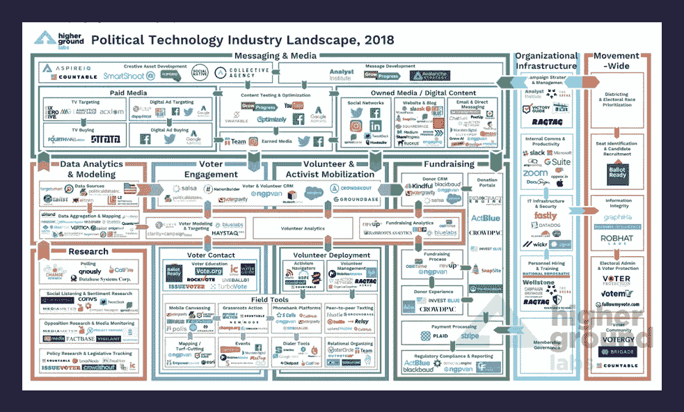
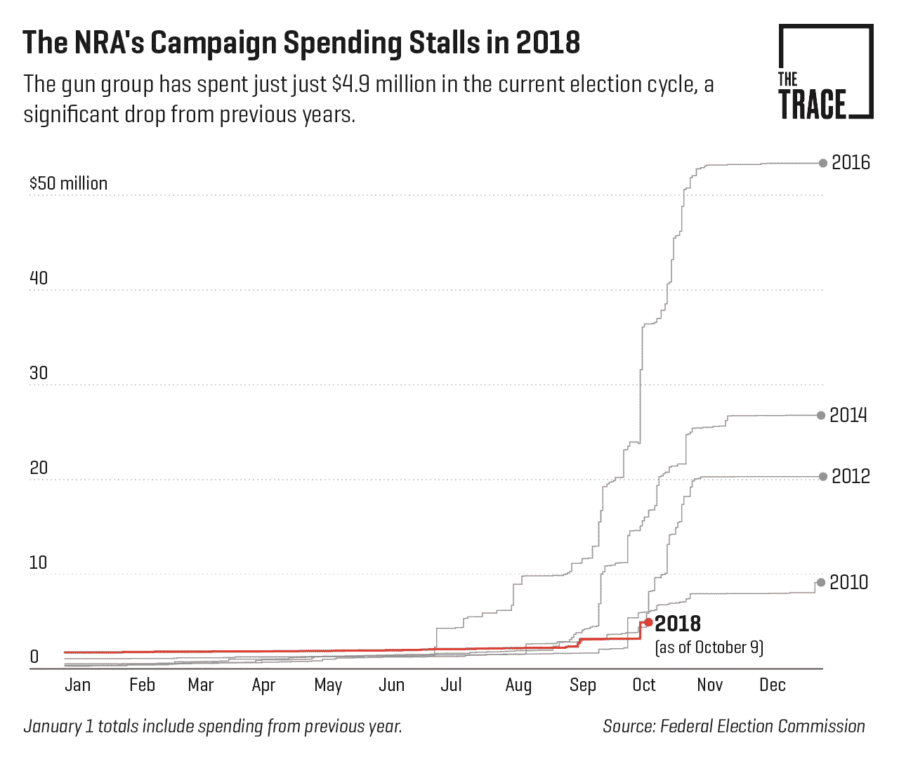
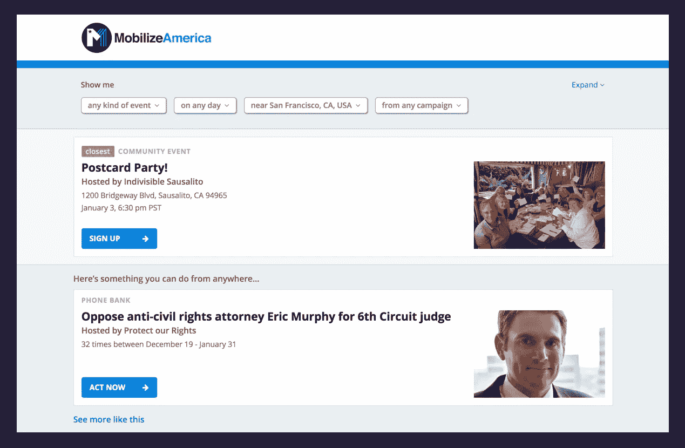
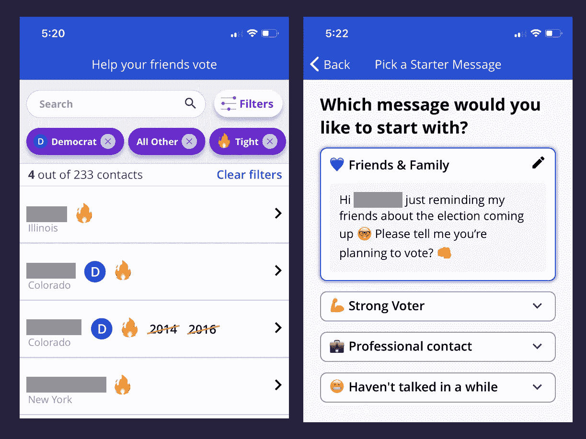
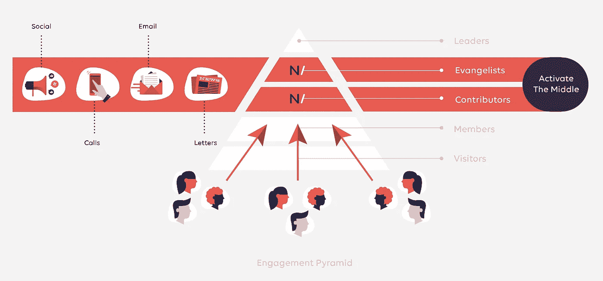

# 政治中的“黑仔 App”在哪里？

> 原文：<https://medium.datadriveninvestor.com/where-is-the-killer-app-in-politics-b1655a0474ea?source=collection_archive---------5----------------------->

2018 年的结束标志着我开始在“政治技术”领域工作 18 个月:通过一系列小型志愿者项目，与 [Amplify](https://getamplify.org/) (一款[不可分割的](https://indivisible.org/)团体用来协调行动的应用程序)，目前在 [Hustle](http://hustle.com/) 担任设计师。在离开 Quora 的时候，我很兴奋地将我所知道的关于消费产品开发的知识应用到政治领域，在我们的 [有生之年](https://twitter.com/reason/status/1059466376270639105)最重要的 [选举](https://twitter.com/HarleyRouda/status/1059161371575693312)[之前。](https://twitter.com/washingtonpost/status/1059479006473580544)

在那段时间里，我了解到政治空间具有独特的属性，这使得传统的“消费技术剧本”很难运作。在这篇文章中，我将探索其中的一些属性，以及我所见过的在这个领域做着最有趣工作的产品。

但首先，我所说的“消费技术剧本”是什么意思？简而言之，我认为最好的面向消费者的产品是由以下因素构成的:

*   专注于人们喜欢重复和频繁进行的核心活动(例如在 Instagram 上发布照片)
*   跟踪关键参与度指标
*   对什么会让人们做更多的活动提出假设
*   运行实验来测试假设，并了解是什么推动了关键指标
*   启动足够多的成功实验，实现用户参与度的指数级增长

从高层次上来说，这是每一个成功的消费者互联网产品开始和成长的方式。

然而，尽管近年来(特别是自 2016 年 11 月以来)在政治领域进行了大量投资，但没有一款专注于政治或问题行动主义的面向消费者的产品取得突破性成功。

需要明确的是，有许多雄心勃勃和令人兴奋的政治技术正在建立，对政治进程的许多部分产生了巨大的影响。[Higher Ground Labs portfolio](https://www.highergroundlabs.com/portfolio/)中充满了这些公司，他们刚刚发布了一份令人惊叹的概述，展示了这个领域正在发生多少活力和创新:

[https://www.highergroundlabs.com/updates-1/2018-landscape-analysis-report](https://www.highergroundlabs.com/updates-1/2018-landscape-analysis-report)

我并没有从这些公司令人难以置信的工作中吸取任何东西，我感兴趣的是探索为什么很少有像过去十年那样在消费者中取得突破性成功的公司——脸书、Twitter、Instagram、Pinterest 等。

以下是我对原因的理论:

## 政治是周期性的。

大多数人对政治的关注和兴趣，尤其是 2016 年以来，都集中在联邦层面。(补充说明:这是一个遗憾，因为在州和地方层面会产生巨大的影响。)联邦选举每两年举行一次，在这两年的周期内，大部分精力都集中在选举前的最后几周:

I hate the NRA, but they know how to influence elections. Source: [https://www.thetrace.org/2018/10/nra-spending-decrease-2018-midterm-elections/](https://www.thetrace.org/2018/10/nra-spending-decrease-2018-midterm-elections/)

因此，在两次选举之间还有大约 20-22 个月的时间，大多数普通人不会太关注政治。这个休耕期使得建立和发展产品循环变得很有挑战性，原因如下:

最大的问题是**没有足够的人去做。**在非周期年份，即使是最热衷于政治的人也没有多少发泄激情的渠道。两个最好的选择，以及那些催生了最成功的政治技术的选择，是联系立法者([5 呼吁](https://5calls.org/)、[不可分割](https://indivisible.org/campaigns)、[放大](https://getamplify.org/))和捐款( [ActBlue](https://fivethirtyeight.com/features/how-actblue-is-trying-to-turn-small-donations-into-a-blue-wave/) 、 [Swing Left](https://swingleft.org/) 、[flipped](https://flippable.org/))。虽然这些非常有影响力，非常值得做，但它们没有提供在 Instagram / Twitter / etc 上采取行动所提供的令人上瘾的反馈回路。一个理想的反馈回路在你的行动和反馈之间有一个清晰的联系，并且反馈会很快出现。无论是打电话给立法者还是捐款都没有提供明确的反馈(“我的电话说服黛安·范斯坦在这个问题上更强硬了吗？”)即使有，也往往会延迟几周或几个月。

我见过的解决这个问题的最好方法之一是 [MobilizeAmerica](https://www.mobilizeamerica.io/) ，他们聚集了许多问题和组织的机会，并提供了许多产生影响的方式:电话银行、短信银行、写明信片、活动出席、选民登记、社区会议等等。我认为任何成功的产品都需要这种多样的行动机会。

几乎与缺乏吸引用户的循环一样糟糕的是**缺乏对产品团队的良好学习反馈**。如果一家公司希望采用数据和假设驱动的方法来进行产品开发，他们需要一组用户和系统内行为的数据来开始运行实验。非周期政治行动的缺乏导致很少有机会来测试提高参与度的理论。

在 Amplify，我们有无数的想法来增加采取政治行动的人数:来自志同道合的活动家的社会反馈、团体挑战和成就、确定政治上不活跃的朋友等。像任何头脑风暴列表一样，这些想法中的大多数都不会起作用，希望有些会起作用。但是，由于小用户群的反馈周期很长，距离关键选举还有几个月，我们几乎没有机会测试我们的假设。这尤其令人困惑，因为我们有一个不错的小型政治初创公司的用法:3000 MAU，使用该应用程序给他们的立法者打电话，计划会议，并在特别选举中向选民发送明信片。然而，即使这样也不足以给我们统计能力去做真正的数据驱动的产品开发。(这确实让我们嫉妒 AirBnb，他们在 2014 年运行了 [500 个并发实验](https://medium.com/airbnb-engineering/https-medium-com-jonathan-parks-scaling-erf-23fd17c91166)。

## 政治谈话很尴尬。

过去十年中，大多数成功的面向消费者的社交产品都有非常简单的机制(如评论、转发)和默认公开的内容(Twitter、Instagram、Reddit、Quora、Pinterest)。这些决定有很多好处，既简化了系统动态的设计，也增加了每条附加内容的增长潜力。

不幸的是，政治是出了名的敏感话题。特别是在我们 2016 年后，高度部落化，一切都是政治的世界，很难就政治进行建设性和情感安全的对话。(作为证据，见证家庭手工业的文章谈[如何向](https://qz.com/quartzy/1135399/thanksgiving-how-to-constructively-talk-politics-with-your-family/) [倾诉](https://www.nytimes.com/2018/10/30/smarter-living/the-edit-parents-politics.html) [与](https://www.uscatholic.org/articles/201808/talk-politics-dinner-table-31464) [贵](https://www.washingtonpost.com/) [家](https://www.harpersbazaar.com/culture/politics/a25221603/thanksgiving-dinner-conversation-how-to-talk-to-family-about-politics/) [谈](https://www.cnn.com/2016/11/22/health/thanksgiving-holiday-conversation-survival-guide-trnd/index.html) [政](https://www.bustle.com/p/how-to-talk-about-politics-with-your-relatives-over-the-holidays-without-fighting-13154694)。)这对政治技术意味着什么？设计一个以政治言论和行动为中心的面向消费者的产品需要系统设计中大量的微妙之处。

这是我见过的最有趣的政治应用之一的一个例子，[和我一起投票](https://votewithme.us/):你上传你的电话簿，应用扫描选民文件，找出最近没有投票的联系人，然后你鼓励他们投票:

Friend #3 in the list is a registered Democrat in a tight race in Colorado, but didn’t vote in 2014 or 2016.

如果一个产品可以帮助我让朋友#3 在中期选举中投票，它已经产生了难以置信的影响。我尝试过开发一款产品来做到这一点，我可以自信地说，Vote With Me 在这个想法上有很好的执行力。

然而……创造和扩大这种互动的影响还有很长的路要走:在我上面的例子中，数据不是很好。我知道朋友#1 已经很多年没有在伊利诺伊州居住了，所以现在我很担心朋友#3 是否真的在科罗拉多州注册。即使他们是，我已经很多年没有和朋友#3 说过话了，所以突然给他们发短信让他们投票是一件非常奇怪的事情。建议的文本是令人愉快的非指责性的，但我不确定我是否有足够的勇气这样做。即使我给他们发了短信，他们为缺乏公民参与而道歉，并承诺在 2018 年投票，我如何才能在我的产品中建立一个病毒式增长循环？我不太可能在公共 feed 上说“Joel 说服了朋友#3 投票，尽管他们自 2012 年以来就没有投票”(公开羞辱不是产品主要内容的理想基础)，这意味着我刚刚经历的所有工作都没有积极的社会强化。我喜欢 Vote With Me 正在做的事情，但不要羡慕他们在扩展这种产品体验方面的挑战。

尽管有这些社会障碍需要克服，但 Vote With Me 已经取得了初步的成功——在 Conor Lamb 特别选举中增加了 2.4%的投票人次。诸如此类的经历让我乐观地认为，出色的执行力和专注可以打造出一条应对政治社会挑战的道路——但这需要娴熟的技巧和同理心。

## 基层组织是一项艰苦的工作。

经验丰富的活动家(我对他们永远心存敬畏)经常谈论参与金字塔，即人们开始参与行动主义的过程:

Source: [https://www.newmode.net/targeted-engagement](https://www.newmode.net/targeted-engagement)

一个杀手级政治应用的愿景是“让任何人都更容易靠自己爬上参与度的金字塔。”这可能看起来像:让人们接触他们关心的问题，与他们相信的组织发展联系，提供一种简单的方法来采取轻量级的行动，开始扮演更积极的领导角色，向他们的社区和其他地方宣传这项事业。

问题是:这很难做到！几十年来，社区组织者一直在开发如何有效地做到这一点的技术和剧本，这需要大量的知识和亲密的人际交流。当我已经模拟出一个产品架构可能如何开始捕捉这个旅程时，这是令人畏惧的:金字塔的每一步都被命名和描述；用户通过完成关键动作达到一定地位，公开向金字塔上移动；晋升后，他们被授予与金字塔底层的人接触的权限；等等。这开始感觉像是一种说教和自上而下的强加，通常是一个流动和人为驱动的过程。

我开始相信，更有效的方法是授权组织者执行他们现有的剧本。这也是我如此相信忙碌有潜力影响世界真正变化的原因之一。(抱歉自我推销，我保证很快就结束了。)我们的短信交流工具帮助我们的客户(如[计划生育](https://www.hustle.com/customer-stories/planned-parenthood-federation-of-america)、[塞拉俱乐部](https://www.hustle.com/customer-stories/sierra-club)、[苏珊·g·科曼](https://www.hustle.com/customer-stories/susan-g-komen))做他们已经在做的工作，帮助建立推动运动的关系。我们从根本上相信，组织最了解他们自己的问题、社区和影响计划。我们制造的产品通过授权组织者和志愿者与人交流来帮助他们实现目标，而不是强加我们自己对正确工作方式的看法。

我希望“自助社区组织”的一个版本有一天可以激励新的活动家，而不需要干预——当一个团队发现如何释放这种潜力时，我会印象深刻！

在这个领域工作的 18 个月中，我受到了无数人在“公民技术”领域所做的工作和创新的启发，在我来到这里之前，这个领域已经蓬勃发展了许多年。上面的列表绝不是完整的，没有什么是不可能的挑战。我希望阅读这篇文章的目的是:与其他来自消费者世界的技术专家就如何最好地利用我们的技能来改变世界展开对话。