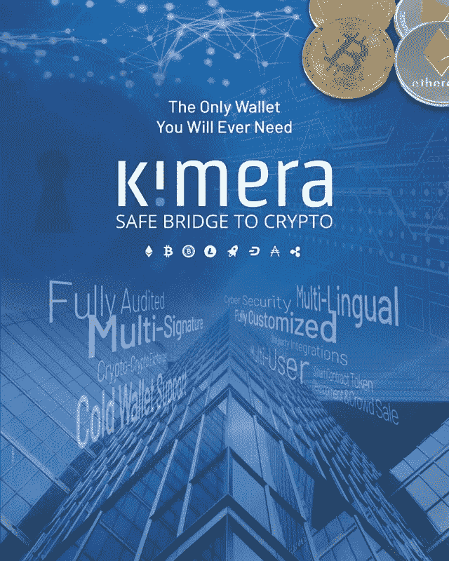

# 医学成像、区块链和大数据相遇的地方

> 原文：<https://medium.datadriveninvestor.com/where-medical-imaging-blockchain-and-big-data-meet-c0446d7ac46?source=collection_archive---------27----------------------->

医疗领域产生了大量的数据。数据的主要部分以可视数据的形式呈现，带有或不带有医学遥测和元数据。今天，大多数手术和医疗程序都是根据专业医疗设备产生的可见光文档记录的，一直到 ad-hock 解决方案。

因此，越来越多的消费者寻求访问这些记录的数据，首先是医疗数据本身，其需求主要在医疗 QA、研究和医学法律层，最后是作为学术和信息共享要求的一部分共享数据。

大中型实体正在寻找这些数据，主要是为了获得大数据、深度学习和分析。像谷歌这样的实体(动词外科，脸书，美敦力等。)正在协商并正在获取尽可能多的成像数据。

这个自然的、自我创造的生态系统还没有回答基本的商业模块定义:谁拥有数据，谁需要向谁付费，付费多少；谁掌握信息，谁将从生态系统循环中受益。

 [## 正在改变行业的 5 个真实世界区块链应用——数据驱动的投资者

### 除非你一直生活在岩石下，否则我相信你现在已经听说过区块链了。而区块链…

www.datadriveninvestor.com](https://www.datadriveninvestor.com/2019/02/13/5-real-world-blockchain-applications/) 

# 为什么是“区块链”？

使用区块链在节点之间交换医学成像的原因如下:

***加密数据***

区块链上的数据是加密的，无法破解。事实证明，数据是安全的，不会被传送到不需要的目的地。

***快速交易层***

区块链上的所有“块”都在快速网络层上复制和广播。在以太坊区块链上，一笔交易在不到 20 秒的时间内在活动节点内得到完全确认。

***经济型工作流程***

区块链定义了经济生态系统的严格规则。它为参与者提供了根据经济规则支付代币(硬币)或接受硬币的选项。例如，向区块链投稿(发送医学图像)的医生将在另一名医生使用/观看该内容时收到一个令牌。然后，这个医生可以使用他收到的令牌来观看另一个医生的内容。

***分布式应用***

区块链的灵魂依赖于分布式环境，例如，不需要中央服务器。每家希望“加入”的医院都将安装一个简单的区块链节点应用程序，并自动加入区块链的基础设施。这样，我们就有了区块链数据库的副本，不需要冗余系统和/或备份数据。

# 一个想法

这里提出的想法是定义一个在全球范围内医院之间交换医学影像的严格规则。提议的系统将使用区块链基础设施来定义医院和内部消费者之间的信息交换，并定义医疗内容提供商和消费者的经济用途和回报。

***生态系统的参与者***

将有三种类型的参与者:节点，它实际上是医院或任何其他愿意贡献内容并为共享的内容赚取报酬的设施。在某种程度上，参与不仅限于医院。它面向希望提供信息的任何其他医生或医疗内容提供商。要成为区块链的一个节点，你所要做的就是下载一个节点应用程序，并在一台连接到互联网的计算机上激活它。成为节点的好处是有机会在挖掘(确认)区块时赚取一些硬币或代币——否则每个内容提供商都可以通过第三方前端接口连接到区块链。

第二个参与者是“超级节点”——超级节点实际上持有内容。它是互联网(或专用网络)上的一个简单的中央服务器，将存储内容，无论是图像、文档还是视频。通过从内容创作者的使用费中获得一部分费用，每个超级节点因其保存的每条内容而得到奖励。超级节点将很可能被托管在云上，每个内容项都被视为区块链内的数据事务，这意味着用公钥加密。

第三个参与者是最终用户。这结合了两种类型:内容提供者和内容消费者。通常，内容消费者为每个消费的内容向内容提供商付费。典型的内容提供者是医务人员、医生、内科医生、医院、医疗机构、研究人员等。典型的内容消费者是医务人员、医生、内科医生、研究人员、大数据消费者等。

# 货币铸造

使用区块链的主要目的是定义服务货币化的规则。流程将是这样的，内容提供商为他们消费的内容付费。每个内容参与者将不得不花费初始数量的硬币，以便将内容发送到区块链或者观看它(消费)。节点(通常为医院所有)将从交易费用中获得奖励，超级节点将从内容提供商获得的部分付款中获得奖励。

***内容提供商规则***

要成为内容提供商，您必须激活一个节点，或者使用互联网上存在的任何上传程序接口连接到外部节点。要成为内容提供商，您必须具备以下条件:

要分发的内容–内容可以是以下任何内容:

*   医学成像:静态图像、视频、放射成像
*   病历格式:PDF、EMR
*   内容元数据—内容的医学描述
*   为了发送数据而花费的硬币(或代币)。该金额是以下各项的组合:

1.  交易费—取决于内容的大小
2.  存储费用—取决于内容到期前的时间段

将由内容消费者支付的“内容使用价格”的定义，将是以下内容之一:

*   按次付费(PPV)金额
*   根据天数，定期支付租金
*   支付终身租金

***内容消费规则***

要成为内容消费者，您只需使用网络上的索引器界面浏览可用内容，并获取所需内容。为此，您必须拥有以下物品:

*   足够的硬币(或代币)可在以下选项中查看:
*   按次付费(PPV)
*   支付租金—取决于此内容被租用的天数
*   永久支付-实时视图的租金
*   足够支付交易费的硬币(或代币)

总的来说，生态系统定义了规则，但没有定义谁是用户。内容提供商也可以是内容消费者，反之亦然。支付流来自内容消费者，并在超级节点和内容提供商之间分配。

规则不能改变，但金融货币化可以改变，它通常由用户定义——生态系统实际上由支付特定内容的能力和内容提供商定义的支付金额来定义。太贵的内容将不会被消费，而其他不太贵的内容将被消费，从而使内容提供商受益。内容中还存在与医疗质量和独特性相关的依赖性，因为更独特的内容价值更高，而其他内容将按标准费率收费。在存储有效期内不能更改成本，只能在过期后用新成本重新分配。

通过奖励节点所有者和超级节点所有者来平衡生态系统。奖励为拥有节点或超级节点的节点运营商提供了激励。实际运营并拥有一个节点的医院可以在内部将奖励的硬币(或代币)分发给使用该生态系统的医生。

# 关于正在使用的令牌

这个区块链是基于定义和目标的效用令牌，主要是为了开始使用生态系统。任何用户，无论是内容提供商还是消费者，都需要有初始币来消费。初始硬币在初始基础上提供给潜在用户。具有初始金额的 genesis 区块将在稍后决定，并将在 ICO 前销售时首次提供。它将在稍后的以太坊区块链进行部署，并在大众销售阶段进行购买。ICO 结束后，所有令牌都将被转移到私有区块链，供购买令牌的用户使用。

硬币(或代币)最终将有其法定价值和转换，并将在标准交换设施中进行交换和交易。

硬币(或代币)持有者的利益显然是通过以下方式定义的:

*   使用—为观看内容付费
*   交易——基于固定价值

这是医学成像、区块链和大数据交汇的地方。

本文作者是 Kimera 网站的联合创始人和所有者