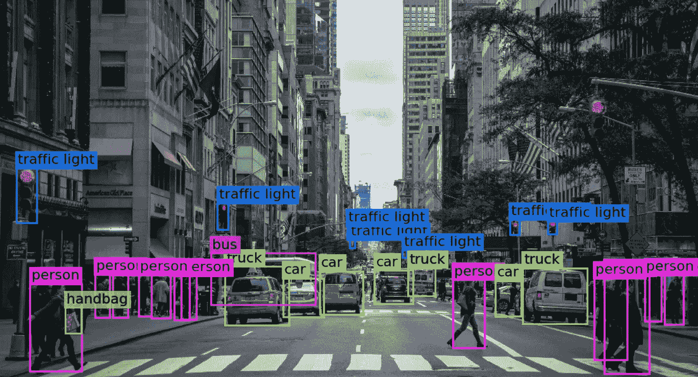
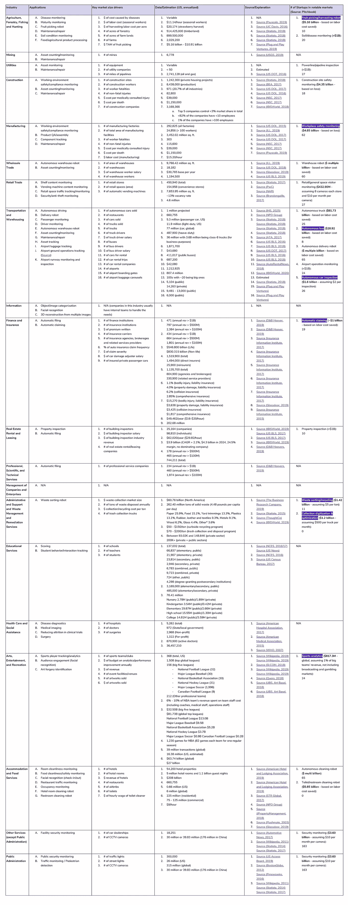

# 计算机视觉初创公司的下一步投资方向

> 原文：<https://medium.datadriveninvestor.com/where-next-to-invest-for-computer-vision-startups-9535ed632230?source=collection_archive---------2----------------------->

YOLO Multi-Object Detection And Classification ([Source: Towards Data Science](https://towardsdatascience.com/everything-you-ever-wanted-to-know-about-computer-vision-heres-a-look-why-it-s-so-awesome-e8a58dfb641e))

随着计算机视觉几乎成为一种“商品”技术，这一领域的初创公司不再能够凭借基础技术(或算法/性能的一点点改进)建立高市场壁垒。相反，选择正确的应用程序并快速上市将成为创业公司在这一领域的优势。因此，当投资者基于计算机视觉技术评估机会时，市场规模和竞争水平成为首先要问的问题。

这项研究的目的是**确定计算机视觉技术**的应用**，其特定市场尚未饱和，但仍然足够大**。

**假设:**

1.  基本的计算机视觉技术几乎是一种商品。因此，公司将很难使用基于价值的定价模式。相反，公司更可能使用市场定价模式，即基于竞争的定价模式。
2.  大多数计算机视觉公司将直接为企业而不是个人服务。因此，更有可能的是，公司将按帐户而不是按使用量收费。然而，情况并非总是如此，根据使用情况，不同的帐户可能会有一些分层定价。
3.  PitchBook 已经涵盖了大部分相关的创业公司。

**请看**[**Google Doc**](https://docs.google.com/document/d/1_25BMB8JW-T8P83k2NRYJs9bx_QYCalnriJRJU34rV0/edit)**或** [**PDF 版**](https://fanw.co/downloads/CV_investment_opportunities.pdf) **这里。(表格会不断更新)**

*本研究由* [*范文*](https://www.linkedin.com/in/fanwen/) *完成，并得到了* [*塔雷克·埃利萨维*](https://www.linkedin.com/in/tarekelessawi/)*[*贾尼斯·斯克里维斯*](https://www.linkedin.com/in/janisskriveris/)*[*马克·布歇*](https://www.linkedin.com/in/marc-bouchet/) *和* [*艾迪森·哈尼卡特*](https://www.linkedin.com/in/addison-huneycutt/)**

***免责声明:本文不是也不应被视为“投资建议”或关于行动方案的“建议”，包括但不限于任何适用法律或法规中使用的术语。***

****