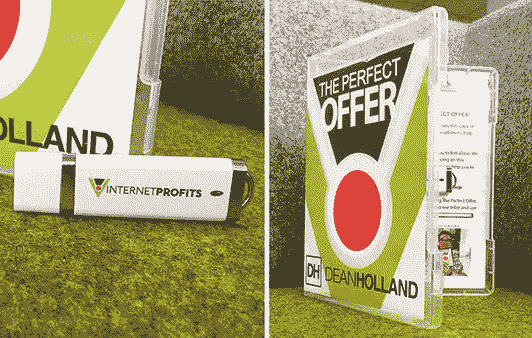

# 我们的生意利润最大的地方

> 原文：<https://medium.datadriveninvestor.com/where-the-big-profit-is-made-in-our-business-dfc3b5d000?source=collection_archive---------12----------------------->

我们现在在互联网利润公司忙得不可开交，如果你知道的话。

在过去一周左右的时间里，你会知道我一直在谈论的—显然，我们现在正在做的一件大事实际上是获得新的报价和销售渠道，以吸引更多的客户。

为了让你们了解这方面的最新情况。过去 24 小时内发生了什么——真的是相当大的进步。

我们开始订购 1000 件新产品，因为实际上(我不知道我是否讨论过这个问题，但我可能讨论过)…

# 新产品

…事实上，如果你跟着我去脸书，你会看到我在那里放了一张照片，或者在过去几天里，我在脸书放了一张我们新产品的照片。所以你可以看到…

所以它基本上是——它是一个塑料里面的 u 盘，他们称之为塑料蛤壳。基本上看起来像一个 DVD 盒，但如果你打开它，里面夹着一个 u 盘。所以我们实际上有——因为现在我已经有了样品，我们已经检查了样品，我们已经看了所有的东西，所有的东西看起来都很好，所有的东西看起来都非常好，看起来不可思议——我们在最初的运行中制作了 1000 个样品。

所以我们知道这些将会是非常畅销的，你知道。我不想订购 5000 个，然后发现，实际上好像没有人想要它们！我们已经做了尽职调查。这是我几乎…

# 100%相信它会成为畅销品

但是我不想让价值几万美元的这些东西放在架子上。所以我们已经订购了一千个。昨天开始的。

那些东西我们花了大约六七千美元。所以他们现在正在做这个星期。我在等一份完工时间表，但不会太久。

昨天，我们还录制了两个追加销售视频。我们还录制了一段向下销售的视频。所以那些基本上必须被放在页面上，一切都在那里完成。因此，销售漏斗方面的一切都真正走到了一起。

正如我所说的，我认为在本周开始时，在这次活动的最后几集，一旦我们做好了一切准备，在我们向可以使用我们所有销售渠道的认证合作伙伴敞开大门之前，成为我们认证合作伙伴的一个好处是…

# 我们首先优化我们所有的销售渠道

所以，一旦我们做好了准备，手头的主要任务，就是我个人开始投入数千美元在流量创造和广告上。并开始优化销售漏斗，测试漏斗。

但是最大的事情之一，事实上这可能是所有事情中最大的事情；几年前，我曾经犯过的一个错误是，把我所有的注意力都放在销售漏斗的前端部分，这是我们实际上正在谈论的东西，也是我们目前正在构建的东西。那才是真正获得客户的前端。

现在的问题是，企业的大部分利润，或者说企业的所有利润都是在所谓的企业后端产生的。因此，在我们获得新客户后，实际上向该客户销售了更多产品，让该客户再次向我们购买额外的产品，即售价为…

# 二到十二，两万美元甚至更多

从 2000 美元到数万美元不等。这就是我们在业务中产生利润的地方；在更高的水平上工作，为新客户提供高质量的产品、项目、机会、解决方案和服务。

我昨天计划的一件大事——实际上，我差点忘了，我本来要和你分享的。我在计划后端活动。

所以我的意思是。一旦我们有了顾客会发生什么。因此，一旦人们订购了被称为“[完美报价](https://likesinternetmarketing.com/affiliate-marketing/free-the-perfect-offer-method/)的新产品——一旦人们订购了，接下来会发生什么，会发生什么。

我们必须有，一个企业必须有，一个提升计划…

# 我们把新顾客带到哪里去？

当然，根据我们的商业模式，我们需要一个提升计划。因此，我们获得了一个客户，我们在购买时向该客户销售了更多产品——这有助于我们清算为实现销售而花费的广告费用。

然后，为了创造利润，这是业务运作所需要的，为了向我们的客户和受众提供尽可能多的服务，我们要做什么？

这是一件大事——实际上我还没有在这一集里讲过，也许明天和以后的几集里我会讲得更详细。因为我们现在正在开发和努力的一件大事，是一个真正高度优化的后端营销活动，一个后端提升活动。

# 基本上，只是给你一个快速，精简的版本…

…因为我们现在实际上已经快到办公室了。一旦我们有了新的买家，我们要做的事情就是:

●然后，我们会发出电子邮件跟进活动。我们有外联电话——所以我团队的一名成员给新客户打电话。如果我们有他们的手机号码，我们就发短信出去。
●我们利用脸书广告展示相关的重新定位活动信息，开展重新定位活动。
●我们会派人去参加自动化网络研讨会、视频系列、案例研究、推荐、成功客户访谈等活动。

真正的整体目标是，一旦我们有了客户，现在让我们看看我们如何进一步帮助他们，并加快步伐，加速和缩短从他们所在的地方到他们想要的地方的旅程。

数码产品能为人们做的就这么多了。你可以看一些东西，你可以学习，你可以自己研究和应用。

但是如果你真的能为自己做些什么，比如说。或者你可以让某人在小组辅导环境中与你一起动手练习。或者你可以参加一个智囊团(研讨会),和志同道合的人一起。

# 你知道，没有什么比这种机会更好的了

你不能把数字产品比作教练项目，也不能把数字产品比作策划。

这就是我们当时的想法——我们如何通过我们的产品线提升人们。我们可以提供所有这些神奇的东西。我们如何将它们提供给人们和…

# 我们如何向他们展示价值主张…

…这样人们才会真正想采取行动，想[抓住那些高水平的优质项目和机会](https://likesinternetmarketing.com/the-new-way/)？

这就是我今天真正要关注的。进一步发展后端营销活动。因为令人兴奋的是，一旦你建立了一个后端营销活动，你把你的客户通过，一旦你优化了，关键最终是；我如何让更多的买家参与到这个后端营销活动中来——这个活动一旦正常运行，就像一台加满油的机器。

你将让所有这些齿轮转动，你将让人们购买优质产品和程序，人们申请并与我的电话团队通电话，人们希望与我的团队和我的教练项目密切合作。诸如此类——这就是令人兴奋的部分！