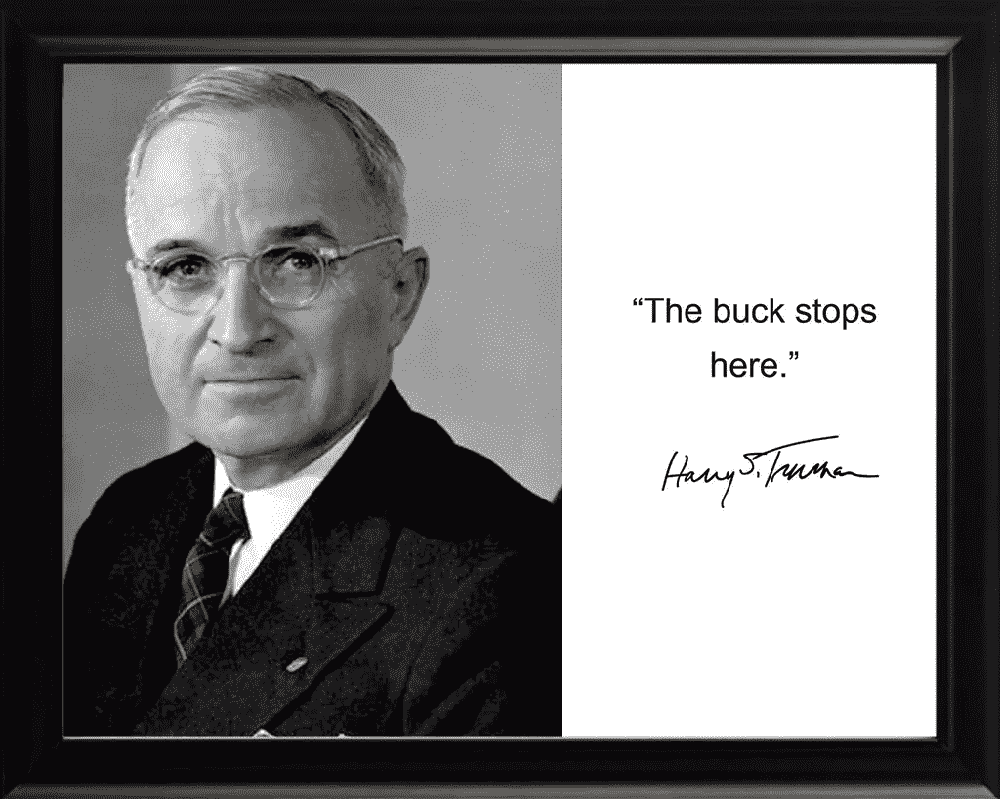

# 责任到此为止

> 原文：<https://medium.datadriveninvestor.com/where-the-buck-stops-1d496a06186f?source=collection_archive---------56----------------------->

无数次我们错过了为自己的行为负责的黄金机会。这似乎是一个国家的爱好，甚至是一个世界范围的爱好，因为我们获得的结果而责备某人或某事。在今天的美国大选中，已经有关于选举中黑客行为的讨论。那已成为某些政党的怪物。如果这是真的，那将是一种耻辱，因为所有人都钦佩的民主现在将是一种“香蕉共和国”民主。虚弱，无力，不值得，最重要的是腐败。但是这种情况是人类特有的问题。变化发生得如此之快，以至于许多人已经落后了。从政党到工人，到几乎任何社会阶层。几年前可以接受和有效的东西现在被取代了。缺乏对快节奏变化的适应能力让许多人动摇，无法应对出现的挑战。这是当我们寻找一个替罪羊或妖怪来责备。是啊！我们必须把自己的缺点归咎于别人。但愿不要让别人发现我们已经过时了。然而，这正是已经发生的事情。

今天需要问的问题是:责任止于何处？在哈里·S·杜鲁门的书桌上有一块牌子，上面写着“我负责”。至此，杜鲁门总统向所有人宣布，尽管在他执政期间发生的任何错误或混乱，其他人都无可指责，但他最终要对错误决策的后果负责。与过去 20 年左右白宫发生的事情截然不同。当人们，从王子到穷人，认识到错误时，任何级别的领导，真正的领导就开始了。当个人和团体认识到他们(我们)不能把责任推给别人。但是对我们允许发生在我们身上的事情负责，事情就会好转。这是认识到事情并不像我们想象的那样运行的第一步。

如果我们要看到我们想看到的结果，就不要再推卸责任了。不要因为自己的缺点责怪别人。这可能很难开始。然而，责任是任何成功人士的性格特征。如果出于任何原因，这种情况发生在你身上，从今天开始。为自己的行为负责，为自己的决定承担后果。这真的可以帮你卸下一大块重担。把东西拿在手中是一种非常解放的体验。一个成熟人的标志。