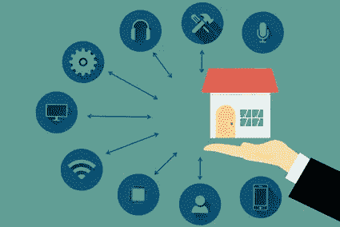
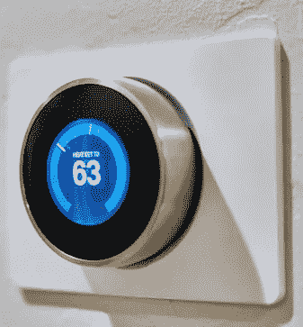
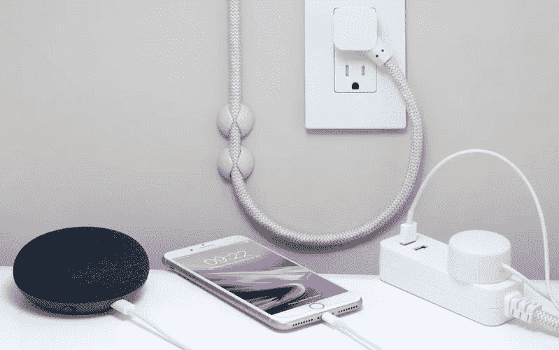
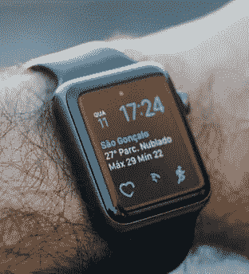
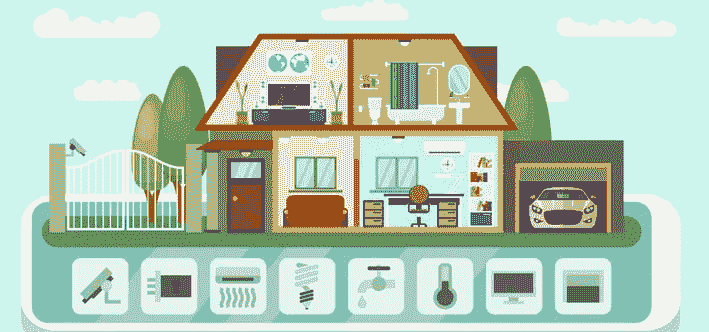

# 从哪里开始让你的家成为智能家居

> 原文：<https://medium.datadriveninvestor.com/where-to-begin-making-your-home-a-smart-home-a37151feb4ab?source=collection_archive---------4----------------------->

几乎任何人都可以用即插即用设备让自己的家成为廉价的智能家居。

W 帽子是智能家居？这是一个装有电子设备的家庭，这些电子设备可以通过智能手机或平板电脑上的应用程序(一个“应用程序”)远程控制照明、供暖和安全等电器。相同的设备或电器可以通过智能助理(如 Alexa)在家中进行控制。这是一款智能扬声器/麦克风，使用人工智能(AI)来激活和执行许多日常琐事，如查看日历、播放音乐以及通过语音命令控制家中的设备。内置麦克风的小型设备可以放在墙上，甚至可以随身携带，将语音控制扩展到整个家庭，而不仅仅是在助理麦克风的说话距离内。

All appliances can be smart appliances

## 以下只是一些功能，这些功能可以在远离家的地方通过数据或互联网连接或在家里通过虚拟助理通过应用程序进行远程控制。

1.  一到家就打开烤箱做晚饭。
2.  控制恒温器提高或降低家庭中央供暖。
3.  打开或关闭窗帘、窗帘或百叶窗。
4.  一到家就放音乐。
5.  按照预定的时间表和预定的食物量喂养宠物。
6.  用语音命令开门。
7.  允许家庭成员或朋友使用智能门锁远程进入家中。
8.  在夏天，从后花园或家里的任何地方远程观看到来的游客。

 [## 物联网解决方案如何改变供应链中的机遇|数据驱动型投资者

### 物联网(IoT)可能开始时规模很小，但它正在成为世界经济中的一个重要因素。事实上…

www.datadriveninvestor.com](https://www.datadriveninvestor.com/2018/11/14/how-iot-solutions-are-shifting-opportunities-in-the-supply-chain/) 

## 今天，许多正在建造的新住宅都是为智能家居功能而硬连线的。对于老式住宅，硬接线可能是一个昂贵的提议。一个更便宜的选择是“即插即用”设备。它们可以在大多数电子产品或大盒子商店买到，并且相对容易安装。

开始基本家庭自动化任务的最简单和最便宜的方法是购买智能接口产品，这些产品专门用于您想要远程控制的电器。如果你能拧上一个灯泡，安装一个电缆调制解调器，你就能安装大多数智能设备。对于电器，你可以使用插件传感器将你已经拥有的普通设备变成智能设备。传感器插入墙壁插座，设备插入传感器。此外，还有非常简单的遥控插座装置，如果你还没有准备好使用 Alexa 虚拟助手，可以在房子的任何地方按下一个按钮，打开或关闭任何连接到电源插座的东西。

A smart thermostat

智能恒温器是一种很好的节能设备。它们可以用来远程控制你家的温度。使用人工智能，它们可以学习你的偏好，并可以在你外出时智能地降低你的热量或空调，并在你回家前重新激活它，以达到你首选的“在家”温度设置。

市场上有几种智能标准可供选择。如果你对价格敏感，并决定走非硬件路线，你的大部分时间将花在决定使用哪个插件系统上。有许多网站，如 [**汤姆的指南**](https://www.tomsguide.com/us/best-smart-home-devices,review-2008.html) ，你可以在那里做你的研究。Z-Wave 是无线技术中的一种通信标准，它允许智能设备相互通信。Zwave 由 Zensys，Inc .开发，Zen sys，Inc .是一家位于丹麦的初创公司，在全球范围内使用。

*   **软件:**无论你是通过台式机、智能手机还是平板电脑来控制系统，你都需要软件来运行系统。您可以在购买专用设备(集线器)或使用开源软件时获得该软件。一些解决方案提供有年费的套餐。
*   中枢:你的命令需要一个带软件的主控器来与你的电器和设备对话。枢纽是“大脑”；向您的网络传输无线命令的盒子。更常见的设备是简单、独立的单元，通常带有一些软件。市场上有许多低价产品，但要小心，因为许多更便宜的 USB 设备不附带软件，也不需要按月或按年订购。
*   **传感器、开关和外围设备:**某些东西必须接收从集线器传输的信号。根据你想要自动化的东西，你可能需要安装智能墙壁开关，安装智能门锁，并对你的照明系统进行一些硬件改造。外围设备从低价到高价都有。

你也不必坚持使用基础软件。虽然您有一个设备作为网络的主控程序，但市场上总会出现新的、更高效的设备和软件，能够更好地扩展您的智能家居系统。

If your home is not hardwired for smart appliances, use plug and play

家庭自动化将会继续存在。家庭和企业主都在寻找简化生活和使房屋更加安全的方法。家庭技术继续满足消费者的需求，他们正在寻找更好的方式来访问信息和控制家庭环境。预测家庭自动化技术的未来并不是一件容易的事情，但是未来可能会是什么样子。

家庭中将会有更多的语音控制技术。一些带有语音命令的智能手机应用程序甚至现在越来越受欢迎，以完成任务和控制周围的环境。有了这项技术，业界预见到使用语音命令来控制安全、加热和冷却、照明、隐私和娱乐的能力。告别遥控器和智能手机或平板电脑应用。

可穿戴技术是新的黑色。我们已经看到可穿戴设备以健身监视器的形式越来越受欢迎，这只是可穿戴技术和家庭自动化可能性的开始。在未来，数字世界和现实世界之间的界限将会变得非常模糊。这将允许人们以一种全新的方式与他们的家互动。或许在未来，可穿戴技术将监测消费者的健康和医疗状况，并控制周围的环境，以实现最佳的健康和福祉。

自动化就是舒适、方便和节能。如果所有这些都可能在消费者没有想到的情况下发生，会怎么样？在未来，家庭环境可以根据房子周围、移动设备和个人的传感器自动改变。也许当居民生病时，家庭会感觉到，并调整加热和冷却，以帮助更好、更快地康复。

## 谈到家用科技的未来，消费者的选择只会越来越多。技术将继续改善生活，同时提供新的方式与家庭和他人互动。无论是家庭安全、可穿戴电子产品还是语音命令技术，家庭自动化的未来应该是光明而令人兴奋的。

*最初发表于*[*【http://tecusautomation.blogspot.com】*](https://tecusautomation.blogspot.com/2017/11/where-do-i-start-with-home-automation.html)*。*