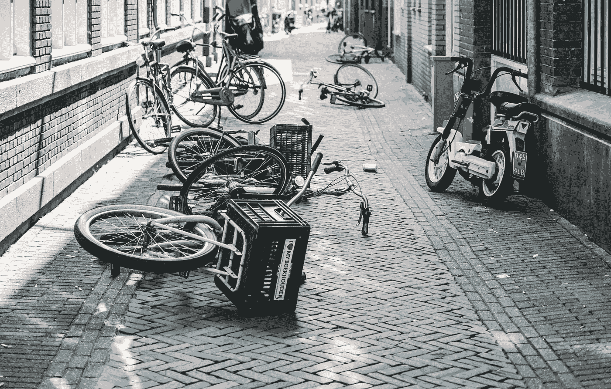
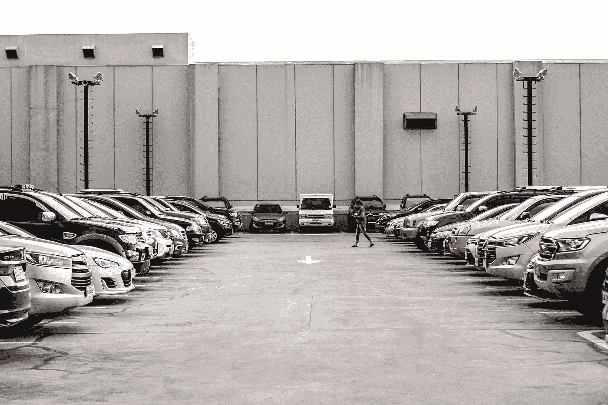
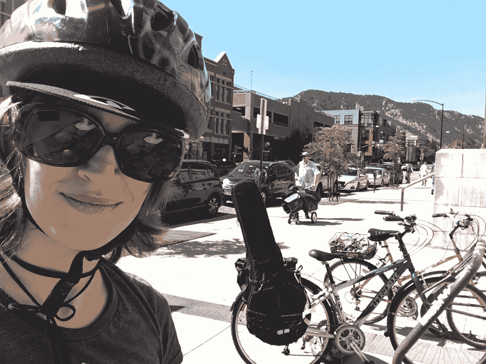

# 我的悍马呢？？？

> 原文：<https://medium.datadriveninvestor.com/wheres-my-hummer-470d90311799?source=collection_archive---------4----------------------->

# 无车生活方式的起伏

Bike woes. Crop of original photo by [Marc Kleen](https://unsplash.com/@marckleen?utm_source=unsplash&utm_medium=referral&utm_content=creditCopyText)

我现在已经无车 10 年了，大部分时间都很热爱。但是最近感觉很糟糕。有时候我就想大喊一声“我的悍马呢？？?"当我下楼发现又一个零件从自行车上被偷走，或者听到前刹车开始摩擦，乞求再一次调整。

7 月，当我租了一辆车回弗吉尼亚的家时，我对这种生活方式的挫折感加剧了。我已经有一年左右没有开车了，已经忘了它有多方便。在我的小起亚 Sol 里，我可以随时随地缩放，想放多少就放多少。我不需要携带额外的雨具，也不用担心我的链条会掉下来。

 [## 更好的预算，打造更大的|数据驱动型投资者

### 即使是专家也承认它们并不完美。从 1 到 10 的范围内，安东尼·科普曼和德尔…

www.datadriveninvestor.com](https://www.datadriveninvestor.com/2018/11/08/budget-better-to-build-bigger/) 

回家的第一天，我在 10 分钟内驱车 5 英里，去观赏阿尔迪的奇迹。走过过道时，我发现自己在想，“不要买太多——我需要小心我买的每样东西都适合我的自行车。”然后我想起了外面那匹漂亮的白马。我想要多少就能得到多少！

那次旅行回家后，我猛然醒悟。我的自行车坏了，花了一两个星期把它送进修理厂再送回来。

这意味着我不得不通过步行和乘坐公交车来携带一切，并在晚上 9 点后乘坐 Lyfts，因为这里的公交系统不是为人们实际依赖的。😡我去年仅在 Lyfts 上就花了 400 美元。

没有车的生活并不像你想象的那么不寻常。2016 年，8.7%的家庭没有汽车。有些是自愿的，有些是必须的。但是其中大部分是在像纽约这样的城市地区——54%的家庭没有汽车。(在曼哈顿，这个数字是 76%。)在这些人口密集的地区，乘公共汽车和地铁，甚至骑自行车去任何地方都相当容易。

我是一小部分选择在市区外不开车的美国人之一。

人们不这么做是有原因的。你必须真的想去做才能解决这些不便。女性有一些额外的障碍。我不喜欢晚上在自行车道上骑车，因为我不知道谁会出现在下一个拐角处，或者藏在下一个桥柱后面。这是身体上的挑战；以我小小的身躯，我艰难地扛着 30 磅重的自行车上下楼梯。

无车的问题不在于概念有缺陷。无车的问题是，我们的道路已经被福特、通用和其他大型汽车公司收购了。道路曾经是公共场所，供人们散步、玩耍、骑自行车，是的，还可以继续开车。但是汽车公司想要更多——司机们抱怨其他人的生活让他们慢了下来。所以汽车游说团[创造了“乱穿马路”](https://www.vox.com/2015/1/15/7551873/jaywalking-history)这个词和相关法律。

行人现在不得不等汽车才能过马路。汽车会发出长达几分钟的信号，而行人只有微不足道的几秒钟时间过马路。

Stay off OUR roads, said the auto industry. Never before has so much public property been privatized.

> “在汽车发展的早期，司机的工作是避开你，而不是你的工作去避开他们。但是在新的模式下，街道变成了汽车的地盘——作为行人，如果你被撞了，那是你的错。"
> 
> ——彼得·诺顿，弗吉尼亚大学历史学家，著有《与交通作斗争的 [*:美国城市*](http://www.amazon.com/Fighting-Traffic-American-Inside-Technology/dp/0262516128) 汽车时代的曙光。

从那以后，事情开始走下坡路。当人们在街上不再受欢迎时，他们接受了暗示，以巨大的个人成本购买了汽车。城市将购物从步行的商业区和社区转移到了只有开车才能到达的购物中心和商业区。街角商店已经成为过去。

Our quaint downtowns filled with little shops and eateries have been replaced by this: Ye Olde Mall Parking Lot.

纽约是这一规则的一个明显例外。是的，汽车统治着道路。但是很多人仍然步行。与许多美国城市不同，这里到处都是人行道，还有大量的公共汽车和火车。当我住在那里的时候，我利用地铁无缝地实现了无车出行。

此外，纽约是为每个人划分的，不仅仅是司机。在任何一个街区，你都可以在下层找到杂货店和药店，上面是公寓。每个地铁站周围都是街角商店，我可以在那里买一盒牛奶或一些晚餐蔬菜。这就是为什么纽约是一个养老的好地方——即使你不能开车了，你仍然可以去任何你想去的地方。

搬到科罗拉多是一次突然的觉醒。一方面，我花在通勤上的时间更少了，而且更加享受我的通勤生活。我挤在东河下拥挤的地铁车厢里的日子结束了。在这里，即使骑自行车也能花更少的时间到达目的地。在纽约，我 3 英里的通勤路程只需要 15 分钟，而同样的路程需要 50 分钟。

另一方面，与纽约相比，我的活动更有限。

即使在像博尔德这样的相对自行车王国，城市设计也反映了每个人都会开车的假设。市区没有杂货店。街区里没有杂货店，像郊区街区一样孤立，而不是像功能齐全的城市一样混合使用。

不像在纽约，当我没有面包的时候，我不能穿着运动裤去街角的商店。我必须穿好衣服，去离家半英里远的杂货店购物。药房离那还有半英里。健身房离那还有一英里。假设拥有汽车。

最大的成本是社交。

在纽约，我可以在火车上去任何我想去的聚会。这就更难了。我有时就是不去参加聚会和朋友聚会，因为 a .人们住得很分散，b .晚上很难找到地方(参见:糟糕的公交服务)。

我甚至感觉到了这种影响。我的男朋友住在这个城市分散的街区，所以我不容易从他的房子里跑出来去市中心。当我在那里的时候，他变成了某种司机，因为我们去的商店和音乐会不容易骑自行车或公共汽车。我讨厌依赖司机。

但是我在不久的将来没有看到一辆汽车。他们说美国人平均每月在汽车上花费 775 美元，我买得起。但是购买一辆大型汽车从根本上说是没有意义的。

为什么要花 15000 美元买一辆 2000 磅重的装甲坦克来运送一个小个子呢？一辆 300 美元 30 磅重的自行车绰绰有余。

我喜欢骑自行车。我喜欢散步。我喜欢在户外活动身体。我喜欢向我的邻居挥手。我喜欢看自己在那台漂亮的机器上能走多远。

我还没想好如何让我的社交生活正常运转，但我正在努力。我开始我自己的聚会，学习穿过城镇的更好的方法，并且通常在我周围 5 英里范围内建立一个完整的世界。有 150，000 人住在那个地区，可能性比比皆是。

____________________

吉纳描写了她在 frugalkite.com**骑着自行车走向财务自由。**

**

*Adding a banjo to my bike setup means my bike is now truly theft-proof. 😏*