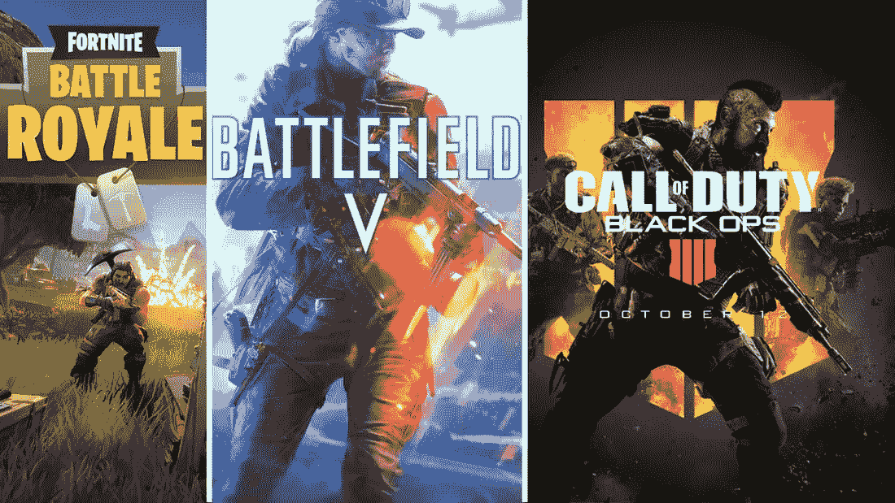

# 哪只皇家战役股票值得关注？腾讯，EA，还是动视暴雪？

> 原文：<https://medium.datadriveninvestor.com/which-battle-royale-stock-is-watchlist-worthy-tencent-ea-or-activision-blizzard-fb4bc2b211f5?source=collection_archive---------4----------------------->

一个分分钟缩小的地图，100 名左右的士兵大部分藏起来，但也有一些战斗，只有一个赢家。这被称为皇家战役模式，是最新的视频游戏热潮。还记得《糖果粉碎》和《口袋妖怪 Go》吗？这是另一个！堡垒之夜游戏是 2018 年皇家战役热潮背后的原因。游戏由 Epic Games 开发。据估计，在堡垒之夜的成功推动下，Epic Games 现在的估值在 70 亿到 140 亿美元之间。到目前为止，这只是一种热潮，对我们这些股市投资者来说没什么意思。Epic Games 是一家私人公司。但是等一下！中国视频游戏巨头腾讯控股拥有该公司 40%的股份。拍拍手，因为事情越来越有趣了！

今天，我们正在关注三家正在发布皇室战争模式的视频游戏公司，看看哪一家值得我们关注，并最终进入我们的长期投资组合。今天的参赛者是[腾讯控股](https://stockcard.io/TCEHY)、[电子艺界](https://stockcard.io/EA)、[动视暴雪](https://stockcard.io/ATVI)。

注:所有数字均基于 2018 年 9 月 14 日的最新数据。如果你在晚些时候阅读这个版本，信息可能会有很大的不同。聪明点，检查你的数字。

**[**腾讯控股**](https://stockcard.io/TCEHY) **(市盈率:32.93)****

**腾讯控股是中国的游戏巨头和世界上最大的视频游戏公司，它还拥有堡垒之夜开发商 Epic Games 40%的股份。该公司是堡垒之夜成功的直接受益者。然而，腾讯最近的情况并不太好。似乎他们在游戏审批过程中遇到了一些问题，导致该公司宣布第一个季度利润下降。当然，这是投资中国公司的一个风险。我们需要考虑监管和政府所有权对股价波动的影响所带来的风险。话虽如此，腾讯对于冒险者来说绝对是一个不容错过的机会。它拥有几个成功的游戏工作室，如 Riot Games 和 PUBG。Riot Games 是《英雄联盟》世界上最大的电竞游戏特许经营商之一。腾讯也是 PUBG (PlayerUnknown 的战场)的发行商，这是第一款引发皇室战争热潮的游戏。在众多其他业务中，腾讯拥有名为腾讯 QQ 的即时通讯服务和最大的门户网站之一 QQ.com。它提供微信，这是世界上最强大的应用程序之一。它还拥有中国大部分的音乐服务(通过腾讯音乐娱乐)，根据维基百科的数据，它拥有超过 7 亿活跃用户和 1.2 亿付费用户[。腾讯控股的市盈率为 32.93 倍，是一个带有监管风险包袱的廉价交易。在游戏股的混战中，很难忽视这个巨头。](https://en.wikipedia.org/wiki/Tencent)**

****访问** [腾讯控股的股票卡](https://stockcard.io/TCEHY)。**

********(市盈率:51.28)********

****电子艺界最近宣布，将推迟四周发布其轰动一时的视频游戏《战地 5》。推迟的部分原因是该公司计划推出皇家战役模式。战地是最受欢迎的第一人称射击游戏之一，也将包括皇家战役模式。这使得这次延迟值得注意。尽管这个消息对玩家来说很有趣，但推迟意味着在当前财年中销售游戏的时间将减少四周，这让分析师们感到担忧。例如，美林证券的分析师决定降低他们对 EA 未来 12-18 个月的目标股价。尽管这些担忧是有道理的，但对于长期投资者来说，在艺电这样的市场领导者的一生中，几周的销量只是昙花一现。如果你通读了管理层的说明，游戏发布的延迟实际上是一个战略举措。他们推迟游戏有两个原因:1)他们已经从游戏社区收到了很多关于最近货币化计划的反馈，该计划是今年早些时候在他们的一些游戏中引入的。这样的反馈是非常有价值的，管理层很聪明地采纳了这些意见，并确保他们根据反馈改进和完善他们的新游戏。2)时间上的变化预计将减少竞争压力，并在战地游戏和其他竞争对手之间建立一个时间差，如 Take-Two Interactive 的红色死亡救赎 2 和 Activision Blizzard 的使命召唤黑色行动 4，它们也计划在原发布日期前后发布。正如你在 [EA 的股票卡片](https://stockcard.io/EA)上看到的，下跌不仅有意义地将股价拖至低估的范围，而且下跌背后的原因也是战略性的，我们有信息相信公司的运营实力没有真正的变化。****

******参观** [电子艺界的股票卡](https://stockcard.io/EA)。****

********[**动视暴雪**](https://stockcard.io/ATVI) **(市盈率:125.63)**********

**当堡垒之夜成为街谈巷议的话题时，动视暴雪正在努力开发他们自己的《皇室战争》游戏。当你粉碎了世界上最著名的第一人称射击游戏 IP，用最疯狂的电子游戏模式，你得到了什么？你得到了使命召唤，皇家战役模式！(咄！)自该公司发布公开测试版以来，该股已上涨近 10%。评论家对此赞不绝口，视频流分享他们的兴奋。许多忠实的使命召唤粉丝，他们不确定是否会购买计划在今年晚些时候发布的新游戏，现在正在倒计时，他们可以下载完整的游戏并开始战斗。除了 Royale 模式之外，就像它的竞争对手 Electronic Arts 一样，该公司正在从电子竞技类别的出现中受益，并已经在发展其电子竞技业务方面投入了大量资金。这项投资包括发展一个电子竞技联盟，运动员选拔和招募规则，以及为其受欢迎的 Overwatch 专营权开发世界上第一个电子竞技体育场。动视暴雪是视频游戏行业的怪兽玩家。**

****访问** [动视暴雪的股票卡](https://stockcard.io/ATVI)。**

****谁是我们值得关注的人选？****

**这些皇家战斗队的股票中，哪一只值得列入我们的智能投资观察名单？在一个强劲的市场中，这三家公司都是管理良好的公司。很难选择，说实话。但是，如果观察名单是一个地方，我们把值得我们关注的公司放在那里，我们希望在进入之前监测一段时间，我不得不说腾讯是我的观察名单中值得的赢家。尤其是在如此便宜的市盈率下，该公司值得考虑。另外两家已经是实力雄厚的公司，它们已经属于大多数长期投资组合。而且，既然我们专注于皇室战争模式，腾讯显然是值得注意的一个。他们不仅拥有 Epic Games——堡垒之夜 40%的股份，还发行了 PUBG game，这是堡垒之夜成功之前创作的第一款 Battle Royale 游戏。对于这家中国公司来说，从视频游戏行业的这股新热潮中赚钱的机会实在是太大了，因此它无疑是今天股票卡位战的赢家。**

**希望你喜欢这一集。在评论区分享你的想法，让你的投资伙伴知道哪一个是值得你关注的赢家。**

**你或你认识的人有优先权！**

****

**我们创办股票卡是为了给现代的、精通技术的股票市场投资者提供一个备忘单，这些投资者来自各种背景或拥有任何净值。从一开始，我们就知道我们还需要做一件事。我们的用户是投资新手，在获得开始投资的信心之前有几个问题。这就是为什么我们一直在努力创建如何投资大学的原因。如果你或你喜欢的人是投资新手，你可以以独家的早鸟价格获得“如何投资大学”的有限席位。邀请你！11 月 8 日在旧金山举行的为期一天的有趣的实践互动研讨会，学习创建个性化长期投资计划所需的一切知识！加入我们吧！[取票](https://www.eventbrite.com/e/how-to-invest-workshop-stock-market-investing-simplified-registration-49908563858)**