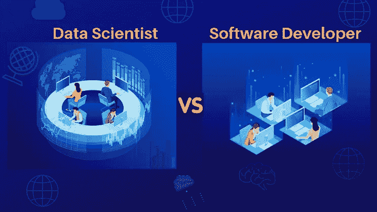

# 数据科学家和软件开发员哪个职业更有保障？

> 原文：<https://medium.datadriveninvestor.com/which-career-is-more-assuring-data-scientist-or-software-developer-6253d81352b4?source=collection_archive---------1----------------------->

首先，让我们尝试定义/区分所描述的两种角色:

软件开发人员是编写代码的铁杆计算机程序员，通常是一个著名的低级程序员。他们为高度复杂的系统设计和开发完整的软件架构。典型的职业道路引导你走向系统工程&产品管理。倾向于以增强技术为重点。

**数据科学家** —一个相对较新的角色，是统计学家角色的一个分支，它结合了高级分析技术的使用，包括机器学习和预测建模，以提供统计汇总之外的见解。从根本上说，他们做了你在分析领域能想到的一切，甚至更多。他们通常也有博士学位

 [## 成为数据科学家所需的 8 项技能|数据驱动型投资者

### 数字吓不倒你？没有什么比一张漂亮的 excel 表更令人满意的了？你会说几种语言…

www.datadriveninvestor.com](https://www.datadriveninvestor.com/2019/02/07/8-skills-you-need-to-become-a-data-scientist/) 

**回答原问题:**

当你两者都拥有时，你会爱上它。数据科学家当然知道他的后端数据架构应该是怎样的。一个开发人员知道如何通过他的编码技能把整个事情联系起来。

数据科学家是负责以某种方式编译东西的人，这种方式使得产品能够给企业带来最大的好处。一个开发者可能没有这样的经验，他专注于构建东西，而不是分析它。

到最后，一切都简单地归结为你个人的决定和兴趣。如果你喜欢设计东西和构建算法，拥有一套你知道会发生什么的结果，那么软件开发是适合你的。然而，如果你喜欢不可预测的事物，热爱统计数据和趋势，拥有内在的商业智能，那么你就是未来寻找的数据科学家。

虽然数据科学领域每天都在发展，但它的重要性永远不会超过软件工程师，因为我们将永远需要他们开发数据科学家将操作的软件。最后包括更多的数据，我们将永远需要数据科学家来解释数据，并在业务中取得进步。

*   数据科学家写代码是为了一个目的的媒介，而软件开发人员写代码是为了开发东西。
*   数据科学本质上不同于软件开发，因为数据科学是一种分析活动，而软件开发在标准上比传统工程高得多。
*   数据科学家解决的问题包括识别欺诈交易或预测哪些员工注定要离开公司。软件开发人员可以选择数据科学家的模式，并根据生产质量原则将它们转换成完全起作用的安排。软件开发人员解决一些问题，比如让算法运行得更高效，或者构建用户界面。

数据科学家是大数据的辩论者。他们喜欢大量杂乱的数据点(非结构化和结构化)，并利用他们在数学、统计和编程方面的高超技能来清理和组织它们。然后他们运用他们所有的分析能力——行业知识、背景知识、对实际假设的讽刺——来揭示隐藏的商业挑衅的解决方案。

## 软件开发人员的生活:

软件开发人员用他们编写的代码让硬件平台不断发展。在某种意义上，代码是结果的行为组成部分——它做什么，它如何做，等等。他们开发各种软件，比如手机应用程序、网站、硬件代码、操作系统以及互联网本身。

软件开发人员能成为数据科学家吗？

“当代”软件开发人员投身数据科学潮流的一个好处是，对他们来说，技术变革的步伐是已知的，没有令人沮丧的活动。

现在回答这个问题，

是的，这是可能的。对某些人来说可能比其他人简单。从软件工程角色转换到数据科学家角色有多简单取决于你有什么样的软件开发经验。很有可能，软件工程师会要求进行数据科学方面的兼职或全职培训。问题是，数据科学虽然是一个相对较新的术语，但已经存在很长时间了。自从计算机被用来预测天气模式、医学治疗的结果以及资本和产品市场以来，我们一直在使用数据科学。因此，那些使用统计模型开发预测算法的软件工程师中的大多数比那些只有软件开发经验的人更适合数据科学家的角色。

成为数据科学家是一个旅程。如果你以前知道数据分析工具和语言，如 SQL、R、Python、SPSS 和 SAS，这个旅程会容易得多。如果由于你所受的教育或所从事的工作，你获得了统计学方面的知识或专业技能，或者利用统计模型来改进算法，这甚至会令人满意。重点是把你的想法骗进一个软件开发角色，这个角色看起来不像数据科学家，但仍然需要你使用统计建模。

从长远来看，处于这两种方式交汇点的人将是行业的巨大价值。

*最初发表于*[*【https://www.mytectra.com】*](https://www.mytectra.com/blog/Which-career-is-more-assuring-data-scientist-or-software-developer/)*。*