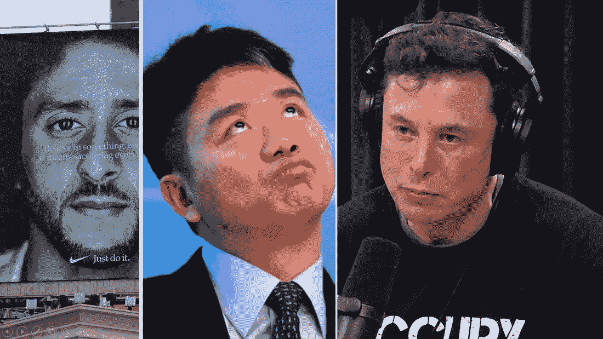

# 哪只下跌股票值得我们关注？耐克，JD.com，还是特斯拉？

> 原文：<https://medium.datadriveninvestor.com/which-dipping-stock-is-worthy-of-a-spot-in-our-watchlist-nike-jd-com-or-tesla-5020b0a31587?source=collection_archive---------18----------------------->

一周戴一顶帽子！政治与投资交织在一起，T2 耐克公司的股票下跌。[特斯拉](https://stockcard.io/TSLA)的首席执行官在一次诚实的谈话中抽了点大麻，于是特斯拉的股票下跌了。JD.com 的首席执行官因天知道在做什么而被捕，股票下跌。因此，在本周的“值得关注的战斗”中，我们决定看看这三只下跌的股票，看看哪只股票值得我们关注，并最终进入我们的长期投资组合。

让我们开始战斗吧:

[https://bit.ly/2oRFWTi](https://bit.ly/2oRFWTi)

注:所有数字均基于 2018 年 9 月 8 日的最新数据。如果你在晚些时候阅读这个版本，信息可能会有很大的不同。聪明点，检查你的数字。

**[**耐克**](https://stockcard.io/NKE) **(市盈率:69.7)****

**无论你的政治观点是什么，不可否认的是，耐克的举动把今年最有争议的政治话题之一变成了一场惊人的公关活动。当然，股价下跌了约 3%，但情感是耐克品牌的基础。我看过一篇文章，上面写道:“耐克广告公司 W+K 的联合创始人、Just Do It 口号的创始人丹·维登曾经说过，“站在最前沿意味着有人或事需要被裁掉”。他不怕冒有争议的风险，他喜欢为耐克的业务工作，因为这从一开始就是耐克品牌 DNA 的一部分。除了 Just Do It 活动，该公司花费 115.1 亿美元产生 364.0 亿美元的收入和 39.3 亿美元的自由现金流。对于耐克这样规模的公司来说，收入仍在稳步增长。无论是否下跌，这都是一家稳定的公司，它支付股息，与消费者有着深厚的情感联系。难怪该股的市盈率是市场平均水平的两倍多。**

****访问** [**耐克的股票卡**](https://stockcard.io/NKE) **。****

****【美元】**[**【JD.com】**](https://stockcard.io/JD)**(市盈率:318.9)****

**呀！来吧伙计。你能不能离开你的名人生活去经营你的公司？当我读到 JD.com 的创始人兼首席执行官因非常严重的不当性行为指控而在美国被捕的新闻时，这是我的反应。这个男人是中国的名人和亿万富翁，并且娶了一个名人为妻。但是，不！他不得不跳下道德的悬崖！据称。我们真的不知道事情的全部。但是，消息传出后，该股遭受了相当大的两位数打击。在警方继续调查的同时，该公司的投资者陷入了进退两难的境地。一方面，该公司是市场颠覆者的主要候选人。它继续从阿里巴巴手中夺取市场份额。通过与腾讯的合作、Alphabet 的投资以及几个新的合作伙伴，该公司有望实现非凡的增长率。JD.com 也是一家管理良好的公司。它花费 82.8 亿美元产生 585.4 亿美元的收入和 24.4 亿美元的自由现金流。这就是为什么投资者奖励了该公司如此高的股价，从而将该公司的市盈率推高至 318.9 倍。另一方面，如果指控属实，管理层将有大变动。不要忘记，大多数长期投资者不希望持有他们在道德上感到不舒服的公司股票。左右为难，蘸酱诱人！**

****访问** [**京东的股票卡**](https://stockcard.io/JD) **。****

****$ $**[**特斯拉**](https://stockcard.io/TSLA) **(市盈率:没有收益，这意味着无论什么价格，股票都太贵了。)****

**哦泰斯拉！特斯拉特斯拉。贵但颠覆性，很棒的品牌，有周剧的一面！而且，一家使用特斯拉名字并提到埃隆·马斯克的金融媒体每天都想出一个新的 clickbait。本周，我们再次见证了一场戏剧。当埃隆·马斯克与乔·罗根进行非常诚实坦率的谈话时，主持人给了他一根大麻烟。他试着还了回去，说这不是给他的。但是，随后媒体变得疯狂，人们谈论他失去了安全许可，因为他使用了一种药物，股票准备好接受另一次打击。周五收盘时，股价在 260 美元左右。而且，由于该公司没有收益，使用市盈率意味着该公司是你能买到的最贵的股票之一。该公司花费 39.8 亿美元产生 124.7 亿美元的收入和-44.3 亿美元的自由现金流。此外，对该公司维持运营、不耗尽现金的能力的担忧仍然存在。持有特斯拉股票的理由并没有得到明智的投资事实的支持，而是取决于投资者对埃隆·马斯克(Elon Musk)的信心以及他们对未来的想象。**

****访问** [**特斯拉的股票卡**](https://stockcard.io/TSLA) **。****

**谁是我们值得关注的人选？**

************

**消除三个中的一个很容易。投资[特斯拉](https://stockcard.io/TSLA)与数字和事实无关。即使股价进一步下跌，如果你愿意为了成为能源和汽车未来的一部分而失去所有的钱，投资这家公司也是明智的。或者，如果你只是喜欢支持埃隆。在 JD.com 的 T2 和 T4 的耐克之间做出选择也没那么困难。JD.com 是一家管理非常好的公司，股价的下跌是显著的，下跌的原因不是操作性的。请注意，如果指控属实，将会有一段时间价格进一步下跌，但最终在中国这样一个不断增长的市场，在所有利益相关者的参与下，公司很可能会长期表现良好。作为一名投资者，你需要决定，支持一家由一个没有道德准则的人领导的公司，对你来说有多重要。最终，这场值得关注的战斗的赢家是耐克。我认为股票下跌没有什么意义。下跌幅度不足以将该股拖至被低估的区间。但是，在本周三只下跌的股票中，耐克是唯一一只拥有继续获胜所需一切的股票。我不是说你应该跳进来投资耐克，而是访问该公司的股票卡，亲自看看这只股票是否符合你的投资策略。**

**希望你喜欢这一集。在评论区分享你的想法，让你的投资伙伴知道哪一个是值得你关注的赢家？**

# **你或你认识的人有优先权！**

****

**我和我的团队创建了[股票卡](https://stockcard.io)作为现代、精通技术的股票市场投资者的备忘单，这些投资者来自各种背景或拥有任何净资产。从一开始，我们就知道我们还需要做一件事。我们的用户是投资新手，在获得开始投资的信心之前，他们有相当多的问题。那就是我们刚刚推出的[如何投资大学](https://www.howtoinvest.university/)。如果你或你喜欢的人是投资新手，你可以以独家的早鸟价格获得“如何投资大学”的有限席位。[了解更多信息，拿起您的早鸟票！](https://www.howtoinvest.university/)**