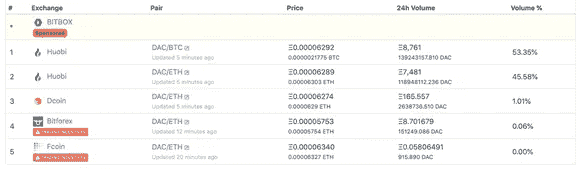
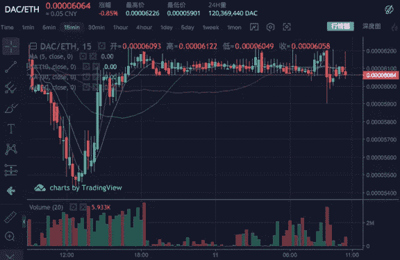
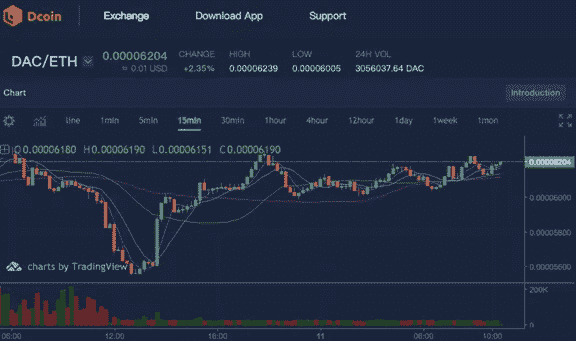
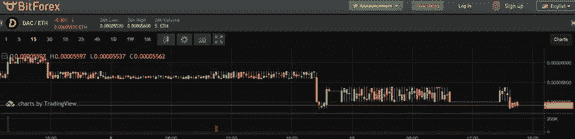

# 熊市哪家交易所的成交量机器人最好？

> 原文：<https://medium.datadriveninvestor.com/which-exchange-has-best-volume-robot-in-bear-market-e0fb27f96684?source=collection_archive---------47----------------------->

集中交易所的流量有多少是真实的？机器人交易多少钱？是否存在价格操纵？是否为外部游资提供投机便利……这些指控一直存在，只是没有公开的证据证实或否认。

交易所内部问题很多。在数字货币市场上，证券交易所与银行家联合崩盘已经是公开的秘密。

为了制造用户涌入的假象，机器人挂销售单，来回刷数据，已经成为很多交易所的常用战术。看似交易量那么大，其实很大一部分是虚假交易，不是真实用户的交易。越垃圾的币，数据刷的比例越大。

论坛里总有这样的帖子:“现在都是交换机器人交易数据。这太容易犯错误了。”当你想装运大量货物时，你发现你无法成交。采购价格总是比你的销售订单低一点。

让我们来看一组图表。以 DAC/ETH 为例。这种货币目前在四个交易所交易，包括 Fcoin、Huobi、Dcoin 和 Bitforex。

[Https://www.coingecko.com/en/coins/davinci-coin/trading_exchanges#panel](http://Https://www.coingecko.com/en/coins/davinci-coin/trading_exchanges#panel)

其中火币占比最大，达到近 99%。截图一个 15 分钟走势图的行情数据，上涨相当平稳，可以说是教科书版的“横盘振荡”，这波操作很让人不安。

看看占股票交易所 1.01%的 Dcoin。根据资料，它是一个新的瑞士交易所。它成立于 2018 年。虽然它没有报多大希望，但结果是非常令人鼓舞的。它截获了一些交易报价。对比火币，趋势还是很真实的。传球！一朵小红花是要奖励的。

[https://www.dcoin.com/](https://www.dcoin.com/)

剩下两家交易所占比更低，Fcoin 占比 0%，就懒得看一眼 Bitforex 了！让我们见证这美妙的…时刻。Emmmm 这个机器人怕生锈。

交易所里有很多用户。交易所的交易额越大，新用户就越多。人人都想分一杯羹。一波牛市激起千层浪，无数小交易所此起彼伏，没有数据？去吧。没有用户？去吧。没有项目？抓住它！猪一下子就能飞起来。转眼间，寒冷的冬天来了又逃。剩下的就等着春天来临前的冬天燃起一把火:机器人雇佣自己，志愿者上钩。

根据 CoinMarketCap 4 月 12 日的数据，OKEx、币安和火币在全球交易所的 24 小时比特币交易量中排名第二、第三和第四。作为 2017 年中国排名前三的数字货币交易所。2017 年 9 月 4 日政府颁布 ICO 禁令后，他们要么下海，要么转型。在数字货币世界中，交易所是最大的中心。

集中交易所面临更多的转型和规范。要真正弘扬区块链精神，币圈任重道远。