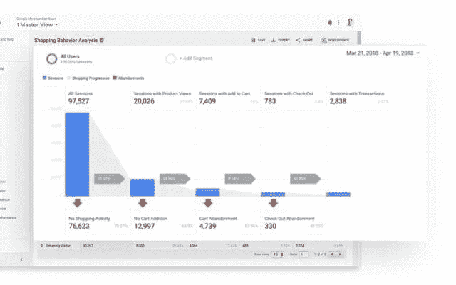
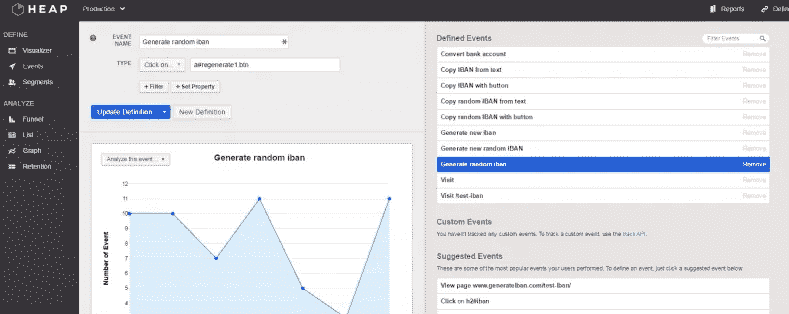
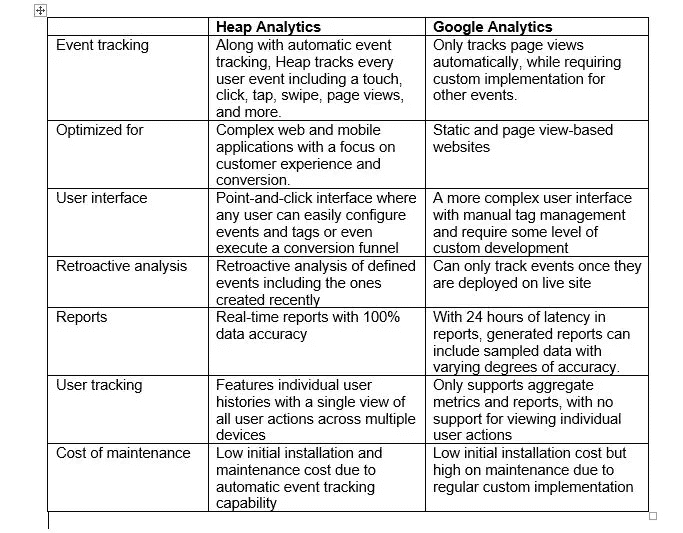

# 哪个更好？比较堆分析和谷歌分析

> 原文：<https://medium.datadriveninvestor.com/which-is-better-comparing-heap-analytics-with-google-analytics-c9a82cd2356e?source=collection_archive---------2----------------------->

无论是电子商务零售商还是任何其他企业，商业企业都希望了解他们的网站或移动应用程序的日常运行情况。进来的流量和 app 下载多吗？我的数字平台的整体客户体验如何？

作为世界上最古老和最受欢迎的数据(或 web)分析工具之一，Google Analytics 在 web 数据的收集、测量和分析方面树立了行业标杆，并为全球大小企业提供了有意义的见解。

随着网络应用和智能手机应用的日益复杂，谷歌分析在分析诸如有机网络流量减少、客户转化率和更高跳出率等趋势时，也有自己的局限性。这导致了其他分析工具的开发和采用，如堆分析，它解决了一些与谷歌分析相关的问题。

通过这篇文章，我们将评估这两种分析工具及其优缺点。

**关于谷歌分析**

Google Analytics 是 Google 为 web analytics 提供的免费增值工具，用于跟踪和报告网站流量。作为一个网络分析工具，Google Analytics 提供了你的网站在线访问者数量以及页面浏览量的信息。

**除了测量实时网络流量，你还可以使用谷歌分析:**

了解你的流量来源。

[衡量与用户相关的指标](https://www.impactbnd.com/blog/marketing-metrics-on-google-analytics)，例如独立用户数量、页面浏览量、会话数量以及平均会话时间和跳出率。

根据受欢迎程度排列你的网页。

从其他来源导入实时数据。

找出[用户的地理位置和使用的设备](https://zenmedia.com/20-things-no-clue-google-analytics/)。

创建自定义报告。

**使用谷歌分析的好处包括:**

确定你的网上商店的用户交谈率。

评估为你的网站带来流量的搜索关键词。

在个人电脑、安卓和苹果设备上的可用性

**谷歌分析的缺点包括:**

该工具的高级版本每年花费 15 万美元。

针对静态和基于页面浏览量的网站进行了更多优化。

由于工具的定期变化和功能增加，需要不断的用户培训。

要求在网站上执行一个 JavaScript 文件，以便计入访问次数

**关于堆分析**

Heap Analytics 是一款 web 分析工具，允许您捕获和测量网站或移动应用程序上的每个用户操作，包括点击、点击、滑动、页面查看、表单提交等。

**堆分析提供了以下特性:**

自动捕捉每个用户动作(无需任何手动代码)

自动跟踪用户事件

活跃用户和用户群的定义

简单的点击式用户界面，无需编写任何代码即可标记网站和移动应用

**使用堆分析的优点包括:**

更容易确定网络用户的行为和创造销售渠道

用户友好且直观，适合包括产品经理、数据分析师和 UX 设计师在内的广大用户使用。

易于安装和配置

对用户行为的实时洞察

免费使用

**堆分析的缺点包括:**

用户需要一个学习曲线来配置和生成报告。

需要 HTML 标记的基本知识

**谷歌分析或堆分析:比较**

下表提供了这两种分析工具的功能比较:

**总结**

这篇文章展示了 Google 和 Heap Analytics 在特性方面的比较。总之，Google Analytics 是跟踪网站访问页面浏览量的理想工具，而如果你想从用户跟踪和转换漏斗中获得更多商业见解，那么推荐 Heap Analytics。

— —作者 [Nagendra Bombhore](https://www.linkedin.com/in/nagi-bombhore/) (数据分析专家&Countants 的创始人)

请分享您在使用 Google 和 Heap 分析工具时可能面临的任何挑战的想法或评论。