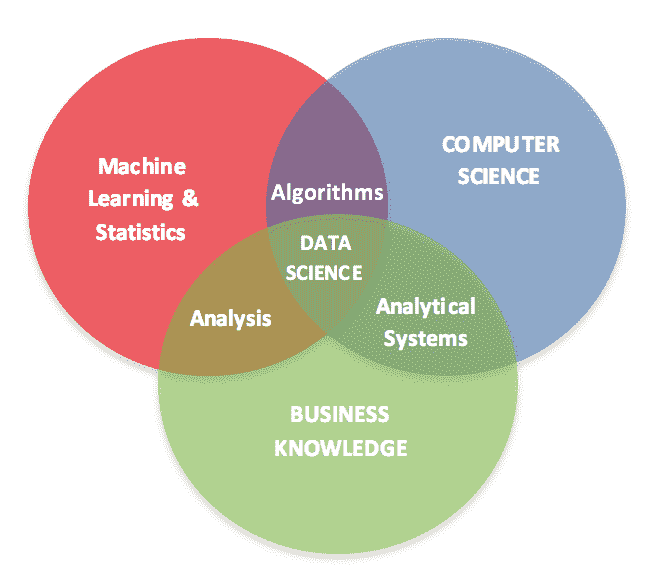
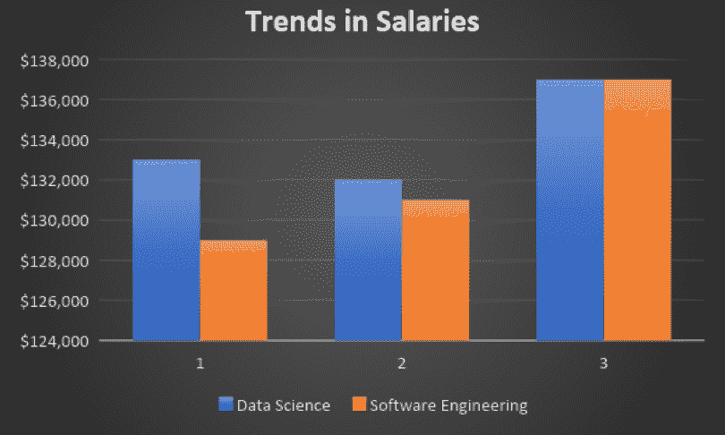

# 数据科学和软件工程哪个更有前途？

> 原文：<https://medium.datadriveninvestor.com/which-is-more-promising-data-science-or-software-engineering-7e425e9ec4f4?source=collection_archive---------1----------------------->

大约一个月前，当我坐在一家咖啡馆里为一个客户开发网站时，我发现这个女人坐在我旁边的桌子旁，观察了我很长时间。过了一会儿，她问我是不是在编码，用什么语言编码。随后进行了一次轻松的交谈，我发现她是一名数据科学家。她告诉我，由于她的背景在 BBA，她的公司希望她参加一些 Python 和[机器学习](http://www.datadriveninvestor.com/deep-learning-in-python/)的[在线课程，以更精通数据科学。在花了相当多的时间和金钱上了许多课程后，她和公司都意识到编程不是没有适当基础就能学会的东西。](http://www.datadriveninvestor.com/intro-to-python)

如今，数据科学和大数据已经成为热门词汇，这使得许多计算机科学学生和毕业生陷入两难境地，不知道哪条职业道路能确保他们有更好的未来，更不用说更高的薪酬了。他们应该选择软件工程还是数据科学？要回答这个问题，我们先来看看两者的关键区别。

# 应用领域/范围

软件工程师主要创造创造数据的产品，而数据科学家则分析所说的数据。你可以说软件工程师制造了获取信息的手段，但是数据科学家将这些信息转化为企业可以使用的有用情报。

具体来说，软件工程师致力于开发和构建供组织使用的网络和移动应用程序、操作系统和软件。另一方面，数据科学家研究收集的数据，以建立预测模型，并开发机器学习能力，以分析软件捕捉的数据。

这有什么好处呢？如果没有软件工程师，数据科学家就不会存在。话又说回来，许多人说软件工程是现在，但数据科学是未来。

就个人而言，我不敢苟同。尽管数据科学似乎是一个相对较新的术语，但它已经存在了相当一段时间。几十年来，人们一直使用计算机处理数据来预测股票市场趋势、天气和许多其他现象。这只是数据科学！

如今，随着越来越多的数据收集方法的出现，公司每天都要处理近 2.5 万亿字节的数据。在未来几年中，一般企业将处理近 50 倍以上的数据。有人必须弄清楚所有这些数据([我推荐的相关课程](http://www.datadriveninvestor.com/deep-learning-in-python/))，其中大部分是非结构化的。这就是为什么数据科学家变得几乎不可或缺。

# 资格

回到问题，数据科学家需要知道如何编程吗？不完全是。他们需要精通一些数据科学工具，并使用他们的直觉技能来了解组织和分析数据的最佳方式，并根据过去的趋势和模式做出正确的预测。话虽如此，如果你来自计算机科学背景，你有更多的选项可以选择。

# 报酬

根据 2018 年薪资状况报告，数据科学和软件工程的薪资几乎相同，平均收入为 13.7 万美元。

# 结论

最终，这一切都归结于你的个人偏好和兴趣。如果你喜欢创造东西和构建有固定结果的算法，你知道会发生什么，那么软件工程是适合你的。但如果你喜欢不可预测的事物，热爱统计数据和趋势，并且有天生的商业头脑，那么你就是未来寻找的数据科学家。

这个故事的寓意是，尽管数据科学领域每天都在发展，但它的重要性永远不会盖过软件工程师的重要性，因为我们将永远需要他们来构建数据科学家将要工作的软件。随着我们掌握的数据越来越多，我们将永远需要数据科学家来分析数据并带来业务改进。

如果你想开始这个学习之旅，我强烈推荐这个[python 入门课程！](http://www.datadriveninvestor.com/intro-to-python)

*原载于 2019 年 1 月 23 日*[*www.datadriveninvestor.com*](https://www.datadriveninvestor.com/2019/01/23/which-is-more-promising-data-science-or-software-engineering/)*。*