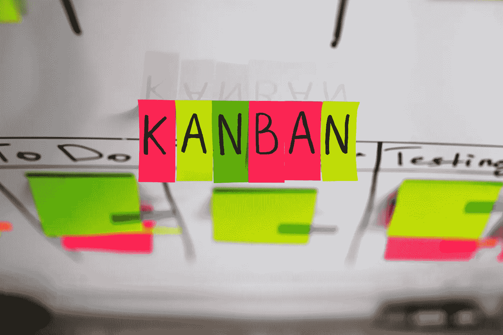
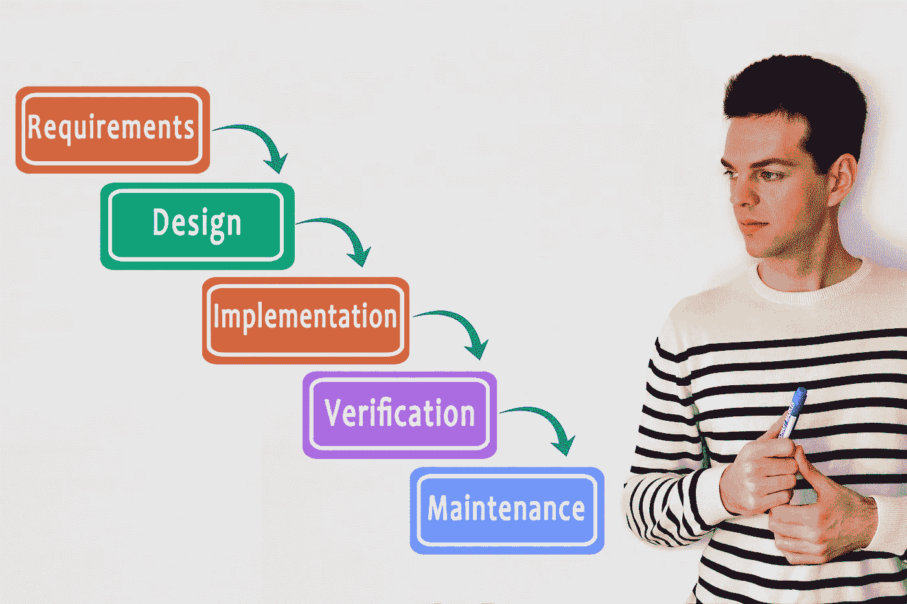

# 哪个是软件开发中最好的方法:Scrum、看板还是瀑布？

> 原文：<https://medium.datadriveninvestor.com/which-is-the-best-approach-in-software-development-scrum-kanban-or-waterfall-e89a3577217f?source=collection_archive---------14----------------------->

拥有一个结构化的软件开发方法对于确保你的产品第一次就能按时按预算完成是至关重要的。然而，有如此多的方法可供您选择。在这篇文章中，我们将分解 Scrum、看板和瀑布，这样你就可以做出一个明智的决定，决定如何组织你的下一个项目。

# 混乱

Scrum 是敏捷的变体，也是敏捷实现中最流行的过程框架之一。它是一种软件开发模型，用于管理复杂的软件和产品开发，迭代是固定长度的，称为“冲刺”，通常持续 1-2 周。这允许团队定期发布软件，并且在每个 sprint 结束时，团队成员和涉众会面讨论接下来的步骤。

Scrum 方法非常适合那些不断变化或者有非常多开发需求的开发项目。Scrum 软件开发模型从初步计划开始，接着是一些会议，最后是总结性的回顾。

这种增长方法用于软件开发，恰好包括一系列迭代来生产所需的软件。

Scrum 有一套通常不会改变的职责、角色和会议。例如，Scrum 要求为每个 sprint 提供结构的四个仪式:计划 sprint、每日站立、sprint 演示和 sprint 回顾。在每个冲刺阶段，团队将使用视觉辅助工具，如任务板或燃尽图，来显示进度并接收增量反馈。

Scrum 的好处是:

*   作为 Scrum 过程的参与者，产品负责人可以影响每个 sprint 的范围，从而产生领先于竞争对手的创新产品。
*   易于适应变化:由于 sprint 和不断的反馈，处理和适应变化是很容易的，比如在一次 sprint 中发现一个新的用户故事。如果发生这种情况，团队成员可以很容易地在 backlog 精化会议期间将该特性添加到下一个 sprint 中。
*   增加成本节约:持续的沟通确保团队意识到所有的问题和变化，只要它们出现，这有助于降低费用和提高质量。由于编码和特性测试是以小块的形式进行的，所以会有持续的反馈，错误可以在早期得到纠正，以免变得太昂贵而无法修复。

一些缺点是:

*   团队需要经验和承诺:团队需要熟悉 Scrum 原则才能成功，因为有明确的角色和责任。所有团队成员都必须参加每天的 Scrum 会议，并在项目期间留在团队中。
*   范围蔓延成为一个因素:由于缺乏具体的结束日期，一些 Scrum 项目可能会经历范围蔓延。由于没有完成日期，涉众可能会不断地请求额外的功能。

# 看板法

看板最早是由丰田生产系统和精益制造想象出来的。在 20 世纪 40 年代，丰田能够通过从超市的货架存货手册中窃取一页来改进其工程流程。工程师 Taiichi Ohno 注意到，超市库存的产品刚好满足需求，这优化了超市和顾客之间的流动。只有当货架上有空的空间时，库存才会重新进货，因为库存与消费相匹配，所以超市提高了库存管理的效率。

“看板”一词的字面翻译是“视觉标志”或“卡片”它是一个用来实现敏捷的可视化框架，显示生产什么，什么时候生产，生产多少。它鼓励对当前系统进行小的、逐步的改变，同时不需要特定的设置或程序。这意味着您可以在现有的工作流程上覆盖看板。然而，在 IT 界，看板是一种以高效的方式管理软件开发过程的技术。看板支撑着丰田的“准时制”(JIT)产品系统。管理生产线的基本机制仍然可以应用，即使生产软件是一种创造性的活动，因此不同于大规模生产汽车。

看板的优势包括:

*   减少浪费:看板围绕着减少浪费，确保团队不会浪费时间做不需要的工作或做错误的工作。
*   更大的灵活性:看板是一个流动的、不断发展的模型。没有固定的阶段持续时间，随着新信息的出现，优先级会被重新评估。

一些缺点是:

*   团队可能会使看板过于复杂:看板应该保持清晰易读。然而，一些团队成员可能会学到他们可以应用到他们的看板上的“新技巧”,通过在看板上添加这些花里胡哨的东西，只会掩盖重要的信息。
*   过时的看板会导致问题:团队必须保证看板是最新的，否则，他们将会处理不准确的信息。如果这项工作是基于一个过时的电路板完成的，它可能会破坏整个项目。

# 瀑布

瀑布模型起源于制造业和建筑业，这两个行业都是高度结构化的环境，在这种环境中，变化可能过于昂贵，有时甚至不可能..

瀑布方法遵循一个线性的、顺序的过程，这使得它成为软件工程和 it 项目中最流行的系统开发生命周期(SDLC)版本。通常，计划是通过甘特图来完成的，甘特图是一种显示每项任务开始和结束日期的条形图。一旦八个阶段中的一个完成，开发团队就进入下一步。如果不从头开始整个过程，团队就不能回到前一个阶段，并且在团队进入下一个阶段之前，需求可能需要由客户审查和批准。

瀑布的优点是:

*   需要良好记录的方法:瀑布的每个阶段都需要文档，从而更好地理解代码和测试背后的逻辑。它还为任何未来的项目留下了书面记录，或者如果利益相关者需要查看某个阶段的更多细节。
*   易于管理和使用:由于瀑布模型对于所有项目都遵循相同的顺序模式，因此易于使用和理解，并且在处理瀑布项目之前不需要任何先前的经验或培训。瀑布模型也是一个严格的模型，其中每个阶段都有具体的可交付成果和评审，因此很容易管理和控制。

缺点是:

*   制定准确的需求可能是一个挑战:瀑布项目的第一个阶段是向客户和利益相关者提出并确定他们的需求。这可能很难在项目早期准确地确定他们想要什么。在大多数情况下，客户在早期阶段并不确切地知道他们在寻找什么，相反，随着项目的进展，他们学习并确定需求。
*   变化不容易适应:一旦团队完成了一个阶段，他们就不能回头了。如果他们到达了测试阶段，并意识到需求阶段缺少了一个特性，那么回去修复它是非常困难和昂贵的。

项目管理方法中的差异只有在您一致地使用该方法时才是重要的。例如，如果您在使用瀑布时没有保持阶段的离散性，那么您还不如使用敏捷方法。话虽如此，对你的团队来说，最好的项目管理方法是你能完美执行的方法。从时间和成本方面评估你的项目，然后确定流程并坚持下去。使用一种方法的零碎部分只会让你失去最初推广这种方法的好处。因此，虽然您当然可以调整方法以供您的团队使用，但是最好按照预期使用方法，只在必要时进行调整。

*最初发表于*[*sky well . software*](https://skywell.software/blog/which-is-the-best-approach-in-software-development-scrum-kanban-or-waterfall/)*。*