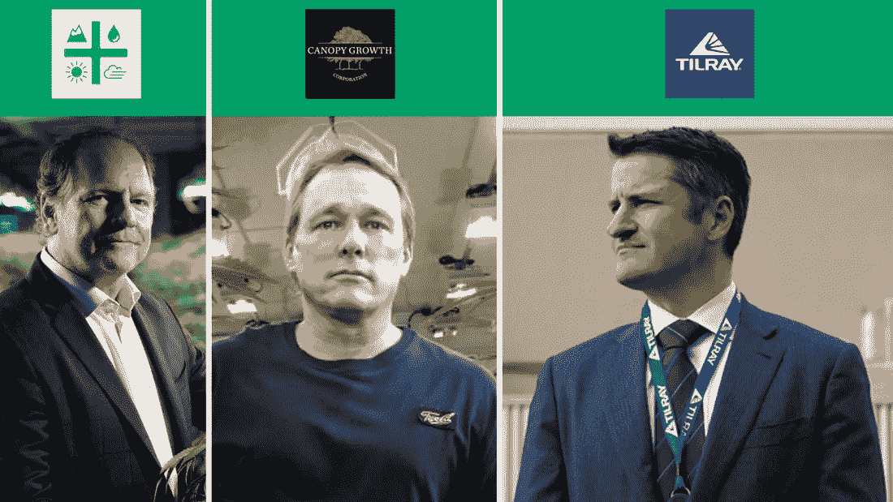
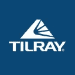

# 哪支大麻股票值得关注？极光，树冠生长，还是蒂雷？

> 原文：<https://medium.datadriveninvestor.com/which-marijuana-stock-is-watchlist-worthy-aurora-canopy-growth-or-tilray-ea70b756b2ea?source=collection_archive---------11----------------------->

> *什么大麻是药物、酒精和运动恢复[产品]的干扰剂。"
> ——首席执行官兼 Canopy Growth 联合创始人布鲁斯·林顿*

无论你是支持还是反对大麻及其合法化，布鲁斯在上面的引述中总结了这个机会，以及许多投资者兴奋的事情。对这一潜力感到兴奋的不仅仅是股市。在初创企业投资领域，情况没有什么不同。如果你对创业投资感兴趣，没有几个星期没有几个大麻创业公司出现在你面前的交易流中。兴奋还不止于此。消费品和饮料公司正在进入。 [Constellation Brands](https://stockcard.io/STZ) 、[可口可乐](https://stockcard.io/KO)和[莫尔森啤酒](https://stockcard.io/request)就是其中几家已经签署协议并向大麻市场投入大量投资的公司，目的是尽早进入含有大麻的消费品和产品市场。当出现兴奋时，价格不可避免地被推高，非理性繁荣弥漫在空气中。所有的烟和镜背后有没有真火？

在今天的《股票卡周刊》上，我们看到三家大麻公司有着三种截然不同的价格销售比(哇？)来看看哪只股票值得我们关注，并最终进入我们的长期投资组合。今天的参赛选手有:[奥罗拉大麻公司](https://stockcard.io/ACBFF)，[树冠生长公司](https://stockcard.io/CGC)，[蒂尔雷公司](https://stockcard.io/REQUEST)。

注:所有数字均基于 2018 年 9 月 29 日的最新数据。如果你在晚些时候阅读这个版本，信息可能会有很大的不同。聪明点，检查你的数字。

在我们继续之前，当你读到我们用价格与销售比率来比较今天的大麻股票观察名单之战的参赛者时，你说了“哇”吗？如果你不知道为什么和意味着什么，也许你应该考虑加入[如何投资大学](https://www.howtoinvest.university/)；)!不管怎样，最常见的是，我们用股票每一美元收益的价格来看一只股票的价格是高还是低。它被称为市盈率。今天，因为大多数大麻公司没有收入或收入不可靠，我们选择使用价格销售比来表示每销售一美元股票的价格。这仍然是评估一只股票有多贵的可靠方法。好吧，我们继续！

**$奥罗拉大麻公司(价格销售比:104.17)**

奥罗拉大麻公司是可口可乐公司的大麻合作伙伴。这笔交易最近刚刚完成，被视为对该公司作为市场领导者实力的认可。此外，Aurora 大麻寻求成为大麻的“亚马逊”。2018 年 5 月，该公司宣布了收购 MedReleaf 的计划。这使 Aurora 大麻进入了另外四个地理市场。据其创始人兼首席执行官特里·布斯称，Aurora 大麻公司计划通过收购进一步扩张。尽管令人兴奋，并且是当今竞争中价格最便宜的公司，但该公司花费 1 亿美元产生 0.4 亿美元的收入和-1.7 亿美元的自由现金流。该公司和该行业大多数公司的投资者面临的挑战是稀释性可转换票据、负现金流以及美国和全球大麻合法化的不确定性。

**参观** [极光大麻‘股票卡](https://stockcard.io/ACBFF)

**$$ Canopy Growth Corporation(价格销售比:142.56)**

Canopy Growth Corporation 是全球最大的医用大麻生产商之一，业务遍及全球 11 个国家。这也是第一家能够让主要非大麻玩家抓住市场增长机会的公司。Constellation Brands 是该公司的合作伙伴和投资者，两人共同关注大麻饮料市场。尽管有强劲的迹象，但该公司花费了 0.9 亿美元，产生了 0.6 亿美元的收入和-0.2 亿美元的自由现金流。Canopy Growth 报告了 2018 年 6 月的年度和第四季度收益。其年收入同比增长 95%。该公司正在快速发展，在非洲、欧洲和澳大利亚都有扩张。它在德国的第四季度收入表现出色。该公司最近推出了 Spectrum 软胶囊，促进了销售。Canopy Health Innovations 的一系列基于大麻的专利药物最近获得批准，在计划的一系列临床试验中进行首次试验。这对公司来说是一大进步。难怪这只股票的价格高于 Aurora 大麻。Canopy Growth 着眼于最多样化的增长可能性，包括不同产品类别和多个地理市场。

**访问** [冠层生长‘股票卡](https://stockcard.io/CGC)

**$$$蒂尔雷公司(价格销售比:584.43)**

在三位参赛者中，蒂尔雷是最不为人知的。最近，该公司受到了媒体的高度关注，因为在 2017 年首次公开募股后，该公司的股票在短短一年内增长了 10 倍，而销售额却没有任何大的增长。如你所见，以 584.83 倍的销售额，这是你可能遇到的最贵的股票之一。虽然增长的机会很大，但该公司的大部分股价上涨是由财务驱动的，而不是运营驱动的。换句话说，这是一个微不足道的商业胜利，而是宣布澳大利亚的一些医院正在使用该公司的产品。虽然这个消息在本质上是重大的，并表明制药公司进入市场的可能性，但没有销售数字显示机会的规模。在最新公告之前，只有 29 名患者在使用该公司的产品。并且，最新的声明并没有提供任何与澳大利亚医院协议的清晰程度。在这一消息的推动下，由于投资者在公开市场上可以交易的股票数量非常少，这只股票迅速而疯狂地转手(没有双关语的意思)。在过去的几天里，我们最终看到了两位数的价格上下波动。

**访问** [**Tilray 股票卡**](https://stockcard.io/TLRY)

谁是我们值得关注的人选？

这很难，因为这三家公司都非常昂贵。其中一个很容易消除。尽管如果与医疗或制药公司签署大规模协议，Tilray 可能会带来潜在的增长机会，但在炒作周期的这一点上，没有确凿的证据证明投资该公司是合理的。销售没有大的改善，加上高交易量让我们想起了另一个热潮。20K 美元的比特币，有吗？这样，极光和树冠生长之间的战斗就开始了。Canopy Growth 是一家有趣的公司。该公司的发展并不依赖于娱乐用大麻的合法化。该公司已明确表示，它只在各级政府都已合法化的市场上运营。此外，过去几个月的一些战略合作增加了我对这只股票的信心。与 Constellation Brands 合作生产大麻饮料以及在澳大利亚和德国的分销协议就是几个重要的例子。即使没有娱乐性大麻合法化，该公司也准备在一个不断增长的市场中发展。另一方面，Aurora 的每克生产成本是其主要竞争对手中最低的，对其即将投产的 Sky 工厂的投资预计将使 Aurora 大麻的生产能力大大提高。在加拿大市场最重要的玩家中，Aurora 是在合法化后建立了稳定的分销流程来服务加拿大市场的玩家。与可口可乐公司达成的生产一种新的健康饮料的潜在协议也是一个开辟新的收入来源的机会。结合最低的价格销售比，在这一点上，我将 Aurora 大麻加入我的观察名单，监控一段时间，并可能在未来几个月或几个季度买入一些股票。

这一版股票卡战到此为止，大麻版。一定要在评论区分享你的想法和主意。

投资愉快！

**除了朝九晚五的工作，你有什么创造财富的计划？**

你知道你不会因为朝九晚五的工作和投资储蓄账户而变得富有和经济独立。不要成为那些一直拖延学习如何长期投资股票市场的人之一！

参加为期一天的[如何投资大学](https://www.howtoinvest.university/)，由 Stock Card 的联合创始人兼首席执行官和公司的投资负责人主持。11 月 8 日在 SF 的 FiDi。

与长期投资者同行一起学习、讨论、吃喝和建立关系网，以建立个性化的长期投资计划。

没有术语，充满啊哈时刻，专为资金量小、经验有限的投资者设计，最终开始长期投资！

为期一天的研讨会，为多年的智能和长期投资奠定坚实的基础！

今天就享受普通入场券八折优惠！[立即行动](https://www.eventbrite.com/e/how-to-invest-workshop-stock-market-investing-simplified-registration-49908563858)