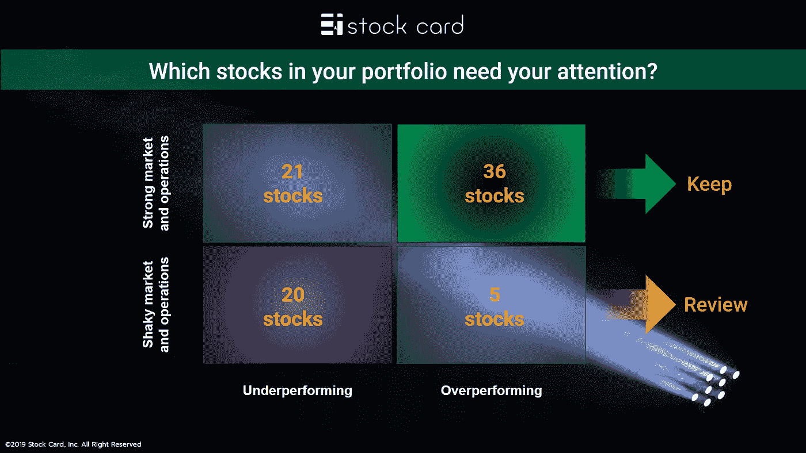
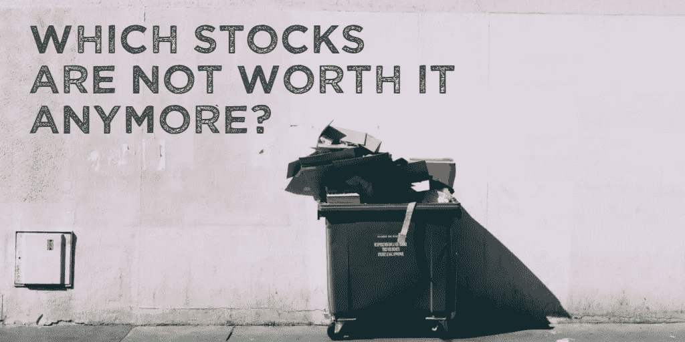
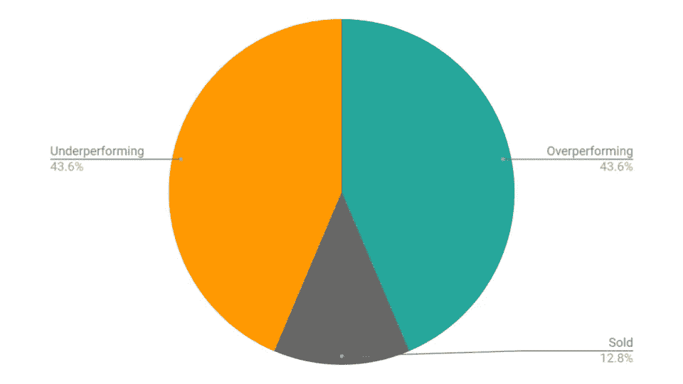
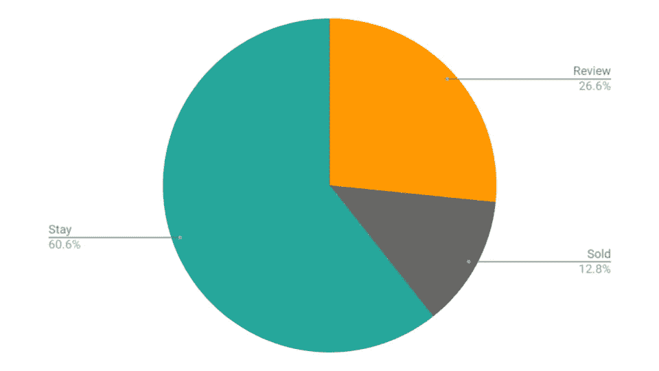

# 哪些股票在你的投资组合中已经一文不值了？

> 原文：<https://medium.datadriveninvestor.com/which-stocks-are-not-worth-a-spot-in-your-portfolio-anymore-a74893097587?source=collection_archive---------8----------------------->

## 七月是做你的年中投资组合回顾的好时机，并确定哪些赢家应该持有，哪些输家应该抛弃。这是一个详细的分步指南。

伙计们，你们多久回顾一次自己的全部投资组合？你多久清理一次你的监视名单？

 [## 算法交易的机器学习|数据驱动的投资者

### 当你的一个朋友在脸书上传你的新海滩照，平台建议给你的脸加上标签，这是…

www.datadriveninvestor.com](https://www.datadriveninvestor.com/2019/01/30/machine-learning-for-stock-market-investing/) 

对我来说，每年至少发生两次。12 月，我发表了我的 [2018 漂流者作品集](https://stockcard.io/portfoliostore/Castaways_2018)。我们经历了[股票卡的宇宙](https://stockcard.io/allstockcards)，摆脱了那些不再值得我们花费时间和关注的公司。随着七月的到来，是时候再次回顾一下事情的进展了。

目标是确保我们持有的股票仍然值得持有，我们观察名单上的股票仍然值得我们关注。在 7 月份，当我进行半年一次的清理时，你会从我和我的[以及我们的 CEO](https://stockcard.io/portfoliostore/Roll_With_Our_CEO) 组合那里听到很多。

**下面是我将遵循的 4 部分清单，以完成我 7 月份的大扫除:**

**获胜者:**

*   我相信我的投资组合中增长最快的公司能够继续增长吗？或者说，是时候卖出，挑选其他股票了？

**失败者:**

*   我有理由持有投资组合中损失最大的公司吗？或者，我应该卖掉它们，把损失用于税收目的，并选择其他股票吗？

**防撞:**

*   我有足够的现金来利用任何可能的市场下跌吗？

**观察列表:**

*   在我的观察名单上，哪些公司已经被证明运营强劲，可以加入我的投资组合？
*   在我的观察名单上，哪些公司的运营弱点已经暴露无遗，不值得我再浪费时间了？

你准备好为你自己的投资组合做同样的事情了吗？

在上一节中，我们谈到了 7 月是审查我们的投资组合和观察名单的月份，以确定哪些股票值得我们关注，哪些股票已经失去了光泽。我跟你分享了一份四部分清单。清单中的前两个问题是关于我们投资组合中哪些赢家值得持有，哪些输家不再值得我们浪费时间。

在这一部分，我想分享我们回答清单前两个问题的方法。这是一封详细的电子邮件，详细介绍了我们在 7 月份清理投资组合时使用的一步一步的流程。我们开始吧。

**第一步**

我和我们的首席执行官的投资组合中有 94 只股票在我的[名下。首先，我想根据与整体市场相比的总回报来确定赢家和输家。我在](https://stockcard.io/portfoliostore/Roll_With_Our_CEO)[股票卡](https://stockcard.io/allstockcards)上有所有这些信息。如果你进入[追踪你的表现](https://stockcard.io/myportfolio)页面，每个投资组合的最后一栏显示了你的股票相对于标准普尔 500 指数的收益。我用那个专栏把我的股票分为表现优异(赢家)和表现不佳(输家)的股票。结果是这样的:

请注意，一只表现不佳(亏损)的股票可能已经涨得更高，但不仅仅是快于整体市场。虽然不亏钱很好，但跑赢市场才是最重要的。如果他们表现不佳，你会想更深入地挖掘，弄清楚你是否能看到公司超越市场的合理路径。否则，它需要被铸造以释放现金用于更强的选择。

**第二步**

我采取的下一步是根据市场潜力和运营实力，将我的[名单中的股票与我们的 CEO 组合](https://stockcard.io/portfoliostore/Roll_With_Our_CEO)进行分组。同样，这些信息可在[跟踪您的表现](https://stockcard.io/myportfolio/)页面上找到。看股票卡的 2X2 缩略图([在所有股票卡页面](https://stockcard.io/allstockcards))，如你所知，最上面的两种颜色分别代表“市场潜力”和“公司实力”。如果市场潜力和公司实力类别都是黄色、灰色或红色，表明公司的市场或运营存在潜在的弱点，我会将该公司标记为需要“评估”的股票结果是这样的:

**第三步**

现在，让我进一步分析，看看有多少股票是真正值得关注的，因为它们不仅“跑输”市场，而且还需要“评估”。这是我非常兴奋的部分。这是我的投资组合图，基于我最需要关注的地方:

在接下来的几周里，我将分享我投资组合中表现差于市场、市场潜力和操作不稳定的 20 只股票的详细回顾。[这些公司的股票卡](https://stockcard.io/allstockcards)将得到全面的审查和更新，如果有任何公司值得增加或取消，你会得到通知。敬请关注下次更新。

**你的下一步:**

现在，轮到你开始你的 7 月投资组合回顾了。你有多少股票的表现低于市场？还有，哪些是市场和运营不稳定的组合？