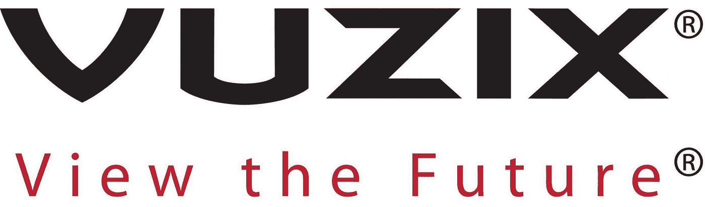

# 我应该考虑哪些具有重大颠覆性潜力的潜力股？

> 原文：<https://medium.datadriveninvestor.com/which-under-the-radar-stocks-should-i-consider-with-significant-disruptive-potential-663bd2145855?source=collection_archive---------4----------------------->

尽管贸易战仍在悬崖上进行，但分析师们仍然对未来几年 T2 某些行业的增长抱有坚定的信心。许多拥有科技和区块链空间的上市公司预计将大幅上涨，还有其他一些公司。让我们来看看投资者对市场上一些最不受关注的股票有什么看法。

过去几年，亚洲科技公司(如阿里巴巴和 HTC 等规模较小的公司)表现尤为出色。这是所有议论的地方(也是一些稍微落后于潮流的人目前所处的位置)。该地区最新的创业公司和小型科技公司被誉为比美国同行更好的[。尽管有贸易萧条和全面衰退的传言，今年资金仍源源不断。](https://www.economist.com/business/2018/02/15/how-does-chinese-tech-stack-up-against-american-tech)

在太平洋的另一边，行业专家和分析师齐聚一堂，参加几十年来首次在美国举行的世界天然气大会。该会议汇集了业内一些最大的参与者；来自世界各地的监管者、行业高管和外交官坐在一起讨论行业的十字路口。会议上最大的嗡嗡声可能来自天然气行业。“更清洁”的化石燃料(相对于煤炭而言)的支持者将天然气吹捧为美国的下一个大出口。然而，化石燃料的批评者说，它燃烧的甲烷比人们相信的要多。谁是对的？不管怎样，天然气能像分析师所说的那样成为一个爆炸性的产业吗？

在这篇文章中，我看了这两个行业的股票，并提出了我的观点。我们分析了一些最新消息，讨论了其他分析师的观点，并概述了投资者在考虑股票时应该了解的内容。

# CLNE

当世界各地的能源投资者观看在华盛顿举行的世界天然气大会时，每个人都在 T2 猜测中美之间是否会爆发一场全面的贸易战。与此同时，美国几家主要的物流公司[宣布推出依赖天然气的车辆](https://www.reuters.com/article/us-ups-energy/ups-to-spend-130-million-on-new-natural-gas-vehicles-fueling-stations-idUSKBN1JF1NM)。美国和中国之间的贸易战会扼杀该行业的增长吗？

然而天然气是一个圆滑的话题。虽然有些人认为美国需要更多地接受天然气作为“国家财富”，但其他人对化石燃料表示怀疑，认为它排放的甲烷比我们相信的要多。一份独立杂志的报告表明，美国的气体排放量比政府报告的高 60%。

然而，与煤相比，天然气是一种更好的替代品，可能是能源发展的下一个环节。相比之下，煤一年产生的甲烷量相当于天然气 20 年产生的甲烷量。虽然甲烷排放仍然存在，但这是两害相权取其轻。

美国一直致力于成为更大的液化天然气(LNG)出口国，尤其是在阿拉斯加。中国等地需求的激增将会导致对天然气和液化天然气的需求增加，但目前，天然气的产量也达到了历史最高水平。

# 武齐

增强现实眼镜制造商 Vuzix 经历了火热的 30 天，比上个月这个时候的交易价格高出约 33%。这家 AR 眼镜制造商较 2010 年创下的 12.38 美元的历史高点下跌了约 40%。然而，[最近的发展](https://www.vuzix.com/News)如公司重组和过去几个月 Russel 2000 的增加可能会使 VUZI 回到它最初进入市场时达到的高度。

# 罗库

作为网飞最大的竞争对手之一，Roku 希望成为电视未来的一部分。大约有 1500 万人将会切割和弦(Chord Cutters)，Roku 为其不断增长的用户群提供了重要的选择，让他们可以通过流媒体应用程序继续观看他们最喜欢的一些电视台。虽然他们开始是为家庭电视提供新的互联网视频节目的利基市场，但现在有传言称，该公司正在创建一个电视节目和电影订阅的一站式市场。

像传闻中的这样的服务是电视观看进化中不可避免的下一步。像网飞和爱奇艺这样的竞争对手是否能够克服目前的障碍，提供像 Roku 这样的下一波产品将是一个谜。这些公司必须迅速做出反应，以跟上 Roku 不断增长的用户群，目前用户群的规模是网飞的 1/6，并且每年以大约 35%的速度增长。

这些股票的表现取决于与市场直接和间接相关的因素。如果发生全球贸易战，最具创新性的设计将无法获得原本可以获得的资金。政府对技术的支持和行业监管等其他因素也可能影响股票表现。如果一切顺利，ROKU 和 VUZI 没有理由不是好的投资。

*原载于 2018 年 7 月 26 日*[*www.datadriveninvestor.com*](http://www.datadriveninvestor.com/2018/07/26/which-under-the-radar-stocks-should-i-consider-with-significant-disruptive-potential/)*。*