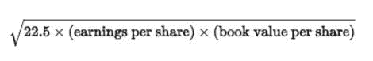
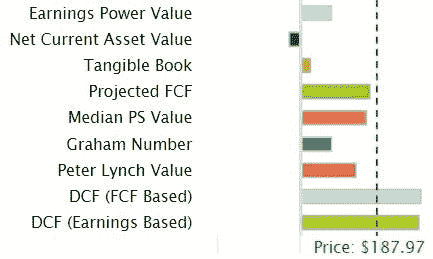
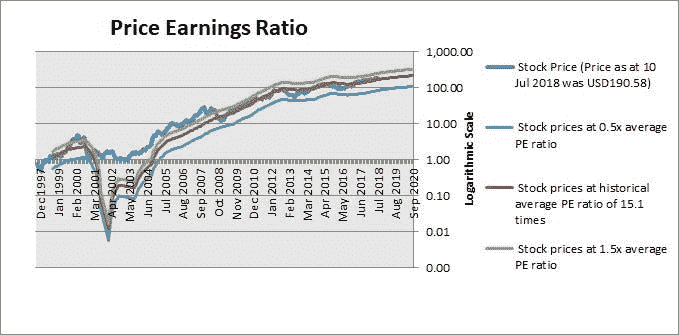
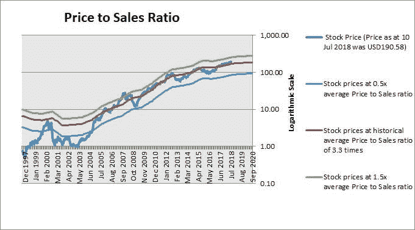
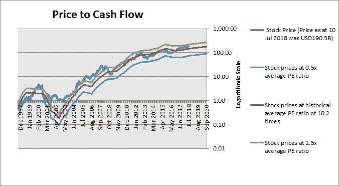
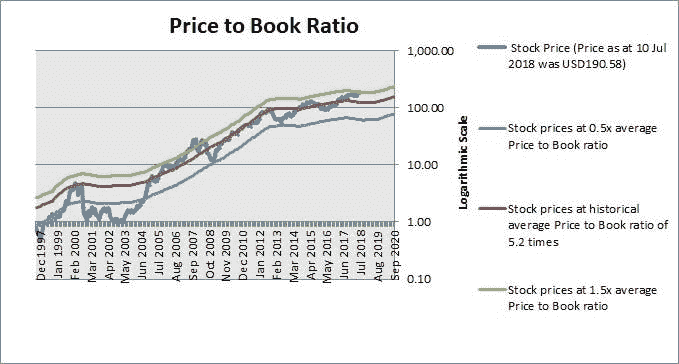
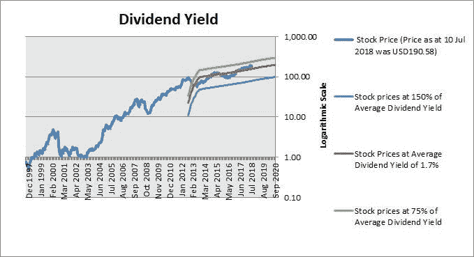
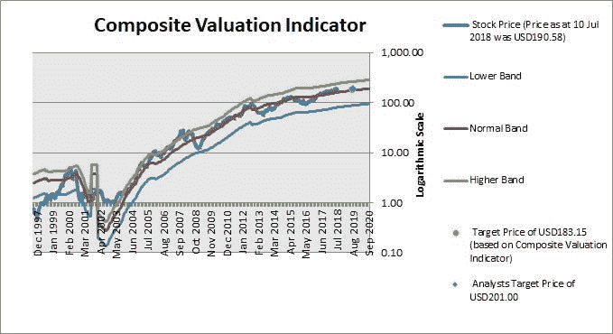

# 使用哪个评估指标——让数据来决定

> 原文：<https://medium.datadriveninvestor.com/which-valuation-indicator-to-use-let-the-data-decide-91f223f2afc3?source=collection_archive---------1----------------------->

*   有许多评估指标可以用来评估股票
*   不同的指标给出的估值差异很大，让投资者很难得出结论
*   具有讽刺意味的是，最好的决定方式不是自己决定，而是让数据决定哪个指标是最好的

# 许多估价指标

## 基于收益的估价

评估一只股票的价值有很多方法。每一种都有自己的投资者追随者，而且每一种都可以追溯到推广它的投资大师。

最常见的股票估值指标无疑是市盈率。它衡量的是与股票收益相比，你为股票支付的次数。这种方法很直观，可以用来比较各行各业利润率相差很大的公司。无论你是对一家净利润率为 40%的生物技术公司进行估值，还是对一家利润率为 3%的折扣店进行估值，都没有关系，因为我们关注的是底线利润数字，它已经考虑了利润率。

要使用这种方法，我们需要找出公司前几年的平均市盈率，然后用它乘以当前或未来的每股收益。

由于不完全在管理层控制范围内的因素，底线净利润可能会经历大幅度波动，因此有时会使用市盈率的变化——市值与 EBIT(息税前利润)的比率——来消除不完全在管理层控制范围内的税收和利息支付的影响。

一些公司目前可能处于亏损状态，甚至可能在未来几年都处于亏损状态。这使得 PE 不是评估股票价值的合适方法。为了克服这一点，使用了现金流量折现法，因为它考虑了未来的收益方式，并对其应用了适当的贴现率。

## 基于现金流的估价

会计利润可能会受到操纵。因此，一些投资者更喜欢根据公司经营活动产生的现金流来对公司进行估值。它也是对市盈率的现实检验，因为如果一家公司产生高利润，但没有经营性现金流，它可能会陷入困境，因为是现金支付运营费用。一个公司可以记录高利润，但低现金流，因为现金被固定在营运资本中。例如，产品销售给客户是有利润的，但它们是赊销的，公司很难从客户那里收回现金。或者，公司赚的钱可能会被过多的库存套牢，从而耗尽现金流。此外，一些公司可能会采用创造性的会计方法来夸大收益。所有这些原因使得一些投资者更喜欢用现金流来评估股票，而不是收益。根据经营现金流对公司进行估值的一个简单方法是使用价格与现金流比率。

正如市盈率可能因为公司正在经历亏损而不合适一样，如果公司现在或未来几年正在经历负现金流，价格与现金流比率也可能不合适。现金流量贴现法也可以应用于现金流量而不是收益来计算股票价值。

另一种基于现金流的估值方法是收益幂值。这是哥伦比亚大学教授布鲁斯·格林沃尔德开发的一种方法。这种方法通过以下公式计算股票价值:调整后的收益/资本成本。调整后的收益是通过从会计收益中扣除维持公司运营所需的资本支出而得出的。因此，它与自由现金流非常相似。资本成本是公司使其业务有价值所需的回报率。

## 基于销售的估价

价格销售比是一个常用的股票估值指标。虽然不像市盈率那样受欢迎，但它甚至可以在公司不盈利或盈利很少的时候使用。然而，它不应该单独使用，因为一个公司可能实现了销售而不是利润，这意味着该公司没有产生价值。使用这种方法，我们找出公司前几年的平均价格与销售额的比率，然后乘以公司当前或未来的销售额。

## 基于资产的估价

市盈率、销售价格比和现金流价格比都是根据一家公司产生的利润(即利润、销售额或现金流)来评估其价值的。基于账面价值(即资产减去负债)对一家公司进行估值是不同的，因为它基于*拥有的*对一家公司进行估值。对于经常重估其资产和负债的金融机构或拥有庞大资产基础的公司(如工业或公用事业公司),这通常是一个合适的估价指标。账面价值提供了公司的理论清算价值。

根据资产对公司进行估值的最常见方法是使用市净率。使用这种方法，我们可以确定公司前几年交易的平均市净率，并将其乘以公司当前或未来的账面价值。

当使用账面价值对一家公司进行估值时，投资者通常会剔除商誉和其他储备等无形资产，因为当一家公司被清算时，这些资产通常不会带来任何价值。

净流动资产价值法也是根据公司的资产来评估公司的价值。它的公式是:股票价值=现金和短期投资+(应收账款 x 75%) +(存货 x 50%)-总负债

它不考虑有形资产总额减去负债总额，只考虑流动资产，而忽略长期资产(如厂房和机器)，因为当公司清算时，这些资产通常一文不值。即使流动资产也被向下调整，以反映这样一个事实，即在清算事件中，不是所有的应收账款都可以收回，也不是所有的存货都可以出售变现。从这个调整后的流动资产价值中，我们减去公司的总负债。

## 基于股息的指标

对于有支付有意义股息历史的股票，股价通常取决于公司支付多少股息。许多支付高额或持续股息的股票(如房地产投资信托基金)都属于这一类。

当我们根据股息对股票进行估值时，我们会计算过去的平均股息收益率(股息/股价),并将其应用于当前或未来的股息。

## 综合估价指标

有些方法不是单纯使用收益、销售额、现金流、账面价值或股息来评估一家公司，而是混合使用这些指标。

预计自由现金流量(FCF)法结合了现金流量和账面价值。这种方法计算股票价值如下:股票价值=(适当的倍数)x 自由现金流的 6 年平均值+总股本 x 80%。自由现金流是公司在扣除资本支出后可获得的现金流。由于自由现金流往往不稳定，因此使用 6 年平均值来平滑该数字。然后，该公式增加了 80%的股权价值，因为它将公司的部分价值归因于其资产支持。

格雷厄姆指数(以本杰明·格拉哈姆命名)是另一个综合估值指标，但它将收益与账面价值结合在一起。它采用公式:

格雷厄姆认为，本益比不应超过 15，市净率不应超过 1.5。因此，每股价格/收益 x 每股价格/账面价值不应超过 22.5(即 15 x 1.5)。这种推理导致上述格雷厄姆数，被认为便宜的股票是那些价格没有超过这个数的股票。

# 不同的指标给你不同的结论

有必要使用不同的估价方法来对股票进行适当的估价。这是因为虽然每种估价方法都有其优点，但也有其缺点。当公司有负的收益或现金流时，基于收益和现金流的方法是没有意义的。基于销售的方法更稳定，因为销售从来不是负数。然而，这并没有告诉我们该公司是否能够盈利销售。基于资产的方法给我们一个指示，表明我们为公司的资产支付了多少，但资产与公司的盈利能力没有直接关系。

虽然根据多个指标对股票进行估值很重要，但它们有时会导致对估值的不同看法。一个指标可能告诉你一只股票被高估，而另一个指标告诉你它被低估。

以苹果公司这样的知名股票为例，下面的图表显示了使用不同方法计算的苹果公司的股票价值。

来源:www.gurufocus.com

投资者应该依靠哪种方法？根据他选择的方法，苹果的股票可能会被强买或强卖。

通常，投资者选择他喜欢的方法是基于他对公式背后的基本原理的认同，或者他对方法发明者的亲和力。然而，在没有首先从数学上或视觉上确认这个指标在过去很好地解释了股价的情况下，依赖任何指标都是危险的。如果过去的股票价格与这个指标确定的股票价值相关性很小，为什么要相信这个指标告诉你它的当前价值应该是多少？

如果一个投资者想靠几种方法给他股票价值怎么办？他应该如何组合不同的方法？他应该将价格与销售、价格与收益还是价格与账面、价格与现金流结合起来？

这些都是困难的问题，我想建议我们不要主观地选择采用哪些指标，而是让数据来决定。我的意思是，我们应该结合不同的指标，从数学上选择对过去价格有最佳解释力的组合。我们最好的选择是依靠这个综合指标来告诉我们未来价格应该如何变化。

让我们看看这种方法如何应用于苹果公司(AAPL)

# 股票估价

我们首先从流行指标的角度来看估值——市盈率、销售价格比、现金流价格比、账面价格比和股息率。

来源:www.ProThinker.com

截至 2018 年 7 月 10 日，苹果公司的股价为 190.58 美元，市盈率为 17.1 倍。这比其 14.4 倍的历史平均市盈率溢价 19.1%。(红线表示基于公司历史平均 PE 的价格。)

以 2018 年 7 月 10 日 190.58 美元的价格计算，苹果公司的交易价格与销售额之比为过去 12 个月销售额的 3.8 倍。这比其 3.3 倍的历史平均价格销售比溢价 14.0%。

截至 2018 年 7 月 10 日，苹果公司的股价为 190.58 美元，股价与现金流之比是过去 12 个月现金流的 13.4 倍。这比其 10.2 倍的历史平均价格与现金流比率溢价 32.0%。

以 2018 年 7 月 10 日 190.58 美元的价格计算，苹果公司的市净率是当前账面价值的 8.0 倍。这比其 5.2 倍的历史平均市净率溢价 53%。

2018 年 7 月 10 日，苹果公司股价为 190.58 美元，股息率为 1.4%。这比其 1.7%的历史平均股息收益率高出 15.7%。(注:股息率越低/越高，股票越贵/越便宜。)

如上所述，我认为，与其主观选择依赖哪个指标，不如让数据来决定，选择最能从数学上解释股价的指标组合。

利用过去的数据，我们发现了一个综合估值指标，它使用了一组指标，比上面任何一个单独的指标都更好地解释了股票价格。它给你一个关于股票的结论——它是被低估了还是被高估了，以及被高估了多少。

根据综合估值指标，该股 12 个月内的目标价为 183.15 美元。基于 2018 年 7 月 10 日的股价 190.58 美元，我们的目标价下跌 3.9%。目标价格考虑了公司的适当估值及其未来基本面，即利润、销售、现金流、账面价值、股息等。

# 结论

评估一只股票的价值有很多方法。这很好，因为不同的指标有不同的优势和劣势。然而，单独使用不同指标的问题是，我们最终会得出不同的结论，并且不知道如何行动。

与其主观选择我们喜欢的指标，不如让数据来决定。首先，我们在很长一段时间内运行这些数字，并根据收益、销售、现金流、账面价值和股息确定平均估值。然后，我们将这些独立的指标以不同的排列组合在一起，直到我们找到能够从数学上最好地解释股票价格的组合。这个综合指标给了我们对股票价格未来走势的最大信心。

**数据来源**:估值图来自 ProThinker 股票报告。公司描述、历史财务报表数据和价格数据均来自 gurufocus.com。估计来自 gurufocus 和/或 4-traders.com-汤森路透。

**免责声明**:本报告仅供参考，不应被视为买卖任何证券的邀约。ProThinker 或任何其他方均不保证其准确性，也不保证其使用结果。未经 ProThinker 的明确书面同意，禁止再分发。版权所有(c) 2018。保留所有权利。

*原载于 2018 年 7 月 11 日*[*【www.datadriveninvestor.com】*](http://www.datadriveninvestor.com/2018/07/11/which-valuation-indicator-to-use-let-the-data-decide/)*。*