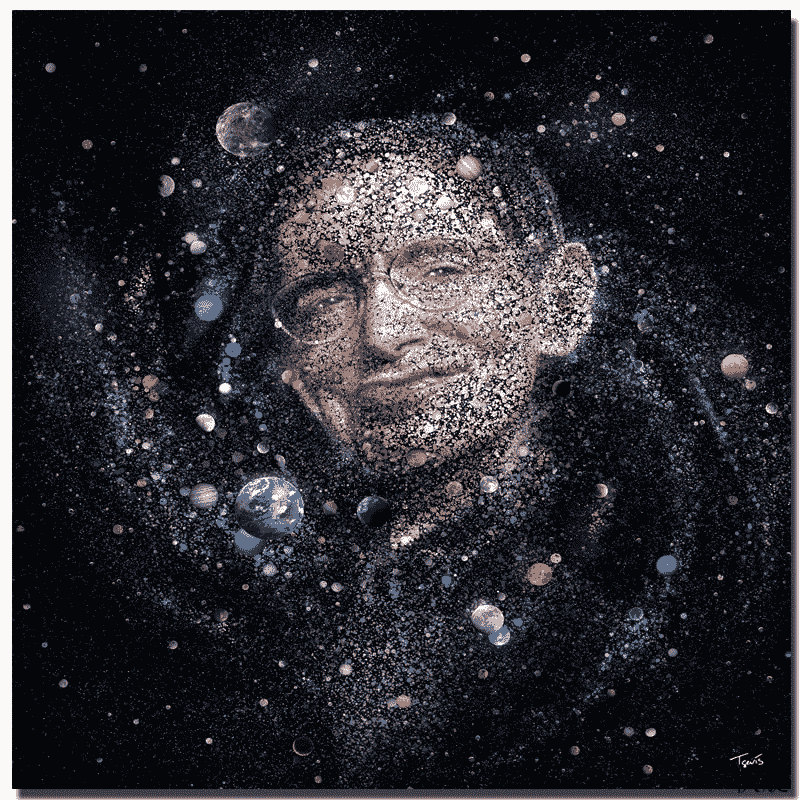

# "只要有生命，就有希望。"

> 原文：<https://medium.datadriveninvestor.com/while-theres-life-there-is-hope-cf4b7b6716bf?source=collection_archive---------3----------------------->

## 斯蒂芬·霍金告诉我，生活是由你自己创造的

在研究未来的变化时，我最崇拜的人是斯蒂芬·霍金。

斯蒂芬·霍金，一个不可思议的人，他不仅在广义相对论的框架下基于引力奇点定理创作了他的作品，而且在医生预测他的死亡日期后不可思议地活了 50 年。斯蒂芬·霍金不断向前推进的意愿和他持续的好奇心使他有了许多发现，同时激励了数百万人。

 [## 面向 Noobs |数据驱动型投资者的数字身份

### 聪明人如何在增强现实中创造身份价值？我最近刚满 40 岁。作为一个生物…

www.datadriveninvestor.com](https://www.datadriveninvestor.com/2019/02/28/digital-identity-for-noobs/) 

斯蒂芬·霍金的一句名言，我一直珍藏在心中

> “记得抬头看星星，不要低头看脚下。试着理解你所看到的，并思考是什么让宇宙存在。好奇。无论生活看起来多么艰难，总有一些事情你可以去做并取得成功。重要的是，你不能就这么放弃。”

我们为什么要质疑一切？

在读完史蒂芬·霍金去世前创作的最后一本书《大问题的简要回答》后，我意识到不断提问的重要性。有些问题诱使读者和我自己相信它们很容易回答，但并不像我想象的那样简单。诸如“这一切是如何开始的？”，“有上帝吗？”，“时间旅行可能吗？”，以及“我们会在地球上生存吗？”这些问题看似简单，但由于缺乏科学支持和不可预测性，实际上并非如此。

当谈到人类在这个地球上的存在时，有太多的问题。诸如“宇宙是如何开始的？”，“这一切背后的意义和设计是什么？”，以及“外面有人吗？."斯蒂芬·霍金相信最好地利用你在地球上拥有的时间，因为他不相信来世，在他最初被给予的有限生命中，他决定不仅为自己充分利用它，而且对世界产生影响，这创造了一个没有人会忘记的标记。正如他在书中所说，

> “在这个世界上，时间非常宝贵，所以我们必须抓住每一刻。现在就行动。”

不仅质疑一切，而且相当希望立即得到答案，这只是人类本性的一部分，而这并不总是发生在所有的问题上。

通过阅读这本书，我当然意识到了知识的重要性，尤其是与科学相关的知识。因为科学是帮助我们人类理解地球最大问题的工具，所以用一生的时间研究它并不重要，但重要的是至少知道最起码的知识，这样我们才能多少理解我们对这个地球和生命本身的大问题的基础。