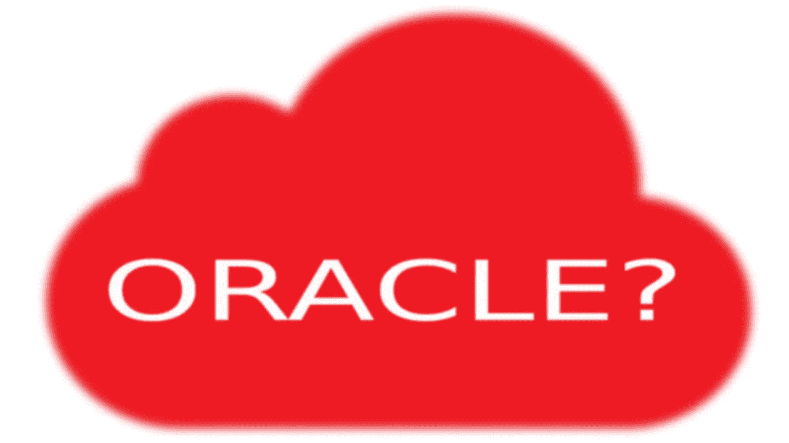

# 神谕在哪里？

> 原文：<https://medium.datadriveninvestor.com/whither-oracle-f77a4736bac2?source=collection_archive---------5----------------------->

## 对偶像未来的思考

Oracle?

一个 mazon 最近[大肆宣传宣布](https://www.businessinsider.com/amazon-consumer-business-last-oracle-database-aws-2019-10)他们已经从 Oracle 上迁移了 75*Pb 的数据*看起来像是噱头和实际的业务驱动的举动。

但中心点是清楚的:甲骨文和它的旗舰数据库管理系统不再是他们曾经是必不可少的软件组件。

亚马逊认为*他们*不再需要甲骨文，而*企业*也不需要甲骨文。

 [## 信息图:云之旅|数据驱动的投资者

### 聪明的企业领导者了解利用云的价值。随着数据存储需求的增长，他们已经…

www.datadriveninvestor.com](https://www.datadriveninvestor.com/2018/09/22/infographic-journey-to-the-clouds/) 

racle 是一艘老旧的大船，目前市值 1800 亿美元。但与微软(1.07 万亿美元)或亚马逊(8840 亿美元)相比，它实际上相当小。

面对亚马逊网络服务的生存挑战，甲骨文和它的同行都经历了疯狂的投资。甲骨文的支出让它继续留在游戏中，但它不一定能带来比例效益。

面对经营业务的基本方式发生的巨大变化，他们试图通过购买来获得相关性。在这个变化的时代，这是一个常见的行业主题(IBM 和 RedHat，微软和 GitHub 等)。

然而，看到甲骨文表面上持续健康的关键因素是，它肯定在 SaaS 领域购买了相关性，但另一方面，它已经失去了作为软件关键供应商的地位，软件使其他人能够构建应用程序。

为了看到错过的机会，我们当然可以像批评微软那样批评甲骨文，批评它在 2000 年代对浏览器市场的统治。这些相似之处不难发现——而且客户会记得。

面对 AWS、微软、谷歌甚至 IBM，Oracle 云(IaaS 和 PaaS)产品也是我的竞争对手。无论如何，云提供商市场已经沦为基于价格的竞争。

那么，在当今时代，什么能让公司成为软件开发方式的关键部分呢？在这个时代，有什么东西像 T21 一样拥有 2000 年代的 Oracle 数据库管理系统吗？

我们先不要回答这个问题。取而代之的是先问另一个问题:甲骨文有能力在它生命的后桂冠时期摆脱停滞吗？

你可以从甲骨文公司的一种不确定性中看出，他们试图更积极地利用 Java 赚钱。它曾经是关系数据库中无可争议的王者，是几乎每个企业都需要和依赖的关键基础设施组件。

为了发挥自己的优势，甲骨文严重依赖于经常性的支持费用，这些费用并不真正取决于实际表现，并积累了巨大的利润率([高达 2000%](https://www.computerweekly.com/opinion/Why-Software-Giants-Are-Failing) )。

竞争对手 DBs、noSQL trend 和云开发革命的联合打击让甲骨文显得手足无措。

但该公司仍有明显的一线希望。

毫无疑问，*甲骨文拥有大量真正的技术人才和激情*。

这无疑是它最大的优势，而不是它的现金储备(高达 447 亿美元)或最近的大量收购(包括以超过 1B 美元的价格收购 Saleforce)。

甲骨文的软件经验和技术诀窍相结合，提供了一个关键因素，可以让它脱颖而出，有效地与同行(如 IBM)甚至更大的沼泽中的鳄鱼竞争:**兴奋和** **创新**。

这些都不是可伪造的东西；它不可能是市场语言。甲骨文需要真正的、诚实的工程师，他们对自己所从事的工作有信心。

这与我们之前的问题非常吻合:一家科技公司如何让自己不仅相关，而且重要？

同样的回答，**兴奋**创新**创新**。

我可能会猜测下一波软件创新会是什么样子，但我可以保证一件事:它会是全新的，有点出乎意料。

从内部观察这个行业很长一段时间后，你可以指望的一件事是*当前的做事方式将会改变*。通常，这种改变会抛弃旧的方式(比如说，整体架构或 CGI)，有时还会在旧的方式上进行扭曲或分层(比如 IaaS 或 PaaS)。

无论哪家公司专注于开放思维，利用他们的员工、思想和灵感，最大限度地让他们创造性地开拓新领域，它们都将脱颖而出。

甲骨文(和其他公司)*不得不*加入云提供商的竞争，否则将面临被遗忘的风险。每个人都必须扮演我。但是现在他们都这样做了，他们都在这个基础上不可避免地走向平等。

我们知道关键问题在于甲骨文(和其他公司):*下一步你会怎么做？*

马特·泰森是[黑马集团公司](http://www.darkhorse.tech)的首席技术官

Dark Horse Group, Inc.